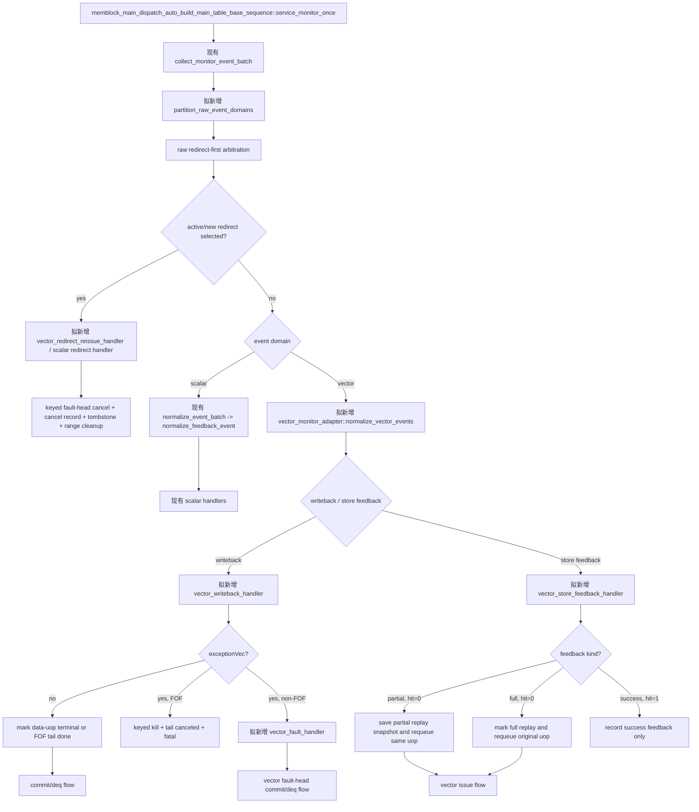

# V2 向量 Monitor、Writeback、Replay 与 Redirect Flow

本文定义测试框架如何采集 `writebackVldu_0/1` 与
`vstuIqFeedback_0/1.feedbackSlow`，把事件定位到 vector
macro/data-uop runtime，并处理正常完成、full/partial replay、异常和 redirect re-admission。本文仅追踪 MemBlock 顶层可见的
uop 结果，不模拟每个 flow 的 TLB、DCache 或内部 retry。

当前 `io_mem_to_ooo_vec_wb_agent_agent_monitor` 观察到 vector writeback valid 时会 `uvm_fatal`，因此本文描述的
adapter/handler 是拟新增设计。它们可以在调用图和伪代码中按普通函数调用表示，不要求当前源码已存在；现有 scalar
batch 仲裁和 redirect recovery 仍是向量扩展需要复用的公共时序框架。

**文档定位：** 本文是 `flow 逻辑文档`，用于后续 coding 和实现级 review。它定义 Monitor、writeback、feedback、
replay、fault 与 redirect 的事件归一化、状态更新和 helper 边界；不能由生命周期摘要推导或替换这些细节。
供人工阅读全链路的独立 `flow 描述文档` 见
[V2 向量测试框架生命周期 Flow 描述文档](vector_lifecycle_flow_description.md)。

## 1. 术语与抽象功能说明

| 英文术语 | 当前 flow 中的中文含义 | 代码对象/状态落点 | 示例 |
| --- | --- | --- | --- |
| `raw event` | monitor 在一个 DUT sample 采下的未归一化 vector output | vec writeback/IQ feedback agent transaction | 一个 writeback lane valid。 |
| `normalized event` | 已定位 UID、动态实例、data-uop 或 tail 的框架事件 | `vec_monitor_event_t` | `{uid,dynamic_epoch,vuopIdx,kind}`。 |
| `active map` | 把 ROB 或 SQ key 映射到当前活动 UID/uop owner 的索引 | `uid_by_active_rob`、`vec_range_owner_by_sq` | 事件先查 map 再更新 runtime。 |
| `owner` | raw event 当前对应的 UID/data-uop 归属 | active/range map | 查不到 owner 且无 tombstone 时报告错误。 |
| `batch` | 一个 monitor sample 内待仲裁和分派的 raw event 集合 | monitor batch 临时列表 | redirect 优先处理同批被覆盖事件。 |
| `epoch` | 动态 UID 实例版本，用于区分旧 redirect 实例和 re-admission 实例；唯一可变真源是 `status_by_uid[uid].dynamic_epoch` | 公共 status；runtime 仅作镜像，event/tombstone 保存不可变快照 | 迟到 event 命中旧 epoch 时 drop。 |
| `cursor` | monitor/recovery 处理事件的阶段位置或公共 ROB oldest 选择位置 | redirect/commit service | redirect-first 决定后续分派。 |
| `writeback` | VLSU 报告某个 vector uop 收尾的顶层 output | `writebackVldu_0/1` | lane 与原 issue lane 无固定关系。 |
| `store feedback` | vector store merge 反馈，可能请求 full/partial replay | `vstuIqFeedback.feedbackSlow` | owner 只用 `sqIdx` 反查；`lqIdx` 是 canonical/辅助字段，不作为身份键。 |
| `tail match` | 把 FOF fix-VL 写回识别为 tail 的规则 | `fof_tail_issued` + `vlWen` + 预期 pdest | tail 不能用 payload vuopIdx 索引。 |
| `active redirect` | 已被接受、正在影响 active UID 的 redirect | 现有 `active_redirect`/freeze | 覆盖的旧 writeback 不落状态。 |
| `launch token` | admission 已 launch 但尚未或刚完成 sample 的向量分配暂存记录 | vector runtime uop token | redirect 时先处理 `visible=0` token。 |
| `provisional reservation` | token 在 sample 前为防止 key 冲突而临时占用的 enqueue pointer 边界和自身 entry delta | launch token | 取消先校验 pointer；失败保持 token/pointer/free count，成功才撤销自身 delta。 |
| `promotion` | 把已采样 token 提升为正式 range owner 的动作 | vector admission helper | 之后才允许按 remaining entry 计 cancel。 |
| `redirect LSQ transition` | 一个 redirect 对共享 LQ/SQ 可变资源执行的唯一串行事务 | `run_redirect_lsq_transition()` | 先稳定 provisional token，再汇总所有覆盖 UID 的取消数量。 |
| `writer gate` | redirect transition 持有的按 LQ/SQ domain 限制的写入权限 | `{redirect_epoch,domain_mask}` | gate 期间其它 admission、dequeue、foreign cancel 只能保留 raw batch。 |
| `resource drain fence` | redirect 开始取消前必须已经结算的 deq 采样边界 | `redirect_lsq_sample_seq` 与 deq batch 的 `sample_seq` | cut line 以前的 deq 先减 remaining，不能与 cancel 重复释放。 |
| `deq sample_seq` | ctrl monitor 捕获 raw deq 时保存的不可变 DUT sample 序号 | `dispatch_raw_ctrl_t.sample_seq` 或等价 envelope | deferred raw 重试时仍按原序号判断是否早于 cut line。 |
| `dequeue provenance` | deferred raw deq 的不可变 capture 身份和物理 key 快照 | `{capture_order,sample_seq,lq_keys[],sq_keys[]}` | V2 SQ 重放不能再从当前 `sq_deq_ptr` 推导 key。 |
| `STALE_DROP` | 被 gate 延期的 raw deq 某一完整 domain 逐 key 命中本 redirect 覆盖旧 owner 的 matching tombstone | provenance classifier | 可跨多个 covered UID；消费 sideband，但不再改变 pointer/free count/owner。 |
| `covered UID set` | 当前 redirect 覆盖、在资源排空阶段不得进入 terminal/recycle 的 UID 集合 | `redirect_transition_plan.covered_uid_set` | status 尚未置 flushed 时仍可正确抑制旧实例收尾。 |
| `aggregate cancel record` | 一个 redirect 汇总 scalar/vector 正式 range 取消数量的公共账本 | `active_redirect_record_ref` | 所有计数 finalized 后只回退一次。 |
| `DEFER` | 因资源排空未完成、gate 暂不可取得或更早 foreign cancel 尚未完成而保留 redirect 的可重试结果 | `active_redirect` + raw batch | coordinator 不修改 redirect 状态，不把合法资源竞争报成 fatal。 |
| `issue kill` | 使旧 UID/动态 epoch 的 driver pending、FOF reservation 和 active FOF owner 失效 | `kill_vector_driver_pending()` | redirect/fault 后旧 valid 不得继续 fire。 |
| `FOF scheduler owner` | 当前占用 FOF 串行屏障的 UID/动态 epoch | `active_fof_owner` | 只释放匹配的旧 owner。 |
| `canceled` | 因 redirect 被取消、不再允许 issue 或正常完成的 vector uop | vector uop runtime | 并非 normal writeback。 |
| `full replay` | 重做完整候选 flow 集合的同一 vector store uop | `replay_kind=FULL` | replay 三字段保持 0。 |
| `partial replay` | 只重做给定 flow mask 的同一 vector store uop | `replay_kind=PARTIAL` | 不创建新 range。 |
| `tombstone` | redirect 或正常 range 回收后暂存旧动态实例的 key 和过期采样边界 | `vec_tombstone_by_sq/rob` | 防止无 ROB 的迟到 feedback 命中新实例。 |
| `fault event` | 含有真实 exceptionVec 的 vector writeback 事件 | macro.fault_pending + 公共 fault 状态 | 进入 vector fault-head；它不自动产生 redirect。 |
| `keyed fault-head cancel` | redirect 时按 `{kind,uid,dynamic_epoch}` 删除匹配的异常等待 token | `cancel_vector_fault_head()` | 只清理旧 vector 实例，不影响 scalar fault-head。 |
| `domain split` | 在 scalar 归一化前按 `vector_ls`/事件来源把 raw event 分为 scalar、vector 和 redirect 三类 | monitor batch 临时列表 | vector event 不能进入 scalar `normalize_feedback_event()`。 |

本 flow 中用于 owner 查询的 `robIdx` 统一指完整 `rob_key={flag,value}`，必须先经
`rob_order_util::rob_to_map_key()`；不得用裸 value。所有 live event 的 epoch 从公共
`status_by_uid[uid].dynamic_epoch` 读取，vector runtime 的同名字段只能同步镜像。

当前 `dispatch_raw_ctrl_t` 已保存 `cycle=$time`，但它不是单调 DUT sample 序号，不能参与 resource drain fence。
后续扩展必须在 ctrl raw capture 时把 `wait_for_l2tlb_sample_anchor()` 得到的 `sample_seq` 固定写入 raw 或等价 envelope；
deferred queue 重试时禁止用当前消费 sample 覆盖这个值。

## 2. 可观测接口和最小状态

V2 顶层可见的向量结果为：

```text
writebackVldu_0/1:
  valid, robIdx, uop.vpu.vuopIdx, pdest, vecWen/v0Wen/vlWen,
  fuOpType, exceptionVec, data, uop.vpu.vl

vstuIqFeedback_0/1.feedbackSlow:
  valid, hit, sqIdx, lqIdx,
  isVecPartReplay, vecReplayMask, vecReplayMbIdx

当前 standalone V2 MemBlock 交接的 `writebackVldu_0/1` 只暴露 `valid/bits`，没有独立的 writeback `ready`；
因此本 monitor 按 `valid=1` 采样一个完整 writeback event。RTL 内部的 Decoupled ready 已在 standalone 交接内处理，
不应在 UVM monitor 中等待一个不存在的 ready。若未来顶层新增 ready，才把 event 边界收紧为 `valid && ready`。

V2 当前生成的 `MemBlock` 顶层没有暴露 `vlduIqFeedback`；它是 Backend 内部连接，不能作为本测试框架
的输入。向量 load 的可见完成边界只使用 `writebackVldu`；若未来顶层增加 load feedback，必须另行更新
接口基线和本 flow，不能在当前版本伪造该事件。
```

不能从 issue lane 推断 writeback lane。普通 data-uop 通过完整 `rob_key + vuopIdx` 定位（`robIdx` 字段先规范化为
`rob_key={flag,value}`）；store feedback 的
owner 只能通过 `sqIdx -> vec_range_owner_by_sq` 定位，不能使用 `lqIdx` fallback，因为 V2 store feedback 的
`lqIdx` 可能是 canonical `0`，会误撞其它 load range。当前 standalone writeback 交接没有暴露
`isVleff/lastUop` 字段（RTL 内部 `VfofBuffer` 仍然保留这些字段，而且 `VSplit` 可能重新计算 data-uop 的
`lastUop`），因此 tail 必须先检查：

```text
macro.v_form == fof
macro.fof_tail_issued == 1
macro.fof_tail_written_back == 0
macro.fof_tail_canceled == 0
writeback_lane == 1
writeback.vlWen == 1
writeback.vecWen == 0
writeback.v0Wen == 0
writeback.pdest == derive_fof_tail_pdest(uid, macro.data_uop_num)
writeback.robIdx == macro.robIdx
```

上表中的 `vlWen/vecWen/v0Wen` 组合先定义 tail shape，`exceptionVec` 不参与 shape 分类。tail shape 命中后只能
走 live tail match 或 tail tombstone；若 `exceptionVec!=0`，先执行 keyed kill、置 `fof_tail_canceled=1`，再报告
tail fault/protocol error 并停止该 FOF 尝试，不进入普通 data-uop fault 路径。只有 payload 不呈 tail shape 时，才按
普通 `vuopIdx` 查 data-uop；任何 tail-shaped event 都不能因占位 `payloadVuopIdx=0` 回落到 `uop[0]`。

## 3. 函数调用 Flow 图



### 3.1 函数调用 Flow 图整体文字伪代码

```text
1. 同拍采集：
   service_monitor_once 继续采集现有 scalar/control raw event，并新增采集两个 vector writeback 和两个
   vector store feedback raw event。当前 standalone 交接中 `writebackVldu.valid=1` 就形成一个 writeback raw event；
   vector agent 只采样 DUT output，不直接修改 main/status 表。若未来接口增加 ready，再由 `valid && ready` 定义
   fire，并把未 fire 的 payload 保持为 pending。

2. domain split（必须早于 scalar 归一化）：
   partition_raw_event_domains 先识别 `vector_ls=1` 或 vector feedback 来源，把 raw event 放入 vector 列表；
   redirect raw event 单独放入 redirect 列表。只有明确属于 scalar 的 event 才交给现有
   normalize_event_batch/normalize_feedback_event。这样 vector event 不会因缺少 scalar target/issue_epoch
   而被错误 drop 或 fatal；redirect 即使尚未解析 UID，也可凭 raw ROB key 参加 oldest 选择。

3. redirect 优先：
   若已有 active redirect，或本 batch 的 raw redirect 仲裁已选出更老 redirect，先调用对应 domain 的 handler；
   vector handler 取消其覆盖的 vector macro。同 batch 内被覆盖的 vector raw event 直接丢弃，不能产生 replay、
   writeback 或 fault 状态。唯一例外是已经被 DUT 采样、且 `sample_seq <= redirect_lsq_sample_seq` 的 LQ/SQ deq：
   它先作为资源事实进入既有联合 deq 提交，更新 owner/remaining/pointer/free count，但对被覆盖 UID 只做
   resource-drain-only 更新，不能触发 terminal、recycle 或普通完成。未被覆盖的 event 保留给后续 batch，不能在
   redirect 生效期间落状态。writer gate 已取得后到达的 deq 则只入带冻结 key 的 deferred envelope；gate 释放后按
   `LIVE_COMMIT/STALE_DROP` provenance 分类，不能直接作为普通 empty-owner mismatch 处理。

4. 归一化与结果处理：
   vector writeback 用完整 `rob_key` 查统一 active map，再以 vuopIdx 查 vector runtime；store feedback 只用
   sqIdx 查 vector range map 得到 `{uid,vuopIdx}`。查不到 owner 且没有 redirect/tombstone 覆盖时为错误。
   正常 writeback 只把一个 data-uop 标为 terminal；FOF tail 只更新 macro tail 状态；`hit=0` store feedback
   让同一 uop 回到原 lane queue。partial replay 保存真实三字段，full replay 保持三字段为零；`hit=1` 仅是
   成功确认，即使 writeback 已先到达也只记录、不报重复错误。

5. 异常与 redirect：
   带真实 `exceptionVec` 的非 FOF data-uop 写回由 vector_fault_handler 记录为 fault-head 状态，不自动构造
   redirect、不自动 re-admission；初版只允许 D=1、非 FOF 专用 fault 模板进入正常 fault-head 收尾，多 uop 非 FOF
   先清理旧 issue pending 后保留 fault 等待真实 redirect。FOF fault 先调用 issue kill 清除 pending/reservation/
   active FOF owner，置 tail canceled，再报告 fatal 停止 testcase。redirect 覆盖的 vector macro 先按旧
   `{kind=VECTOR,uid,dynamic_epoch}` 清除匹配 fault-head 等待 token，再写 tombstone，
   取消 queue 和旧 range，通过 vector 专用 cancel-record 适配器回退资源；随后按统一 UID 的 flushed/redirect_pending
   规则等待同 UID re-admission，不合成新 UID。
```

## 4. 现有接入点：vector writeback monitor

源码位置：`mem_ut/ver/ut/memblock/agent/io_mem_to_ooo_vec_wb_agent_agent/src/io_mem_to_ooo_vec_wb_agent_agent_monitor.sv`。

抽象功能描述：该 monitor 已能采样两个 `writebackVldu` lane 的完整字段，但当前作为 scalar-only 防线拒绝它们。
它是后续向量 raw event producer 的正确位置。

真实逻辑摘要：

```systemverilog
if (io_mem_to_ooo_writebackVldu_0_valid !== 1'b0 ||
    io_mem_to_ooo_writebackVldu_1_valid !== 1'b0) begin
    `uvm_fatal("MEMBLOCK_VEC_WB_UNSUPPORTED", "scalar-only flow observed writebackVldu valid")
end
```

文字伪代码：

```text
后续实现要把 fatal 替换为“每个 valid lane 发布一个 raw vector writeback transaction”；
当前接口没有 ready，因此不能额外等待或读取 ready。若未来新增 ready，再改为只发布 fire event；
它不能直接调用 scalar writeback_status_handler，也不能在 monitor 内修改 vector runtime，
因为 redirect-first 仲裁必须在同一 service batch 完成后才允许事件落状态。
```

## 4.1 拟新增 `partition_raw_event_domains()`

抽象功能描述：该 helper 在同一 monitor sample 内把 raw event 按所有权域分成 scalar、vector 和 redirect
列表，是 scalar normalization 与 vector normalization 之间的唯一分界。它只做分类和顺序保留，不解析 UID、
不修改 runtime，也不消费任何反馈队列。

文字伪代码：

```text
遍历本拍 raw event，保持各来源在 sample 内的原始顺序；
若 event.redirect.valid：放入 redirect_raw_q，先保留 raw ROB key，不要求 scalar target 或 issue_epoch；
否则若 event.vector_ls=1，或 event 来源明确是 vector writeback/vector store feedback：放入 vector_raw_q；
否则放入 scalar_raw_q。
先对 redirect_raw_q 做 oldest/覆盖判断；被选中的 redirect 交给 scalar 或 vector redirect handler，
其覆盖范围内的两个 domain event 均丢弃。
redirect 过滤完成后，scalar_raw_q 才调用现有 normalize_event_batch()；vector_raw_q 只能调用
normalize_vector_events()，绝不能回流到 common_data_transaction::normalize_feedback_event()。
```

当前 `dispatch_monitor_batch_handler::normalize_event_batch()` 无条件调用
`data.normalize_feedback_event()`，因此在 vector 支持启用前必须在该调用之前增加这个分流；不能仅在
`writeback_status_handler::handle_event()` 里检查 `vector_ls`，因为那时 vector event 已经被 scalar normalizer
按 target/issue_epoch 规则拒绝。scalar_raw_q 的输入和输出保持不变，保证标量路径零行为变化。

## 5. 拟新增 `vector_monitor_adapter::normalize_vector_events()`

抽象功能描述：该 helper 将 raw vector output 转换成具有确定 owner 的事件，并在修改 runtime 前执行 redirect
覆盖过滤。它不创建 issue item，也不执行资源回收。

文字伪代码：

```text
该函数只接收 `partition_raw_event_domains()` 产出的 vector_raw_q，不接收 scalar event：
对每个 raw writeback（当前 standalone monitor 已确认 `valid=1`）：
  先构造完整 `rob_key`。如果 payload 呈现
    `writeback_lane=1 && vlWen=1 && vecWen=0 && v0Wen=0` 的 tail shape，先用完整 `rob_key` 查询
    `vec_tombstone_by_fof_tail[rob_key]`，再比对 tombstone 保存的 expected_pdest；不能查询 raw event 不携带的
    dynamic_epoch，也不能把占位 `payloadVuopIdx=0` 当作 data-uop 索引。命中时作为旧实例直接 drop。
    tombstone 未命中时，再由完整 `rob_key` 查询统一 `uid_by_active_rob`，并只尝试 live FOF tail match；
    live tail 不匹配时报告/丢弃该 tail-shaped event，**绝不**回落到 `uop[payloadVuopIdx]` 或普通 data-uop 路径。
    `exceptionVec` 是否为零不改变 tail shape 分类；非零异常留给 tail fault handler 统一清理。
  如果 payload 不呈 tail shape，才按普通 data-uop 处理：用 `{rob_key,vuopIdx}` 查询 vector ROB tombstone；
    命中时直接 drop，不能继续查当前主表或猜测新 UID；两类 tombstone 都未命中后，才由完整 `rob_key` 查询统一
    `uid_by_active_rob`；active map 未命中才报告 owner 丢失；读取公共 `status_by_uid[uid].dynamic_epoch` 作为
    live epoch，并断言 runtime 镜像与它一致；读取主表 op_class，要求为 V_LOAD/V_STORE；若 active/new redirect 覆盖
    该 `rob_key`，drop，不读取 uop runtime；最后要求 `vuopIdx < D` 并得到 uop[vuopIdx]。raw writeback 本身不携带
    epoch，因此重入前的 tombstone/drain 仍是过滤极晚旧 output 的必要边界，不能伪造 payload epoch 比较。

对每个 raw store feedback：
  若 active/new redirect 覆盖其 sqKey，或 sqKey 命中有效 tombstone，则 drop；
  只用 sqIdx 查询 vec_range_owner_by_sq；得到 owner 后读取公共 `status_by_uid[uid].dynamic_epoch`，并只把
  runtime 同名字段作为镜像断言；lqIdx 不参与 owner 选择和一致性比较；
  若 sqIdx 无 owner 但命中已完成的 success tombstone 且 hit=1，则只记录迟到成功确认并丢弃；
  若 sqIdx 无 owner 且无有效 tombstone，则 fatal，不能全表扫描找 UID。

对 writeback 或 hit=0 replay feedback：
  要求定位的 uop 当前属于本动态实例、outstanding=1 且尚未 terminal；
  对 hit=1 feedback：允许 uop 仍 outstanding，也允许已由 writeback 标为 terminal，只记录
  success_feedback_seen，不改变 terminal；这覆盖 VMergeBuffer 的 RegNext 延迟反馈。
```

vector event 不要求 scalar 的 `target_dispatched()`、`issue_epoch` 或 `status.active_lq_mapped/active_sq_mapped`；
其 live epoch 合法性先由公共 `status_by_uid[uid].dynamic_epoch` 判断，runtime 的同名字段仅作镜像断言，再结合
`{uid,dynamic_epoch,vuopIdx}` 和 per-entry range owner 定位。`replay_seq` 只用于本地 queue item 去重和诊断，不能
作为 DUT feedback 的外部身份依据。归一化失败时只能在 vector handler 内报告或丢弃，不能
回退到 scalar target 选择，更不能全表扫描主表猜 owner。

## 6. 拟新增 `vector_writeback_handler()`

抽象功能描述：该 handler 消费一个已归一化的 vector writeback，更新一个 data-uop 或 FOF tail 的宏观终态。
它不推导 flowMask、不验证内部 TLB/DCache 行为，也不立即回收 LSQ range。

正常 data-uop 的文字伪代码：

```text
确认 writeback 的 pdest、vecWen/v0Wen/vlWen、fuOpType 与静态 uop 派生结果兼容；
确认该 uop 当前 outstanding=1，且不是 replay_pending 等待重发；
若 exceptionVec 为零：
  若 `macro.fault_pending=1` 或公共 `status_by_uid[uid].issue_killed=1`（runtime 的
    `macro.issue_killed` 只作镜像），则该 writeback 只能在 redirect tombstone 命中时丢弃；否则报告旧实例/协议错误。
    两种情况都不置 terminal、不清 issue_accepted、不推进 FOF cursor，也不改变正常完成状态；
  若上述 fault/kill 门控均为零：
    置 writeback_seen=1、issue_accepted=0、terminal=1；
    若该 macro 是 FOF：确认 `vuopIdx == macro.fof_next_vuopIdx`，再将
      `macro.fof_next_vuopIdx++`，从而只开放下一个连续 data-uop；
若 exceptionVec 非零：
  若该 macro 是 FOF：先调用 `kill_vector_driver_pending(uid,dynamic_epoch)` 清除旧 pending payload、
    fof_send_reservation 和 active FOF owner，置 `fof_tail_canceled=1`；不调用只支持 D=1 的
    `vector_fault_handler()`，直接报告初版不支持的 FOF fault 并 fatal 停止 testcase，不留下悬挂的 FOF buffer/lock；
  否则调用 vector_fault_handler，并把当前 writeback 作为尚未清理的 outstanding 快照传入；由该 handler 统一确认
    issue_accepted、清理该状态并置 fault_pending；若为不支持的 multi-uop 非 FOF fault，handler 先 kill 匹配的旧
    driver pending，再保留 fault 等待真实 redirect；
  不凭此位把后续 uop 标为正常 suppressed terminal；非 FOF handler 不生成 redirect、也不把该 UID 重新 admission。
```

V2 `VMergeBuffer` 对 FOF 非首元素异常可能只在内部缩短 `vl`、不产生顶层异常；因此只有顶层
`exceptionVec != 0` 才能驱动本 flow 的 fault 分支。普通 writeback 的 `vl` 变化不能作为“后续 uop 已抑制”的
依据，未观察到明确 fault 时仍须等待并处理全部 D 个 data-uop。

`VL=0`、全 mask-off 或某个末尾 uop 的 `flowMask=0` 也不改变这个规则。VSplit 会把内部活动数降为零，但
仍可经 merge-buffer 形成一次 uop writeback；monitor 按普通 writeback 路径把该 uop 置 terminal，不能根据
零活动 mask 提前删除 range、合成 terminal 或跳过 FOF 的下一步/tail 条件。

FOF tail 的文字伪代码：

```text
确认 tail match；检查 vlWen=1、vecWen=0、v0Wen=0；若 tail `exceptionVec` 非零：先调用
`kill_vector_driver_pending(uid,dynamic_epoch)`，置 `fof_tail_canceled=1`，再报告 tail fault/protocol error
并停止该 FOF 尝试；不把它当作成功 tail writeback，也不进入普通 `vector_fault_handler()`；
保存 writeback.uop.vpu.vl 作为 observed_final_vl，仅用于日志/检查；
确认 `fof_tail_issued=1` 且 `fof_tail_written_back=0`；若 tail 未 issued、已写回或已 canceled，报告协议错误并丢弃；
先调用带 `{uid,dynamic_epoch}` 校验的 `release_active_fof_owner(uid,dynamic_epoch)`；只有返回“释放成功”时才
置 `fof_tail_written_back=1`、`fof_tail_pending=0`。owner 不存在或 UID/epoch 不匹配时报告协议错误，保持
tail 未完成状态，不调用 terminal helper，也不能清除其它宏的 owner；release 失败必须 fatal 或将 testcase 标记为
不可继续，不能让 service loop 无限重试；
调用 `try_vector_terminal(uid)` 重新检查 ROB commit、LSQ dequeue 和其它宏级条件；若这些条件尚未满足则仅保留
runtime，待后续 commit/dequeue 事件再次调用，不在 tail writeback 时提前回收。
tail 不写 data-uop[]，不尝试按 payload vuopIdx 更新 uop runtime。
```

`derive_fof_tail_pdest(uid, data_uop_num)` 直接使用需求文档 5.1.1 的固定公式
`PDEST_BASE + ((UID * 8 + data_uop_num) % PDEST_RANGE)`；它是 tail pdest 的唯一真源，builder 和 monitor
不能各自维护预期值副本。

## 7. 拟新增 `vector_store_feedback_handler()`

抽象功能描述：该 handler 处理 vector store merge 反馈。它区分成功确认、完整 replay 和部分 replay，并把真实
replay 转化为对原 uop 的重发；它不创建新的 UID、ROB 或 LSQ range。

文字伪代码：

```text
若公共 `status_by_uid[uid].issue_killed=1` 或 macro.fault_pending=1：
  该 feedback 属于已停止的旧 issue；命中 redirect tombstone 时丢弃，否则报告协议错误并保持 replay/terminal 状态不变；
  不进入以下 hit/replay 分支。
若 hit=1 且 isVecPartReplay=0：
  记录 feedback_seen/hit 和 success_feedback_seen；即使该 uop 已由 writeback 置 terminal 也允许，
  不改变 terminal 状态。

若 hit=0 且 isVecPartReplay=0：
  这是完整 replay；先计算下一 replay_seq，并确认当前 uop 是本次反馈对应的唯一 live outstanding，即
  `issue_accepted=1 && !replay_pending && !terminal`；顶层 feedback 不携带 replay 序号，框架不能凭本地
  replay_seq 识别“已消费的旧 feedback”。该前置条件不满足时，除 redirect tombstone 命中外一律报告协议错误并丢弃；
  随后预检下一 replay 身份不在 vector_issue_q、driver pending 或其它 replay 状态中；预检失败时报告并保持原状态，不写 queue；
  预检通过后，先把同一 {uid,dynamic_epoch,vuopIdx} 按原 queue_id 追加一个 replay item；追加成功后一次性写入
  replay_kind=FULL、replay_pending=1、issue_accepted=0、issue_pending=1，并递增 replay_count；
  下一次 payload 的 isVecPartReplay、vecReplayMask、vecReplayMbIdx 仍全部为 0。

若 isVecPartReplay=1：
  要求 hit=0、vecReplayMask 非零、owner 是 V_STORE data-uop；
  要求该 uop 当前满足 `issue_accepted=1 && !replay_pending && !terminal`；顶层 feedback 不携带 replay 序号，
  不满足该条件时除 redirect tombstone 命中外一律报告协议错误并丢弃；先计算下一 replay_seq，并预检下一 replay 身份不在
  vector_issue_q、driver pending 或其它 replay 状态中（当前这一次 outstanding 是允许被转换的对象）；预检失败
  时报告并保持原状态，不写 queue；
  预检通过后，先把同一 {uid,dynamic_epoch,vuopIdx} 按原 queue_id 追加一个 replay item；追加成功后一次性保存
  replay_kind=PARTIAL、vecReplayMask、vecReplayMbIdx，置 replay_pending=1、issue_accepted=0、
  issue_pending=1，并递增 replay_count；
  不发送 enqLsq，不改变 lq/sq range、F、source、pdest、vuopIdx 或 lane binding。
```

V2 当前顶层只明确暴露 vector store feedback。框架不因为“没有 vector load feedback 顶层端口”而伪造 load
full/partial replay。

正常 SQ range 出队或 vector terminal 回收前，框架为该 range 保留一个短期 success tombstone，覆盖
`VMergeBuffer` 的 `RegNext(feedbackValid)` 延迟；因此 hit=1 在 owner 已删除后仍可被识别为迟到成功确认，
而 hit=0 只能在 active owner 或 redirect tombstone 命中时处理。

## 8. 异常、redirect 与 cancel

### 8.1 向量 fault 的最小处理

向量 data-uop 的真实 `exceptionVec` 非零时，`vector_fault_handler()` 只记录 vector 专用 fault 状态，并同步写
公共 `status.fault=1`、`status.exception_pending=1`、`status.success=0`、`status.terminal_done=0`。它不把 event
塞进仅理解 scalar target 的 `exception_redirect_replay_task()`，不构造 redirect payload，也不调用
`prepare_uid_for_redirect_reissue()`。

非 FOF vector fault event 应进入独立的 `vector_fault_pending_q`（或等价的 vector runtime 标志），由 vector
fault-head commit/dequeue flow 消费；FOF fault 不进入该 queue，而是按 FOF 专用路径 keyed kill 后 fatal；不得把它写入现有 `exception_event_q` 后再依赖 scalar
`exception_redirect_replay_handler::handle_fault_event()` 解释。公共 recovery service 可以继续负责统一的时序
唤醒和 redirect freeze，但 fault 的 owner 定位、range 清理和 terminal 条件必须留在 vector handler。

初版 direct-fault 只允许 `D=1`、`v_form!=fof`、`vtypeIllegal=0` 的专用 fault 模板。该限制使一个异常 UID
只拥有一个已分配 range：后续 vector fault-head commit 等真实 deq 即可完成 `success=0` 的异常终态，而无需猜测
多 uop 宏中未发 uop、未释放 range 或 FOF tail 的 Backend squash 语义。普通随机 profile 不生成该异常组合。
若仍观测到多 uop 非 FOF fault，报告不受支持组合并等待真实 redirect，不能自行 cancel/re-admission；若观测到
FOF fault，则按 FOF 专用策略先 keyed kill、置 `fof_tail_canceled=1`，然后 fatal 停止 testcase，不等待 redirect。

`vector_fault_handler()` 的抽象功能描述：它把一个已归一化的 D=1 vector writeback 转成 vector fault-head
状态，供 commit/dequeue flow 消费；它不释放 range、不推进 commit cursor，也不拥有 redirect 生命周期。

文字伪代码：

```text
若 macro 不是 D=1、非 FOF 专用 fault 模板：
  先调用 `kill_vector_driver_pending(uid,dynamic_epoch)` 清除匹配的旧 driver pending/reservation；
  确认该 uop 当前 issue_accepted=1，清 issue_accepted 以结束当前 live outstanding；
  记录 macro.fault_pending、fault_vuopIdx 和 exceptionVec，报告不受支持的 multi-uop fault 并保留现场等待真实 redirect；
  同步置公共 status.fault=1、status.exception_pending=1、status.success=0、status.terminal_done=0；
  返回，不进入 normal terminal。
若 macro 是 D=1、非 FOF 专用 fault 模板：
  先调用 `kill_vector_driver_pending(uid,dynamic_epoch)` 清除匹配的旧 driver pending/reservation；
  确认该 uop 当前 issue_accepted=1 且尚未 terminal/replay；这是本 handler 清理 live outstanding 的唯一检查点；
  清 issue_accepted，记录 writeback_seen、macro.fault_pending、fault_vuopIdx 和 exceptionVec；
同步置公共 status.fault/exception_pending，保持 success=0、terminal_done=0；
不清 vector range owner，不建立 cancel record，不删除 active ROB map；
  等待 vector fault-head selector 在该 UID 成为 ROB head 时发出异常 commit；后者会登记
  fault_head_kind=VECTOR，直到唯一 range 真实 deq 后才允许 cursor 前进。
```

这里 `kill_vector_driver_pending()` 会置公共 `status.issue_killed=1`，用于阻止迟到 issue 或正常 writeback
继续进入 normal path。对 D=1 direct-fault，这不是 redirect 标记：后续 vector fault-head selector 必须允许这个
`fault_pending=1` 的 VECTOR 实例，tagged fault-head sync 也不能只因 `issue_killed=1` 清 token；只有真实 redirect/
epoch stale 或 fault terminal 才能解除它。scalar fault token 的既有 `issue_killed` 语义不受此规则影响。

### 8.2 拟新增 `vector_redirect_reissue_handler()`

抽象功能描述：该 handler 是公共 redirect coordinator 的 per-vector 回调：它把一个已被 redirect 覆盖的 vector
动态实例从可发状态暂存为待 flushed/reissue，清理其专有 owner/issue/fault 状态并累计未释放 range 数。真正的
pointer/free-count 回退由 redirect 级 aggregate cancel apply 完成；该回调不创建新的 UID/ROB，也不调用 scalar target
reissue 逻辑。

文字伪代码：

```text
redirect service 必须先做一次只读分类：

vector_involved =
  存在被当前 redirect 覆盖的 active `V_LOAD/V_STORE` macro
  || 存在属于被覆盖旧实例的 valid `visible=0` vector launch token

若 `vector_involved=0`，这是 **scalar-only fast path**：直接保持现有
`apply_redirect_flush_range() -> scalar prepare_uid_for_redirect_reissue() -> 既有 cancel-record/service` 的调用顺序。
不创建 `redirect_transition_plan`，不取得 vector writer gate，不执行 vector token 预检，也不把现有 scalar
`apply_pending_lsq_cancels()` 替换为 `apply_guarded_lsq_cancel_record()`；这条路径的 scalar UID、queue、count 和
reissue 行为必须逐项保持原样。

只有 `vector_involved=1` 才进入下述 mixed/vector coordinator。此时
`vector_redirect_reissue_handler()` 是 redirect 内的 per-vector 回调，不单独拥有 LSQ 串行段，也不能单独应用
cancel record。真正的 owner 是 `run_redirect_lsq_transition(redirect)`：它由公共
`apply_redirect_flush_range()` 在本 redirect 的 active-UID 扫描前调用一次，owner key 是当前 `redirect_epoch`，而不是某个
vector UID。这样同一 redirect 的 scalar 和多个 vector 贡献仍汇入一个既有公共 cancel record，避免提前把不完整的
aggregate 标为 software_applied。

`run_redirect_lsq_transition(redirect)`：
  先只读收集所有被该 redirect 覆盖的 vector macro、每个 macro 的旧 dynamic_epoch、所有 `valid=1 && visible=0`
    provisional token，以及所有会由 scalar/vector 正式 owner 计入 aggregate cancel record 的 LQ/SQ domain。domain_mask
    不能只从 provisional token 推导，否则“没有 token、但有正式 range”的 redirect 会在没有 gate 的情况下回退 pointer。
    初版必须复用既有全局单深度 `pending_sample_valid` 边界：整个 LSQ
    dispatcher 在 sample/promotion 前不再 launch 任意 scalar/vector allocation，所以这批 vector provisional token
    最多一个且必定位于该 domain 的 enqueue 尾部。若初版观察到多个未 promotion 的 vector token，报告 fatal；不能把
    “每个 macro 至多一个”误当成跨 macro 可并行的多 token 支持。
  若 `domain_mask!=0`，以当前 redirect 的 ROB 覆盖范围先建立 `redirect_transition_plan.covered_uid_set`，再以当前 cancel record 的 `redirect_lsq_sample_seq` 建立 resource drain fence，并调用
  `ensure_redirect_deq_drain_fence(cut_line, domain_mask)`：所有 `sample_seq <= cut_line` 的 raw LQ/SQ deq batch
  必须先按原采样顺序完成联合预检/资源提交。若仍有这类 batch，返回 `DEFER_RESOURCE_DRAIN`，不取得 gate、不取消
  token、不清 issue/FOF/fault/range，也不写任何 redirect lifecycle；调用者只允许把最早完整 deq batch 做成
  resource-drain-only 更新，并携带这个 cover-set，随后重新收集 owner/domain 并重试。deq 已经是 DUT 可见资源事实，不能在 cancel 计数
  前丢弃；但 redirect 覆盖 UID 不能借该 drain 进入 terminal/recycle。由于 `flushed/redirect_pending` 此时尚未置位，
  resource-drain helper 必须以 cover-set 而不是 status 位抑制 scalar/vector terminal、fault-head sync、terminal prefix 和 recycle。
  若 `vector_involved=1`，但所有被覆盖 scalar/vector UID 都没有任何 LQ/SQ provisional token 或正式 owner，则
    `domain_mask=0`：coordinator 仍执行 vector issue/fault/tombstone cleanup，但不取得物理 LQ/SQ writer gate、不阻塞
    scalar dequeue/cancel，也不创建或应用 aggregate cancel count。它不是 scalar-only fast path，因为仍必须清理 vector runtime；
    只要任一被覆盖 scalar 或 vector UID 仍有正式 owner，其 LQ/SQ domain 就必须进入非零 mask，不能跳过 gate。
  若 `domain_mask!=0`，调用 `begin_redirect_lsq_transition(redirect_epoch, domain_mask, token_batch)`。它先检查不存在更早、未 software_applied
    且触及相同 domain 的 foreign cancel record；随后取得 LQ/SQ writer gate，并在 gate 内完成 token 的 after/before 链、
    当前 enqueue pointer 和 allocation owner 的整体预检。
    - gate 暂时不可取得或有更早 foreign record：返回 DEFER，不改变 token、issue/FOF、pointer/free count 或任何
      vector lifecycle 状态；公共 redirect freeze 保持，等既有服务先处理旧 record 后重新尝试。
    - token 预检失败：报告 fatal，释放尚未产生资源副作用的临时 gate，token、pointer/free count 和 vector lifecycle
      状态保持原样；不得继续本 redirect 的 active-UID 扫描。
  若 `domain_mask!=0` 且 gate 成功，进入本 redirect 唯一的串行 LSQ transition。直到本 redirect 的全部 provisional 取消、所有 scalar/vector
    正式 owner 计数、当前 aggregate cancel record 的软件回退和 redirect 状态提交均完成前，所有其它
    admission/reservation、DUT dequeue commit 和 foreign cancel-record apply 都不得改动被 gate 覆盖 domain 的
    enqueue/dequeue pointer 或 free count。命中 gate 的 scalar/vector 操作保留 raw deq 的 provenance envelope
    `{capture_order,sample_seq,lq_keys[],sq_keys[]}` 并延期，不能丢弃、重排或在重放时重新展开 V2 SQ key；同时触及
    LQ/SQ 的联合 batch 必须整体延期。

    gate 释放后，最早 envelope 先做 redirect-aware provenance 分类，再决定是否调用普通 deq helper：
    - 已通过 resource drain 的缓存 batch 必须满足 `sample_seq > cut_line`；更早/相等 sample 表示 drain fence 实现漏项，fatal；
    - 对每个非空 LQ/SQ domain，若所有冻结 key 都命中 live scalar/vector owner，则该 domain 为 `LIVE_COMMIT`；若所有 key
      都没有 live owner、却逐 key 命中当前 `{redirect_epoch,cut_line,domain}` 的 redirect tombstone，且每个 tombstone 的
      `old_uid` 都属于 `covered_uid_set`、自身 `old_dynamic_epoch` 一致，则为 `STALE_DROP`。同一 domain 可跨多个
      covered UID，不要求各 key 的 UID/epoch 相同；
    - 同一 domain 内 live/tombstone 混合、空 owner、其它 redirect 的 tombstone、epoch/cut line/owner 不匹配，均为 fatal。
      `STALE_DROP` 必须是整侧 domain，不能静默忽略其中少数 key；
    - `STALE_DROP` 只消费该侧 raw sideband，不推进 pointer/free count、不删除 owner、不触发 terminal/recycle。剩余
      `LIVE_COMMIT` domain 形成 effective batch：两侧均 live 时沿用联合预检/提交；一侧 stale、一侧 live 时只提交 live
      侧；两侧 stale 时只 pop envelope。普通联合 deq 不允许部分提交的规则只在有效 live batch 内保持不变；
    - redirect deq tombstone 必须保存到覆盖它的 gate-owned deferred FIFO 段全部被分类/消费，且仍满足既有 output-drain
      过期边界后才能删除或允许 key 重用。gate 释放后的公共 scalar/vector allocation preflight 也必须把该 tombstone 当作
      physical-key quarantine；命中时暂不分配，不能因 free count 已由 cancel 回退而覆盖旧 key。
    - provenance 分类只决定 LQ/SQ 资源侧；同一 raw 携带的 MMIO tag、`sbIsEmpty` 等非-deq sideband 仍按原顺序处理一次。
      即使 LQ/SQ 两侧都是 `STALE_DROP`，也不能把完整 raw 当作空事件直接丢弃。
    - 对 V2 count-only SQ，`STALE_DROP` 不推进真实 SQ dequeue pointer。若随后待重放的 SQ `LIVE_COMMIT` envelope 的
      第一个冻结 key 已不等于真实 `sq_deq_ptr`，说明 shadow capture 序列无法和实际资源状态重合；初版必须 fatal，不能
      以 shadow cursor 覆盖真实 pointer 或用当前 head 重算旧 envelope。
  在 gate 内（`domain_mask=0` 时则无此资源步骤），按每个 domain 的全局逆 allocation 顺序取消收集到的 provisional token。初版因全局单深度边界，直接
    `cancel_vector_launch_token()` 即可；它仍先复核 pointer==after，成功后才回退 before、对当前 free count 加回
    reserved_entries 并删除 token。未来若扩大为多 slot，必须先建立覆盖 scalar/vector 的统一 allocation ledger，再按
    全局逆序取消；在该 ledger 存在前不得打开多个 visible=0 token。
  随后按已有 redirect 的 active-UID 顺序处理正式 owner：scalar UID 走原有 `prepare_uid_for_redirect_reissue()`；
    vector UID 调用下述 per-vector 回调。两类回调只向当前 redirect 的同一 aggregate cancel record 累计实际未释放数，
    都不得在此阶段调用 `lsq_ctrl.cancel_lq/sq()` 或标记 record software_applied。
    在删除任一仍未释放的 scalar/vector LQ/SQ owner 前，两类回调都必须通过公共
    `record_redirect_deq_tombstone()` 写入按 `{domain,physical_key}` 索引的 tombstone：
    `{redirect_epoch,cut_line,uid,old_dynamic_epoch,expire_sample_seq}`。它是 gate 后 raw deq provenance 的唯一
    stale 身份依据，与原有用于 writeback/feedback 的 `vec_tombstone_by_rob/sq` 可以共用存储但语义必须可区分；
    仅保存 vector tombstone 而让 scalar owner 直接消失会使 mixed redirect 的 delayed scalar deq 无法安全分类。
  所有覆盖 UID 的计数均完成后，由公共 redirect 逻辑置该 aggregate record 的 `software_count_finalized=1`。若 record
    的 LQ/SQ count 非零，在仍持有 gate 时调用 `apply_guarded_lsq_cancel_record(active_redirect_record_ref,redirect_epoch)`；
    它只应用当前 redirect 的**完整 aggregate record**，复用既有 `apply_pending_lsq_cancels()` 的 count、underflow、
    pointer/free-count 回退和 `software_applied` 语义，不能扫描或应用其它 record。若任一侧失败，LQ/SQ 均不提交并 fatal。
  仅在 aggregate record 已 software_applied（或 count 均为 0）后，提交各 vector macro 的 public redirect 状态：
    retire active ROB owner、clear dispatch result、调用 `mark_vector_redirect_reissue_pending()`，并只递增公共 dynamic_epoch
    一次。最后 `end_redirect_lsq_transition(redirect_epoch)` 释放 writer gate；`apply_redirect_flush()` 也只能在该调用之后
    清 `active_redirect/flush_in_progress`。失败路径不释放 gate 或错误地清全局 redirect 状态。

per-vector `vector_redirect_reissue_handler(uid,old_dynamic_epoch,redirect_epoch)` 在已持有上述 transition 后执行：
  调用 `kill_vector_driver_pending(uid,old_dynamic_epoch)` 清除匹配 driver pending payload、fof_send_reservation 和
    active FOF owner；该调用不能触碰新 epoch；
  在任何 epoch 更新前调用 `cancel_vector_fault_head(uid,old_dynamic_epoch)`：总是先删除
    `vector_fault_pending_q` 中匹配 `{uid,old_dynamic_epoch}` 的旧记录；随后只在共享 `fault_head_waiting` 同时匹配
    `kind=VECTOR、uid、old_dynamic_epoch` 时清 token。若 shared token 属于其它 UID/epoch 或 scalar，则保留它；
  删除两个 vector_issue_q 中匹配 `{uid,old_dynamic_epoch}` 的 item；不能只按 UID 删除，也不能误删同 UID 新 epoch 的 item；
  对每个 `visible=1` token 或正式 range owner，在删除每个仍有 range_remaining_entries 的 LQ/SQ owner 前，先通过
    `record_redirect_deq_tombstone(domain,key,redirect_epoch,cut_line,uid,old_dynamic_epoch)` 写入完整 provenance tombstone，
    再写带 dynamic_epoch 和过期 sample 的 vector feedback/writeback tombstone；累计实际未释放 LQ/SQ entry，删除对应
    vector range map。对每个已经
    promotion 的 data-uop 写 `vec_tombstone_by_rob[{rob_key,vuopIdx}]`；若 FOF tail 已 fire 未 writeback，另写
    `vec_tombstone_by_fof_tail[rob_key]`，value 保存 `{uid,old_dynamic_epoch,expected_pdest,expire_sample_seq}`；
  清 issue_pending/issue_accepted/replay_pending；未 writeback 的 FOF tail 置 fof_tail_canceled=1；
  仅当累计 `lq_count + sq_count > 0` 时调用 `record_vector_lsq_cancel_counts(uid,lq_count,sq_count,redirect_epoch)`，
    将数值加入当前 redirect aggregate record，并把同一个 `active_redirect_record_ref` 写入本 UID 的
    redirect_cancel_record_ref。无 owner/计数为 0 时该 UID 的 ref 为 invalid；
  暂存本 UID 的 ready-item、active ROB owner 和 status 清理动作，交给 coordinator 在 aggregate software rollback
    成功后统一提交；per-vector callback 不调用 `apply_pending_lsq_cancels()`、`apply_guarded_lsq_cancel_record()` 或
    `end_redirect_lsq_transition()`。

redirect flush 边界及至少一个 monitor drain sample 完成、tombstone 到期后，还必须确认旧
`{kind=VECTOR,uid,old_dynamic_epoch}` fault-head token 已不存在，才允许同一 UID 重新 activate、重新 admission 并建立新的
vector range。非零 cancel record 在 gate 释放前已经 `software_applied=1`；旧实例的迟到 writeback/feedback 在 tombstone
有效期内直接 drop。
```

内部子调用职责：

- `precheck_vector_launch_token_batch()`：在 writer gate 已取得、任何 token 发生修改前，按**全局** allocation 顺序校验全部
  provisional token 的 after/before 链与当前 pointer；失败时不修改 token、pointer 或 free count，并中止整个 redirect transition。
- `begin_redirect_lsq_transition()`：是 redirect 对 LQ/SQ 共享可变状态的唯一入口。它以
  `{redirect_epoch,domain_mask}` 登记 transient owner，在同一原子边界内检查更早 foreign cancel record、取得对应 domain 的
  writer gate、再执行 `precheck_vector_launch_token_batch()`。gate 不可取得返回 DEFER；预检失败才报告 fatal。所有
  admission/reservation、dequeue commit 和普通 cancel apply 在写 `lsq_ctrl` 前均查询该 gate；只有匹配 redirect epoch 的
  aggregate cancel apply 获得例外。
- `ensure_redirect_deq_drain_fence()`：在 writer gate 之前确认当前 redirect 的 `redirect_lsq_sample_seq` 及更早 raw
  deq 已全部结算。它先断言每个 raw deq 都携带 capture 时固定的非零 `sample_seq`；当前仅有 `$time` 的 `cycle` 不是
  替代值。它不修改 redirect/token/owner；未满足时只返回 `DEFER_RESOURCE_DRAIN`。调用者随后复用既有
  `apply_deferred_ctrl_updates_batch()` 的联合预检来处理最早 batch，并携带 `redirect_transition_plan.covered_uid_set`。
  该 resource-drain-only 模式按 cover-set 抑制被覆盖 scalar/vector UID 的 terminal、fault-head sync、terminal prefix
  和 recycle，不能依赖尚未写入的 `flushed/redirect_pending`；全局 `sync_modeled_head_after_fault_terminal()` 对整个 drain
  batch 延后至 coordinator 提交 redirect public state 后统一调用，避免非覆盖 UID 的局部处理越过旧 fault-head。这样避免 deq
  与随后 cancel 重复释放同一 entry。
- `freeze_dequeue_provenance()`：raw deq 第一次进入 deferred FIFO 时冻结 capture 顺序、`sample_seq` 以及 LQ/SQ 物理 key
  列表；LQ 先按现有 `lq_deq_start_key(raw_lq_ptr,count,ptr_is_next=1)` 还原起点，V2 count-only SQ 则冻结 capture 时的
  `sq_deq_ptr` 展开结果。它只建立重试身份，不推进真实 dequeue pointer 或
  free count；缺少 capture provenance 时必须 fatal。
- `classify_deferred_deq_provenance()`：在 gate 释放后的重放前，按 LQ/SQ domain 将 envelope 分类为 `LIVE_COMMIT` 或
  `STALE_DROP`。只有整侧 domain 的全部 key 都逐 key 命中当前 redirect 的 tombstone（每项 UID/epoch 可不同但必须属于
  `covered_uid_set`）才能 stale drop；混合 live/tombstone、空 owner 或 epoch/cutoff 不匹配均 fatal。它返回 effective batch，
  供后续联合 owner 预检消费，不能直接修改 LSQ 状态。
- `record_redirect_deq_tombstone()`：在删除 mixed/vector redirect 覆盖的任何 scalar/vector 正式 owner 前，以
  `{domain,physical_key}` 写入 `{redirect_epoch,cut_line,uid,old_dynamic_epoch,expire_sample_seq}`。它既供 deferred deq
  provenance 分类，也在 gate 释放后作为所有 scalar/vector allocation 的临时 key quarantine；只有相关 envelope 消费和
  output-drain 边界均完成后才可删除。
- `cancel_vector_fault_head(uid,dynamic_epoch)`：在 redirect 递增 epoch 前先删除同一 UID/epoch 的 pending fault
  record；再按完整 `{kind=VECTOR,uid,dynamic_epoch}` 清除匹配的 shared fault-head token。无匹配 shared token 时
  pending-record 删除仍要保留；共享状态属于其它类别/UID/epoch 时不得清除，下一次 commit service 再按公共 cursor
  处理，以免阻塞或误解锁 scalar fault-head。
- `cancel_vector_launch_token()`：只撤销 `visible=0` 的 provisional reservation，调用者必须已持有对应
  redirect_epoch writer gate。先校验当前 enqueue pointer 等于 token 的 `after` 边界；失败时返回失败/fatal，token、pointer、
  当前 free count 均不变，并中止整个 redirect transition。成功后才回退到 `before`、对当前 free count 加回
  `reserved_entries`、删除 token；它不能回写历史 free-count 快照，也不能写正式 owner、tombstone 或 cancel record。
- `record_vector_lsq_cancel_counts()`：只接收已经 promotion 且仍有实际未释放 entry 的正式 range 计数，并把数值累加到当前
  redirect 的公共 aggregate cancel record；计数为 0 时该 vector UID 不建立 ref。它不是“一 UID 一 record”接口。
- `apply_guarded_lsq_cancel_record()`：在当前 redirect transition 的 writer gate 内只消费当前 redirect 的已 finalized
  aggregate record，先联合预检 LQ/SQ 的 count、已分配容量、record identity 和 `software_count_finalized`，再一次性执行
  pointer/free-count 回退并更新 `software_applied`；它复用既有 cancel count/underflow 语义，不扫描或应用 foreign record。
  若 LQ/SQ 联合 record 的任一侧不能提交，则两侧都保持不变并报告 fatal。
- `end_redirect_lsq_transition()`：只在当前 aggregate record 已 `software_applied=1`（或 count 均为 0）且所有 redirect
  public state 已提交后释放对应 domain gate。失败路径不调用它。
- `mark_vector_redirect_reissue_pending()`：在资源回退完成后保留 UID/静态表，切换 flushed/redirect_pending/epoch 状态；它不负责回退 pointer，也不删除静态主表。

这条路径与 scalar `prepare_uid_for_redirect_reissue()` 不同：标量保留其现有 target reissue；向量只复用
UID/ROB/LSQ cancel record 的公共对账边界，再由向量专用 admission 重新构造 data-uop runtime、range map 和
issue item。`record_vector_lsq_cancel_counts()` 和 `mark_vector_redirect_reissue_pending()` 是向量扩展所需的
新边界 API；它们不改变 scalar helper 的实现或字段含义，也不伪造 Backend rename 或 VecMem IQ 内部重建。

### 8.2.1 拟新增 `cancel_vector_fault_head()`

建议实现位置：`mem_ut/ver/ut/memblock/seq/base_seq_help/lsq_commit_handler.sv`；本 flow 的 redirect handler 只负责调用它。

抽象功能描述：该 helper 是 vector redirect 清理旧异常状态的唯一向量入口。它先移除与旧
`{uid,dynamic_epoch}` 匹配的 pending fault record，再只取消完全匹配的 VECTOR fault-head token，并把公共
commit service 留在同一 UID，避免旧 fault 在 re-admission 后被重新选择或阻塞；它不推进 cursor，也不修改 scalar fault-head。

本文中的 `vector_fault_pending_q` 允许实现为等价的 per-macro pending record；无论采用哪种载体，redirect 都必须
按 UID/epoch 删除旧记录，不能只依赖 shared fault-head 是否已经建立。

文字伪代码：

```text
先删除 `vector_fault_pending_q` 中 `{uid,dynamic_epoch}` 匹配的旧记录；这一步即使
`fault_head_waiting=0` 也必须执行，因为 redirect 可以早于 fault-head commit 到达；
读取共享 fault-head 状态；若 `fault_head_waiting=0`，返回“仅删除 pending 记录”或“无匹配”，不修改 shared token；
若 kind、uid、dynamic_epoch 均与输入匹配：
  清除 VECTOR fault-head waiting/token 字段，并将 `fault_head_kind` 写为 NONE；同时清对应的
  `latched_is_store_exception`；
  保持 `commit_cursor_uid==uid`，不把被 redirect 的旧实例当作 terminal；
  将 modeled head 标记为待在 redirect 状态切换完成后重新同步；
  返回“已取消”；
否则：
  返回“无匹配”，保留 scalar 或其它 UID/epoch 的 token；
```

该 helper 必须在 `mark_vector_redirect_reissue_pending()` 递增公共 epoch 前调用。没有匹配 shared token 时，已删除的
matching pending record 仍是有效结果；若 shared token 匹配其它类别或 epoch，则只删除当前 vector 的 pending record，
不得清除该 token，防止解除不属于当前 vector 的公共 ROB 阻塞。

## 9. 事件优先级和错误处理

同一个 service sample 采用以下优先级：

```text
1. 已存在的 active redirect
2. 当前 batch 中已仲裁出的更老 redirect
3. vector data-uop fault（writeback.exceptionVec != 0）
4. vector 正常 writeback / FOF tail writeback
5. vector store full/partial replay feedback（hit=0）
6. vector store success feedback（hit=1）
```

同一 `{uid,vuopIdx}` 在一个 sample 同时出现 fault writeback 和 replay feedback 时，fault 优先：uop 进入
`fault_pending`，replay feedback 只记录为被 fault 覆盖并丢弃，不得重新入队。若同一 uop 同时出现“正常 terminal
writeback”和 `hit=0` full/partial replay，则两种结果互相矛盾，应报告协议错误并冻结该 uop，不能按 port 顺序
猜测结果。`hit=1` 与正常 writeback 同拍或迟到均可共存，只记录 success feedback，不改变 terminal。
已被 redirect 覆盖的所有事件仍优先 drop，不能触发上述冲突错误。

vector writeback 顶层不携带 `issue_epoch`。因此 framework 通过“一 uop 一次 outstanding”的协议避免歧义；它不能
宣称对任意极晚旧 writeback 都可凭虚构 epoch 正确过滤。redirect 覆盖后的 event 依赖现有 full ROB key、active map
删除和 DUT flush 语义过滤，和标量现有模型保持一致。

## 10. plus 控制与边界

| 参数 | 本 flow 的用法 |
| --- | --- |
| `MEMBLOCK_REDIRECT_SEQ_EN` | 复用真实 redirect 的 drive 与 freeze；关闭时不生成/接受需要 redirect re-admission 的 testcase。它不控制 direct fault-head。 |
| `MEMBLOCK_REPLAY_WAIT_PTW_EN` | 不用于 vector partial replay；该参数仅保留现有 scalar PTW wait 语义。 |
| `MEMBLOCK_MAIN_PERMISSION_DEBUG_CHECK_EN` | 如需增加“writeback 字段再次和静态 payload 比对”的二次 debug 检查，必须受此开关控制。 |
| 向量 op/VTYPE/地址权重 | 影响事件发生概率，不改变 raw event 分类规则。 |

初版不增加“随机制造 vector replay/fault”的伪输入控制。replay 和 fault 都必须来自 DUT output；direct fault
只通过 D=1 专用模板覆盖，普通测试可通过已有地址、TLB、DCache/异常场景参数提高真实出现机会。

## 11. 端到端行为总结

```text
普通写回：
  writebackVldu valid
  -> 完整 rob_key + vuopIdx 定位
  -> validate active outstanding
  -> writeback_seen/terminal
  -> commit/deq flow

store replay：
  vstuIqFeedback hit=0
  -> 仅用 sqIdx 从 range map 定位 owner（lqIdx 不参与）
  -> isVecPartReplay=1：保存 replay mask/MB index
  -> isVecPartReplay=0：标记完整 replay、三字段保持零
  -> 同一 uop 重入原 vector_issue_q，不入 enqLsq

store success feedback：
  vstuIqFeedback hit=1
  -> 记录成功确认，即使 writeback 已将 uop 标为 terminal 也不报重复错误

FOF tail：
  writeback with matching robIdx + vlWen + derive_fof_tail_pdest(uid,data_uop_num)
  -> fof_tail_written_back
  -> 解除唯一 active FOF owner

redirect 覆盖：
  active/new redirect
  -> 先排空不晚于 redirect_lsq_sample_seq 的完整 raw deq batch；它只结算资源，不使被覆盖 UID terminal
  -> 若 redirect_epoch writer gate 暂时不可取得、有更早 pending record 或 resource drain 未完成：保留 freeze 与 raw event，DEFER 后重试
  -> gate 内取消初版唯一的尾部 provisional token
  -> 删除覆盖 UID 的 vector queue/range map，写 tombstone 并累加 common aggregate cancel record
  -> aggregate finalized 后由 gate owner 回退 pointer/free count，software_applied
  -> 提交 flushed/redirect_pending，释放 gate；旧 writeback/feedback 只在 tombstone 命中时 drop，等待同 UID re-admission
```

端到端文字伪代码：

```text
monitor 只负责采样和发布 raw vector event；状态更新必须在 redirect-first 仲裁后发生，以免已经被 flush 的
writeback 或 feedback 又把旧 uop 复活。

正常 writeback 只结束一个 data-uop，range 仍要等真实 LSQ deq 才释放。`hit=1` feedback 只是成功确认，允许在
writeback 后到达；完整/partial replay 都只改变该 uop 的
下一次 issue 状态；partial replay 额外携带反馈 mask/MB index。它们不能改变静态主表、LQ/SQ range 或宏指令身份。

FOF tail 是宏指令级结果，不是 data-uop 数组元素。其 `vlWen` writeback 结束 FOF 串行屏障，之后才允许下一
条 FOF macro 进入 issue。
```
