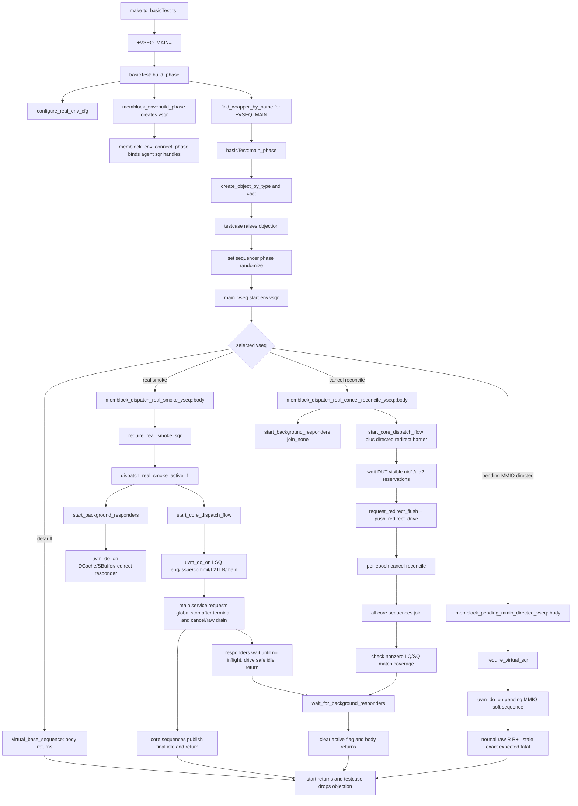

# Virtual Sequence 统一调度 Flow

本文描述 memblock 通过 `basicTest + ts=<virtual sequence>` 选择顶层场景，并由
`basicTest::main_phase()` 在 `env.vsqr` 上显式启动目标 vseq，再由
`memblock_virtual_sequencer`并发调度真实agent sequence的当前调用链。重点覆盖real smoke和
`memblock_dispatch_real_cancel_reconcile_vseq`的自然退出行为。

## 1. Flow 定位与术语

### 1.1 术语与抽象功能说明

| 英文术语 | 当前 flow 中的中文含义 | 代码对象/状态落点 | 示例 |
|---|---|---|---|
| `virtual sequencer` | 只汇总各agent sequencer handle的顶层调度器 | `memblock_env::vsqr`、`memblock_virtual_sequencer` | vseq通过`p_sequencer.lsqenq_sqr`启动LSQ sequence |
| `explicit vseq start` | testcase在`main_phase()`中创建并显式`start()`的顶层sequence | `find_wrapper_by_name()`、`create_object_by_type()`、`main_vseq.start(env.vsqr)` | `ts=memblock_pending_mmio_directed_vseq`直接创建目标vseq |
| `core flow` | 会建立主表并最终收敛的有限并发sequence集合 | `start_core_dispatch_flow()` | LSQ enq、issue、commit、L2TLB和main sequence |
| `background responder` | 响应DUT request或框架drive queue的长期sequence | `dcache_mem__access_base_sequence`、`sbuffer_mem_access_base_sequence`、redirect sequence | global stop且无inflight后自然返回 |
| `global stop` | 所有transaction和公共cancel/raw状态收敛后的统一停止标志 | `common_data_transaction::global_stop_requested` | 不是仅由`terminal_done_uid`单独决定 |
| `inflight` | responder已经接受、但response或drive生命周期尚未完成的请求 | DCache/SBuffer握手状态、redirect drive queue/inflight | inflight存在时不能因global stop直接退出 |
| `natural exit` | sequence在安全idle边界自行`break/return` | responder `body()`、cancel vseq等待逻辑 | 不使用`disable fork`强杀线程 |
| `responder done` | DCache 已完成 terminal idle 并自然返回的兼容完成标志 | `memblock_sync_pkg::dcache_responder_done` | legacy testcase 用它保持 phase objection |
| `testcase objection` | `basicTest`在顶层`start()`前raise、返回后drop的phase objection | `basicTest::main_phase()` | 覆盖目标vseq完整`start()`，不依赖派生`pre_body/post_body`保活 |
| `automatic phase objection` | sequence自身可选的自动raise/drop机制，不是顶层phase保活唯一来源 | cancel vseq `set_automatic_phase_objection(1'b1)` | 可覆盖局部sequence生命周期，但外层testcase objection仍在整个`start()`期间保持 |
| `software-only directed` | 只在virtual sequencer上运行公共owner API检查、不启动业务agent sequence的专项入口 | `memblock_pending_mmio_directed_vseq` | 覆盖normal raw、LOAD `R/R+1` stale和精确expected-fatal |

### 1.2 核心对象

- `basicTest`：固定testcase入口，创建env、读取`+VSEQ_MAIN`、查找目标wrapper，并在`main_phase()`显式创建和启动vseq。
- `memblock_virtual_sequencer`：保存各agent sequencer handle，不拥有driver或monitor数据流。
- `virtual_base_sequence`：顶层vseq基类和sequencer检查入口。
- `memblock_dispatch_real_smoke_vseq`：并发启动background responder和core flow。
- `memblock_dispatch_real_cancel_reconcile_vseq`：在real smoke拓扑中加入真实redirect barrier、cancel
  coverage检查和background responder完成握手。
- `memblock_pending_mmio_directed_vseq`：通过既有virtual sequence选择路径启动pending-MMIO soft sequence；
  不修改`basicTest`启动逻辑，也不启动real smoke background/core agent拓扑。

## 2. 函数调用 Flow 图



### 2.1 函数调用 Flow 图整体文字伪代码

```text
1. testcase与vseq选择：
   make的ts参数转成+VSEQ_MAIN；
   basicTest创建real-smoke cfg和env，并用find_wrapper_by_name查目标类；
   main_phase使用create_object_by_type创建并cast目标vseq；
   testcase在start前raise objection、start返回后drop，因此覆盖完整pre_body/body/post_body，
   不依赖派生vseq自身的objection保持main phase存活。

2. virtual sequencer接线：
   env build创建vsqr；
   env connect把已创建agent的sqr句柄赋给vsqr；
   具体vseq在启动前调用require_real_smoke_sqr，缺少必需handle时fatal。

3. real smoke调度：
   body置dispatch_real_smoke_active；
   background task用uvm_do_on并发启动DCache、SBuffer和redirect responder；
   core task用uvm_do_on并发启动LSQ enq、issue、commit、L2TLB和main sequence；
   main service只在所有uid terminal且cancel record、anchor、snapshot及raw timing queue收敛后请求global stop；
   core driver发布末尾安全idle，responder在无inflight边界自行返回。

4. cancel reconcile专项：
   testcase objection覆盖完整顶层start；子vseq现有automatic objection只属于sequence内部生命周期；
   directed main sequence建立anchor load、victim load和victim store；
   barrier等待两个victim的LSQ reservation都被真实DUT sample，再注入flushAfter redirect；
   公共flow完成逐epochsoftware-vs-DUT cancel对账和uid reissue；
   core join后检查LQ/SQ非零匹配计数；
   wait_for_background_responders确认三个responder自然退出后，vseq才返回。

5. pending-MMIO software-only专项：
   复用既有VSEQ_MAIN显式启动入口进入pending-MMIO vseq，不新增basicTest场景分支；
   vseq只检查virtual sequencer并用uvm_do_on启动soft sequence；
   soft sequence覆盖normal raw、LOAD redirect sample R/R+1 stale和精确expected-fatal后自然返回，
   不启动real smoke agent拓扑。
```

## 3. `basicTest::build_phase()`

源码位置：`mem_ut/ver/ut/memblock/tc/src/basicTest.sv`

抽象功能描述：该函数是固定testcase的构建入口，负责创建real DUT环境配置、实例化env、解析命令行
`ts`并找到目标vseq的真实factory wrapper。它不创建或启动sequence，也不配置phase default sequence。

真实逻辑摘要：

```systemverilog
seq_csr_common::reload_from_plus();
real_smoke_cfg = memblock_env_cfg::type_id::create("real_smoke_cfg");
void'(real_smoke_cfg.randomize());
configure_real_env_cfg(real_smoke_cfg);
uvm_config_db#(memblock_env_cfg)::set(this, "env", "cfg", real_smoke_cfg);
env = memblock_env::type_id::create("env", this);
main_vseq_name = "virtual_base_sequence";
if (!$value$plusargs("VSEQ_MAIN=%s", main_vseq_name)) begin
    void'(uvm_cmdline_proc.get_arg_value("+VSEQ_MAIN=", main_vseq_name));
end
main_vseq_wrapper = uvm_factory::get().find_wrapper_by_name(main_vseq_name);
if (main_vseq_wrapper == null) begin
    `uvm_fatal("BASIC_VSEQ_FACTORY",
               $sformatf("+VSEQ_MAIN type is not registered: %0s", main_vseq_name))
end
```

文字伪代码：

```text
重新加载plus参数，创建并随机化memblock_env_cfg；
configure_real_env_cfg把真实flow涉及agent的driver mode设为DRV_0并关闭XZ驱动；
cfg写入config_db后创建env；
读取+VSEQ_MAIN，未传入时保留virtual_base_sequence；
用find_wrapper_by_name直接查目标类的真实wrapper，未注册时在build phase立即fatal；
不写env.vsqr.main_phase.default_sequence，也不设置virtual_base_sequence factory override；
设置10ms UVM timeout作为异常兜底，不把固定周期数当作正常退出条件。
```

### 3.1 `basicTest::main_phase()`

源码位置：`mem_ut/ver/ut/memblock/tc/src/basicTest.sv`

抽象功能描述：该task把build阶段解析到的wrapper创建为`virtual_base_sequence`派生对象，并在
`env.vsqr`上显式执行完整`start()`。它负责顶层vseq和main phase的生命周期，不直接调度任何agent
sequence，也不实现具体场景逻辑。

```systemverilog
created_obj = uvm_factory::get().create_object_by_type(
    main_vseq_wrapper, env.vsqr.get_full_name(), main_vseq_name);
if (created_obj == null) begin
    `uvm_fatal("BASIC_VSEQ_CREATE", ...)
end
if (!$cast(main_vseq, created_obj)) begin
    `uvm_fatal("BASIC_VSEQ_TYPE", ...)
end

phase.raise_objection(this, "starting main virtual sequence");
main_vseq.set_sequencer(env.vsqr);
main_vseq.reseed();
main_vseq.set_starting_phase(phase);
if (!main_vseq.do_not_randomize && !main_vseq.randomize()) begin
    `uvm_fatal("BASIC_VSEQ_RANDOMIZE", ...)
end
main_vseq.uvm_report_info("VSEQ_BODY", "starting body ...", UVM_LOW);
main_vseq.start(env.vsqr);
main_vseq.uvm_report_info("VSEQ_BODY", "body completed", UVM_LOW);
phase.drop_objection(this, "main virtual sequence completed");
```

文字伪代码：

```text
main_phase先检查env.vsqr和wrapper非空；
create_object_by_type按目标wrapper创建对象，创建失败立即fatal；
cast要求目标类型继承virtual_base_sequence，类型不符立即fatal；
testcase在start前raise objection，然后设置sequencer、随机种子和starting phase并randomize；
输出VSEQ_BODY starting后调用start(env.vsqr)，同步执行目标对象的pre_body/body/post_body；
只有start完整返回后才输出VSEQ_BODY completed并drop testcase objection。
```

testcase objection覆盖完整`start()`调用。派生vseq即使没有raise objection，或覆盖了
`pre_body()/post_body()`而未调用父实现，main phase也会由testcase保持到目标vseq返回；派生vseq现有的
手工/automatic objection只承担自身兼容或drain语义，不是顶层保活前提。

## 4. `memblock_env::build_phase()` / `connect_phase()`

源码位置：`mem_ut/ver/ut/memblock/env/src/memblock_env.sv`

抽象功能描述：env创建virtual sequencer并把每个已创建agent的sequencer句柄汇总到其中；它不判断某个
场景究竟需要哪些agent，该检查留给vseq。

```systemverilog
vsqr = memblock_virtual_sequencer::type_id::create("vsqr", this);
if (u_lsqenq_agent_agent != null) vsqr.lsqenq_sqr = u_lsqenq_agent_agent.sqr;
if (u_L2tlb_agent_agent != null) vsqr.L2tlb_sqr = u_L2tlb_agent_agent.sqr;
// 其它agent同样接入。
```

文字伪代码：

```text
build阶段应用env cfg并创建vsqr；
connect阶段保留原RM/scoreboard/monitor连接，再逐agent赋sequencer handle；
agent未创建时env不立即fatal；真正启动该agent的vseq调用require_agent_sqr检查并给出明确fatal。
```

## 5. `virtual_base_sequence`

源码位置：`mem_ut/ver/ut/memblock/seq/virtual_sequence/virtual_base_sequence.sv`

抽象功能描述：该基类固定`p_sequencer`类型并提供virtual/agent sequencer合法性检查；默认body为空，
用于`basicTest`未选择实际场景时的安全入口。

```systemverilog
`uvm_declare_p_sequencer(memblock_virtual_sequencer)

function void require_agent_sqr(string agent_name, uvm_sequencer_base sqr);
    require_virtual_sqr();
    if (sqr == null) `uvm_fatal(...);
endfunction
```

基类`pre_body/post_body`在公共`starting_phase`非空时仍会手工raise/drop objection，属于保留的sequence
内部行为。顶层生命周期由`basicTest::main_phase()`的外层testcase objection覆盖，因此任何派生vseq都不依赖
该公共callback来保持main phase存活；`get_starting_phase()`仍可用于读取phase和配置drain time。

## 6. `memblock_dispatch_real_smoke_vseq`

### 6.1 `body()`

抽象功能描述：real smoke body建立场景active窗口，异步启动background responder，再同步等待有限core
flow和后台responder都完成。它不强制kill responder，也不会在后台task返回前清除active窗口。

```systemverilog
require_real_smoke_sqr();
memblock_sync_pkg::dispatch_real_smoke_active = 1'b1;
fork
    start_background_responders();
join_none
start_core_dispatch_flow();
wait fork;
memblock_sync_pkg::dispatch_real_smoke_active = 1'b0;
```

中文伪代码：

1. 置`dispatch_real_smoke_active=1`，并以`join_none`启动后台DCache、SBuffer和redirect responder。
2. 同步等待core dispatch flow完成；core flow结束不代表后台responder已经观察到最终stop边界。
3. 执行`wait fork`等待本task创建的后台fork完整返回；responder只有在`global_stop_requested`且无inflight时
   才会自然返回，因而不会被提前清 active 竞态截断。
4. 后台task返回后才清`dispatch_real_smoke_active`并结束vseq；若responder卡住，由UVM timeout暴露问题。

### 6.2 `start_background_responders()`

抽象功能描述：该task并发启动三个长期responder，并使用`join`把task返回定义为“三者都自然退出”。

```systemverilog
fork
    `uvm_do_on(dcache_seq, p_sequencer.dcache_sqr)
    `uvm_do_on(sbuffer_seq, p_sequencer.sbuffer_sqr)
    `uvm_do_on(redirect_seq, p_sequencer.redirect_sqr)
join
```

每个responder的退出边界：

- DCache：global stop后继续等待pending D、GrantAck、Probe B/C、C assembly、A/C armed snapshot
  和当前A/C valid全部归零；cached line map不属于inflight。满足条件后发安全idle再break，不能只
  用A valid为0作为退出条件。
- SBuffer：global stop且当前A valid为0；已接受请求的D response先完成，再发安全idle并break。
- Redirect：global stop、pending/inflight drive为空且无active redirect；发安全idle并break。

DCache responder 的 item 交付还依赖 DCache driver 的锁步合同：driver 阻塞 get_next_item 后立即
send_pkt/item_done，不在 item 之间 hold 或重复上一 item；DCache sequence 在下一 drv_cb 边界采样
上一 item 的对端 ready/valid，再确认 fire。该细节由
dcache_l2_response_hint_probe_model_flow.md 和 dcache_sbuffer_memory_responder_flow.md 共同维护。

legacy `tc_dispatch_real_smoke` 仍由 agent phase default sequence 启动 responder，无法使用 vseq 的
`wait fork`。DCache sequence 启动时清 `dcache_responder_done`，完成 terminal idle 后置一；legacy
testcase 等待该标志后才清 `dispatch_real_smoke_active` 和 drop objection。该兼容握手只补 DCache
自然退出，不改变 canonical vseq 的三 responder `join`。

### 6.3 `start_core_dispatch_flow()`

抽象功能描述：该task在各自真实sequencer上启动五个有限sequence，并用`join`等待它们按公共global
stop规则自然返回。

```systemverilog
fork
    `uvm_do_on(lsqenq_seq, p_sequencer.lsqenq_sqr)
    `uvm_do_on(issue_seq, p_sequencer.lintsissue_sqr)
    `uvm_do_on(lsqcommit_seq, p_sequencer.lsqcommit_sqr)
    `uvm_do_on(l2tlb_seq, p_sequencer.L2tlb_sqr)
    `uvm_do_on(main_seq, p_sequencer)
join
```

LSQ enqueue结算最后pending sample；LSQ commit发布最后terminal idle和可选committed watermark；main
sequence持续drain semantic raw与cancel timing sideband。只有这些子sequence全部返回后，core task才结束。

## 7. `memblock_dispatch_real_cancel_reconcile_vseq`

### 7.1 phase生命周期

源码位置：`memblock_dispatch_real_cancel_reconcile_vseq.sv`

抽象功能描述：该vseq需要等待core flow和background responder完成握手；顶层phase生命周期由
`basicTest::main_phase()`的testcase objection覆盖，vseq自身的automatic objection只保留为局部sequence
生命周期和drain配置机制。`pre_body()`读取真实starting phase并设置drain time。

```systemverilog
set_automatic_phase_objection(1'b1);
phase = get_starting_phase();
if (phase == null) begin
    `uvm_fatal(get_type_name(), "cancel reconcile vseq requires a starting phase")
end
phase.phase_done.set_drain_time(this, 1us);
```

中文伪代码：

1. vseq构造时开启自身automatic objection，但这不是testcase保持main phase存活的唯一条件。
2. `pre_body()`读取由`basicTest`传入的starting phase；读取失败立即fatal，成功后设置1us drain time。
3. `post_body()`只清理场景active标志；testcase objection仍由`basicTest`在完整`start()`返回后统一drop。

这避免直接依赖可能为null的deprecated `starting_phase`公共别名。`post_body()`只清
`dispatch_real_smoke_active`；若automatic objection存在，则由UVM负责配对释放，但不替代testcase objection。

### 7.2 `start_core_dispatch_flow()` 与 directed barrier

抽象功能描述：子vseq复用四个真实agent sequence，用专项manual main sequence替换普通main sequence，
并额外并发一个只负责等待和注入redirect的barrier task。

```systemverilog
fork
    `uvm_do_on(lsqenq_seq, p_sequencer.lsqenq_sqr)
    `uvm_do_on(issue_seq, p_sequencer.lintsissue_sqr)
    `uvm_do_on(lsqcommit_seq, p_sequencer.lsqcommit_sqr)
    `uvm_do_on(l2tlb_seq, p_sequencer.L2tlb_sqr)
    `uvm_do_on(main_seq, p_sequencer)
    drive_directed_redirect_when_ready();
join
```

专项main table有三笔：uid0 anchor load、uid1 victim load、uid2 victim store。barrier要求uid1/uid2：

- 分别仍持有active LQ/SQ mapping。
- `lsq_reservation_state == MEMBLOCK_LSQ_RESERVATION_DUT_VISIBLE`。
- `lsq_reservation_sample_valid=1`。
- 尚未issue/writeback/deq/terminal。

满足后，以uid0 ROB key构造flushAfter redirect，调用`request_redirect_flush()`与
`push_redirect_drive()`。它不伪造monitor anchor或DUT cancel snapshot；后两者必须来自真实interface
采样。

### 7.3 coverage与自然退出

core `join`返回后，vseq要求：

```systemverilog
cancel_reconcile_match_count != 0;
cancel_reconcile_lq_nonzero_match_count != 0;
cancel_reconcile_sq_nonzero_match_count != 0;
```

这些字段只证明真实LQ/SQ非零对账发生过，不参与公共pass/fail/global-stop。随后
`wait_for_background_responders()`最多等待256个service clock边界，只有父task中三个responder的
`join`返回并置`background_responders_done=1`后才结束；超时fatal。该vseq没有`disable fork`路径。

### 7.4 `memblock_pending_mmio_directed_vseq` software-only入口

源码位置：`mem_ut/ver/ut/memblock/seq/virtual_sequence/memblock_pending_mmio_directed_vseq.sv`。

抽象功能描述：该vseq只验证virtual sequencer存在，然后在同一个virtual sequencer上启动
`soft_test_memblock_pending_mmio_directed_sequence`；它不创建或启动LSQ/DCache/SBuffer/L2TLB agent
sequence，也不修改`basicTest`启动入口。

```systemverilog
task memblock_pending_mmio_directed_vseq::body();
    soft_test_memblock_pending_mmio_directed_sequence directed_seq;

    require_virtual_sqr();
    `uvm_do_on(directed_seq, p_sequencer)
endtask:body
```

文字伪代码：

```text
basicTest::build_phase通过find_wrapper_by_name解析+VSEQ_MAIN，main_phase通过create_object_by_type创建
该vseq并在env.vsqr上显式start；
先检查p_sequencer是有效memblock virtual sequencer；
在该sequencer上用uvm_do_on启动software-only pending-MMIO sequence并同步等待其返回；
soft sequence内部覆盖normal raw、redirect sample R与R+1 stale、精确expected-fatal和既有owner合同；
本入口不启动业务agent default sequence，不新增basicTest分支，也不承担最终仿真结果判断。
```

## 8. Global stop 收敛合同

main service每个negedge按以下顺序推进：

```text
tick_dispatch_service_cycle
-> drain CSR/sfence runtime
-> drain cancel snapshot和redirect anchor
-> collect/process semantic monitor batch
-> process redirect/replay/fault recovery
-> 再次drain cancel timing sideband（仍只收集raw）
-> service_lsq_timing_reconcile -> service_cancel_reconcile（每tick唯一一次）
-> route issue（未global stop时）
-> request_global_stop_if_done
```

`request_global_stop_if_done()`除`terminal_done_uid >= main_trans_num`外，还要求：

- `cancel_record_q`为空。
- 没有尚未应用的软件LSQ cancel。
- redirect anchor history、cancel snapshot history为空。
- raw cancel snapshot和raw redirect anchor queue为空。

因此真实cancel flow不会在observed snapshot尚未比较时提前让core/responder退出。LSQ commit sequence还会
发布最后terminal idle；redirect/DCache/SBuffer responder则分别检查自己的无inflight边界。

## 9. 编译与仿真参数 Flow

用户入口：

```makefile
make eda_run tc=basicTest ts=<virtual_sequence> mode=base_fun cfg=<cfg>
```

VCS/xrun配置把`ts`转换为`+VSEQ_MAIN=${ts}`，远端包装脚本继续转发`ts`。真实cancel专项使用：

```text
ts=memblock_dispatch_real_cancel_reconcile_vseq
cfg=tc_dispatch_real_cancel_reconcile_smoke
```

pending-MMIO software-only专项复用同一个选择入口：

```text
ts=memblock_pending_mmio_directed_vseq
```

2026-07-22 batch验证已确认该入口实际执行：移除损坏的专项生成库并设置`partcmp_op=off`后，VCS/KDB
compile为0 error/0 warning；日志中出现`VSEQ_BODY` start/complete、`R`/`R+1` stale、directed completion、
caught fatal=1、`UVM_ERROR=0`、`UVM_FATAL=0`和`TEST_PASS`。日志路径为
`mem_ut/ver/ut/memblock/sim/pending_mmio_v2_fun/log/tc=basicTest_ts=memblock_pending_mmio_directed_vseq_cfg=default_seed=666666_rtl_.log`。
该批次不包含本轮新增的`stale_reason`日志赋值，修复后的专项重跑仍待主agent复验。

## 10. 端到端行为总结

```text
普通real smoke：
  basicTest + VSEQ_MAIN
  -> find_wrapper_by_name
  -> create_object_by_type
  -> basicTest::main_phase explicit start
  -> real_smoke_vseq
  -> background responders + core flow
  -> all uid terminal and cancel/raw drain
  -> global stop
  -> core final idle + responder no-inflight idle
  -> child sequences自然返回

真实cancel reconcile：
  testcase objection covers complete start; cancel vseq automatic objection is supplementary
  -> three-entry directed main table
  -> wait victim reservation DUT_VISIBLE
  -> real redirect drive
  -> redirect anchor/cancel snapshot monitor
  -> per-epoch software-vs-DUT reconcile
  -> victim reissue and terminal
  -> global stop after all cancel/raw state drain
  -> background_responders_done
  -> vseq返回
  -> basicTest drop testcase objection

pending-MMIO software-only directed：
  basicTest find_wrapper_by_name/create_object_by_type
  -> basicTest::main_phase explicit start
  -> memblock_pending_mmio_directed_vseq
  -> require_virtual_sqr
  -> uvm_do_on pending-MMIO soft sequence
  -> normal raw + R/R+1 stale + 精确expected-fatal
  -> soft sequence自然返回
```

端到端文字伪代码：

```text
basicTest负责解析、创建并显式启动顶层vseq，所有agent sequence都由virtual sequencer显式调度。real smoke把有限core flow
和长期responder分开：前者依赖transaction/cancel/raw收敛，后者依赖global stop和自身无inflight边界。

cancel专项不直接修改reservation、cancel count或terminal。它只等待真实DUT-visible victim后注入redirect，
其余行为复用公共flow。testcase objection覆盖完整顶层start，派生vseq的automatic objection只提供补充的
sequence生命周期/drain语义，也避免用disable fork截断尚未完成的response。

pending-MMIO入口不复用real smoke并发拓扑，只通过basicTest的显式wrapper创建/start入口启动software-only
sequence。它不启动agent phase default sequence；stale_reason修复后的重跑尚未完成，不能把该项写成最终复验通过。
```
