# Writeback 函数调用 Flow

本文整理当前 mem_ut 测试框架中 writeback 相关逻辑的真实函数调用 flow。这里的 writeback flow 指 DUT output monitor 采到 int writeback 后，测试框架如何把 raw 端口事件转换成 `memblock_wb_event_t`，如何进入 batch redirect-first 仲裁，最后如何更新 status 或进入 recovery queue。

需要注意：当前实现已经不是旧的 `adapter -> writeback_status_handler::handle_event()` 逐条处理模式。真实 monitor event 必须先进入 batch handler，由 batch handler 完成 normalize 和 redirect-first 仲裁后，才允许 writeback handler 更新状态。

V2 当前实现对 STA IQ raw 只使用真实 SQ key，并通过 active SQ map/current status 补齐
UID、ROB、`issue_epoch/replay_seq`；本轮不新增 issue-generation token、claim map 或
tombstone。STA IQ hit 只记录 feedback success，真实 STA writeback 才能完成 target。
IQ 专项的完整当前调用链见 [`iq_feedback_replay_v2_flow.md`](iq_feedback_replay_v2_flow.md)。
STD 继续受限于 ROB value-only 双 probe，不建立 backend replay。

本文早期 token/claim 图保留为历史设计记录，当前代码以专项 flow 和源码为准。

## 1. 术语与总体调用图

### 1.0 术语与抽象功能说明

| 英文术语 | 当前flow中的中文含义 | 代码对象/状态落点 | 示例 |
|---|---|---|---|
| `semantic batch` | 同一service sample中先统一做redirect-first仲裁的writeback/IQ/memoryViolation事件集合 | `events[$]`、`process_monitor_event_batch()` | 被同批older redirect覆盖的WB不得落status |
| `deferred ctrl` | semantic batch完成后才应用的完整ctrl raw；本拍先进入临时列表，再转入持久FIFO | `deferred_ctrl[$]`、`deferred_raw_ctrl_q` | resync mismatch保留队首，MMIO、deq和`sbIsEmpty`不会静默丢失 |
| `observation epoch` | monitor观察MMIO output时保存的环境flush epoch，不是producer身份 | `raw.mmio_flush_epoch` | 旧脉冲可能带redirect后的observation epoch |
| `producer provenance` | MMIO valid所在DUT sample的单调序号 | `raw.mmio_sample_seq` | LOAD与redirect sample `R/R+1`做overlap判定 |
| `redirect sample anchor` | redirect输入被DUT采样的sample序号和完整payload | cancel record、redirect anchor FIFO | anchor sample记为`R` |
| `active owner` | 完整ROB key当前唯一映射的动态uid实例 | `uid_by_active_rob` | value-only raw需要probe flag 0/1两个key |
| `staging` | 同一个ctrl raw在写status前的MMIO uid/kind去重列表 | `staged_tags[$]` | 所有tag先preflight再统一commit |
| `STALE_DROP` | 有充分证据证明某个MMIO port属于旧实例，仅丢该port | `MEMBLOCK_MMIO_RESOLVE_STALE_DROP` | 唯一旧load owner被redirect覆盖 |
| `overlap` | LOAD MMIO sample等于未完成redirect的`R`或`R+1` | `resolve_mmio_uid_by_rob_value()` | 新/无/多/不兼容owner均fatal |

> 本文早期总体图包含 token/claim 设计节点，属于历史方案记录。当前 V2 IQ raw 的
> SQ-only 反查、IQ 先于 int-WB 的同拍顺序和 deferred ctrl 以
> [`iq_feedback_replay_v2_flow.md`](iq_feedback_replay_v2_flow.md) 为准。

```mermaid
flowchart TD
    I0[LOAD/STA accepted issue fire] --> I1[register_issue_generation_token]
    I1 -. immutable generation source .-> C12
    I1 -. immutable generation source .-> C15
    A[memblock_main_dispatch_auto_build_main_table_base_sequence::service_monitor_once] --> B[memblock_dispatch_base_sequence::collect_runtime_context_events]
    B --> B1[dispatch_monitor_event_adapter::drain_csr_events]
    B --> B2[dispatch_monitor_event_adapter::drain_sfence_events]

    A --> C[memblock_dispatch_base_sequence::collect_monitor_event_batch]
    C --> C1[dispatch_monitor_event_adapter::collect_writeback_events_batch]
    C1 --> C11[memblock_sync_pkg::pop_raw_int_wb]
    C11 --> C12[dispatch_monitor_event_adapter::convert_raw_int_wb]
    C12 --> C124[attach_issue_generation_snapshot LOAD/STA]
    C124 --> C13[events.push_back]

    C --> C2[dispatch_monitor_event_adapter::collect_ctrl_redirect_events_batch]
    C2 --> C21[memblock_sync_pkg::pop_raw_ctrl]
    C21 --> C25[deferred_ctrl.push_back full raw]
    C21 --> C23[dispatch_monitor_event_adapter::convert_raw_memory_violation]
    C23 --> C24[events.push_back]

    C --> D[dispatch_monitor_batch_handler::process_monitor_event_batch]
    D --> D1[dispatch_monitor_batch_handler::normalize_event_batch]
    D1 --> D11[common_data_transaction::normalize_feedback_event]
    D --> D2{active_redirect valid?}
    D2 -->|yes| D21[event_covered_by_redirect]
    D21 -->|covered| D22[drop event without token validate or commit]
    D21 -->|uncovered redirect| D23[data.push_feedback_event]
    D23 --> D231[normalize_feedback_event]
    D231 --> D232[exception_event_q.push_back]
    D21 -->|uncovered non-redirect| D4
    D2 -->|no| D3[select_oldest_redirect]
    D3 --> D31{batch has redirect?}
    D31 -->|yes| D32[data.push_feedback_event selected redirect]
    D32 --> D321[normalize_feedback_event]
    D321 --> D322[exception_event_q.push_back]
    D31 -->|yes| D33[drop covered writeback/fault/replay]
    D31 -->|yes uncovered| D4
    D31 -->|no| D4[process_allowed_non_redirect_event]
    D --> C19[append full raw to deferred_raw_ctrl_q]
    C25 --> C19
    C19 --> C20[dispatch_monitor_event_adapter::apply_raw_ctrl_mmio_tags on queue head]
    C20 --> C201[resolve value-only ROB with epoch and sample provenance]
    C201 --> C202{LOAD sample overlaps redirect R or R+1?}
    C202 -->|unique covered old load| C203[STALE_DROP this port]
    C202 -->|new no multiple incompatible or unproved| C204[MMIO_RESOLVE fatal]
    C202 -->|no overlap or STORE| C205[stage preflight commit canonical tag]
    C203 --> C22[lsq_commit_handler::apply_raw_ctrl_deq full raw]
    C205 --> C22
    C22 --> C221{owner success?}
    C221 -->|yes| C222[pop deferred queue head]
    C221 -->|resync mismatch| C223[retain head until next service tick]
    C221 -->|strict mismatch| C224[uvm_fatal]

    D4 --> D41{generation_correlated?}
    D41 -->|yes| D42[validate_issue_generation_claim no side effect]
    D41 -->|no| E
    D42 --> E{event source}
    E -->|LOAD_WB / STORE_WB| F[writeback_status_handler::handle_real_writeback_event]
    E -->|STA_FEEDBACK / STD_FEEDBACK| G[writeback_status_handler::handle_issue_feedback_event]

    F --> F1[event_has_fault]
    F1 -->|fault| F2[common_data_transaction::mark_target_fault]
    F2 --> F3[common_data_transaction::push_feedback_event]
    F3 --> F31[normalize_feedback_event]
    F31 --> F32[exception_event_q.push_back]
    F1 -->|normal pass| F4[event_is_normal_pass]
    F4 --> F5[common_data_transaction::mark_target_normal_pass]
    F5 --> D43[handler accepted or unique STA compat no-op then commit claim]

    G --> G1{iq_feedback_failed?}
    G1 -->|STA failed| G2[common_data_transaction::push_feedback_event replay]
    G2 --> G21[normalize_feedback_event]
    G21 --> G22[exception_event_q.push_back]
    G1 -->|STD feedback| G3[strict fatal; real STD WB only]
    G1 -->|hit| G4[target_real_wb_pass_enabled]
    G4 -->|enabled| G5[common_data_transaction::mark_issue_feedback_success]
    G4 -->|disabled| G6[STA compatibility only]
    G5 --> D43
    G6 --> D43
    F32 --> D43
    G22 --> D43

    A --> H[memblock_dispatch_base_sequence::exception_redirect_replay_task]
    H --> H1[exception_redirect_replay_handler::process_pending_events]
    H1 --> H2[common_data_transaction::pop_feedback_event]
    H1 --> H3{redirect/replay/fault}
    H3 -->|redirect| H4[request_redirect_flush + push_redirect_drive]
    H3 -->|replay| H51[handle_replay_event]
    H3 -->|fault| H6[consume fault recovery event only]

    A0[memblock_main_dispatch_auto_build_main_table_base_sequence::service_real_dispatch_flow] --> A
    A0 --> A1[memblock_dispatch_base_sequence::route_all_issue_queues]

    C12 --> C121[dispatch_monitor_event_adapter::make_wb_event_base]
    C121 --> C122[common_data_transaction::make_empty_wb_event]
    C12 --> C123[LDA/STA real ROB key or STD value-only dual probe]
    C1 --> C14[memblock_sync_pkg::pop_raw_iq_feedback]
    C14 --> C15[dispatch_monitor_event_adapter::convert_raw_iq_feedback]
    C15 --> C151[dispatch_monitor_event_adapter::make_wb_event_base]
    C15 --> C152[raw_sq_to_key only]
    C15 --> C153[attach_issue_generation_snapshot IQ]
    C153 --> C16[events.push_back]

    D11 --> D111[feedback_event_has_action]
    D111 --> D112[feedback_event_is_redirect / feedback_event_is_replay / feedback_event_has_fault]
    D11 --> D113[resolve_uid_for_event]
    D113 --> D114[lookup_active_uid_by_rob / lookup_active_uid_by_lq / lookup_active_uid_by_sq]
    D11 --> D115{generation_correlated? preserve token snapshot : compat status fallback}

    F5 --> F51[target_entry_done]
    F5 --> F52[conditional_set_target_status_field]
    F52 --> F53[target_writeback_field / target_pass_field]
    F52 --> F54[target_dispatched / target_replay_seq_match]
    F5 --> F55[required_targets_done]

    F2 --> F21[conditional_set_target_status_field]
    F21 --> F22[target_writeback_field / target_fault_field]

    H1 --> H11[service_ptw_wait_replay]
    H11 --> H111[pop_ready_ptw_wait_replay]
    H11 --> H112[mark_replay_pending]
    H1 --> H12[advance_active_redirect]
    H12 --> H121[redirect_drive_done_for]
    H12 --> H122[apply_redirect_flush]
    H1 --> H13[select_oldest_redirect]
    H13 --> H131[redirect_event_is_older]
    H131 --> H132[redirect_from_event]
    H4 --> H41[request_redirect_flush]
    H4 --> H42[push_redirect_drive]
    H1 --> H14[requeue_events_not_flushed_by_redirect]
    H51 --> H511[resolve_uid_for_event / get_event_issue_epoch / get_event_replay_seq]
    H51 --> H512[event_should_wait_ptw]
    H512 -->|yes| H513[push_ptw_wait_replay]
    H512 -->|no| H514[mark_replay_pending]
    H514 --> H515[delete_issue_queue_entry + bump_replay_seq]
    H6 --> H61[handle_fault_event]
    H61 --> H611[resolve_uid_for_event / get_event_issue_epoch / get_event_replay_seq]
    H122 --> H123[apply_redirect_flush_range]
    H123 --> H124[prepare_uid_for_redirect_reissue]
    H124 --> H126[close_issue_generation_token REDIRECT before active map delete]
    H122 --> H125[clear_ptw_wait_replay_by_redirect + clear_redirect_drive_queue]
```



## 1.1 函数调用 Flow 图整体文字伪代码

```text
Writeback 函数调用主流程：

1. service loop 入口：
   service_real_dispatch_flow 每个 service clock 先调用 service_monitor_once；
   service_monitor_once tick dispatch service cycle；
   collect_runtime_context_events 先同步 CSR runtime 和 sfence/hfence 离散事件；
   collect_monitor_event_batch 再收集 writeback/IQ feedback/ctrl redirect；
   exception_redirect_replay_task 最后消费 recovery queue。

2. current issue snapshot建账：
   LOAD/STA/STD真实issue fire把当前target issue_epoch、replay_seq和active ROB/LQ/SQ owner
   保存在公共status/map；本轮不建立issue-generation token、claim map或tombstone。

3. raw monitor event 转换与attach：
   collect_writeback_events_batch 先pop raw IQ feedback，再pop raw int writeback；
   convert_raw_iq_feedback只接受STA真实SQ key，通过active SQ map/current status附uid、ROB、
   issue_epoch和replay_seq，
   STA miss成为普通replay；VSTU/STD IQ valid固定fatal；
   convert_raw_int_wb按V2 LDA/STA/STD真实字段构造event；LDA/STA通过active ROB map/current
   status补snapshot，STD继续value-only双flag固定probe；
   STA IQ及LDA/STA WB monitor在DUT valid采样块内，把真实payload与
   `sample_flush_epoch=dispatch_flush_epoch`、`cycle=$time`同拍写入raw；adapter只消费
   该快照，出队时不得用current epoch回填或覆盖；
   ctrl monitor只在任一MMIO valid时冻结`mmio_flush_epoch` observation epoch和同拍
   `mmio_sample_seq` producer provenance；
   collect_ctrl_redirect_events_batch pop raw ctrl并保存完整对象到deferred_ctrl，把memoryViolation转成
   redirect event；semantic batch完成后，adapter先原子归一化同一raw的MMIO tag；
   LOAD sample若与未完成redirect的R/R+1重叠，只有唯一旧scalar load owner、已dispatch且完整key被覆盖
   才STALE_DROP；新owner、无owner、多record、不兼容owner或无法证明覆盖均MMIO_RESOLVE fatal；
   STORE不套用该LOAD overlap规则；tag处理返回后，再把完整raw交给singleton lsq_commit_handler处理
   LQ/SQ deq与sbIsEmpty。

4. batch 级 normalize和redirect-first仲裁：
   process_monitor_event_batch 调用 normalize_event_batch；
   V2 LOAD/STA event在converter中已经带current snapshot，normalize继续校验并保留；
   如果已有active redirect，覆盖事件drop且不validate/commit，未覆盖redirect可入recovery
   queue，未覆盖non-redirect可继续处理；
   如果同批存在 redirect，select_oldest_redirect 选最老 redirect 先 push_feedback_event，并 drop 被覆盖事件；
   未覆盖event按输入顺序进入writeback_status_handler；同拍IQ hit先设置feedback success，
   STA real-WB随后做严格顺序检查并落pass/fault。

5. writeback / feedback 分类处理：
   handle_real_writeback_event 处理真实 int writeback；
   normal pass 调用 mark_target_normal_pass 直接落 status；
   fault 先调用 mark_target_fault 落 status，再 push_feedback_event 进入 recovery queue；
   handle_issue_feedback_event 处理 IQ feedback；
   STA miss调用push_feedback_event形成replay；V2 monitor不生成STD IQ event；hit根据
   real WB pass参数决定只标记feedback success或兼容mark pass。

6. recovery queue 消费：
   process_pending_events 先 service_ptw_wait_replay，再 advance_active_redirect；
   active redirect 未完成时不处理新 recovery event；
   没有 active redirect 时 pop_feedback_event 得到本轮 events；
   redirect 优先 request_redirect_flush + push_redirect_drive，并 requeue/drop 被覆盖事件；
   replay 调用 handle_replay_event，按 ptw_back_replay 等待或 mark_replay_pending；
   fault调用handle_fault_event，只消费和打印上下文，不重复落fault；
   replay清旧target状态并递增replay_seq，后续真实re-fire建立新的current status snapshot。
```

## 2. `service_real_dispatch_flow()`

源码位置：`memblock_main_dispatch_auto_build_main_table_base_sequence.sv`

V2 coding后目标逻辑摘要：

```systemverilog
forever begin
    @(negedge service_vif.clk);
    if (service_vif.rst_n !== 1'b1 ||
        memblock_sync_pkg::reset_backend_done !== 1'b1) begin
        continue;
    end
    if (all_transactions_terminal_done()) begin
        break;
    end
    service_monitor_once();
    route_all_issue_queues();
    if (all_transactions_terminal_done()) begin
        break;
    end
end
```

功能解释：

这是真实 dispatch smoke 的外层服务循环。它在 lintsissue service clock 的下降沿运行，先服务 monitor/recovery，再 route issue queue。`route_all_issue_queues()` 不直接处理 writeback，但 replay/redirect 改变 status 或重新入队后，需要靠它把 ready uid 重新送回 issue 队列。

文字伪代码：

```text
每个 service clock 下降沿：
  如果 reset 或 backend 未完成初始化，跳过；
  调用 all_transactions_terminal_done：通过 terminal_done_uid 判断所有 transaction 是否已经进入终态；
  如果所有 transaction 已完成，退出；
  调用 service_monitor_once：同步 monitor raw queue、执行 batch 仲裁，并消费 recovery queue；
  调用 route_all_issue_queues：根据 replay/redirect 后的状态，把 ready uid 重新路由到 load/STA/STD issue queue；
  再调用 all_transactions_terminal_done 做一次收尾检查，避免最后一轮 monitor 服务后还多跑一拍。
```

## 3. `service_monitor_once()`

源码位置：`memblock_main_dispatch_auto_build_main_table_base_sequence.sv`

V2 coding后目标逻辑摘要：

```systemverilog
memblock_sync_pkg::tick_dispatch_service_cycle();
collect_runtime_context_events();
collect_monitor_event_batch();
exception_redirect_replay_task();
```

功能解释：

`service_monitor_once()` 是真实 DUT smoke flow 每个 service cycle 的 monitor 服务入口。它先推进测试框架自己的 service cycle 计数，然后同步 CSR latest snapshot 并显式消费 sfence/hfence FIFO，再收集同一轮 monitor raw event，最后消费 recovery queue。

文字伪代码：

```text
每一轮 service cycle：
  调用 tick_dispatch_service_cycle：推进测试框架 service cycle 计数，供 event cycle 和 timeout 使用；
  调用 collect_runtime_context_events：先同步 CSR runtime 和 sfence/hfence 事件，保证后续事件解释使用最新上下文；
  调用 collect_monitor_event_batch：收集本轮 writeback / IQ feedback / memoryViolation raw event，并作为同一个 batch 做 redirect-first 仲裁；
  调用 exception_redirect_replay_task：消费 recovery queue 中的 redirect / replay / fault，执行 redirect drive、replay pending 或 fault 消费。
```

## 4. `collect_runtime_context_events()`

源码位置：`memblock_dispatch_base_sequence.sv`

V2 coding后目标逻辑摘要：

```systemverilog
monitor_adapter.drain_csr_events();
monitor_adapter.drain_sfence_events();
```

功能解释：

该函数不是 writeback 状态更新本身，但它必须在 writeback batch 前执行。原因是后续 TLB、CSR runtime、sfence 失效等状态都可能影响当前 batch 的上下文解释。它只更新运行时上下文，不处理 writeback pass/fault。

入口准备逻辑：

`collect_runtime_context_events()` 依赖 `monitor_adapter`。base sequence 在使用 adapter 前会确保相关对象已创建并绑定：CSR/sfence 运行时上下文由 `common_data_transaction` 直接更新；`dispatch_monitor_event_adapter` 持有的 `lsq_commit_handler` 主要供 ctrl deq 同步使用，不是 `drain_sfence_events()` 的处理主体。这里的准备动作不改变 writeback 状态，只保证 adapter 能访问 commit/TLB/CSR runtime 相关 helper。

文字伪代码：

```text
在处理 monitor feedback 前：
  调用 drain_csr_events：同步 CSR runtime snapshot，不处理 writeback 状态；
    drain_csr_events 内部调用 memblock_sync_pkg::get_latest_raw_csr 获取最新 CSR raw snapshot；
    如果存在新 CSR snapshot，调用 data.apply_raw_csr_runtime 更新 common_data_transaction 中的 runtime CSR 镜像；
  调用 drain_sfence_events：消费 sfence/hfence raw event，并按 fence payload 失效 TLB entry；
    drain_sfence_events 内部循环调用 memblock_sync_pkg::pop_raw_sfence 弹出离散 fence 事件；
    每个 fence 事件调用 data.apply_raw_sfence；
    apply_raw_sfence 内部会 decode_raw_sfence，再通过 apply_sfence_invalidate、sfence_match_entry 和 sfence_vpn_match 找到并失效匹配的 tlb_entry_by_key；
  不在这里处理 writeback、replay 或 redirect。
```

## 5. `collect_monitor_event_batch()`

源码位置：`memblock_dispatch_base_sequence.sv`

真实逻辑摘要：

```systemverilog
monitor_adapter.collect_writeback_events_batch(events,
                                               sample_cycle,
                                               sample_cycle_valid);
monitor_adapter.collect_ctrl_redirect_events_batch(events,
                                                   deferred_ctrl,
                                                   sample_cycle,
                                                   sample_cycle_valid);
monitor_batch_handler.process_monitor_event_batch(events);
monitor_adapter.apply_deferred_ctrl_updates_batch(deferred_ctrl);
```

功能解释：

这是更改后的关键入口。它把同一 service cycle 中的 int writeback、IQ feedback 和 ctrl memoryViolation 都收集到同一个 `events[$]`，然后统一交给 batch handler。这样可以避免旧 flow 中 writeback 先落状态、redirect 后出现导致状态污染的问题。

入口准备逻辑：

base sequence 会在调用本 task 前确保 `writeback_handler`、`monitor_batch_handler`、`monitor_commit_handler`、`monitor_adapter` 已存在，并把 handler 绑定到 adapter/batch handler。`monitor_batch_handler` 内部需要持有 `writeback_handler`，这样通过 redirect-first 仲裁的非 redirect event 才能继续调用真实 writeback 状态更新函数。

文字伪代码：

```text
创建一个空 batch events；
如果 writeback_handler 为空，创建 writeback_status_handler，作为真实 writeback/IQ feedback 的状态更新器；
如果 monitor_batch_handler 为空，创建 dispatch_monitor_batch_handler；
调用 monitor_batch_handler.bind_writeback_handler：把 writeback_handler 绑定给 batch handler，用于处理通过 redirect 仲裁的非 redirect event；
如果 monitor_commit_handler 为空，取得lsq_commit_handler::get()返回的singleton；
如果 lsq_ctrl 存在，调用 monitor_commit_handler.bind_lsq_ctrl：让 ctrl deq 同步可以释放本地 LSQ 映射；
如果 monitor_adapter 为空，创建 dispatch_monitor_event_adapter；
调用 monitor_adapter.bind_commit_handler：把 monitor_commit_handler 绑定给 adapter，供 ctrl deq 同步使用；
调用 collect_writeback_events_batch：先从 IQ feedback raw queue、再从 int writeback raw queue
取事件，校验同拍后转换成统一 memblock_wb_event_t 并放入 events；
调用 collect_ctrl_redirect_events_batch：从 ctrl raw queue 取完整 raw，校验同拍后保存到
deferred_ctrl，并把 memoryViolation 转换成 redirect event 放入 events；
调用 process_monitor_event_batch：把整个 events 一次性交给 batch handler，由它做 normalize 和 redirect-first 仲裁；
由 batch handler 决定哪些事件可以真正更新状态；
batch handler 返回后，调用apply_deferred_ctrl_updates_batch：先按原顺序追加到持久FIFO，再按队首调用
apply_raw_ctrl_deq；full raw成功后才pop并更新后续项，resync失败时保留队首到下一service tick。
```

兼容入口说明：

`memblock_dispatch_base_sequence` 已删除 `collect_writeback_events()` 和 `collect_exception_and_redirect_events()` 这类拆分入口。真实 DUT flow 只能通过 `collect_monitor_event_batch()` 同时收集 writeback/IQ feedback 和 ctrl memoryViolation，避免拆开处理时绕过同批 redirect-first 仲裁。

## 6. `collect_writeback_events_batch()`

源码位置：`dispatch_monitor_event_adapter.sv`

真实逻辑摘要：

```systemverilog
while (memblock_sync_pkg::pop_raw_iq_feedback(raw_iq)) begin
    check_raw_sample_cycle(raw_iq.cycle, sample_cycle,
                           sample_cycle_valid, "iq_feedback");
    if (convert_raw_iq_feedback(raw_iq, wb_event)) begin
        events.push_back(wb_event);
    end
end
while (memblock_sync_pkg::pop_raw_int_wb(raw_int_wb)) begin
    check_raw_sample_cycle(raw_int_wb.cycle, sample_cycle,
                           sample_cycle_valid, "int_wb");
    if (convert_raw_int_wb(raw_int_wb, wb_event)) begin
        events.push_back(wb_event);
    end
end
```

功能解释：

该 task 只负责收集 writeback 类 monitor event。它不调用 `writeback_status_handler`，也不更新
status。各 raw queue 内部仍保持 FIFO；同一采样 batch 固定先追加 IQ、再追加 int-WB，保证
STA IQ hit 先建立 feedback success，随后 real-WB 才做严格顺序检查。

文字伪代码：

```text
不断从 raw IQ feedback queue 弹出 raw event；
  调用check_raw_sample_cycle：要求raw.cycle与当前batch一致；
  调用convert_raw_iq_feedback：只接受V2 STA真实SQ key，通过active SQ map/current status
  补uid、ROB、issue_epoch和replay_seq；miss标记为replay语义，VSTU/STD IQ valid fatal；
  如果转换成功，也放入 batch；
不断从 raw int writeback queue 弹出 raw event；
  调用check_raw_sample_cycle：要求raw.cycle与当前batch一致；
  调用convert_raw_int_wb：按V2 LDA/STA/STD真实字段构造统一event；
  如果转换成功，就放入 batch；
这里不判断redirect覆盖，也不直接判断最终pass/fault是否有效。
```

## 7. `convert_raw_int_wb()`

源码位置：`dispatch_monitor_event_adapter.sv`

真实逻辑摘要：

```systemverilog
case (raw.source_kind)
    LDA: begin
        target = LOAD;
        has_rob = raw_rob_to_key(...);
        if (!attach_issue_generation_snapshot(...REAL_WB...)) return 0;
        if (raw.replay_inst) begin
            source = BACKEND_REPLAY;
            replay_valid = 1;
            real_wb_valid = 0;
        end else begin
            source = LOAD_WB;
            real_wb_valid = 1;
        end
    end
    STA: begin
        target = STA;
        has_rob = raw_rob_to_key(...);
        if (!attach_issue_generation_snapshot(...REAL_WB...)) return 0;
        source = STORE_WB;
        real_wb_valid = 1;
    end
    STD: begin
        target = STD;
        normalize_std_rob_value_only(...);
        source = STORE_WB;
        real_wb_valid = 1;
    end
endcase
```

功能解释：

该函数按V2 split LDA/STA/STD port事实转换统一event。`source_kind`表示LDA/STA/STD
语义，`port_id`表示该kind内部lane，二者职责不同并同时保留。LDA/STA必须在设置
normal real-WB动作前匹配fire token；LDA `replayInst=1`占用LOAD result channel，但
功能上是backend replay，不是normal writeback。STD只有ROB value，继续固定双flag
active-map probe并从唯一uid补完整身份，不接generation token。

内部子调用：

- `make_wb_event_base()`：创建默认清零的 `memblock_wb_event_t`。
- `common_data_transaction::make_empty_wb_event()`：实际填充 event 默认值，保证所有 valid、key、action 字段有确定初值。
- `raw_rob_to_key()`：只转换LDA/STA真实完整ROB key，不给无来源key置valid。
- `normalize_std_rob_value_only()`：固定probe`{0,value}/{1,value}`，唯一命中后从status
  补完整ROB/SQ；0/2命中或生命周期错误fatal，不扫描active window。
- `attach_issue_generation_snapshot()`：LDA/STA通过active ROB map和open token附加
  `uid/issue_epoch/replay_seq`，不消费pending。

文字伪代码：

```text
如果 raw writeback 无效，返回无事件；
调用 make_wb_event_base：创建默认清零 event，避免 valid、key、action 字段继承旧值；
按source_kind确定LDA/STA/STD target，再校验kind内port_id范围；
复制该port真实exception/replay/flush/trigger metadata，以及monitor采样拍已经冻结的
sample_flush_epoch/cycle；不得在adapter出队时用current epoch回填；
LDA/STA只转换真实完整ROB key，调用attach_issue_generation_snapshot：
  active ROB map先解析uid；
  open token校验target/pipe/key/fire cycle/issue flush epoch和REAL_WB pending；
  CURRENT时附不可变generation，stale按tombstone reason drop，当前不一致fatal；
LDA replayInst=1时设置BACKEND_REPLAY/replay_valid，保持real_wb_valid=0；
LDA normal或STA在全部key/generation/non-normal metadata检查通过后才置real_wb_valid=1；
STD调用value-only双probe，不调用token，成功后才置real_wb_valid=1；
unsupported flushPipe/trigger等当前无consumer组合按int-WB专项固定策略fatal；
返回转换成功。
```

## 8. `convert_raw_iq_feedback()`

源码位置：`dispatch_monitor_event_adapter.sv`

真实逻辑摘要：

```systemverilog
wb_event = make_wb_event_base();
if (!raw.valid) return 1'b0;
if (raw.vector_feedback || raw.is_std || !raw.is_sta) `uvm_fatal(...);

wb_event.valid = 1'b1;
wb_event.port_id = raw.port_id;
wb_event.target = MEMBLOCK_ISSUE_TARGET_STA;
wb_event.source = MEMBLOCK_WB_EVENT_SOURCE_STA_FEEDBACK;
wb_event.has_rob = 1'b0;
wb_event.has_lq  = 1'b0;
wb_event.has_sq  = raw_sq_to_key(...);
attach_current_issue_snapshot(wb_event);
if (!wb_event.has_uid || !wb_event.has_rob || !wb_event.has_sq ||
    !wb_event.has_issue_epoch || !wb_event.has_replay_seq) begin
    `uvm_fatal("DISP_MON_ADAPT", "STA IQ feedback snapshot is incomplete")
end
wb_event.iq_feedback_valid       = 1'b1;
wb_event.iq_feedback_hit         = raw.hit;
wb_event.iq_feedback_failed      = !raw.hit;
wb_event.iq_feedback_flush_state = raw.flush_state;
wb_event.replay_valid            = raw.is_sta && !raw.hit;
wb_event.ptw_back_replay         = raw.is_sta && !raw.hit && raw.flush_state;
wb_event.cycle                   = raw.cycle;
return 1'b1;
```

功能解释：

该函数把V2 scalar STA feedback转换成统一event。它不会设置`real_wb_valid`，因为IQ
feedback不是真实ROB/RF writeback。V2 raw只有真实SQ key，ROB/LQ valid必须保持0；
adapter通过active SQ map和current status附加uid、ROB、issue epoch和replay sequence。
`hit=1`只表示IssueQueue
finalSuccess，`hit=0`派生普通STA replay。V2没有scalar `flushState`，不触发PTW wait。
任一VSTU或STD IQ raw在scalar模式下fatal。

内部子调用：

- `make_wb_event_base()`：创建默认清零 event。
- `common_data_transaction::make_empty_wb_event()`：实际填充 event 默认值。
- `raw_sq_to_key()`：只转换V2真实SQ key。
- `attach_current_issue_snapshot()`：按active SQ map解析uid，校验current status中的
  active/STA dispatched/canonical SQ，再复用`fill_current_issue_snapshot()`补完整snapshot；
  该helper不修改status、map或queue。

文字伪代码：

```text
如果 raw IQ feedback 无效，返回无事件；
如果是vector、STD或unknown scalar feedback，uvm_fatal；
调用 make_wb_event_base：创建默认清零 event，保证 IQ feedback 不继承真实 writeback 标志；
设置STA target/source，保持ROB/LQ invalid，只复制真实SQ key；
设置iq_feedback_valid/hit/failed，miss额外设置replay_valid；
flush_state和ptw_back_replay固定0；
调用attach_current_issue_snapshot：通过active SQ map查唯一uid，从current status补
ROB/issue_epoch/replay_seq；owner缺失、STA未dispatched或snapshot不完整均fatal；
返回转换成功。
```

## 9. `collect_ctrl_redirect_events_batch()`

源码位置：`dispatch_monitor_event_adapter.sv`

抽象功能描述：collector只把完整ctrl raw保存到本service的deferred列表，并把memoryViolation投影为
semantic redirect event；它不解析MMIO owner、不释放LQ/SQ mapping，也不写`sbIsEmpty`。

真实逻辑摘要：

```systemverilog
while (memblock_sync_pkg::pop_raw_ctrl(raw_ctrl)) begin
    check_raw_sample_cycle(raw_ctrl.cycle, sample_cycle,
                           sample_cycle_valid, "ctrl");
    deferred_ctrl.push_back(raw_ctrl);
    if (convert_raw_memory_violation(raw_ctrl, wb_event)) begin
        events.push_back(wb_event);
    end
end
```

功能解释：

该task负责ctrl output monitor event。完整raw先进入当前service的`deferred_ctrl`，
`lq_deq/sq_deq/sb_is_empty`不在collector内即时更新；`memoryViolation`转换成redirect event
并进入同一batch。batch完成后调用者才按FIFO应用deq，避免owner反查前释放active map。

内部子调用：

- `check_raw_sample_cycle()`：要求 ctrl raw 与本次 IQ/int-WB semantic batch 属于同一采样拍。
- `deferred_ctrl.push_back()`：保存完整 raw，延后应用资源状态。
- `apply_deferred_ctrl_updates_batch()`：semantic batch返回后把本拍临时列表追加到持久FIFO，并按队首
  success语义调用`apply_raw_ctrl_deq()`；失败不pop。
- `apply_raw_ctrl_deq()`：先归一化MMIO tag，再把完整raw交给唯一LSQ owner并返回owner success。
- `apply_raw_ctrl_mmio_tags()`：在active map释放前解析value-only MMIO facts，并执行全raw preflight/commit。
- `lsq_commit_handler::apply_raw_ctrl_deq()`：根据 DUT deq 指针释放 LQ/SQ 映射。
- `convert_raw_memory_violation()`：把 memoryViolation 转成 redirect event。

文字伪代码：

```text
不断从 raw ctrl queue 弹出事件；
  调用check_raw_sample_cycle，要求raw.cycle与本batch一致；
  把完整raw push到deferred_ctrl，本阶段不更新sb_is_empty，也不释放active LQ/SQ映射；
  调用 convert_raw_memory_violation：如果 raw ctrl 中存在 memoryViolation，就转换成 redirect event；
  redirect event 不立即 drive redirect，也不直接 flush；
  先放入 batch，让 batch handler 判断它是否是本批 oldest redirect。
process_monitor_event_batch返回后，调用者把deferred_ctrl追加到持久deferred_raw_ctrl_q：
  从持久FIFO队首调用apply_raw_ctrl_deq，不允许后续raw越过当前队首；
  先调用apply_raw_ctrl_mmio_tags，在active map仍存在时解析每个MMIO port；
  MMIO-only raw即使lq_deq/sq_deq都为0也必须完成tag处理；
  tag处理返回后，把未拆分的完整raw交给monitor_commit_handler.apply_raw_ctrl_deq；
  commit handler联合预检LQ/SQ deq，更新sb_is_empty，并释放DUT已deq的active mapping；
  owner成功后pop队首；resync mismatch返回失败并保留队首，strict mismatch仍fatal；
  raw_monitor_queue_size包含持久FIFO，所以等待重试时不能发布global stop。
```

## 10. `convert_raw_memory_violation()`

源码位置：`dispatch_monitor_event_adapter.sv`

真实逻辑摘要：

```systemverilog
wb_event.valid                 = 1'b1;
wb_event.source                = MEMBLOCK_WB_EVENT_SOURCE_MEMORY_VIOLATION;
wb_event.target                = MEMBLOCK_ISSUE_TARGET_NONE;
wb_event.redirect_valid        = 1'b1;
wb_event.redirect.valid        = 1'b1;
wb_event.redirect.flush_itself = raw.memory_violation_level;
wb_event.redirect.level        = raw.memory_violation_level;
wb_event.has_rob               = raw_rob_to_key(...);
wb_event.redirect.rob_key      = wb_event.rob_key;
wb_event.cycle                 = raw.cycle;
```

功能解释：

memoryViolation 在 DUT 语义上不是普通 writeback，也不是 IQ feedback，而是 redirect/recovery 请求。adapter 在这里把它标准化成 redirect event，但不在 adapter 内执行 flush，也不在 adapter 内更新 status。

内部子调用：

- `make_wb_event_base()`：创建默认清零 event。
- `common_data_transaction::make_empty_wb_event()`：实际填充 event 默认值。
- `raw_rob_to_key()`：转换 memoryViolation ROB key。

文字伪代码：

```text
如果 raw ctrl 没有 memoryViolation，返回无事件；
调用 make_wb_event_base：创建默认清零 event，避免 redirect payload 外的旧字段残留；
创建一个 redirect event；
source 标记为 MEMORY_VIOLATION；
target 设为 NONE，因为 redirect 是全局恢复边界；
调用 raw_rob_to_key：保存 memoryViolation 对应 ROB key，作为 redirect flush 边界；
保存 redirect payload；
返回转换成功，等待 batch handler 仲裁。
```

## 10.1 pending-MMIO deferred raw provenance

### 10.1.1 ctrl monitor sample冻结

源码位置：`io_mem_to_ooo_ctrl_agent_agent_monitor.sv`，task：`mon_data()`。

抽象功能描述：monitor把MMIO valid/value、观察时环境epoch和同拍DUT sample序号冻结到同一个ctrl raw；
它不反查uid，也不在MMIO全invalid时生成虚假的sample provenance。

```systemverilog
if (any_mmio_valid) begin
    raw_ctrl.mmio_flush_epoch = memblock_sync_pkg::dispatch_flush_epoch;
    raw_ctrl.mmio_sample_seq = memblock_sync_pkg::get_dut_sample_seq($time);
end
```

文字伪代码：

```text
任一load/store MMIO valid时，保存当前dispatch flush epoch作为observation epoch；
在同一个分支调用sample accessor，把本monitor sample的单调序号冻结为producer provenance；
MMIO全invalid时两个字段保持empty raw默认值，adapter不得在消费拍补写。
```

### 10.1.2 `resolve_mmio_uid_by_rob_value()`

源码位置：`common_data_transaction.sv`。

抽象功能描述：resolver把value-only ROB fact分类为唯一当前owner、可证明旧fact或fatal。LOAD额外读取
未完成redirect timing provenance；STORE不使用LOAD的`R/R+1`规则。函数不写status。

```systemverilog
if (load_overlap_observed) begin
    if (active_candidate_count == 1 &&
        overlap_old_covered_count == 1 &&
        overlap_new_candidate_count == 0 &&
        overlap_uncovered_count == 0 &&
        overlap_incompatible_count == 0) begin
        stale_reason = $sformatf(
            "loadMmio sample=%0d overlaps redirect sample=%0d and old active ROB=%0d/%0d is covered",
            raw_sample_seq, overlap_redirect_sample_seq,
            overlap_old_key.flag, overlap_old_key.value);
        return MEMBLOCK_MMIO_RESOLVE_STALE_DROP;
    end
    `uvm_fatal("MMIO_RESOLVE",
               $sformatf("cannot prove LOAD MMIO stale ownership sample=%0d redirect_sample=%0d active=%0d old_covered=%0d new=%0d uncovered=%0d incompatible=%0d",
                         raw_sample_seq, overlap_redirect_sample_seq,
                         active_candidate_count, overlap_old_covered_count,
                         overlap_new_candidate_count, overlap_uncovered_count,
                         overlap_incompatible_count))
    return MEMBLOCK_MMIO_RESOLVE_STALE_DROP;
end
```

文字伪代码：

```text
LOAD先扫描有深度上限的全部未完成anchored record和未绑定anchor FIFO，只匹配sample R或R+1；
再probe同一ROB value的flag 0/1两个完整active key，并按行为、dispatch、activation epoch和redirect覆盖分类；
只有active候选恰好一个、且它是已dispatch scalar load、旧于redirect并被完整key覆盖时STALE_DROP；
新owner、无owner、多owner、不兼容owner、多个record/anchor或无法证明覆盖均MMIO_RESOLVE fatal；
STORE跳过overlap扫描，继续按observation epoch与active provenance执行普通CURRENT/STALE/fatal分类。
```

### 10.1.3 `apply_raw_ctrl_mmio_tags()` / `apply_raw_ctrl_deq()`

源码位置：`dispatch_monitor_event_adapter.sv`。

抽象功能描述：adapter在active map仍存在时先解析完整raw的全部MMIO事实，全部preflight通过后原子写tag；
随后才把同一raw交给singleton LSQ owner应用deq与`sbIsEmpty`。

```systemverilog
function bit apply_raw_ctrl_deq(input memblock_sync_pkg::dispatch_raw_ctrl_t raw);
    ensure_handles();
    apply_raw_ctrl_mmio_tags(raw);
    return monitor_commit_handler.apply_raw_ctrl_deq(raw);
endfunction:apply_raw_ctrl_deq
```

文字伪代码：

```text
确保data和唯一LSQ handler已绑定；
先调用MMIO adapter逐port resolve：stale只丢该port，current按uid去重进入staging；
所有staging先调用canonical setter做dry-run，全部成功后再commit；
返回后把完整raw交给singleton LSQ handler，后者才允许更新sbIsEmpty和释放LQ/SQ mapping；
handler返回成功才从`deferred_raw_ctrl_q`弹出队首，resync失败保留队首重试；因此deq不会先删除MMIO
value-only反查所需的active map，也不会把失败raw静默丢弃。
```

## 11. `process_monitor_event_batch()`

源码位置：`dispatch_monitor_batch_handler.sv`

真实逻辑骨架：

```systemverilog
if (!normalize_event_batch(events, normalized_events)) return;

if (data.active_redirect.valid) begin
    foreach (normalized_events[idx]) begin
        if (event_covered_by_redirect(normalized_events[idx], data.active_redirect)) continue;
        if (event_is_redirect(normalized_events[idx])) data.push_feedback_event(normalized_events[idx]);
        else void'(process_allowed_non_redirect_event(normalized_events[idx]));
    end
    return;
end

if (select_oldest_redirect(normalized_events, selected_redirect_event)) begin
    selected_redirect = redirect_from_event(selected_redirect_event);
    data.push_feedback_event(selected_redirect_event);
    foreach (normalized_events[idx]) begin
        if (same_redirect_event(normalized_events[idx], selected_redirect_event)) continue;
        if (event_covered_by_redirect(normalized_events[idx], selected_redirect)) continue;
        if (event_is_redirect(normalized_events[idx])) data.push_feedback_event(normalized_events[idx]);
        else void'(process_allowed_non_redirect_event(normalized_events[idx]));
    end
    return;
end

foreach (normalized_events[idx]) begin
    void'(process_allowed_non_redirect_event(normalized_events[idx]));
end
```

功能解释：

这是本次重构后的核心。它保证同一 batch 内 redirect 优先于 writeback pass/fault/replay。只要本批有 redirect，就先选 oldest redirect；被该 redirect 覆盖的 writeback/fault/replay 全部丢弃，不允许先写状态表。

文字伪代码：

```text
调用normalize_event_batch：correlated LOAD/STA校验token已附snapshot，非correlated
event按原规则解析uid/允许的fallback；
  normalize_event_batch内部逐项调用normalize_feedback_event，但禁止给correlated
  event从当前status补generation；
如果一个 event 解析不到 active uid/ROB，就 warning 后丢弃；

如果当前已经有 active redirect：
  调用 event_covered_by_redirect：用 ROB 顺序判断 event 是否在 active redirect flush 范围内；
    event_covered_by_redirect 内部调用 rob_order_util::rob_need_flush 判断 event ROB 是否落在 redirect flush 范围；
  被active redirect覆盖的event直接丢弃且不validate/commit token；
  调用 push_feedback_event：未覆盖的 redirect 进入 recovery queue，并在入队前再次 normalize；
  调用process_allowed_non_redirect_event：未覆盖的correlated event先只读validate token
  kind，再按source交给原writeback handler；handler成功/唯一STA compat no-op后commit；
  未分类但带replay/fault的event调用
  push_feedback_event入recovery queue；
  结束本轮处理。

如果当前没有 active redirect，但本批存在 redirect：
  调用 select_oldest_redirect：按 ROB 顺序和 port_id tie-break 选择本批最老 redirect；
    select_oldest_redirect 内部遍历 batch，调用 event_is_redirect 过滤 redirect event，再调用 redirect_event_is_older 比较候选；
    redirect_event_is_older 内部调用 redirect_from_event 获取 payload；ROB 不同时调用 rob_order_util::rob_is_after 判断 candidate 是否更老；
  调用 push_feedback_event：把 selected redirect 放入 recovery queue，等待 recovery handler 建立 active redirect；
  遍历本批其它 event：
    调用 same_redirect_event：识别并跳过 selected redirect 自身，避免重复入队；
    调用event_covered_by_redirect：被selected redirect覆盖的event直接丢弃且不validate/commit；
      event_covered_by_redirect 内部调用 rob_order_util::rob_need_flush 判断 event ROB 是否落在 selected redirect flush 范围；
    调用 push_feedback_event：未覆盖的其它 redirect 放入 recovery queue 延后处理；
    调用process_allowed_non_redirect_event：未覆盖event按需要执行validate、原handler、
    handler成功/唯一STA compat no-op后commit。

如果本批没有 redirect：
  调用process_allowed_non_redirect_event：所有normalized event按需要先validate，再按来源
  进入对应handler，接受后commit。
```

关键内部子调用：

- `normalize_event_batch()`：先把端口事件补齐成 active uid 事件。
- `event_covered_by_redirect()`：调用 `rob_order_util::rob_need_flush()` 判断 event 是否被 redirect 覆盖。
- `select_oldest_redirect()`：从本批 redirect 中选 ROB 顺序最老的 redirect。
- `select_oldest_redirect()` 内部逐个检查 `event_is_redirect()`；发现候选后调用 `redirect_event_is_older()` 比较 ROB 顺序。
- `redirect_event_is_older()` 内部先用 `redirect_from_event()` 取 redirect payload；ROB 相等时按 `port_id` 做稳定 tie-break；ROB 不等时调用 `rob_order_util::rob_is_after(best, candidate)` 判断 candidate 是否更老。
- `redirect_from_event()` 内部会先调用 `event_is_redirect()`；如果非 redirect event 误入则 fatal。
- `same_redirect_event()`：避免 selected redirect 被重复入队。
- `same_redirect_event()` 内部比较 source、port_id、ROB key、`flush_itself` 和 `level`，用于识别“本批已经选中的同一个 redirect event”。
- `process_allowed_non_redirect_event()`：只有通过redirect仲裁的非redirect event才能
  validate claim资格并进入原状态更新；接受后才commit token。
- `data.push_feedback_event()`：selected redirect 或未覆盖 redirect 进入 recovery queue。

## 12. `normalize_event_batch()`

源码位置：`dispatch_monitor_batch_handler.sv`

真实逻辑摘要：

```systemverilog
foreach (events[idx]) begin
    if (!events[idx].valid) continue;
    if (!data.normalize_feedback_event(events[idx], normalized_event)) begin
        `uvm_warning("DISP_MON_BATCH", ...)
        continue;
    end
    normalized_events.push_back(normalized_event);
end
```

功能解释：

batch handler不直接相信raw event。V2 correlated LOAD/STA event在adapter已经通过active
map和token附齐`uid/ROB/issue_epoch/replay_seq`；normalize负责校验并保留这些不可变
snapshot，不能用当前status覆盖。非correlated兼容/STD/redirect event继续按原规则
解析uid或使用允许的fallback。

文字伪代码：

```text
遍历 batch 中每个 event；
  跳过无效 event；
  调用normalize_feedback_event：correlated event校验已有uid/key/generation并禁止
  status fallback；其它event按原active map规则解析uid和允许字段；
  如果 normalize 失败，说明无法定位当前 active uid，warning 后丢弃；
  如果 normalize 成功，放入 normalized_events，等待 redirect-first 仲裁。
```

## 13. `common_data_transaction::normalize_feedback_event()`

源码位置：`common_data_transaction.sv`

真实逻辑摘要：

```systemverilog
if (!normalized_event.valid || !feedback_event_has_action(normalized_event)) return 0;
if (normalized_event.redirect.valid && !normalized_event.has_rob) begin
    normalized_event.rob_key = normalized_event.redirect.rob_key;
    normalized_event.has_rob = 1'b1;
end
if (!resolve_uid_for_event(normalized_event, uid)) return 0;
status = get_status(uid);
normalized_event.uid = uid;
normalized_event.has_uid = 1'b1;
if (!normalized_event.has_rob) normalized_event.rob_key = status.get_rob_key();
if (!feedback_event_is_redirect(normalized_event)) begin
    check target is LOAD/STA/STD;
    if status.replay_seq != 0 and non-STD event misses issue/replay snapshot: drop;
    fill issue_epoch from status if missing;
end
fill replay_seq from status if missing;
return 1;
```

功能解释：

该函数把monitor event提升为能参与batch仲裁的transaction event。V2 LOAD/STA raw的
generation恢复已经前移到`attach_issue_generation_snapshot()`；本函数不能在第一次
replay后从可变status猜快照。对非correlated event，原active map解析和受限fallback
继续保留。

文字伪代码：

```text
如果 event 无效或没有任何动作语义，返回失败；
  feedback_event_has_action 会确认 event 至少是 redirect/replay/fault/真实 writeback/IQ feedback 之一；
如果是 redirect 且缺 ROB key，从 redirect payload 中补 ROB key；
调用 resolve_uid_for_event：通过 uid/ROB/LQ/SQ active map 解析唯一 active uid，并检查多个 key 是否一致；
解析失败则返回失败；
从 status 表读取该 uid 当前状态；
补 uid 和 ROB key；
如果不是 redirect：
  调用 feedback_event_target_is_valid：确认 target 必须是 LOAD/STA/STD；
  如果generation_correlated=1：
    要求has_uid/has_issue_epoch/has_replay_seq全部存在；
    保留token snapshot，禁止从status补齐或覆盖；
  否则如果当前uid已发生过replay且非STD event缺snapshot，warning/drop；
  只有明确非correlated兼容event才允许在target_dispatched后从status补issue_epoch；
只有非correlated兼容event缺replay_seq时，才允许从status当前replay_seq补齐；
返回 normalized event。
```

内部子调用：

- `feedback_event_has_action()`：确认 event 至少有 redirect/replay/fault/real writeback/IQ feedback 之一。
- `feedback_event_is_redirect()`：以 `redirect.valid` 为 canonical redirect 标志，并检查 `redirect_valid` 一致性。
- `feedback_event_is_replay()`：检查 `replay_valid`。
- `feedback_event_has_fault()`：检查 exception/fault。
- `resolve_uid_for_event()`：通过 uid、ROB、LQ、SQ active map 解析唯一 active uid。
- `feedback_event_target_is_valid()`：非 redirect event 必须是 LOAD/STA/STD target。
- `generation_correlated`防御：V2 LOAD/STA必须自带token快照；第一次及后续replay均
  不允许status fallback。
- `target_dispatched()` / status snapshot：只服务明确非correlated兼容event，不能给V2
  correlated LOAD/STA提供generation。

## 14. `common_data_transaction::resolve_uid_for_event()`

源码位置：`common_data_transaction.sv`

真实逻辑摘要：

```systemverilog
if (wb_event.has_uid) begin
    check_uid(wb_event.uid, ...);
    check status_by_uid[uid].active;
    uid = wb_event.uid;
end
if (wb_event.has_rob) begin
    lookup_active_uid_by_rob(wb_event.rob_key, rob_uid);
    check uid mismatch;
end
if (wb_event.has_lq) begin
    lookup_active_uid_by_lq(wb_event.lq_key, lq_uid);
    check uid mismatch;
end
if (wb_event.has_sq) begin
    lookup_active_uid_by_sq(wb_event.sq_key, sq_uid);
    check uid mismatch;
end
return have_uid;
```

功能解释：

该函数是 monitor event 定位 transaction 的核心。一个 event 可能同时带 uid、ROB key、LQ key、SQ key。函数会用所有可用 key 反查 active uid，并强制它们指向同一个 uid；如果任意 key 找不到 active 映射，或者多个 key 指向不同 uid，就认为 event 不合法或已过期。

文字伪代码：

```text
如果 event 自带 uid：
  调用 check_uid：检查 uid 数值范围合法；
  检查 status_by_uid[uid] 存在且 active；
  记录 uid。
如果 event 带 ROB key：
  调用 lookup_active_uid_by_rob：把 ROB flag/value 转成 map key 后查 active ROB map；
  如果和已有 uid 不一致，fatal。
如果 event 带 LQ key：
  调用 lookup_active_uid_by_lq：把 LQ flag/value 转成 map key 后查 active LQ map；
  如果和已有 uid 不一致，fatal。
如果 event 带 SQ key：
  调用 lookup_active_uid_by_sq：把 SQ flag/value 转成 map key 后查 active SQ map；
  如果和已有 uid 不一致，fatal。
至少成功解析一个 uid 才返回成功。
```

内部子调用：

- `lookup_active_uid_by_rob()`：使用 `rob_order_util::rob_to_map_key()` 查 `uid_by_active_rob`。
- `lookup_active_uid_by_lq()`：使用 `rob_order_util::lq_to_map_key()` 查 `uid_by_lq`。
- `lookup_active_uid_by_sq()`：使用 `rob_order_util::sq_to_map_key()` 查 `uid_by_sq`。
- `check_uid()` / `is_valid_uid()`：检查 uid 范围。

## 15. `process_allowed_non_redirect_event()`

源码位置：`dispatch_monitor_batch_handler.sv`

V2 coding后目标逻辑摘要：

```systemverilog
memblock_issue_generation_claim_ctx_t claim_ctx;
bit handler_accepted = 1'b0;
bit allowed_compat_noop = 1'b0;

if (wb_event.generation_correlated) begin
    claim_ctx = data.validate_issue_generation_claim(wb_event);
    pre_facts = '{target_epoch, replay_seq, sta_pass, sta_writeback,
                  fault, replay, redirect};
end
case (wb_event.source)
    MEMBLOCK_WB_EVENT_SOURCE_LOAD_WB,
    MEMBLOCK_WB_EVENT_SOURCE_STORE_WB:
        handler_accepted = writeback_handler.handle_real_writeback_event(wb_event);

    MEMBLOCK_WB_EVENT_SOURCE_STA_FEEDBACK:
        handler_accepted = writeback_handler.handle_issue_feedback_event(wb_event);

    MEMBLOCK_WB_EVENT_SOURCE_STD_FEEDBACK:
        `uvm_fatal("WB_STATUS", "STD feedback cannot complete V2 STD target");

    default:
        if (event_is_replay(wb_event) || event_has_fault(wb_event)) begin
            data.push_feedback_event(wb_event);
            handler_accepted = 1'b1;
        end
endcase
if (wb_event.generation_correlated) begin
    post_facts = '{target_epoch, replay_seq, sta_pass, sta_writeback,
                   fault, replay, redirect};
    allowed_compat_noop = !handler_accepted &&
        wb_event.target == MEMBLOCK_ISSUE_TARGET_STA &&
        ((wb_event.generation_event_kind == MEMBLOCK_ISSUE_EVENT_KIND_IQ_FEEDBACK &&
          claim_ctx.real_wb_seen_before) ||
         (wb_event.generation_event_kind == MEMBLOCK_ISSUE_EVENT_KIND_REAL_WB &&
          claim_ctx.iq_seen_before)) &&
        !event_has_fault(wb_event) && !event_is_replay(wb_event) &&
        ((wb_event.generation_event_kind == MEMBLOCK_ISSUE_EVENT_KIND_IQ_FEEDBACK &&
          wb_event.iq_feedback_hit) ||
         (wb_event.generation_event_kind == MEMBLOCK_ISSUE_EVENT_KIND_REAL_WB &&
          event_is_normal_pass(wb_event))) &&
        !target_real_wb_pass_enabled(MEMBLOCK_ISSUE_TARGET_STA) &&
        pre_facts.sta_pass && pre_facts.sta_writeback &&
        post_facts == pre_facts;
    if (!handler_accepted && !allowed_compat_noop) begin
        `uvm_fatal(...)
        return 1'b0;
    end
    data.commit_issue_generation_claim(
        wb_event, claim_ctx, handler_accepted || allowed_compat_noop);
end
return handler_accepted || allowed_compat_noop;
```

功能解释：

该函数只处理已经通过batch redirect-first仲裁的非redirect event。对correlated
LOAD/STA，它先只读validate token对应event kind，再按`source`分到真实writeback、IQ
feedback或backend replay分支；只有功能handler成功或唯一允许的STA compat no-op后才
commit。attach、validate和commit分离保证covered或handler拒绝的event不会提前消费
pending。redirect不允许进入这里。

文字伪代码：

```text
如果误传入 redirect，fatal；
如果generation_correlated=1：
  调用validate_issue_generation_claim，要求event epoch/seq/kind/key/pipe与open token一致；
  生成局部claim_ctx并采样target epoch/seq/pass/writeback/fault/replay/redirect等pre-handler
  标量事实；全过程不修改token、status或tombstone；
如果来源是真实 LOAD/STORE writeback，调用 handle_real_writeback_event：按 fault 或 normal pass 更新状态；
如果来源是 STA/STD IQ feedback，调用 handle_issue_feedback_event：按 IQ hit/miss 更新 issue success 或生成 replay；
如果来源无法分类但带 replay/fault 语义，调用 push_feedback_event：进入 recovery queue，并在入队前再次 normalize；
记录原handler是否成功；
若拒绝，只允许STA同uid/target/issue_epoch/replay_seq、另一distinct kind已seen、当前为
无fault/replay的STA hit或normal STA WB、target_real_wb_pass_enabled(STA)=0、pre状态已
sta_pass=1且sta_writeback=1、post无异常变化的compat no-op；
LOAD、STA miss、fault、replayInst、generation错配或其它拒绝都fatal并保持token未消费；
成功或唯一compat no-op后调用commit_issue_generation_claim，重读并核对ctx before-image：
  STA hit只清IQ pending并保留WB；STA miss清IQ、取消WB并close STA_MISS；
  STA WB只清WB并按IQ pending决定保持open或close；LOAD result清唯一WB pending；
非correlated的其它无法分类event沿用原drop策略。
```

validate不直接写pass/fail/terminal或token；原handler仍是功能状态和recovery入队的
owner。只有handler成功或上述唯一compat no-op才commit；其它拒绝fatal且不commit，避免
token与status分叉。

## 16. `handle_real_writeback_event()`

源码位置：`writeback_status_handler.sv`

真实逻辑摘要：

```systemverilog
if (!event_is_real_writeback(wb_event) && !event_has_fault(wb_event)) return 0;
uid = wb_event.uid;
issue_epoch = wb_event.issue_epoch;
replay_seq = wb_event.replay_seq;
status = data.get_status(uid);

if (wb_event.target == MEMBLOCK_ISSUE_TARGET_STA &&
    target_real_wb_pass_enabled(MEMBLOCK_ISSUE_TARGET_STA) &&
    !status.sta_issue_feedback_success) begin
    `uvm_fatal("WB_STATUS_STA_ORDER",
               "STA real writeback arrived before IQ hit")
end

if (event_has_fault(wb_event)) begin
    if (!data.mark_target_fault(uid, wb_event.target, issue_epoch, replay_seq,
                                wb_event.exception_vec, wb_event.cycle)) return 0;
    data.push_feedback_event(wb_event);
    return 1;
end

if (event_is_normal_pass(wb_event)) begin
    if (!data.mark_target_normal_pass(uid, wb_event.target, issue_epoch,
                                      replay_seq, wb_event.cycle)) return 0;
    return 1;
end
```

功能解释：

该函数只处理真实DUT int writeback。无异常更新target pass；有异常先更新target fault，
再把fault event放入recovery queue。默认严格V2路径要求STA IQ hit先设置
`sta_issue_feedback_success`，STA normal/fault writeback随后才能进入原状态机；否则以
`WB_STATUS_STA_ORDER` fatal。handler不建立generation token，也不取得IQ replay owner。

内部子调用：

- `event_is_real_writeback()`：确认 event 来自真实 int writeback，而不是 IQ feedback 或 synthetic event。
- `event_has_fault()`：检查 `has_exception` 或 `exception_vec`，决定是否走 fault 分支。
- `data.mark_target_fault()`：fault 分支的唯一状态落表入口，内部会检查 issue_epoch/replay_seq。
- `data.push_feedback_event()`：fault 落表成功后，把 fault event 放入 recovery queue，交给 recovery handler 消费。
- `event_is_normal_pass()`：确认真实 writeback 且不是 redirect/replay/fault。
- `data.mark_target_normal_pass()`：normal pass 分支的状态落表入口，内部检查 active、target dispatched、issue_epoch、replay_seq 和 required target 完成情况。

文字伪代码：

```text
如果 event 既不是真实 writeback，也没有 fault，直接忽略；
取出 uid、issue_epoch、replay_seq；
读取uid current status；
如果target是STA且严格real-WB开关开启，但sta_issue_feedback_success为0：
  以WB_STATUS_STA_ORDER fatal，不更新pass/fault；

如果 event 带 exception：
  调用 mark_target_fault：先写 target writeback/fault，再设置 uid fault 和 exception_pending；
  如果 issue_epoch/replay_seq 不匹配，mark_target_fault 会失败，说明是 stale fault；
  调用 push_feedback_event：fault 状态成功落表后，把 fault event 放入 recovery queue，供 recovery handler 消费；
  返回处理成功。

如果 event 是 normal pass：
  调用 mark_target_normal_pass：写 target writeback/pass，并在 required target 全完成后设置 uid 总体 pass；
  该函数会检查 issue_epoch/replay_seq，避免旧发射结果污染状态；
  成功后 target pass/writeback 状态更新；
  不进入 recovery queue。
```

## 17. `event_is_normal_pass()`

源码位置：`writeback_status_handler.sv`

真实逻辑摘要：

```systemverilog
return event_is_real_writeback(wb_event) &&
       !event_is_redirect(wb_event) &&
       !event_is_replay(wb_event) &&
       !event_has_fault(wb_event);
```

功能解释：

normal pass 必须是真实 writeback，且不能同时是 redirect、replay 或 fault。IQ feedback hit 不会设置 `real_wb_valid`，因此不会被误判为真实 writeback pass。

文字伪代码：

```text
只有满足以下条件才是 normal pass：
  调用 event_is_real_writeback：确认 event 来自真实 int writeback，而不是 IQ feedback 或 synthetic event；
  调用 event_is_redirect：确认该 event 不是 redirect/recovery 请求；
  调用 event_is_replay：确认该 event 不是 replay 请求；
  调用 event_has_fault：确认没有 exception_vec/has_exception；
否则不能走 normal pass 状态更新。
```

## 18. `handle_issue_feedback_event()`

源码位置：`writeback_status_handler.sv`

真实逻辑摘要：

```systemverilog
if (!event_is_issue_feedback(wb_event)) return 0;
if (wb_event.target == MEMBLOCK_ISSUE_TARGET_STD ||
    wb_event.source == MEMBLOCK_WB_EVENT_SOURCE_STD_FEEDBACK) begin
    `uvm_fatal("WB_STATUS", "STD issue feedback cannot complete V2 STD target");
end
uid = wb_event.uid;
issue_epoch = wb_event.issue_epoch;
replay_seq = wb_event.replay_seq;

if (wb_event.iq_feedback_failed) begin
    data.push_feedback_event(wb_event);
    return 1;
end

if (wb_event.iq_feedback_hit) begin
    if (target_real_wb_pass_enabled(wb_event.target)) begin
        return data.mark_issue_feedback_success(uid, wb_event.target,
                                                issue_epoch, replay_seq,
                                                wb_event.cycle);
    end
    return data.mark_target_normal_pass(uid, wb_event.target,
                                        issue_epoch, replay_seq,
                                        wb_event.cycle);
end
```

功能解释：

该函数处理 IssueQueue feedback，而不是真实 writeback。V2 STA event 进入前已附不可变
generation 并完成 IQ kind 只读校验；handler 成功返回后外层才提交 claim。`hit=1`
在真实 STA writeback 约束打开时只记录 feedback success，随后等待 STA real-WB；
`failed=1` 对 STA 进入 replay queue。STD feedback 是严格拒绝路径，不能设置 STD pass，
也不能通过 warning/drop 让主动 flow 永久等待；V2 STD 的唯一完成来源是
`writebackStd_0/1`。

内部子调用：

- `event_is_issue_feedback()`：确认 event 是 IQ feedback；STD 一旦进入本函数立即 fatal。
- `data.push_feedback_event()`：STA feedback failed 时进入 recovery queue，后续由 replay handler 置 replay pending。
- `target_real_wb_pass_enabled()`：只判断 STA 的 IQ feedback hit 是否只能作为 issue success，还是可以兼容闭环为 pass。
- `data.mark_issue_feedback_success()`：真实 writeback pass 打开时，只记录 IQ feedback success，不设置 target pass。
- `data.mark_target_normal_pass()`：仅 STA 兼容开关关闭时把 IQ feedback hit 当作 pass；STD 不调用该路径。

文字伪代码：

```text
如果 event 不是 IQ feedback，忽略；
取出 uid、issue_epoch、replay_seq；
如果是V2 correlated STA，要求IQ kind已在redirect-first放行后完成只读validate，
此时尚未commit；

如果 IQ feedback failed：
  如果 target 是 STD，入口已经 fatal，不能静默丢弃；
  如果 target 是 STA，调用 push_feedback_event，把该 event 放入 recovery queue，后续由 replay handler 置 replay_pending；

如果 IQ feedback hit：
  调用 target_real_wb_pass_enabled：读取 STA real writeback pass 开关，判断 STA IQ hit 是否能直接闭环；
  如果该 target 开启真实 writeback pass：
    调用 mark_issue_feedback_success，只记录 issue feedback success，等待真实 writeback 才能 pass；
  如果 STA 未开启真实 writeback pass：
    调用 mark_target_normal_pass，按 STA 兼容模式把 IQ feedback hit 当作 target pass；
  STD 不会进入该分支。
```

## 19. `target_real_wb_pass_enabled()`

源码位置：`writeback_status_handler.sv`

真实逻辑摘要：

```systemverilog
return target == MEMBLOCK_ISSUE_TARGET_STA &&
       seq_csr_common::get_sta_real_wb_pass_en();
```

功能解释：

该函数决定 STA IQ feedback hit 是否可以直接闭环为 pass。V2 STD 不再查询 runtime
开关，STD IQ feedback 不能设置 pass，必须等待真实 `writebackStd_0/1`。

文字伪代码：

```text
如果 target 是 STA，调用 get_sta_real_wb_pass_en：读取 STA 是否必须等待真实 writeback pass 的配置；
如果 target 不是 STA（包括 STD），返回 false；STD 的 completion handler 会在更早的入口拒绝 IQ feedback；
返回 STA 是否必须等真实 writeback 才能 pass。
```

## 20. `mark_target_normal_pass()`

源码位置：`common_data_transaction.sv`

真实逻辑摘要：

```systemverilog
if (status.fault || status.exception_pending ||
    status.redirect_pending ||
    target_entry_done(status, target)) return 0;
if (status.replay_pending && replay_target_requested(status, target)) return 0;

conditional_set_target_status_field(uid, target_writeback_field(target), 1, target, issue_epoch, replay_seq);
conditional_set_target_status_field(uid, target_pass_field(target), 1, target, issue_epoch, replay_seq);

if (required_targets_done(uid) && no fault/replay/redirect pending) begin
    status.writeback = 1;
    status.pass = 1;
end
```

功能解释：

这是 normal pass 的最终落表函数。它会先过滤 fault、exception、redirect、重复完成等不能 pass 的状态；对 replay pending 只过滤“当前 replay 目标”的迟到 pass，避免 STA replay 时误挡住同 uid 的 STD 正常完成。检查通过后，它按 target 写 `*_writeback` 和 `*_pass`。只有该 uid 所需 target 全部完成后，才置全局 `writeback/pass`。

内部子调用：

- `target_entry_done()`：检查该 target 是否已经 pass 或 fault，避免重复完成。
- `replay_target_requested()`：如果当前 replay pending 且该 target 正是 replay 目标，则旧 pass 不能落表。
- `target_writeback_field()`：把 LOAD/STA/STD target 映射成对应 `*_writeback` 状态字段。
- `target_pass_field()`：把 LOAD/STA/STD target 映射成对应 `*_pass` 状态字段。
- `conditional_set_target_status_field()`：带 active、issue_epoch、replay_seq 防护的状态写入口。
- `required_targets_done()`：判断该 uid 所需 target 是否全部完成。

文字伪代码：

```text
读取 uid 的 status；
如果 uid 已经 fault、exception pending 或 redirect pending，拒绝 pass；
调用 target_entry_done：如果该 target 已经 pass 或 fault，拒绝重复写入；
调用 replay_target_requested：如果 uid 正在 replay pending 且当前 target 正是 replay 目标，拒绝旧 pass；
调用 conditional_set_target_status_field 写 target writeback=1：内部检查 active、target dispatched、issue_epoch 和 replay_seq；
调用 conditional_set_target_status_field 写 target pass=1：同样用 epoch/replay 防护过滤 stale event；
调用 required_targets_done：确认 load 的 LOAD target 或 store 的 STA/STD target 是否都完成；
如果这个 uid 所有 required target 都完成，且没有 fault/replay/redirect pending：
  设置 uid 总体 writeback=1；
  设置 uid 总体 pass=1。
```

## 21. `conditional_set_target_status_field()`

源码位置：`common_data_transaction.sv`

真实逻辑摘要：

```systemverilog
status = get_status(uid);
if (!status.active || status.issue_killed ||
    !target_dispatched(status, target)) begin
    return 1'b0;
end
if (status.get_target_issue_epoch(target) != issue_epoch ||
    !target_replay_seq_match(status, target, replay_seq)) begin
    return 1'b0;
end
set_status_field(uid, field, value);
return 1'b1;
```

功能解释：

这是 writeback/fault/pass 状态写入前的统一防护函数。它保证只有当前 active、没有被 kill、target 已发射、issue_epoch 匹配、replay_seq 匹配的 event 才能写状态表。

文字伪代码：

```text
读取 uid 的 status；
如果 uid 不 active、issue 已被 kill、或者 target 尚未发射，拒绝写入；
调用 target_dispatched：确认 LOAD/STA/STD target 已经发射过；
调用 get_target_issue_epoch：读取 target 当前发射轮次，和 event issue_epoch 不一致则拒绝写入；
调用 target_replay_seq_match：LOAD/STA replay_seq 必须匹配，STD 当前不因 replay_seq 阻塞；
所有检查通过后，调用 set_status_field：实际写 status_transaction 中对应状态字段。
```

内部子调用：

- `target_dispatched()`：确认 LOAD/STA/STD target 已发射。
- `status.get_target_issue_epoch()`：读取当前 target issue epoch。
- `target_replay_seq_match()`：LOAD/STA 要求 replay_seq 匹配，STD 当前不做 replay_seq 阻塞。
- `set_status_field()`：实际更新 status 字段。

## 22. `required_targets_done()`

源码位置：`common_data_transaction.sv`

真实逻辑摘要：

```systemverilog
if (main_tr.fuType == MEMBLOCK_FUTYPE_LDU) begin
    return target_entry_done(status, MEMBLOCK_ISSUE_TARGET_LOAD);
end
if (main_tr.fuType == MEMBLOCK_FUTYPE_STU || main_tr.fuType == MEMBLOCK_FUTYPE_MOU) begin
    return target_entry_done(status, MEMBLOCK_ISSUE_TARGET_STA) &&
           target_entry_done(status, MEMBLOCK_ISSUE_TARGET_STD);
end
```

功能解释：

该函数决定一个 uid 是否所有必要 target 都完成。load 只需要 LOAD target 完成；store 需要 STA 和 STD 都完成，才能把 uid 总体 `writeback/pass` 置高。

文字伪代码：

```text
如果是 load 指令：
  调用 target_entry_done(LOAD)：检查 LOAD target 是否已经 pass 或 fault；
  LOAD target done 后，该 uid 所需 target 即完成。
如果是 store/amo 类指令：
  调用 target_entry_done(STA)：检查地址侧是否已经 pass 或 fault；
  调用 target_entry_done(STD)：检查数据侧是否已经 pass 或 fault；
  STA target done 且 STD target done，才算 required targets done。
否则说明 fuType 不在当前 flow 支持范围内，fatal。
```

## 23. `mark_target_fault()`

源码位置：`common_data_transaction.sv`

真实逻辑摘要：

```systemverilog
if (!conditional_set_target_status_field(uid, target_writeback_field(target), 1, target, issue_epoch, replay_seq)) return 0;
if (!conditional_set_target_status_field(uid, target_fault_field(target), 1, target, issue_epoch, replay_seq)) return 0;
status.fault = 1;
status.exception_pending = 1;
status.exception_vec = exception_vec;
status.pass = 0;
status.success = 0;
```

功能解释：

这是 fault 状态唯一落表点。它先把对应 target 标记为 writeback，再把该 target 标记为 fault，并把 uid 置为 fault/exception pending。注意源码不设置 uid 总体 `writeback=1`；uid 总体进入异常 pending 后不按 normal pass 完成。fault event 之后还会进入 recovery queue，但 recovery handler 不再重复写 target fault。

文字伪代码：

```text
调用 conditional_set_target_status_field 写 target writeback=1：检查该 fault 是否对应当前 target 的 issue_epoch/replay_seq；
如果不匹配，说明是旧 fault，拒绝写入；
调用 conditional_set_target_status_field 写 target fault=1：复用相同 stale event 防护；
设置 uid fault=1；
设置 exception_pending=1；
保存 exception_vec；
清除 pass/success，防止异常 transaction 被误认为完成。
```

## 24. `mark_issue_feedback_success()`

源码位置：`common_data_transaction.sv`

真实逻辑摘要：

```systemverilog
status = get_status(uid);
if (!status.active || status.issue_killed ||
    !target_dispatched(status, target) ||
    status.get_target_issue_epoch(target) != issue_epoch ||
    !target_replay_seq_match(status, target, replay_seq)) return 0;
case (target)
    LOAD: status.load_issue_feedback_success = 1;
    STA:  status.sta_issue_feedback_success  = 1;
    STD:  status.std_issue_feedback_success  = 1;
endcase
status.last_event_cycle = cycle;
```

功能解释：

该函数只记录 IssueQueue feedback hit 成功，不代表真实 writeback pass。它用于真实 STA/STD writeback pass 开启时，保留“issue 已经被 IQ 接受”的状态，同时等待后续真实 writeback 决定最终 pass/fault。

内部子调用：

- `get_status()`：取 uid 对应状态对象。
- `target_dispatched()`：确认该 target 本轮已经发射。
- `status.get_target_issue_epoch()`：检查 IQ feedback 对应当前 target issue epoch。
- `target_replay_seq_match()`：过滤 replay 前后不匹配的旧 feedback；STD 当前不做 replay_seq 阻塞。
- `case target`：直接写 `load_issue_feedback_success`、`sta_issue_feedback_success` 或 `std_issue_feedback_success`，源码没有 `target_issue_feedback_success_field()` 这一层映射 helper。

文字伪代码：

```text
读取 uid status，并检查 active、未 issue_killed、target 已发射；
调用 get_target_issue_epoch：检查 IQ feedback 对应当前 target issue epoch；
调用 target_replay_seq_match：检查 replay_seq 是否仍属于当前 replay 轮次；
如果匹配，设置该 target 的 issue_feedback_success=1；
更新 last_event_cycle；
不设置 target pass；
不设置 uid pass；
等待真实 writeback event。
```

## 25. `push_feedback_event()`

源码位置：`common_data_transaction.sv`

真实逻辑摘要：

```systemverilog
if (!normalize_feedback_event(wb_event, normalized_event)) begin
    return;
end
exception_event_q.push_back(normalized_event);
```

功能解释：

该函数是 recovery queue 的统一入口。redirect、replay、fault 等需要后续 recovery handler 决策的事件会进入 `exception_event_q`。normal pass 不进入这个队列。

内部子调用：

- `normalize_feedback_event()`：再次校验event；correlated snapshot必须原样保留，
  不从当前status补generation。
- `exception_event_q.push_back()`：真正入队。

文字伪代码：

```text
调用normalize_feedback_event：correlated event要求已有uid/ROB/issue_epoch/replay_seq并
禁止status fallback；非correlated event沿用原解析；
如果 normalize 失败，直接丢弃；
如果 normalize 成功，调用 exception_event_q.push_back，把 event 放入 recovery queue；
等待 exception_redirect_replay_handler 后续消费。
```

## 26. `process_pending_events()`

源码位置：`exception_redirect_replay_handler.sv`

真实逻辑摘要：

```systemverilog
service_ptw_wait_replay();
advance_active_redirect();
if (data.active_redirect.valid) return;

while (data.pop_feedback_event(wb_event)) begin
    events.push_back(wb_event);
end

if (select_oldest_redirect(events, redirect_event)) begin
    redirect = redirect_from_event(redirect_event);
    if (seq_csr_common::is_initialized() &&
        !seq_csr_common::get_redirect_seq_en()) fatal;
    data.request_redirect_flush(redirect);
    data.push_redirect_drive(redirect);
end

if (data.active_redirect.valid) begin
    requeue_events_not_flushed_by_redirect(events, data.active_redirect);
    return;
end

foreach (events[idx]) begin
    if (event_is_replay(events[idx])) handle_replay_event(events[idx]);
    else if (event_is_fault(events[idx])) handle_fault_event(events[idx]);
end
```

功能解释：

该函数是 recovery queue 消费者。它不是 writeback pass 更新器，而是处理 redirect/replay/fault 的后续动作。redirect 具有最高优先级；如果建立了 active redirect，则未被 flush 覆盖的事件会 requeue，等待后续 cycle 继续处理。

内部子调用：

- `service_ptw_wait_replay()`：释放满足条件的 PTW wait replay。
- `advance_active_redirect()`：检查 active redirect 是否已经 drive done，完成则 apply flush。
- `data.pop_feedback_event()`：从 `exception_event_q` 弹出事件。
- `select_oldest_redirect()`：从 pending events 中选择 oldest redirect。
- `select_oldest_redirect()` 内部调用 `event_is_redirect()` 和 `redirect_event_is_older()`，ROB 相等时按 `port_id` 稳定排序，否则用 `rob_order_util::rob_is_after()` 比较 ROB 顺序。
- `redirect_from_event()`：取 redirect payload。
- `seq_csr_common::get_redirect_seq_en()`：redirect sequence 必须开启，否则 recovery payload 无法被 drive，源码会 fatal。
- `data.request_redirect_flush()`：建立 active redirect / freeze 状态。
- `data.push_redirect_drive()`：把 redirect payload 交给 redirect sequence。
- `requeue_events_not_flushed_by_redirect()`：active redirect 建立后，保留未被 flush 覆盖的事件。
- `handle_replay_event()`：处理 replay pending 或 PTW wait replay。
- `handle_fault_event()`：只消费 fault recovery event，不重复 mark fault。

文字伪代码：

```text
调用 service_ptw_wait_replay：释放 TLB ready 或等待超时的 PTW wait replay，并转成 replay_pending；
调用 advance_active_redirect：推进当前 active redirect，如果 redirect drive 已完成则 apply flush；
如果 active redirect 仍存在，本轮不再处理新的 recovery event；

调用 pop_feedback_event：弹出 exception_event_q 中所有 pending event，形成本轮 recovery batch；
如果其中有 redirect：
  调用 select_oldest_redirect：选择 ROB 顺序最老的 redirect；
  检查 MEMBLOCK_REDIRECT_SEQ_EN 是否开启，未开启则 fatal；
  调用 request_redirect_flush：建立 active_redirect、freeze/flush 状态，阻止继续错误发射；
  调用 push_redirect_drive：把 redirect payload 放入 redirect drive queue，由 redirect sequence 驱动 DUT；

如果 active redirect 已建立：
  调用 requeue_events_not_flushed_by_redirect：丢弃被 redirect 覆盖的 event，未覆盖的 replay/fault/redirect 重新放回队列；
  结束本轮。

如果没有 redirect：
  调用 handle_replay_event：replay event 进入 PTW wait 或 replay_pending 流程；
  调用 handle_fault_event：fault event 只做 recovery 消费和调试打印，不重复写 fault 状态。
```

`service_ptw_wait_replay()` 内部逻辑：

```text
如果 active redirect 存在，PTW wait replay 暂停释放；
调用 seq_csr_common::get_replay_wait_ptw_timeout：读取 PTW wait replay 最大等待周期；
循环调用 pop_ready_ptw_wait_replay(timeout)：使用该 timeout 检查 PTW wait replay 是否已经 TLB ready 或等待超时；
  pop_ready_ptw_wait_replay 内部检查 tlb_entry_ready_for_uid(uid)，确认 uid 对应 TLB entry 是否已可用于 replay；
  如果 TLB ready 或等待超时，弹出 wait item；如果是超时释放，会记录 warning；
  对弹出的 wait item 调用 mark_replay_pending：清旧 target 状态、设置 replay target mask 并 bump replay_seq；
```

`advance_active_redirect()` 内部逻辑：

```text
如果没有 active_redirect，直接返回；
调用 redirect_drive_done_for(active_redirect)：判断 redirect sequence 是否已经完成当前 active redirect 的 drive；
  redirect_drive_done_for 会检查 pending_redirect_drive_q 和 redirect_drive_inflight，确认 payload 不再 pending 或 inflight；
  它还要求 redirect_drive_done_epoch != 0、redirect_phase >= MEMBLOCK_REDIRECT_PHASE_REDIRECT_DRIVEN；
  当前 service cycle 必须大于 redirect_drive_done_cycle，避免 drive done 同拍立刻 apply flush；
如果 drive done，调用 apply_redirect_flush：扫描 active uid 窗口，flush 被 redirect 覆盖的 uid 并回滚 admission 边界；
如果超过 redirect_freeze_timeout 仍没 done，fatal。
```

## 27. `handle_replay_event()`

源码位置：`exception_redirect_replay_handler.sv`

真实逻辑摘要：

```systemverilog
if (!data.resolve_uid_for_event(wb_event, uid)) return;
issue_epoch = data.get_event_issue_epoch(wb_event, uid);
replay_seq  = data.get_event_replay_seq(wb_event, uid);
if (event_should_wait_ptw(wb_event)) begin
    data.push_ptw_wait_replay(uid, wb_event.target, issue_epoch, replay_seq, cycle);
    return;
end
data.mark_replay_pending(uid, wb_event.target, issue_epoch, replay_seq, wb_event.cycle);
```

功能解释：

该函数消费recovery queue中的replay event。它确认active uid并读取event快照；V2
correlated LOAD/STA必须直接使用token snapshot，不能从当前status补齐。如果配置为
等待PTW且event明确是PTW back replay，则先进入PTW wait，否则直接置replay pending。
V2 STA feedback没有flushState，因此本来源固定不走PTW wait。

内部子调用：

- `data.resolve_uid_for_event()`：确认 replay event 仍能映射到 active uid。
- `data.get_event_issue_epoch()` / `data.get_event_replay_seq()`：correlated event必须读取
  自带token snapshot；只有明确非correlated兼容event可使用原status fallback。
- `event_should_wait_ptw()`：检查 `MEMBLOCK_REPLAY_WAIT_PTW_EN` 和 `ptw_back_replay`。
- `data.push_ptw_wait_replay()`：PTW back replay 延迟释放入口，内部会对同 uid/target/replay_seq wait item 去重。
- `data.mark_replay_pending()`：真正置 replay pending，内部会清旧 target issue queue 项、清 target dispatched/pass、设置 replay target mask 并 bump replay_seq。

文字伪代码：

```text
解析 replay event 对应的 active uid；
如果generation_correlated=1，要求issue_epoch/replay_seq自带且直接读取，缺失fatal；
只有非correlated兼容event才允许原status fallback；
如果该 replay 需要等 PTW：
  调用 push_ptw_wait_replay：放入 PTW wait replay 队列，并对同 uid/target/replay_seq 去重；
  本轮不置 replay_pending。
否则：
  调用 mark_replay_pending：清理旧 issue queue 项、清 target 发射/完成状态，并设置 replay_target；
  按 replay target 等待后续重新 route。
```

`mark_replay_pending()` 内部逻辑：

```text
只允许 LOAD/STA replay；STD replay 当前 warning 后拒绝；
检查 uid active、未 issue_killed、target 已发射、issue_epoch/replay_seq 匹配；
调用 delete_issue_queue_entry(target, uid, 0, 0)：清掉该 target 旧队列项，避免 replay 前残留项再次发射；
设置 replay_pending=1，清 uid 总体 writeback/pass/success；
按 target 清 dispatched/writeback/feedback_success/pass/queued；
设置对应 replay_target_load 或 replay_target_sta；
调用 bump_replay_seq(uid)：进入新的 replay 轮次，让后续旧 event 的 replay_seq 失配。
```

## 28. `handle_fault_event()`

源码位置：`exception_redirect_replay_handler.sv`

真实逻辑摘要：

```systemverilog
if (!data.resolve_uid_for_event(wb_event, uid)) return;
issue_epoch = data.get_event_issue_epoch(wb_event, uid);
replay_seq  = data.get_event_replay_seq(wb_event, uid);
`uvm_info(...);
```

功能解释：

fault 状态已经在 `mark_target_fault()` 中落表。`handle_fault_event()` 只是 recovery queue 的消费点，用于确认 fault event 仍可解析，并保留调试信息；它不再次写 target fault。

文字伪代码：

```text
调用 resolve_uid_for_event：解析 fault event 对应的 active uid，确认它仍属于当前 active transaction；
调用 get_event_issue_epoch/get_event_replay_seq：读取 event 快照或当前 status 中的 issue_epoch/replay_seq；
打印调试信息；
不重复设置 fault 状态。
```

## 29. `advance_active_redirect()` 和 `requeue_events_not_flushed_by_redirect()`

源码位置：`exception_redirect_replay_handler.sv`

真实逻辑摘要：

```systemverilog
if (data.redirect_drive_done_for(redirect)) begin
    data.apply_redirect_flush(redirect);
end else if (timeout) begin
    fatal;
end
```

```systemverilog
foreach pending event from back to front:
    if event is redirect and same ROB key / covered by active redirect: drop;
    else if event is redirect: push_front;
    else if event.rob is covered by active redirect: drop;
    else push_front;
```

功能解释：

`advance_active_redirect()` 负责推进已经建立的 active redirect：redirect sequence drive 完成后，调用 `apply_redirect_flush()` 真正 flush 状态。`requeue_events_not_flushed_by_redirect()` 负责在 active redirect 建立后，把没有被 flush 覆盖的 replay/fault/redirect 放回队列，等待 redirect 完成后继续处理。

内部子调用：

- `redirect_drive_done_for()`：检查 redirect payload 是否仍在 pending queue 或 inflight；只有 drive done 后下一 service cycle 才允许 apply flush。
- `apply_redirect_flush()`：真正应用 redirect flush。
- `advance_terminal_done_uid()`：推进已经 terminal_done 的 uid 前缀，缩小 redirect flush 扫描窗口。
- `get_active_scan_begin_uid()` / `get_active_scan_end_uid()`：确定当前需要扫描的已 admission active 窗口。
- `apply_redirect_flush_range()`：扫描 active uid 窗口，用 `rob_order_util::rob_need_flush()` 判断哪些 uid 被 redirect 覆盖。
- `prepare_uid_for_redirect_reissue()`：对被 flush uid 做 reissue 准备，清 active/success、增加 dynamic_epoch 并记录 flushed。
- `retire_active_uid()`：如果 uid 仍 active，先从 issue queue、active ROB map、LQ/SQ map 删除。
- `remove_uid_from_issue_queues()`：如果 uid 已非 active，则至少清理残留 issue queue 项。
- `clear_uid_dispatch_result()`：清除 uid 的 enq/queued/dispatched/writeback/pass/fault/replay 等发射与完成状态。
- `rollback_max_enqueued_uid()`：如果 flush 掉 active 窗口中的较老 uid，回滚后续 admission 扫描边界。
- `clear_ptw_wait_replay_by_redirect()`：清掉被 redirect 覆盖的 PTW wait replay。
- `clear_redirect_drive_queue()`：清掉 redirect drive queue 和 inflight 状态。

文字伪代码：

```text
advance_active_redirect：
  如果没有 active redirect，直接返回；
  调用 redirect_drive_done_for：判断 redirect sequence 是否已经完成对应 payload 的 drive；
  如果 redirect drive 已完成，调用 apply_redirect_flush：真正修改 active uid、issue queue、LSQ cancel 和 redirect 状态；
  如果等待 drive 超时，fatal。

requeue_events_not_flushed_by_redirect：
  从后向前遍历本轮弹出的 pending events；
  如果 event 是 redirect，直接比较 event ROB key 和 active redirect ROB key：相同表示当前 redirect 自身，丢弃；
  对其它 redirect 或 feedback，调用 rob_order_util::rob_need_flush：如果 event 被当前 redirect 覆盖，丢弃；
  如果 event 未被覆盖，调用 push_front 重新放回 exception_event_q；
  保证当前 redirect 完成后，这些未覆盖事件还能继续处理。
```

`apply_redirect_flush()` 内部逻辑：

```text
检查 redirect payload valid；
调用 apply_redirect_flush_range：扫描 active uid 窗口，找出被 redirect 覆盖的 uid 并准备重新 admission；
  调用 advance_terminal_done_uid：推进已经 terminal_done 的 uid 前缀，减少后续扫描范围；
  调用 get_active_scan_begin_uid/end_uid：得到当前已 admission 且可能 active 的 uid 窗口；
  对窗口内 uid 逐个读取 status 和 ROB key；
  调用 rob_order_util::rob_need_flush 判断是否被 redirect 覆盖；
  对被覆盖 uid 调用 prepare_uid_for_redirect_reissue：清 active/发射完成状态，记录 redirect_pending/flushed，并准备后续重新入队；
  如果本次扫描找到 flushed uid，记录最老 flushed uid，并调用 rollback_max_enqueued_uid(oldest_flushed_uid) 回退 admission 边界；
  如果没有找到 flushed uid，则不回退 admission 边界；
调用 clear_ptw_wait_replay_by_redirect：清掉被覆盖 uid 的 PTW wait replay，避免 flush 后又释放旧 replay；
调用 clear_redirect_drive_queue：清 redirect drive 队列/inflight，表示本次 redirect drive 已收尾；
清 flush_in_progress、dispatch_flush_in_progress、issue_freeze_ack、active_redirect；
redirect_phase 回到 IDLE。
```

`prepare_uid_for_redirect_reissue()` 内部逻辑：

```text
检查 redirect valid，禁止 flush 已 terminal_done uid；
记录当前 uid 是否有 LQ/SQ active mapping；
对真正被redirect覆盖的uid，先调用close_issue_generation_token(REDIRECT)：
  关闭LOAD/STA open token并写最近SQ/ROB tombstone；
  必须在retire_active_uid删除active key map前完成；
如果 status.active：
  调用 retire_active_uid：从 active ROB/LQ/SQ map 删除 uid，并清掉该 uid 的 issue queue 项；
否则：
  调用 remove_uid_from_issue_queues：清残留 issue queue，避免已非 active 的旧发射项继续发射；
如果原来有 LQ/SQ mapping：
  增加 pending_lq_cancel_count / pending_sq_cancel_count；
调用 clear_uid_dispatch_result：清 enq/queued/dispatched/writeback/pass/fault/replay 等状态，为 redirect 后重新 admission 做准备；
设置 redirect_pending=1、flushed=1、dynamic_epoch++、active=0、success=0；
记录 last_event_cycle。
```

## 29.1 issue-generation token 生命周期对 writeback flow 的约束

```text
reset：停止/清raw queue后，清open token和closed tombstone，再清active map与epoch；

redirect：covered event在batch中drop且不validate/commit；apply阶段只关闭真正被覆盖uid的token；
未覆盖老token保持open，可接受更高sample epoch的合法result；

STA双channel：IQ hit和real-WB可任意顺序，各自在原handler成功或唯一compat no-op后
commit一次；只到一个时token保持open；STA miss仅在replay入队成功后commit IQ并取消
同generation WB；迟到WB按STA_MISS tombstone drop；

LOAD：normal/fault/replayInst都消费唯一real-WB pending并按ALL_CONSUMED/FAULT/
LOAD_REPLAY reason关闭；

reissue：mark_replay_pending bump replay_seq但不创建token；新accepted fire使用新
issue_epoch/replay_seq注册token；旧tombstone不能给新event附generation；

terminal/deq：active map释放前检查LOAD/STA token；required pending泄漏fatal；只有
明确optional pending可按TERMINAL/LSQ_DEQ关闭；公共terminal定义不改；

stale：未来epoch、current必需event无token、duplicate kind或key/pipe错配fatal；
旧epoch、早于fire或命中tombstone按close reason info/drop；无active-window扫描。
```

## 30. 端到端行为总结

```text
真实 int writeback normal pass：
  LOAD/STA accepted fire -> register generation token
  -> raw LDA/STA int_wb
  -> convert_raw_int_wb
  -> active ROB map + attach token snapshot
  -> batch normalize / redirect-first 仲裁
  -> validate REAL_WB claim资格，无副作用
  -> handle_real_writeback_event
  -> mark_target_normal_pass
  -> status pass/writeback 更新
  -> handler成功或唯一STA compat no-op
  -> commit REAL_WB event kind

真实 int writeback fault：
  LOAD/STA accepted fire -> register token
  -> raw_int_wb(exception_vec != 0)
  -> convert_raw_int_wb
  -> attach token snapshot
  -> batch normalize / redirect-first 仲裁
  -> validate REAL_WB claim资格
  -> handle_real_writeback_event
  -> mark_target_fault
  -> push_feedback_event
  -> handler成功返回
  -> commit REAL_WB / close FAULT
  -> exception_event_q
  -> process_pending_events
  -> handle_fault_event 只消费，不重复 mark fault

LDA replayInst：
  LOAD accepted fire -> register real-WB token
  -> raw LDA replayInst=1
  -> attach REAL_WB token snapshot
  -> real_wb_valid=0 replay_valid=1 source=BACKEND_REPLAY
  -> redirect-first放行 / validate WB claim资格
  -> push_feedback_event成功入队
  -> commit WB / close LOAD_REPLAY
  -> mark_replay_pending / re-fire新token

STD real writeback：
  raw STD只有ROB value
  -> 固定probe两个ROB flag key并要求唯一active STD uid
  -> 从status补完整ROB/SQ
  -> 不调用generation token，不支持STD replay
  -> 进入原normal/fault handler

STA IQ feedback replay：
  STA accepted fire -> register IQ + real-WB pending token
  -> raw_iq_feedback(hit=0, is_sta=1, SQ-only)
  -> convert_raw_iq_feedback
  -> active SQ map + attach token snapshot
  -> batch normalize / redirect-first 仲裁
  -> validate IQ claim资格
  -> handle_issue_feedback_event
  -> push_feedback_event
  -> handler成功返回
  -> commit IQ / cancel WB / close STA_MISS
  -> exception_event_q
  -> process_pending_events
  -> handle_replay_event
  -> mark_replay_pending

pending-MMIO deferred ctrl：
  ctrl monitor看到loadMmio/storeMmio valid
  -> 保存value、observation epoch与同拍mmio_sample_seq
  -> collect_ctrl_redirect_events_batch保存完整raw到deferred_ctrl
  -> semantic batch先完成redirect-first仲裁
  -> 把完整raw追加到持久deferred_raw_ctrl_q并从队首处理
  -> apply_raw_ctrl_mmio_tags在active map释放前逐port解析
  -> 普通current owner进入staging并全量preflight/commit
  -> LOAD R/R+1只有唯一旧scalar load owner被redirect覆盖才STALE_DROP
  -> 新/无/多/不兼容owner或无法证明覆盖均MMIO_RESOLVE fatal
  -> STORE不套用LOAD overlap规则
  -> tag处理返回后才由singleton LSQ owner应用同raw deq与sbIsEmpty
  -> owner成功才pop；resync mismatch保留队首，strict mismatch fatal

memoryViolation redirect 同批覆盖 writeback：
  raw_int_wb + raw_ctrl.memoryViolation
  -> 同一个 events batch
  -> process_monitor_event_batch
  -> select_oldest_redirect
  -> selected redirect push_feedback_event
  -> 被 redirect 覆盖的 writeback/fault/replay drop
  -> process_pending_events
  -> request_redirect_flush / push_redirect_drive
```


端到端文字伪代码描述：

```text
真实 int writeback normal pass：
  accepted LOAD/STA fire先注册不可变generation token；
  adapter把raw_int_wb转成event并通过active ROB map/token附加snapshot；
  batch handler先normalize并确认没有redirect覆盖，随后只读validate REAL_WB kind；
  handle_real_writeback_event 判断为 normal pass；
  mark_target_normal_pass 更新 target writeback/pass；
  如果 required_targets_done，全 uid writeback/pass 也置位；
  handler成功或唯一STA compat no-op后外层commit REAL_WB。

真实 int writeback fault：
  adapter根据exception_vec!=0生成fault event并附token snapshot；
  batch handler 若发现 older redirect 覆盖该 fault，则 drop；
  未覆盖时先validate REAL_WB claim资格，再由handle_real_writeback_event执行
  mark_target_fault；
  mark_target_fault 写 target fault 和 status.fault/exception_pending；
  随后 push_feedback_event 入 exception_event_q；
  handler成功返回后外层commit REAL_WB并close FAULT；
  process_pending_events 在无 redirect 抢占时调用 handle_fault_event，只消费事件，不重复 mark fault。

LDA replayInst：
  adapter先按真实ROB匹配LOAD token，把result channel转换为backend replay而非normal WB；
  batch放行后validate唯一WB pending资格，push_feedback_event成功入队后commit并close
  LOAD_REPLAY；后续复用recovery和re-fire，新的LDA generation由新fire token唯一标识。

STD real writeback：
  adapter不读取悬空ROB flag/SQ payload；只对ROB value做两个完整key probe；
  唯一命中后补status ROB/SQ并进入原handler；STD不建token且无STD replay。

STA IQ feedback replay：
  STA fire注册IQ+real-WB双pending token；
  adapter只从STA raw读取真实SQ key，通过active SQ map/token附加generation并生成
  replay_valid event；
  batch handler normalize并做redirect-first过滤，covered event不validate/commit；
  未覆盖时validate IQ claim资格且不修改token；
  handle_issue_feedback_event 对 STA failed 调用 push_feedback_event；
  handler成功返回后外层commit IQ、取消同generation WB并close STA_MISS；
  process_pending_events 调用 handle_replay_event；
  handle_replay_event 根据 ptw_back_replay 选择等待 PTW 或直接 mark_replay_pending；
  mark_replay_pending 清对应 target 旧 issue 项、设置 replay_target 并 bump replay_seq；
  下一轮route_all_issue_queues只把replay target重新入队，新accepted fire注册新token。

pending-MMIO deferred ctrl：
  monitor只在MMIO valid时冻结observation epoch和同拍sample provenance；
  collector把完整raw延迟到semantic redirect-first之后，再追加到持久deferred FIFO；
  adapter在deq释放active map前解析每个value-only ROB fact；
  LOAD sample命中未完成redirect的R/R+1时，只有唯一旧scalar load、已dispatch且完整key被覆盖才drop；
  新owner、无owner、多个timing record、不兼容owner或无法证明覆盖都fatal，不能写到新实例；
  STORE不进入该overlap规则；全部current tag先preflight再commit，最后才应用同raw deq；
  full-raw owner成功才pop FIFO，resync失败保留队首且runtime drain继续为未完成。

memoryViolation redirect 同批覆盖 writeback：
  collect_monitor_event_batch 把 raw_int_wb 和 raw_ctrl.memoryViolation 放入同一个 events batch；
  process_monitor_event_batch 选择 oldest redirect；
  selected redirect 先 push_feedback_event；
  被该redirect覆盖的pass/fault/replay不允许落status，也不validate/commit token；
  process_pending_events 建立 active_redirect 并 push_redirect_drive；
  redirect sequence drive 完成后 advance_active_redirect 调用 apply_redirect_flush；
  apply_redirect_flush在active map删除前以REDIRECT reason关闭被覆盖uid token，再清旧
  动态状态并回滚admission边界，后续重新admission/issue注册新token。
```
