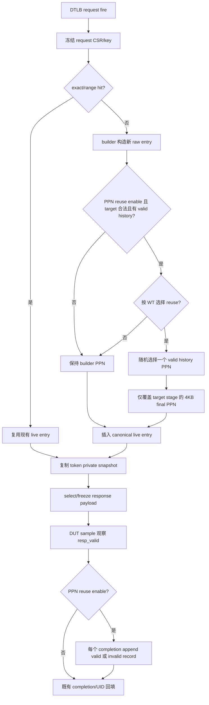

# V2 L2TLB PPN 复用与完成返回历史方案

状态：`do`，coding、专项复验和 implementation review 已完成。

本文为 V2 `L2TLB_agent` 的运行期激励扩展方案。它在不改变 DTLB -> L2TLB request、L2TLB -> DTLB response、TLB lookup key、PTE/权限、flush/reset token 生命周期和既有 response 调度的前提下，为新建的正常 4KB 映射提供一个可选的历史 PPN 复用来源。

关联源码：

- `mem_ut/ver/ut/memblock/env/plus.sv`
- `mem_ut/ver/ut/memblock/seq/base_seq_help/seq_csr_common.sv`
- `mem_ut/ver/ut/memblock/seq/base_seq_help/common_data_transaction.sv`
- `mem_ut/ver/ut/memblock/seq/base_seq_help/tlb_map_builder.sv`
- `mem_ut/ver/ut/memblock/seq/base_seq/memblock_l2tlb_base_sequence.sv`
- `mem_ut/ver/ut/memblock/seq/base_seq/soft_test/soft_test_l2tlb_ppn_reuse_sequence.sv`

## 1. 专有名词与抽象功能说明

| 术语 | 当前含义和代码落点 | 示例 |
| --- | --- | --- |
| PPN | 页号。对 `s2xlate=0/1` 指 S1 的 request-specific resolved PPN；对 `s2xlate=2/3` 指 S2 的 request-specific resolved PPN。 | `s2xlate=3` 的历史记录保存 S2 最终 PPN，而不是 raw S1 anchor 的 PPN。 |
| PPN history | `common_data_transaction` 中保存的有界 FIFO；每个已完成 response 占一个 record，可包含不可复用的 invalid record。 | `M=5` 时第六个完成 response 入队后自动淘汰最早的一个 record。 |
| reusable record | `ppn_valid=1` 的 history record。只有正常、可推导最终 PPN 的 response 可作为新 mapping 的候选。 | PF/GAF/PMA AF response 仍入队，但 `ppn_valid=0`，不能被随机选中。 |
| response completion | `driving_valid && sampled_resp_valid` 被确认的真实 DUT sample；当前入口为 `complete_driving_response()`。 | 已经 select 但尚未被 DUT sample 到的 driving token 不写 history。 |
| miss build | 当前 request 既未 exact hit、也未 range hit，需新建 canonical live entry 的分支。 | 只有 `MEMBLOCK_TLB_LOOKUP_MISS_BUILD` 可触发 PPN reuse。 |
| target stage | 新 entry 中承载最终映射 PPN 的 stage。`0/1` 为 S1，`2/3` 为 S2。 | allStage response 不改 S1 raw mapping，只改 S2 最终 PPN。 |
| 4KB normal target | 无 effective fault、无 PMA AF、target stage level 为 0 且非 NAPOT、且已具备 resolved PPN 的新 entry。 | 超页或 NAPOT response 的 PPN 可以被记录，但它们作为新 entry target 时维持原 builder 结果。 |
| frozen token snapshot | 每次 DTLB request fire 复制的 `pending.entry_snapshot`，在 response select 后成为唯一的 effective response payload。 | history 记录使用该 token 的 request-specific PPN，不能在 completion 时回读 live table。 |

### 本专项修改对象的抽象功能描述

`seq_csr_common::check_l2tlb_ppn_reuse_cfg()` 只校验 PPN reuse runtime 参数的范围和互相依赖；它不读取 history、不随机选 PPN，也不改变 TLB entry。

`common_data_transaction::record_l2tlb_completed_ppn_history()` 仅在一个 response 已完成后把该 token 的最终 PPN 或 invalid 占位写入 FIFO，并将队列裁剪到 `M`。它不查 live table、不触发 reuse，也不驱动接口。

`common_data_transaction::clear_l2tlb_ppn_history()` 只删除 completed-response PPN history；它由 runtime reset adapter 按 reset epoch 调用，不改变 `clear_dispatch_l2tlb_live_entries()` 的 live-entry/invalidate 专有语义。

`common_data_transaction::try_apply_l2tlb_ppn_reuse_to_new_entry()` 只在新建 canonical entry 尚未插表时，从可复用 history record 中按权重选择一个 PPN，并通过 builder 的 PPN 编码 helper 覆盖 target stage。它不改 key、权限、PTE、tag、ASID/VMID 或任何已存在 entry。

`common_data_transaction::get_or_create_l2tlb_entry_by_req_with_snapshot()` 是 responder 专用 lookup wrapper。它复用原 exact/range hit 和建表逻辑；只有 miss build 时才调用 PPN reuse helper，通用 `get_or_create_tlb_entry_by_req_with_snapshot()` 保持无 reuse 的既有语义。

`tlb_map_builder::can_apply_reused_final_ppn()` 与 `apply_reused_final_ppn()` 分别判断 entry 是否可安全承载复用 PPN、以及按 V2 S1 split PPN/S2 38-bit wire 规则写入 target stage。它们不管理 queue、不随机，也不插表。

`memblock_l2tlb_base_sequence::capture_fired_request()` 使用 responder 专用 lookup wrapper 建立或命中 entry；`complete_driving_response()` 在真正 completion 边界调用 history record helper。二者不重排 token，也不改变 response latency/flush 规则。

## 2. 目标、边界与不变量

### 2.1 目标

1. 新增 `MEMBLOCK_L2TLB_PPN_REUSE_EN`，默认 `0`；只有该值为 `1` 才允许收集 history 或在 miss build 中尝试 reuse。
2. 新增 `MEMBLOCK_L2TLB_PPN_REUSE_HISTORY_SIZE`，默认 `5`；它定义最近已完成 response FIFO 的最大 record 数量。
3. 新增 `MEMBLOCK_L2TLB_PPN_REUSE_WT`，默认 `40`；它定义有可用候选时，新 mapping 选择复用 PPN 的百分比权重。
4. enable 后，每个真正完成的 response 都追加一个 history record，包含 exact hit、range hit 和 miss build 创建的 response；超过 `M` 时从队首淘汰最旧 record。
5. 有效候选存在且本次新建 entry 是可复用 target 时，按 `WT` 决定是否复用；选择复用后从 FIFO 中所有 valid candidate record 均匀随机选择一个，保留重复 PPN 的出现次数权重。
6. enable 为 `0` 时保持原有行为：不读写 FIFO、不调用 PPN reuse 随机化、不改变 builder PPN。

### 2.2 不变量

1. PPN history 不是 TLB validity、flush 或 CSR state 的镜像；`sfence/hfence` 只删 live entry，不删除已完成 response history。
2. testcase 主表重建和 runtime reset 都清空 history，避免跨 testcase/reset 重用旧 PPN；flush cancel 的 token 没有 response completion，不能入队。
3. history 的写入值必须来自当前 token 的 request-specific derived PPN：`0/1` 取 `request_s1_resolved_ppn`，`2/3` 取 `request_s2_resolved_ppn`。range/superpage hit 不能直接使用 anchor entry 的 raw PPN。
4. 任何 fault、PMA AF 或不能解析 final PPN 的 completed response 均写入 `ppn_valid=0` 的 record，满足“每次请求返回收集一次”但不把异常 payload 误作可复用地址。
5. PPN reuse 只改新 entry 的 final PPN encoding；lookup key、canonical anchor、entry generation、stage activation、PTE、fault、PBMT、tag、ASID、VMID 和已有 range index 均保持既有生成结果。
6. response history FIFO 只做 `push_back/pop_front`，不扫描主表或 live TLB；miss reuse 最多扫描有界 `M` 个 record，不进入每拍 service loop。

### 2.3 非目标

1. 不新增 DTLB request ID、PADDR lookup、L2Cache/PTW 下游模型或第二个 L2TLB lifecycle owner。
2. 不让 reuse 修改 hit entry、已冻结 token、UID payload 或正在 driving 的 response。
3. 不在超页/NAPOT target 上强行覆盖 PPN；这类 response 可以贡献 valid history，但新建超页/NAPOT entry 继续使用 builder 的原 PPN，避免 VPN 低位拼接语义被破坏。
4. 不去重 history、不保证每个 PPN 等概率；FIFO record 语义是“最近 M 次 completion”，重复 PPN 自然具有更多被选中的机会。
5. 不增加 RM、scoreboard 或 coverage 实现；本计划只提供后续可观测的 log/history 行为和 software smoke。

## 3. 参数与配置 Flow

### 3.1 参数定义和默认值

| 参数 | 默认值 | 类型与合法范围 | 生效语义 |
| --- | ---: | --- | --- |
| `MEMBLOCK_L2TLB_PPN_REUSE_EN` | `0` | bit | `1` 时开启 history 收集与 miss PPN reuse；`0` 时完全旁路。 |
| `MEMBLOCK_L2TLB_PPN_REUSE_HISTORY_SIZE` | `5` | `0..256`；enable 时必须大于 `0` | FIFO 最大 record 数；256 是 framework software history 的扫描上限，不是 DUT 物理容量。 |
| `MEMBLOCK_L2TLB_PPN_REUSE_WT` | `40` | `0..100` | candidate 存在且 target 合法时的 reuse 概率。 |

参数权威链为：

```text
env/plus.sv
  -> seq_csr_common::load_from_plus()
  -> seq_csr_common::check_l2tlb_ppn_reuse_cfg()
  -> seq_csr_common getter
  -> memblock_l2tlb_base_sequence::configure_from_plus()
```

`default.cfg` 必须写出三个同名默认项。专项 software smoke cfg 使用 `EN=1, M=1, WT=100`，让首个正常 completion 之后的目标 mapping 可以确定复用该 PPN；正常 default 不改变既有随机 seed 消耗。

### 3.2 参数校验

```text
check_l2tlb_ppn_reuse_cfg():
  load_from_plus 先用 get_non_negative_int() 读取 M/WT，拒绝负的 plus::int。
  若 WT 大于 100：uvm_fatal。
  若 M 大于 256：uvm_fatal。
  若 EN=1 且 HISTORY_SIZE=0：uvm_fatal。
  EN=0 时允许 HISTORY_SIZE=0，因该 FIFO 不参与任何状态写入。
  不对 M 建立物理 DUT 宏镜像；256 仅为测试框架有界 history 的性能上限。
```

`configure_from_plus()` 必须把 getter 结果冻结到 responder 私有字段，并在启动 log 中打印 enable、M 和 WT。公共 helper 不能直接读取 `plus::MEMBLOCK_*`。

## 4. 运行期状态与生命周期

### 4.1 `common_data_transaction` 的 history record

新增轻量 struct queue：

```systemverilog
typedef struct {
    bit                 ppn_valid;
    bit [43:0]          ppn;
    bit [1:0]           s2xlate;
    longint unsigned    response_token;
    longint unsigned    complete_sample_seq;
} memblock_l2tlb_ppn_history_record_t;

memblock_l2tlb_ppn_history_record_t l2tlb_ppn_history_q[$];
```

字段语义：`ppn_valid=1` 说明 `ppn` 可作为新 entry candidate；为 `0` 说明该 completion 只保留 FIFO 时间位置和调试 provenance。`response_token/complete_sample_seq` 仅用于 log/audit，不参与 key、reuse 选择或 DUT payload。

清理边界：

```text
common_data_transaction::new():               delete history。
common_data_transaction::reset_all_tables():  delete history。
L2TLB runtime reset:                           dispatch_monitor_event_adapter 调用 clear_l2tlb_ppn_history()。
sfence/hfence C4 delete:                       不清 history。
flush cancel:                                  不写 history，因为没有 completed response。
```

`clear_dispatch_l2tlb_live_entries()` 保持仅清 `sfence_invalidate_pending_q`、range index 和
`tlb_entry_by_key` 的既有职责。`dispatch_monitor_event_adapter::reset_l2tlb_sfence_state()` 已经按
`adapter_reset_serviced_epoch` 去重 runtime reset；在该函数确认新 epoch 后，它必须与现有 live-entry
clear 并列调用 `clear_l2tlb_ppn_history()`。这样 SFENCE/HFENCE 的普通 C4 live-entry 删除不会误清
history，且同一 reset epoch 不会重复清队列。

### 4.2 reset 专用 PPN history clear helper

`common_data_transaction::clear_l2tlb_ppn_history()` 只执行 `l2tlb_ppn_history_q.delete()`；不清 live
entry、range index、UID record、CSR history 或 responder token。它只由 `reset_all_tables()` 和 runtime
reset adapter 使用。普通 sfence/hfence 删除路径不得调用该 helper。

### 4.3 responder 私有配置快照

`memblock_l2tlb_base_sequence` 新增三个核心字段：

```systemverilog
bit          ppn_reuse_en;
int unsigned ppn_reuse_history_size;
int unsigned ppn_reuse_wt;
```

它们由 `configure_from_plus()` 在 sequence 启动时设置，此后不随 runtime CSR 或 response reorder 改变。enable 为 `0` 时 `capture_fired_request()` 和 `complete_driving_response()` 均不得调用 PPN history helper。

## 5. 目标功能 Flow



主流程必须遵守以下时序：reuse 在 live entry 插入前发生；history 写入在 `complete_driving_response()` 里的 UID 回填完成前、`driving_req` 清空前发生。当前 `send_l2tlb_cycle()` 固定先处理
`driving_valid && sampled_resp_valid` 的 completion，再处理同 sample 的 request fire。因此同一 DUT sample
中旧 response 完成后到来的新 miss capture 可以立即看到该新 record；这是本计划的明确语义，不能写成
“下一拍才可见”。

## 6. 关键 helper 细节

### 6.1 `seq_csr_common::check_l2tlb_ppn_reuse_cfg()`

抽象功能描述：该校验在全局 plus 已加载、responder 开放 ready 前完成。它只拒绝无法定义的 runtime 配置，不创建 entry、不读取队列。

源码级伪代码：

```text
check_l2tlb_ppn_reuse_cfg():
  if l2tlb_ppn_reuse_wt > 100:
    uvm_fatal。
  if l2tlb_ppn_reuse_en and l2tlb_ppn_reuse_history_size == 0:
    uvm_fatal。
```

中文文字伪代码：先检查百分比权重是否仍可表达“复用/不复用”二选一；随后只在 enable 时要求 FIFO 容量非零。关闭开关时没有收集或选择路径，保留 `M=0` 不会影响原始 L2TLB 行为。

### 6.2 `common_data_transaction::record_l2tlb_completed_ppn_history()`

抽象功能描述：该 helper 处理一个已被 DUT 真正观察到的 response，向 FIFO 追加唯一 record。它消费 caller 已冻结的 token 字段和 effective entry，不做 lookup 或随机化。

输入：`s2xlate`、request-specific derived valid/S1 PPN/S2 PPN、effective `entry_snapshot`、token、completion sample 和 `M`。

输出/副作用：向 `l2tlb_ppn_history_q` 写入一个 record；队列长度最多为 `M`。

源码级伪代码：

```text
record_l2tlb_completed_ppn_history(...):
  构造 record，默认 ppn_valid=0、ppn=0。
  若 entry 无 effective fault、无 PMA AF 且 request_derived_valid：
    s2xlate=0/1：record.ppn = request_s1_resolved_ppn；record.ppn_valid=1。
    s2xlate=2/3：record.ppn = request_s2_resolved_ppn；record.ppn_valid=1。
    其他 s2xlate：uvm_fatal。
  push_back(record)。
  while queue.size() > M：pop_front()。
```

中文文字伪代码：先创建 invalid 默认 record，保证 fault/unresolvable response 也占据一次“最近返回”位置。只有 response 的 effective payload 仍是正常翻译，且 token 的 request-specific PPN 已解析时，才按 request stage 选择 S1 或 S2 final PPN。写入后从队首删到容量满足 `M`；因此范围命中、普通命中和新建命中的完成顺序都被统一保留。

### 6.3 `common_data_transaction::clear_l2tlb_ppn_history()` 与 reset adapter 调用点

抽象功能描述：该 helper 是 PPN history 的 reset lifecycle owner。它在 testcase 重建或 adapter 已确认的
runtime reset epoch 删除历史，不参与 sfence/hfence C4 的 live-entry invalidation。

源码级伪代码：

```text
common_data_transaction::clear_l2tlb_ppn_history():
  l2tlb_ppn_history_q.delete()。

dispatch_monitor_event_adapter::reset_l2tlb_sfence_state():
  若当前 reset epoch 尚未由 adapter 服务：
    执行既有 package reset。
    调用 clear_dispatch_l2tlb_live_entries() 删除 live TLB/invalidate 状态。
    调用 clear_l2tlb_ppn_history() 删除 completed-response history。
    记录 adapter_reset_serviced_epoch 并发送既有 reset acknowledge。
```

中文文字伪代码：history 与 live TLB 的生命周期不同，因此不能把删除语句塞进名称和职责都限定为
live-entry 的 helper。adapter 已有 per-epoch 去重条件，新增调用放在同一条件内部；这保证 reset 后没有
旧 PPN 可被重用，也保证同一 reset 期间重复采样不会反复改变状态。普通 SFENCE/HFENCE 仍只经
`delete_live_tlb_entry_by_anchor_key()` 删除匹配 entry，history 保留。

### 6.4 `tlb_map_builder::can_apply_reused_final_ppn()` 与 `apply_reused_final_ppn()`

抽象功能描述：这两个 helper 将复用策略与 V2 payload 编码隔离。前者判定新 entry 能否接受 full final PPN；后者只写 target stage 的 PPN 表示，保留 entry 其余语义。

源码级伪代码：

```text
can_apply_reused_final_ppn(entry, ppn):
  若 entry 有 effective fault 或 pmaAF：返回 0。
  target = (s2xlate=0/1) ? S1 : S2。
  若 target 不 active、level 非 0、PTE.N=1 或 resolved_ppn_valid=0：返回 0。
  若 target 为 S2 且 ppn[43:38] 非 0：返回 0。
  返回 1。

apply_reused_final_ppn(entry, ppn):
  若 can_apply... 为 0：uvm_fatal。
  若 target=S1：
    调用既有 split sector payload helper 写 s1_entry_ppn_raw/s1_ppn_low。
    写 s1_resolved_ppn=ppn，保持 resolved valid。
  若 target=S2：
    按既有 38-bit response encoding 写 s2_entry_ppn_raw。
    写 s2_resolved_ppn=ppn，保持 resolved valid。
  再执行既有 inactive-stage 与 S1 sector consistency 校验。
```

中文文字伪代码：先以新 entry 当前 builder 结果判定目标是否是正常 4KB translation。S1 重用必须重新生成 split PPN 字段，不能只改 `s1_resolved_ppn`；S2 重用必须先保证 44-bit PPN 可编码到 V2 的 38-bit wire。allStage 只覆写 S2 final PPN，因此 S1 到 GVPN 的 raw mapping、S2 tag 与权限仍保持本次 request 原始建表结果。

### 6.5 `common_data_transaction::try_apply_l2tlb_ppn_reuse_to_new_entry()`

抽象功能描述：该 helper 在 miss build 后、canonical table 插入前决定是否覆写新 entry 的 PPN。它只扫描有界 history queue，不触碰 existing entry、UID 或 pending token。

源码级伪代码：

```text
try_apply_l2tlb_ppn_reuse_to_new_entry(entry, wt, reused):
  reused = 0。
  若 entry 不是合法 4KB target：返回。
  遍历 history queue，将 ppn_valid=1 且 builder 可编码的 record index 放入 candidates。
  若 candidates 为空：返回。
  若 wt=0：返回，不消耗随机数。
  若 wt<100：以 wt / (100-wt) 决定 reuse；未选中则返回。
  从 candidates 中均匀随机选择一个 index；randomize 失败则 uvm_fatal。
  调用 apply_reused_final_ppn(entry, record.ppn)。
  reused = 1。
```

中文文字伪代码：候选不是所有 record，而是既有 `ppn_valid=1` 且对本次 target stage 可编码的 record；这避免 S1 高位 PPN 直接写入 S2 38-bit wire。`WT=0` 直接保持 builder PPN；`WT=100` 不再抽取二选一开关、但当候选多于一个时仍随机选 PPN。重复 record 不去重，因此符合最近完成 response 的原始出现频率。

### 6.6 `common_data_transaction::get_or_create_l2tlb_entry_by_req_with_snapshot()`

抽象功能描述：该 responder 专用 wrapper 维持现有 exact/range hit 行为，并仅为 miss build 增加 PPN policy。通用 lookup API 保持默认无 reuse，软件范围索引测试不会因打开某个 unrelated plus 而改变原有断言。

源码级伪代码：

```text
get_or_create_l2tlb_entry_by_req_with_snapshot(..., reuse_en, reuse_wt, ...):
  request_key = frozen CSR 生成的 key。
  若 exact hit：返回旧 entry，created=0。
  若 range hit：返回 anchor entry，created=0。
  entry = builder 创建新 entry。
  若 reuse_en：try_apply_l2tlb_ppn_reuse_to_new_entry(entry, reuse_wt, reused)。
  插入 canonical table 和 range index。
  lookup_result=MISS_BUILD，created=1，返回 entry。
```

中文文字伪代码：对两个 hit 分支完全早退，不能读 history 或消耗 reuse 随机数。只有当前 request 确定要成为新 canonical mapping 时才构造 entry、尝试 PPN reuse、再插表和注册 range index。插入后任何重复 request 都走既有 hit 路径，不能再次改写本 entry 的 PPN。

### 6.7 `memblock_l2tlb_base_sequence::capture_fired_request()` 与 `complete_driving_response()`

抽象功能描述：前者在真实 request fire 建立 token 和 live entry，后者在真实 response completion 收敛 token/UID/history。它们继续使用 frozen CSR snapshot，不读取 live CSR 替代 request/response context。

源码级伪代码：

```text
capture_fired_request():
  沿用既有 token、CSR snapshot、key 和 queue 容量检查。
  调用 responder 专用 get_or_create wrapper，并传入冻结的 reuse enable/WT。
  沿用 live entry copy、request-specific derive、latency 和 pending enqueue。

complete_driving_response():
  沿用 due/frozen/PBMTE sample 一致性检查。
  若 ppn_reuse_en：
    调用 record_l2tlb_completed_ppn_history(
      driving_req 的 s2xlate、derived PPN、effective entry snapshot、token、sample、M)。
  沿用 UID completion、log、清 driving slot、completed_count 和 lifecycle audit。
```

中文文字伪代码：capture 仍以 request fire 的 frozen CSR 选择 entry，reuse 只是 miss build 期间的一次 PPN 覆写。complete 仅在 `sampled_resp_valid` 已确认后才触发，并且发生在 `driving_req` 释放前，所以 record 的 PPN、effective fault 和 token provenance 都来自同一个完成 response。enable 为零时两个新增调用都被旁路，既有随机顺序和 response lifecycle 不变。

## 7. 测试与验收 Flow

### 7.1 software-only smoke

新增 `soft_test_l2tlb_ppn_reuse_sequence` 与 `tc_l2tlb_ppn_reuse_smoke`，并按现有 `seq_pkg.sv` / `tc_pkg.sv` 编译顺序接入。该 smoke 只直接调用公共 TLB/history API，不驱动真实 DUT wire、不创建第二个 responder owner。

定向检查：

1. `EN=0`：调用 responder wrapper 时不读写 history，不改变 target entry baseline PPN。
2. `EN=1, M=1, WT=100`：首个正常 completed S1 response 入队，下一笔不同 VPN 的 4KB miss 必得到相同 S1 PPN。
3. `M=2` 的连续三次 completion：断言 FIFO 依次保留第二、第三个 PPN，且最早 PPN 已被队首淘汰。
4. `WT=0`：history 存在但新 entry 保留 builder PPN。
5. fault/PMA AF/unresolvable response：仍使 queue 增加一条 invalid record，后续 miss 不得复用该 record。
6. exact hit 与 range hit：通过 request-specific derived PPN 写 history，验证未直接取 anchor raw PPN；hit 本身不能触发 new-entry reuse。
7. S1 split payload 与 S2 wire：验证 S1 `entry_ppn/ppn_low` 一致；S2 仅在候选可编码时被选；超页/NAPOT target 不被覆写。
8. `reset_all_tables()` 与 `clear_l2tlb_ppn_history()`：history 清空；`clear_dispatch_l2tlb_live_entries()` 保持 live-only 语义。通过普通 SFENCE/HFENCE C4 delete 路径验证 live entry 删除不清 history。
9. sequence-level completion harness：构造已冻结的 driving token、发布与其 completion sample 对应的 C-2 CSR history，并仅在 `driving_valid && sampled_resp_valid` 为真时调用真实 `complete_driving_response()`。分别构造 exact hit、range hit、miss build token，断言每个 completion 恰好追加一个 record；`sampled_resp_valid=0` 时不得调用 completion 且 FIFO 不变。
10. 同 sample completion + miss：先通过上述真实 completion 路径写入 PPN，再在同一 sample 的后续 request capture 调用 responder 专用 lookup wrapper，断言 `WT=100` 的新 4KB miss 可立即复用该 record。这与 `send_l2tlb_cycle()` 的现有 completion-before-capture 顺序一致。

### 7.2 静态检查与远端仿真

```bash
git diff --check -- mem_ut/ver/ut/memblock AI_DOC
rg -n "MEMBLOCK_L2TLB_PPN_REUSE|l2tlb_ppn_history|reused_final_ppn" \
  mem_ut/ver/ut/memblock AI_DOC
cd mem_ut/ver/ut/memblock/sim
make eda_compile tc=tc_sanity mode=base_fun
make eda_run tc=tc_sanity mode=base_fun
make eda_run tc=tc_l2tlb_ppn_reuse_smoke mode=base_fun cfg=tc_l2tlb_ppn_reuse_smoke
```

若 V2 real-DUT 环境不能完成专项 responder smoke，必须在 implementation review 记录失败日志、已覆盖的 software closure 和剩余风险，不能把未执行或未通过项写为已验收。

## 8. 文件修改与文档同步

### 8.1 代码与配置

| 文件 | 修改内容 |
| --- | --- |
| `env/plus.sv` | 定义、解析三项 runtime plus，并添加中文默认/使能语义注释。 |
| `seq/base_seq_help/seq_csr_common.sv` | 先以有符号非负校验加载 M/WT，再做 `0..256`/`0..100` 校验、getter 和 responder 私有配置来源。 |
| `seq/plus_cfg/default.cfg` | 追加三项默认值。 |
| `seq/plus_cfg/tc_l2tlb_ppn_reuse_smoke.cfg` | 给专项 smoke 设置 `EN=1/M=1/WT=100`。 |
| `seq/base_seq_help/common_data_transaction.sv` | 增加 history state、reset clear、record/reuse helper 和 responder 专用 lookup wrapper。 |
| `seq/base_seq_help/dispatch_monitor_event_adapter.sv` | 在已去重的 runtime reset epoch 同时调用 live-entry clear 与 history 专用 clear。 |
| `seq/base_seq_help/tlb_map_builder.sv` | 增加 final PPN eligibility/encoding helper。 |
| `seq/base_seq/memblock_l2tlb_base_sequence.sv` | 冻结三项配置，在 miss build 传入 policy，并在 completion 写 history。 |
| `seq/base_seq/soft_test/soft_test_l2tlb_ppn_reuse_sequence.sv` | 新增 software closure。 |
| `tc/src/soft_test/soft_test_tc_l2tlb_ppn_reuse.sv` | 新增 smoke testcase。 |
| `seq/seq_pkg.sv`、`seq/seq.f`、`tc/tc_pkg.sv`、`tc/tc.f` | 按现有 soft-test package 模式接入新类。 |

### 8.2 文档

coding 完成后同步检查并按实际实现更新：

- `AI_DOC/analysis/source_sv/dispatch_framework_sv/memblock_l2tlb_base_sequence.md`
- `AI_DOC/plan/test_framework/plan/do/l2tlb_base_seq_plan_20260614.md`
- `AI_DOC/plan/test_framework/plan/do/dispatch_plan_v2_framework_design_20260614.md`
- `AI_DOC/plan/test_framework/plan/do/dispatch_plan_v2_development_detail_20260614.md`
- `AI_DOC/analysis/framework_design/dispatch_backend_interface_closure_code_changes.md`
- `AI_DOC/project_management/mem_ut_parameter_management.md`
- `mem_ut/ver/ut/memblock/rule/plus_demo_migration_plan.md`
- `mem_ut/ver/ut/memblock/rule/memblock_parameter_management_rule.md`
- `mem_ut/ver/ut/memblock/rule/memblock_l2tlb_agent_rule.md`

同时检索 L2TLB rule 提到的 `dispatch_plan_v2_review_annotated.md`；若该历史 review 已不存在，implementation review 必须写明检索范围和缺失结论，不能静默忽略。

## 9. Coding 顺序与完成标准

1. 完成参数链和参数合法性检查，确认默认 enable 为 0。
2. 实现 builder 的 PPN encoding helper 与 common data history/reuse API，并先完成 software-only directed closure。
3. 接入 responder capture/completion 两个边界，确保 history 永远由 completion 而非 request fire 驱动。
4. 编译并运行 default/tc_sanity 和专项 smoke，检查 log 中 completion、record、reuse 决策的顺序。
5. 同步文档，生成 implementation review；review 覆盖每个代码改动、plan 对齐和用户已有 Verdi 配置脏文件。
6. 所有必要检查完成后将本 plan 从 `undo` 移到 `do`，只 stage 本专项文件并本地 commit，不 push。

完成标准：默认配置下不产生 history/read/reuse；enable 配置下 completed response FIFO 的长度、淘汰顺序、invalid record 和 PPN 复用概率符合参数；L2TLB 的 response token、flush/reset、UID 回填和 DTLB 接口方向均不回归。

## 执行中补充/修正（IMPLEMENTATION_DELTA）

### 1. 合法 token `0` 的 completion provenance

[IMPLEMENTATION_DELTA]

- 来源：coding review 发现 `memblock_l2tlb_base_sequence::initialize_lifecycle_state()` 将
  `next_request_token` 初始化为 `0`，第一笔真实 DTLB request fire 因而合法地获得 token `0`。
- 原 plan：history record 保存 `response_token` 作为 audit provenance，但没有定义 token `0` 的合法性。
- 实现调整：`record_l2tlb_completed_ppn_history()` 仅要求 entry、completion sample 与 history 容量有效；
  不再把 `response_token==0` 当作非法输入。software completion harness 同步接受 token `0`，并让
  `EN=1` 的首个 S1 completion 使用 token `0`。
- 原因：把合法首 token 当作未初始化值会使 enable 后第一笔真实 response 触发 `uvm_fatal`，违反“每次请求返回时收集”。
- 影响范围：`common_data_transaction.sv`、`soft_test_l2tlb_ppn_reuse_sequence.sv` 和专项 smoke；token 编号、
  pending queue、response 调度及 UID completion 均不改变。

### 2. S2/allStage target 的 leaf PTE 限制

[IMPLEMENTATION_DELTA]

- 来源：coding review 发现 S2 的 `resolved_ppn_valid` 只表示地址可解析，并不保证 S2 PTE 是 leaf；
  当前 request-derived path 已将 R/W/X 全零的 S2 payload 视为 non-leaf。
- 原 plan：仅允许正常 4KB target 覆写 final PPN。
- 实现调整：`tlb_map_builder::can_apply_reused_final_ppn()` 对 `s2xlate=2/3` 额外要求
  `s2_pte_r || s2_pte_w || s2_pte_x`；software smoke 分别验证 S2 和 allStage 的 non-leaf target
  保持 builder PPN。
- 原因：仅依赖 level、NAPOT 与 resolved PPN 会让 MIXED/EXCEPTION_BIASED 配置下的 S2 non-leaf entry
  落入 reuse path，与“normal 4KB mapping”的边界不一致。
- 影响范围：仅新建 entry 插表前的 eligibility 判断；历史 record、hit path、PTE 权限、key 和 response payload
  均不被改写。

### 3. software smoke 的参数和 completion guard 覆盖

[IMPLEMENTATION_DELTA]

- 来源：coding review 发现初版 smoke 虽有 `sampled_resp_valid=0` guard，却没有实际执行该分支，且专项 cfg
  的 EN/M/WT 未被断言消费。
- 原 plan：要求验证 `plus -> seq_csr_common -> responder` 参数链，以及 non-visible response 不入 FIFO。
- 实现调整：smoke 启动时调用 `configure_from_plus()` 并断言专项 cfg 的 `EN=1/M=1/WT=100` 已进入 getter 与
  responder 私有快照；随后构造 `completion_visible=0` 的 frozen token，断言 history 不变。
- 原因：避免 software smoke 只靠手写 literal policy 通过，而遗漏真实配置冻结或 completion gate。
- 影响范围：仅专项 software closure；真实 DUT sequence 的生命周期与 runtime 参数语义不改变。

## 与初步 plan 差异说明

### 1. 收集时机与 token 生命周期

修改目的：把用户指定的“每次请求返回时收集”落到 V2 唯一能证明 DUT 已消费 response 的边界，避免把 select、drive、completion 三个阶段混为一谈。

初步方案前的文字伪代码：

```text
request 到来：
  建立或命中 mapping。
  后续某个时刻记录其 PPN。
```

正式方案后的文字伪代码：

```text
request fire：
  建立独立 token，并冻结 entry snapshot。
response select：
  只冻结/驱动 token response，不写 history。
driving_valid && sampled_resp_valid：
  调用 complete_driving_response()。
  EN=1 时记录该 token 的 final PPN 或 invalid record。
  再执行 UID completion 并释放 driving token。
同一 sample 后续 request fire：
  capture 在 completion 之后执行，因此本次新 record 立即可供新的 miss build 选择。
flush/reset cancel：
  token 计入 canceled，不写 history。
```

函数/helper 差异：新增 `record_l2tlb_completed_ppn_history()`，唯一调用点放在
`complete_driving_response()` 中、`driving_req` 清空前。它不改变 response select、latency、reorder
或 lifecycle accounting。

差异影响：reordered response 的 history 顺序由真实 completion 决定；同 sample completion+miss 会按
现有 service 顺序复用刚完成的 PPN，而不是人为延迟一拍。

### 2. history record 的异常语义

修改目的：初步需求没有定义 fault、PMA AF 或无法得到 final PPN 的 response。正式方案既保留“每次完成
都收集一次”的 FIFO 时间顺序，也不允许异常 payload 被误作可用 PPN。

初步方案前的文字伪代码：

```text
completion：
  从 response 取得 PPN 并加入最近 M 项。
```

正式方案后的文字伪代码：

```text
completion：
  先创建 ppn_valid=0 的 record。
  若 effective entry 无 fault、无 PMA AF 且 request-specific PPN 有效：
    写 ppn_valid=1 和对应 final PPN。
  push_back record；超出 M 时 pop_front。
```

函数/helper 差异：新增 `memblock_l2tlb_ppn_history_record_t`，其 `ppn_valid` 将 record 是否可作为
candidate 与“该 response 是否占据最近返回位置”解耦。新行为保留重复 PPN，不做去重。

差异影响：异常 response 不改变随机候选集合，但会参与 FIFO 的最近性淘汰顺序。

### 3. 记录值与新 mapping 覆写范围

修改目的：初步需求只写“复用 PPN”，没有区分 range anchor PPN、当前 request resolved PPN、S1 split
payload 和 S2 38-bit wire。正式方案保证历史值和 DUT 可见 payload 均与当前 request 对齐。

初步方案前的文字伪代码：

```text
miss：
  随机选择一个历史 PPN。
  写入新 mapping 的 PPN。
```

正式方案后的文字伪代码：

```text
completion record：
  s2xlate=0/1 记录 token.request_s1_resolved_ppn。
  s2xlate=2/3 记录 token.request_s2_resolved_ppn。
miss build：
  builder 先生成本次 key/PTE/fault/tag/权限/level 的新 entry。
  仅当 target 是无 fault、非 NAPOT 的 4KB normal mapping 时：
    按 WT 从可编码的 valid history record 选择 PPN。
    S1 重建 split entry_ppn/ppn_low；S2 写 38-bit encodable entry_ppn。
  再插入 canonical table/range index。
```

函数/helper 差异：新增 `can_apply_reused_final_ppn()`、`apply_reused_final_ppn()` 和 responder 专用
`get_or_create_l2tlb_entry_by_req_with_snapshot()`。通用 lookup wrapper 保持 `reuse_en=0` 的旧行为；hit
分支早退，不读取 FIFO 或消耗 reuse 随机数。

差异影响：feature 不污染既有 generic lookup/soft range test；新 PPN 只会在新 canonical mapping 插表前
生效，已命中或已冻结 response 的 payload 永不被回写。

### 4. reset 与 SFENCE/HFENCE 的分离

修改目的：初步需求没有规定 history 的 reset scope。正式方案把 completed-response history 和 live TLB
entry 的生命周期显式分开，避免 reset 清理遗漏或 SFENCE/HFENCE 意外抹掉候选。

初步方案前的文字伪代码：

```text
live entry 被清除时：
  未定义 history 是否也清除。
```

正式方案后的文字伪代码：

```text
testcase reset_all_tables：
  清 history。
runtime reset adapter 的新 epoch：
  维持 clear_dispatch_l2tlb_live_entries() 的原 live-only 清理。
  额外调用 clear_l2tlb_ppn_history()。
normal SFENCE/HFENCE C4 delete：
  只删除匹配 live entry/range index，保留 history。
```

函数/helper 差异：不修改 `clear_dispatch_l2tlb_live_entries()` 的职责；新增
`clear_l2tlb_ppn_history()`，由 `dispatch_monitor_event_adapter::reset_l2tlb_sfence_state()` 在既有
`adapter_reset_serviced_epoch` 去重分支调用。该差异同时保证 runtime reset 后不会跨代复用 PPN。

差异影响：reset 清理和 SFENCE/HFENCE invalidation 具有不同且可测试的范围，不会因同名 live-entry helper
承担额外状态而破坏既有 reset adapter 的审计语义。

### 5. 参数化 enable 与默认兼容性

修改目的：初步需求给出 M、40% 和 enable，但没有定义关闭时的随机/状态副作用及不合法组合。正式方案将
三个值纳入唯一参数链，并将默认路径严格旁路。

初步方案前的文字伪代码：

```text
enable、M 和权重由实现临时读取；关闭时的 collection/random 行为未定义。
```

正式方案后的文字伪代码：

```text
plus -> seq_csr_common -> getter -> responder frozen fields。
load_from_plus 先以 get_non_negative_int() 检查有符号 M/WT。
若 EN=0：
  不调用 record helper，不扫描 history，不调用 reuse randomize。
若 EN=1：
  M 必须在 1..256；WT 必须在 0..100。
  WT=0 直接不复用；WT=100 必复用一个 valid candidate（若 candidate 存在）。
```

函数/helper 与参数差异：新增 `MEMBLOCK_L2TLB_PPN_REUSE_EN=0`、
`MEMBLOCK_L2TLB_PPN_REUSE_HISTORY_SIZE=5`、`MEMBLOCK_L2TLB_PPN_REUSE_WT=40`，以及
`check_l2tlb_ppn_reuse_cfg()` 和三个 getter。它们不取代任何 compile-time DUT 容量/接口宏，也不改变
`MEMBLOCK_L2TLB_SEQ_EN` 的 responder 启动语义。

差异影响：默认 `EN=0` 不增加随机状态或 FIFO 写入；打开 feature 时每次 miss 的候选扫描上限为 256，避免
testcase plus 的负数转换或过大 M 退化为无界高频路径。
