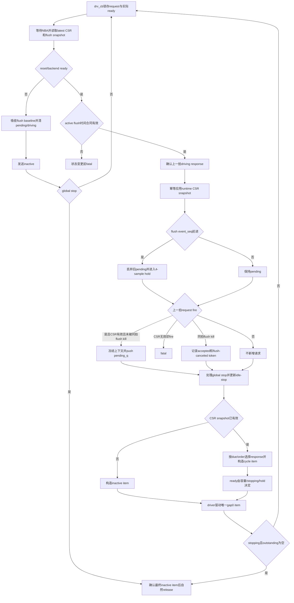

# mem_ut V2 L2TLB Response 与多 Outstanding 生命周期适配最终 Coding Plan

| 项目 | 内容 |
|---|---|
| 状态 | `do`，coding、文档同步、验证和独立 review 已完成；本 plan 已归档 |
| 目标版本 | V2 |
| 当前分支 | `mem_ut_uvm_v2` |
| 核验 commit | `cf63e12ebd00db93524edc35c1fab646b6a48e31`（当前 staged 基线） |
| RTL/Scala 权威 | `build_memblock/rtl/MemBlock.sv`、`src/main/scala/xiangshan/cache/mmu`、`src/main/scala/xiangshan/mem/MemBlock.scala` |
| 测试框架入口 | `memblock_l2tlb_base_sequence`、`L2tlb_agent_agent_driver` |
| Plan 定位 | V2 DTLB/L2TLB responder 的 response 字段适配、请求队列、回复调度和生命周期 owner |
| 修订日期 | 2026-07-23 |

## 1. Plan 定位与范围

本 plan 是当前 `L2TLB_agent` 的唯一运行期 lifecycle owner，负责：

- 保持 `DTLB -> L2TLB_agent request`、`L2TLB_agent -> DTLB response` 的既有 responder 方向。
- 核对并补齐 V2 `s2_entry_perm_g/u` response 字段链。
- 将当前一次只处理一笔请求、用 `pre_pkt_gap` 阻塞等待的实现改为多 outstanding 队列。
- 按 request fire 时刻保存 `vpn/s2xlate`、runtime CSR snapshot、lookup key、entry snapshot 和回复 payload。
- 支持默认顺序回复和可配置乱序回复。
- 用 1 拍、中延迟、长延迟三档权重选择每笔回复的最早可响应拍。
- 负责 queue-full backpressure、reset、sfence/CSR flush、global stop、idle stop 和最终排空。

本 plan 不实现：

- L2Cache、PTW page walk 或 memory 下游模型。
- 顶层 `io_l2_tlb_req_*`、`io_l2_pmp_resp_*` 的接管。
- s1/s2 两套独立 PTE 权限、directed GPF/GAF 或 stage2 legal-leaf 构造；这些继续归
  `mem_ut_test_framework_todo_20260614.md` 的 L2TLB S1/S2 权限专项。
- DUT response 正确性 checker、RM 或 covergroup。

### 1.1 Payload 文档权威交接（2026-08-06）

本 plan 已归档，继续保留已落地的 request token、pending queue、latency/reorder、response sample、
flush/reset 和 lifecycle owner 的历史实现说明。它不再定义后续 response payload 的 coding 规则。

`AI_DOC/plan/test_framework/plan/undo/mem_ut_v2_l2tlb_response_random_payload_plan_20260729.md`
是 S1/S2 response data model 的唯一权威，覆盖字段命名、fault、PPN、permission、PBMT、sector payload、
snapshot copy 和 driver 映射。本 plan 中所有“共享 `entry.pte_*` 同时填 S1/S2”及由此派生的 response
payload 描述仅保留为归档历史，不能作为新 coding 的实现依据。

执行该 random payload 专项时，coding 只需遵循对应 `undo` plan 和当前落点源码，不需要回读本 `do` plan。
本 `do` plan 不要求重做或改写既有 lifecycle；新 payload 代码只保持当前已实现 lifecycle 的外部时序不变，
不得据本归档文档重新引入共享 payload 字段或第二套 payload 规则。

主要 coding 文件：

```text
mem_ut/ver/ut/memblock/cfg/memblock_compile_params.svh
mem_ut/ver/ut/memblock/common/memblock_common/src/memblock_sync_pkg.sv
mem_ut/ver/ut/memblock/env/plus.sv
mem_ut/ver/ut/memblock/seq/base_seq_help/memblock_dispatch_types.sv
mem_ut/ver/ut/memblock/seq/base_seq_help/seq_csr_common.sv
mem_ut/ver/ut/memblock/seq/base_seq_help/common_data_transaction.sv
mem_ut/ver/ut/memblock/seq/base_seq_help/memblock_tlb_entry.sv
mem_ut/ver/ut/memblock/seq/plus_cfg/default.cfg
mem_ut/ver/ut/memblock/seq/base_seq/memblock_l2tlb_base_sequence.sv
mem_ut/ver/ut/memblock/agent/L2tlb_agent_agent/src/L2tlb_agent_agent_driver.sv
mem_ut/ver/ut/memblock/agent/csr_ctrl_agent_agent/src/csr_ctrl_agent_agent_monitor.sv
mem_ut/ver/ut/memblock/agent/fence_agent_agent/src/fence_agent_agent_monitor.sv
```

permission 字段核对文件：

```text
mem_ut/ver/ut/memblock/tb/L2tlb_agent_connect.sv
mem_ut/ver/ut/memblock/agent/L2tlb_agent_agent/src/L2tlb_agent_agent_interface.sv
mem_ut/ver/ut/memblock/agent/L2tlb_agent_agent/src/L2tlb_agent_agent_xaction.sv
mem_ut/ver/ut/memblock/agent/L2tlb_agent_agent/src/L2tlb_agent_agent_driver.sv
mem_ut/ver/ut/memblock/seq/base_seq/memblock_l2tlb_base_sequence.sv
```

## 2. V2 Scala/RTL 合同结论

### 2.1 V2 支持多 outstanding request

`MemBlock.scala` 使用：

```scala
val dtlbRepeater = PTWNewFilter(
  ldtlbParams.fenceDelay,
  ptwio,
  ptw.io.tlb(1),
  sfence,
  tlbcsr,
  l2tlbParams.dfilterSize
)
```

V2 默认 `dfilterSize=32`。`PTWNewFilter` 内部不是单请求寄存器，而是 load、store、prefetch
三个 `PTWFilterEntry`，容量分别为 16、8、8；每个 entry 保存 `v/sent/vpn/s2xlate`，可在前一笔
response 返回前继续从仲裁口发送后续 request。

因此测试框架把 ready 长期保持为 1、却只在 sequence 未阻塞时采样一笔请求，会漏掉已经在接口上
真实 fire 的后续 request。必须建立 bounded pending queue，并把 queue 中所有已握手 request 纳入
outstanding 账本。

### 2.2 V2 支持按内容匹配的乱序 response

V2 `PtwReq` 只有 `vpn/s2xlate`，没有 request ID；`PtwRespS2` 通过
`s2xlate + hit(vpn, asid, vasid, vmid)` 匹配请求。`PTWFilterEntry` 对所有有效 entry 生成
`ptwResp_EntryMatchVec`，不是只比较 FIFO head。

L2TLB response 又可能来自 page-cache hit、PTW FSM 和 LLPTW/miss queue 三条不同延迟路径，最终通过
`mergeArb(i)` 仲裁到 `io.tlb(i).resp`。源码没有把同一 DTLB source 的 response 强制恢复为 request
FIFO 顺序。因此 V2 协议允许按 response tag 内容命中任意 outstanding request，测试框架可以提供
顺序/乱序回复开关。

约束边界：

- internal token 只用于测试框架区分动态 request，不能写入 DUT payload。
- DUT 归属仍由 response 的 `s2xlate`、S1/S2 tag、ASID/VMID 等内容完成。
- 相同 key 的多笔正常 request 仍各自入队并各自产生一次 logical response；只有 reset/flush 明确定义
  的 canceled lifecycle 不返回。依据是三类
  `PTWFilterEntry` 只在各自 filter 内查重，跨 load/store/prefetch 的相同 key 可分别到达 L2TLB；
  L2TLB `tlbCounter` 又对每个 request fire 加1、对每个 response fire 减1。LLPTW 可以让重复 entry
  共用下游 memory wait/result，但仍保留各自 entry，并由 `io.out.fire` 逐项返回。agent 因此不能把
  重复 key 合并成单个 token；一个较宽 response 可提前 refill 多个 DTLB filter entry，不取消其它
  已被 L2TLB 接受 request 对应的后续 logical response。
- response port 每拍最多返回一笔，request port 每拍最多接受一笔。

### 2.3 V2 response 无 backpressure

`PTWNewFilter` 中 `io.ptw.resp.ready := true.B`，当前接管 interface 也没有
`io_ptw_resp_ready`。因此一个 cycle item 的 `resp_valid=1` 在下一 DUT sample 边界确定完成，不需要
response retry；但 sequence 必须保留一个 `driving_req` slot，直到该 sample 边界后才能登记完成。

## 3. 目标功能 Flow



关键时序定义：

```text
sample_seq=N：
  DUT 已采样上一 cycle item；
  sequence 先锁存request与实际ready，NBA后读取CSR/flush snapshot并校验event freshness；
  校验通过后确认driving response、幂等应用CSR并识别request fire；
  sequence 生成供下一个边界 N+1 采样的 cycle item。

request 在 N fire，抽到 latency=L：
  due_sample_seq = N + L；
  当 due_sample_seq <= N+1 时可以放入本轮 cycle item；
  L是最早可回复间隔，不是拥塞下的保证完成间隔；
  ordered head阻塞、每拍单response端口或更早due项竞争时，complete_sample_seq可以晚于due_sample_seq；
  始终要求complete_sample_seq >= due_sample_seq；
  只有无竞争的单请求场景中，L=1才保证response在紧接着的N+1边界被采样；
  不允许同拍零延迟response。
```

## 4. 参数与配置 Flow

### 4.1 编译期结构参数

在 `memblock_compile_params.svh` 增加：

| 宏 | V2 默认值 | 含义 |
|---|---:|---|
| `MEMBLOCK_DUT_L2TLB_DFILTER_SIZE` | 32 | Scala `l2tlbParams.dfilterSize`，runtime outstanding 上限的结构权威 |
| `MEMBLOCK_DUT_L2TLB_FLUSH_HOLD_CYCLES` | 4 | 从顶层 CSR/sfence monitor sample 到 DTLB filter 完成清空的安全 hold：MemBlock 两级 `RegNext` 加 `PTWNewFilter` 内部 `fenceDelay=2` |

这两个值描述 V2 硬件结构，禁止建立同义 runtime plus。版本切换时由 compile profile 覆盖。
`memblock_dispatch_types.sv` 必须像现有 LSQ/issue 结构参数一样提供同名 typed localparam：

```systemverilog
localparam int unsigned MEMBLOCK_DUT_L2TLB_DFILTER_SIZE =
    `MEMBLOCK_DUT_L2TLB_DFILTER_SIZE;
localparam int unsigned MEMBLOCK_DUT_L2TLB_FLUSH_HOLD_CYCLES =
    `MEMBLOCK_DUT_L2TLB_FLUSH_HOLD_CYCLES;
```

sequence、参数校验和循环上界只消费 typed localparam；除 compile header 和该 localparam 声明外，不在
业务源码散落直接展开宏。

### 4.2 Runtime plus 参数

保留：

| 参数 | 默认值 | 作用 |
|---|---:|---|
| `MEMBLOCK_L2TLB_SEQ_EN` | 1 | responder sequence 开关 |
| `MEMBLOCK_L2TLB_IDLE_STOP_CYCLE` | 5000 | queue 为空时连续无 request/response 的退出阈值 |

新增：

| 参数 | 默认值 | 作用 |
|---|---:|---|
| `MEMBLOCK_L2TLB_MAX_OUTSTANDING` | 8 | 行为层允许的最大 outstanding，范围 `1..MEMBLOCK_DUT_L2TLB_DFILTER_SIZE` |
| `MEMBLOCK_L2TLB_RESP_REORDER_EN` | 0 | 0 为 request 顺序回复；1 为所有已到期 request 中随机乱序回复 |
| `MEMBLOCK_L2TLB_RESP_MID_LATENCY` | 4 | 中延迟档的最早可回复 sample 间隔 |
| `MEMBLOCK_L2TLB_RESP_LONG_LATENCY` | 16 | 长延迟档的最早可回复 sample 间隔 |
| `MEMBLOCK_L2TLB_RESP_1C_WT` | 8 | 1 拍延迟权重 |
| `MEMBLOCK_L2TLB_RESP_MID_WT` | 3 | 中延迟权重 |
| `MEMBLOCK_L2TLB_RESP_LONG_WT` | 1 | 长延迟权重 |

删除旧参数：

```text
MEMBLOCK_L2TLB_MIN_LATENCY
MEMBLOCK_L2TLB_MAX_LATENCY
```

删除原因是旧参数只表达连续区间均匀随机，不能表达用户要求的三档权重；保留两套参数会形成第二
延迟权威。删除项直接从 `plus.sv`、`seq_csr_common.sv`、`default.cfg` 和参数文档移除，不新增
removed-plusarg 检测。

参数链固定为：

```text
env/plus.sv
  -> seq_csr_common::init()
  -> check_compile_param_consistency()/validate_and_clamp()
  -> apply_runtime_resource_limits()
  -> get_l2tlb_* getter
  -> memblock_l2tlb_base_sequence::configure_from_plus()
```

合法性检查：

```text
MEMBLOCK_DUT_L2TLB_DFILTER_SIZE <= 0或MEMBLOCK_DUT_L2TLB_FLUSH_HOLD_CYCLES <= 0：
  check_compile_param_consistency()在运行开始前uvm_fatal；
MAX_OUTSTANDING == 0：validate_and_clamp()中uvm_fatal；
MAX_OUTSTANDING > MEMBLOCK_DUT_L2TLB_DFILTER_SIZE：
  apply_runtime_resource_limits()统一clamp到结构上限并warning；
MID_LATENCY <= 1：uvm_fatal；
LONG_LATENCY <= MID_LATENCY：uvm_fatal；
任一权重 < 0：沿用 get_non_negative_int() 的 fatal；
三个权重全部为 0：uvm_fatal；
IDLE_STOP_CYCLE == 0 且 sequence enable：沿用现有 clamp 到 1。
```

## 5. Outstanding 状态模型

在 sequence 文件中先定义：

```systemverilog
typedef enum int unsigned {
    L2TLB_LATENCY_1C,
    L2TLB_LATENCY_MID,
    L2TLB_LATENCY_LONG
} memblock_l2tlb_latency_bucket_e;
```

该 enum 只记录本笔 request 选择的最早 due 类别，不编码实际 completion 延迟。
enum、pending record、owner、event snapshot、counter 和 compile/runtime 参数的源码声明必须按
`memblock_code_comment_rule.md` 添加中文注释，说明设置者、清除点和后续影响。

### 5.1 `memblock_l2tlb_pending_req`

在 `memblock_l2tlb_base_sequence.sv` 中新增
`memblock_l2tlb_pending_req extends uvm_object` 轻量 request record，并用
`memblock_l2tlb_pending_req pending_q[$]` 保存 object handle：

```text
request_token          longint unsigned，单调递增，仅测试框架内部使用
vpn/s2xlate            request fire 边界采样值
csr_snapshot           request-time mmu_csr_runtime_state 副本
lookup_key             request-time CSR snapshot 生成的 key
entry_snapshot         request fire 时对 get-or-create entry 显式 copy_from 得到的不可变副本
resp_tr                已按 entry 冻结的 response payload
accept_sample_seq      longint unsigned，request fire 的 sample 序号
latency_bucket         1C/MID/LONG 三档选择结果
min_latency            该档定义的最早可回复 sample 间隔
due_sample_seq         longint unsigned，accept_sample_seq + min_latency
accept_flush_event_seq longint unsigned，接受请求时已观察到的 L2TLB flush event 序号
```

其中 `due_sample_seq` 使用 `accept_sample_seq + min_latency` 计算。`memblock_tlb_entry` 当前没有 UVM
field automation，默认 `uvm_object::copy()` 不能复制其字段；因此新增显式 `copy_from()`，record 保存
`entry_snapshot` 和由它构造的 `resp_tr`。等待期间 CSR、TLB table 删除或 live entry 更新都不会改变
该请求的 response/UID 回填内容。`update_uid_tlb_records_by_entry()` 不在 request 接受时调用，而在
response 真正完成的 sample 边界使用同一 `entry_snapshot` 调用，避免软件 PTE-ready 早于 DUT response。

### 5.2 两级 outstanding 容器

```text
pending_q[$]：
  保存已经 request fire、尚未安排到下一 cycle item 的全部 request。

driving_req + driving_valid：
  保存已经写入当前 cycle item、等待下一 DUT sample 边界完成的唯一 response。

outstanding_count：
  pending_q.size() + (driving_valid ? 1 : 0)。

生命周期计数：
  以下计数均为longint unsigned；
  accepted_count        每次post-reset真实request fire分配token后加1；
  completed_count       response真实sample后加1；
  flush_canceled_count  pending drop和flush-event-window killed token数；
  reset_canceled_count  reset清除pending/driving token数；
  始终检查accepted_count == completed_count + flush_canceled_count +
         reset_canceled_count + outstanding_count。
```

统一由 `check_l2tlb_lifecycle_accounting(context)` 计算右侧并比较；不在各分支复制不同表达式。
不等立即 `uvm_fatal`，日志带 context 和四类计数。该 helper 只读计数和 queue/driving size，不修改状态。

不能在选择 response 时直接把它视为完成；否则 queue size 会提前少一笔，ready 可能在 response 尚未
被 DUT 采样时额外接受第 `MAX_OUTSTANDING+1` 笔请求。
这些计数只检查 responder 自身的 fire/token 生命周期，不判断 DUT response 正确性，也不进入主表
pass/fail/terminal。

### 5.3 Runtime owner claim

当前有两种互斥但都合法的启动拓扑：legacy `tc_base` 由 agent `default_sequence` 启动 responder；
`basicTest + VSEQ_MAIN=memblock_dispatch_real_smoke_vseq` 不配置 agent default，而由 virtual sequence
显式启动 responder。两种拓扑不能在同一次 testcase 中混用；hybrid 配置会建立两个独立 pending queue，
必须在第二个实例生效前失败。

在 `memblock_sync_pkg` 增加：

```text
l2tlb_lifecycle_owner_claimed  bit
l2tlb_lifecycle_owner_name     string
try_claim_l2tlb_lifecycle_owner(owner_name, current_owner) -> bit
try_release_l2tlb_lifecycle_owner(owner_name, current_owner) -> bit
```

`memblock_sync_pkg` 是无 UVM reporting 依赖的公共状态包，两个 helper 只原子更新状态并返回成功/失败及
当前 owner 名，不直接调用 `uvm_error/fatal`。enable sequence 在驱动任何 ready 前调用 try-claim；失败时
由 sequence 使用返回的 owner 名报 `uvm_fatal`，不得依赖 sequencer arbitration 交错两个 owner。
sequence 发送最终 inactive item并自然退出后 try-release；失败同样由 sequence fatal。DUT reset 只清
outstanding，不释放 owner。release 前必须确认 outstanding=0 且 accepted/completed/canceled 等式闭合；
`MEMBLOCK_L2TLB_SEQ_EN=0` 的实例不 claim。

正常 owner 交接只支持“最终 inactive item 完成 -> 自然退出 -> release -> 后续实例 claim”。对仍持有
owner 的 sequence 调用 `kill()`、`stop_sequences()` 或 phase jump 后再启动新 owner，不在本轮支持范围；
这些强制终止只允许发生在仿真整体结束且不存在后续 handoff 的路径，不能把残留 owner/ready 当作可恢复状态。

## 6. Sequence 主流程

### 6.1 `drive_l2tlb_loop()`

输入：VIF sample、runtime 参数、公共 data 和 non-destructive flush event snapshot。
输出/副作用：每拍发送一个 cycle item，维护 queue、driving slot、计数与退出状态。

中文文字伪代码：

```text
确认runtime owner try-claim成功；
初始化sample_seq、单调request_token、pending_q、driving slot、last_seen_flush_event_seq、
csr_snapshot_valid、acceptance_opened_since_reset、ready_opportunity_since_lifecycle_block和idle_count；
循环等待l2tlb_vif.drv_cb：
  sample_seq加1；
  立即从drv_cb锁存request valid/vpn/s2xlate，并锁存当前interface实际ready；
  调用uvm_wait_for_nba_region()等待同一时钟边界的CSR/fence monitor发布完成；
  随后一次性读取runtime CSR latest序号和L2TLB flush snapshot；
  若reset未释放或reset_backend_done不成立：
    把pending_q和driving token计入reset_canceled_count后清除，不更新uid TLB record；
    单调token和累计lifecycle计数不回退，并复查生命周期等式；
    acceptance_opened_since_reset和ready_opportunity_since_lifecycle_block清0；flush latest序号无条件对齐为reset baseline，不做active freshness fatal；
    发送ready=0、resp_valid=0的cycle item；
    idle_count清0；若global_stop_requested已置位，发送完成后自然release并退出，否则继续下一拍；

  在修改post-reset queue/driving/counter前校验新flush event时间：
    acceptance_opened_since_reset=1时，新event.sample_time必须等于当前$time；
    晚于当前或早于当前都fatal，且fatal前不得取消pending、确认response或接受request；
    post-reset startup且ready从未开放时，允许把较早latest event采纳为baseline，并从当前sample保守hold 4拍；

  若driving_valid：
    上一拍response在当前边界已被固定ready的V2 DTLB filter采样；
    调用complete_driving_response()，按保存的key/entry_snapshot更新匹配uid TLB record；
    清driving slot并记录response progress；

  调用drain_csr_runtime_events()：
    内部使用本拍已读取的get_latest_runtime_csr_snapshot()，不pop任何raw queue；
    该snapshot由CSR monitor在post-reset sample无条件发布，不受dispatch_monitor_capture_en控制；
    apply_raw_csr_runtime()按统一runtime_csr_snapshot_seq去重，因此dispatch和L2TLB重复调用不会
    竞争消费或重复更新；
    更新公共mmu_csr_state，使本拍新request使用同一sample已提交的最新上下文；
    该调用不消费sfence queue；
    如果get_latest_runtime_csr_snapshot()仍无有效snapshot，csr_snapshot_valid保持0；
    取得并应用首份snapshot后才置csr_snapshot_valid；一旦置1，到下次reset前保持有效；

  读取non-destructive L2TLB flush snapshot的event_seq和sample_time：
    如果event_seq比last_seen_event_seq新，使用前述active/startup时间合同；
    若存在新event，调用handle_l2tlb_flush_event()；
    helper丢弃所有accept_flush_event_seq早于该event的pending request，并把ready hold到当前sample加FLUSH_HOLD_CYCLES；
    只有active阶段event.sample_time等于当前sample时，本拍旧ready形成的request fire才分配token并按
    flush-killed记账；active阶段较早event已经fatal，不能错误杀掉flush之后才到达的新request；
    startup/reset baseline期间ready从未开放，不存在本拍request fire，只从当前拍建立保守hold；

  在没有本拍flush kill时检查request_fire()：
    request_fire只使用本拍边界锁存的valid和实际ready，不在NBA后重读live interface；
    删除旧request_valid() admission入口，任何路径都不得仅因valid=1重复采样同一请求；
    若csr_snapshot_valid=0却观察到request fire，说明inactive ready合同被破坏，立即fatal；
    即使global_stop在本拍刚置位，已经完成的fire也必须接受，不能静默丢失；
    调用capture_fired_request()保存request-time上下文、构造response并push pending_q；

  若global_stop_requested置位，进入stopping：
    后续cycle item固定ready=0；
    已接受pending request继续按due时间排空；

  更新idle并在构造下一cycle item前判断idle-stop：
    reset/CSR未有效/flush hold/尚未开放过ready/本次reset或flush解除后尚未提供ready机会/其它lifecycle block期间idle_count保持0；
    只有全部block解除、pending/driving均空且本拍无progress时才增加idle_count；
    达到IDLE_STOP_CYCLE时先进入stopping，本拍必须构造最终inactive item；

  若csr_snapshot_valid=0：
    仍已处理本拍flush snapshot和global stop，但不接受request、不选择response、不累计idle；
    构造ready=0/resp=0 item；若stopping且outstanding为空，发送后自然release并退出；

  否则调用select_due_response(next_sample_seq=sample_seq+1)：
    stopping或ordered模式只检查pending_q最老一笔，未到期则本拍不回复；
    reorder模式在所有due_sample_seq不晚于next_sample_seq的entry中均匀随机一笔；
    命中后从pending_q删除，放入driving slot并把其resp_tr写入cycle item；

  根据stopping、csr_snapshot_valid、flush hold和outstanding_count计算下一拍ready：
    只有未stopping、CSR已有效、已过hold且outstanding_count小于MAX_OUTSTANDING时置1；
    response valid与ready可以同拍出现，分别表示返回旧请求和接受新请求；
    任一item把ready置1后先设置acceptance_opened_since_reset=1；

  发送本拍唯一cycle item；pre_pkt_gap/post_pkt_gap必须为0；
  send_l2tlb_item完成后，若该item的ready为1，再设置ready_opportunity_since_lifecycle_block=1；

  stopping且outstanding为空时，当前item必须是ready=0/resp=0，发送完成后release owner并退出；
  禁止先发送ready=1 item再依据更新后的idle_count立即退出；idle-stop只能走前述最终inactive item路径。
```

### 6.2 `capture_fired_request()`

添加原因：当前代码在 response 发送前才查表，且 `pre_pkt_gap` 期间无法继续采样 request；新 helper
必须在 fire 边界一次性冻结请求语义。

输入：本拍 `drv_cb` snapshot 中的 `vpn/s2xlate`、`sample_seq`、当前 `last_seen_flush_event_seq`。
输出/副作用：返回新 record，递增 token，可能创建 TLB entry，push `pending_q`。

详细文字伪代码：

```text
确认outstanding_count小于MAX_OUTSTANDING；若上一拍ready为1却已超限则uvm_fatal；
从已锁存的drv_cb snapshot复制vpn和s2xlate；
调用data.get_mmu_csr_snapshot()复制当前runtime CSR；
用snapshot.make_lookup_key(vpn,s2xlate)生成request-time key；
立即调用现有TLB get-or-create路径：
  调用snapshot-aware get-or-create helper，以request.csr_snapshot生成key；
  命中则取得已有live entry，未命中则使用同一snapshot构造并插入live entry；
  若返回key与snapshot生成key不一致则uvm_fatal，防止上下文漂移；
创建memblock_tlb_entry entry_snapshot并调用copy_from(live_entry)逐字段复制；
创建并clear response xaction；
调用fill_dtlb_resp_from_entry()把entry_snapshot字段冻结到response payload；
调用choose_latency()取得1/MID/LONG中的一档及其最早可回复间隔；
填写token、bucket、min latency、accept sample、due sample、accept flush event seq、key、entry_snapshot、CSR snapshot和resp_tr；
push到pending_q尾部并输出包含token/key/due/queue depth的debug日志；
accepted_count加1并复查生命周期等式；
本函数不调用update_uid_tlb_records_by_entry()，不提前宣告response完成。
```

### 6.3 `record_flush_killed_request()`

输入：同一 sample 锁存的 `vpn/s2xlate`、`sample_seq` 和本拍首次观察到的新 flush `event_seq`。
输出/副作用：分配一个 request token，增加 accepted/flush-killed 计数并输出 debug；不返回 pending record。

```text
确认该路径只在valid&&上一cycle ready的真实fire与本拍首次观察到新flush event同时出现时调用；
分配并递增单调request_token；
记录token、vpn、s2xlate、sample_seq、event_seq和FLUSH_EVENT_WINDOW原因；
accepted_count与flush_canceled_count各加1，并把本拍标记为progress；
不读取CSR、不创建TLB entry、不构造response、不push pending_q，也不更新uid TLB record。
```

这不是 silent drop：每次物理 fire 都进入 completed、pending-drop 或 flush-event-window killed 之一的审计账本。
该 helper 避免为了一个确定会被 filter flush 的 request 执行无意义的查表和 response 构造。

### 6.4 `choose_latency()`

复用 SystemVerilog `std::randomize()` 和 `dist`，不实现手写累计权重选择器。
函数签名改为返回 `int unsigned min_latency`，并通过 output 返回
`memblock_l2tlb_latency_bucket_e bucket`，让 debug/后续覆盖入口保存实际选择类别。

```systemverilog
if (!std::randomize(bucket) with {
    bucket dist {
        L2TLB_LATENCY_1C   := resp_1c_wt,
        L2TLB_LATENCY_MID  := resp_mid_wt,
        L2TLB_LATENCY_LONG := resp_long_wt
    };
}) begin
    `uvm_fatal(...)
end
```

中文文字伪代码：

```text
参数初始化阶段已经保证三权重非负且至少一项非0；
用std::randomize(enum bucket)和dist按三项权重采样；
randomize失败立即uvm_fatal，不静默fallback；
ONE返回1，MID返回RESP_MID_LATENCY，LONG返回RESP_LONG_LATENCY；
返回值只定义最早 eligible 的due_sample_seq，不保证拥塞下的complete sample，也不写pre_pkt_gap。
```

### 6.5 `select_due_response()`

输入：`next_sample_seq`、`pending_q`、`RESP_REORDER_EN`、`stopping`。
输出/副作用：返回是否选中；选中时删除一项 pending 并建立 driving slot。

```text
若pending_q为空，返回未选中；
stopping或ordered模式：
  只读pending_q[0]；
  若其due_sample_seq大于next_sample_seq，返回未选中；
  否则选择index 0；
非stopping的reorder模式：
  单次扫描pending_q，把所有due entry的index放入小型eligible_indices队列；
  若为空，返回未选中；
  用std::randomize(choice)在0..eligible_count-1中均匀选择；失败uvm_fatal；
  选择对应pending index；
检查被选entry的accept_flush_event_seq等于last_seen_flush_event_seq，否则uvm_fatal；
从pending_q删除并设置driving_req/driving_valid；
把保存的resp_tr复制到下一cycle item；
返回选中。
```

该扫描位于每拍路径，但上界由 compile `DFILTER_SIZE=32` 限制；相比维护多个按 due 排序容器，它更
简单且不会引入跨 flush/delete 的索引一致性风险。进入stopping后强制按head排空，避免持续随机选择
导致某个token理论上长期饥饿而阻塞sequence退出。若未来 filter size 显著扩大，再改为时间桶。

### 6.6 `complete_driving_response()`

```text
要求driving_valid且driving_req非空，否则uvm_fatal；
当前边界表示上一cycle item的resp_valid已被DUT采样；
调用data.update_uid_tlb_records_by_entry(key,entry_snapshot)：
  该helper只回填所有key匹配且pte_valid=0的uid record；
  返回本次更新数量用于debug，不改变主表pass/fail/terminal；
  V2 prefetch或其它无UID request允许返回0，helper把旧uvm_error降为UVM_LOW info；
记录token、bucket、min latency、accept/due/complete sample、额外queue wait和queue depth；
检查complete_sample_seq >= due_sample_seq，否则uvm_fatal；
清driving slot，completed_count加1并复查生命周期等式。
```

`update_uid_tlb_records_by_entry()` 是现有实现，内部遍历 `uid_tlb_record_by_uid`，每个 response 最多调用
一次；本 plan 不新增第二次扫描。该扫描最坏覆盖已登记 UID record 数，不是 bounded outstanding window。
本轮继续复用它，是因为新增 `key -> pending uid` 索引会同时改变 issue 登记、redirect/replay 清理、reset
和 sfence 生命周期，超出 L2TLB responder 适配范围且一致性风险高。若大规模 testcase 证明该现有扫描
成为性能瓶颈，再由公共 TLB record 索引专项处理，不能在本 plan 内局部维护半套索引。

该 helper 当前在 `match_count==0` 时报告 `uvm_error`。这会把合法 DTLB prefetch 或尚无
`uid_tlb_record` 的 request response 误判为 testcase 失败。修改后仍返回0，helper只输出包含key的
`UVM_LOW` 日志，调用方 completion 日志再记录token和match_count；有匹配时的 `copy_entry_fields()` 和
`MEMBLOCK_STATUS_TLB_MAPPED` 更新完全不变。
这是 responder 自身 debug 级别修正，不把 MMIO/RM/checker 或主表判定混入本 plan。

## 7. Driver 逐拍合同

当前 driver 在 `pre_pkt_gap` 中循环 `drive_idle()`，同时 sequence 阻塞在 `finish_item()`；idle 又把
ready保持为1，导致期间发生的 request fire 无 owner。修改后 driver 使用 lifecycle owner 作为当前拍
item 必然存在的合同：没有 owner 时不取 item 并显式驱动 inactive；owner 已声明时阻塞等待当前拍的唯一
cycle item，避免 sequence 和 driver 同拍唤醒时非阻塞获取先执行造成伪 idle：

```text
reset_phase进入时若takeover active且cfg.drv_mode不是DRV_0，立即uvm_fatal；
main_phase每轮先等待vif.drv_cb；
若l2tlb_lifecycle_owner_claimed=0，调用drive_idle(DRV_0)驱动ready=0/resp_valid=0；
若owner已声明，把req置null并调用get_owned_item_or_abort；正常分支阻塞get_next_item(req)，禁止复用上一拍item handle；
若owner被do_kill/phase终止清除，或phase进入READY_TO_END及以后，取item分支取消并驱动一拍idle后返回；正常分支返回null item或item gap非0时fatal，否则调用send_pkt(req)一次，把ready、resp_valid和payload驱到下一sample边界；
取得item后立即item_done；
除active owner的UVM item握手外，不在driver内部等待额外周期，不自行选择latency，不维护outstanding queue。
```

`drive_idle(DRV_0)` 改为 `ready=0/resp_valid=0/payload=0`。只有 sequence 取得并交付的 cycle item
可以把 ready置1；无 item、`MEMBLOCK_L2TLB_SEQ_EN=0`、sequence 已退出或 reset 时均保持 inactive，
不会接受无人记录的 request。

## 8. Flush、Reset 与停止生命周期

### 8.1 Non-destructive L2TLB flush event snapshot

在 `memblock_sync_pkg` 增加 non-destructive latest snapshot：

```text
l2tlb_flush_event_seq       longint unsigned，单调事件序号
l2tlb_flush_sample_time     time，monitor采到事件的同一clock边界$time
l2tlb_flush_event_valid     bit
note_l2tlb_flush_event(sample_time)
get_latest_l2tlb_flush_event(event_seq, sample_time, valid)
```

写者只有：

- `csr_ctrl_agent_agent_monitor`：每个 monitor sample 将
  `satp_changed/vsatp_changed/hgatp_changed/priv_virt_changed` 先 OR；结果为1时只增加一次。若该 level
  连续多拍保持1，则每拍各产生一个 event，与 DUT 连续 flush level 对齐并延长 responder hold。
- `fence_agent_agent_monitor`：每笔 `sfence_valid=1` transaction 增加一次。

两个 writer 属于 responder lifecycle sideband，放在各 monitor 的 post-reset sample 路径，不能受
`dispatch_monitor_capture_en`、analysis port 或 raw queue push 条件控制；否则默认独立运行的 L2TLB
responder 可能漏掉 flush。raw CSR/sfence 原有 capture gate 和 consumer 语义保持不变。

monitor 使用自身 `mon_cb` 采样边界的 `$time` 调用 writer。sequence 每次从 `drv_cb` 醒来后先调用
UVM 内建 `uvm_wait_for_nba_region()`，再读取 latest snapshot，保证同一时钟边界 monitor 的 writer 已经
完成，避免依赖 active/reactive delta 的执行先后。sequence 保存 `last_seen_flush_event_seq`，latest
snapshot 可以被多个 consumer 重复读取，不发生 pop 竞争。

active service 已经开放过 ready 后，首次观察到的 event 必须是同一 `$time` 刚发布的 event；若序号前进
但 `sample_time` 早于当前 sample，说明 monitor sideband 丢拍或 sequence 未按合同服务。此时 sequence
必须在修改任何 lifecycle 状态前 fatal，不能用旧 event 杀掉 flush 之后新进入 filter 的 request。
只有 reset/startup 且本次 reset 后 ready 从未开放时，才允许把较早 latest event 作为 baseline，并从
当前 sample 保守执行一次完整 hold。

#### Runtime CSR latest snapshot

现有 `latest_raw_csr` 只在 `dispatch_monitor_capture_en=1` 时由 `push_raw_csr()` 更新；legacy `tc_base`
只启动 agent default sequence，不一定调用主表 `reset_all_tables()` 打开该 gate。L2TLB 若等待 gated raw
CSR，会永久保持ready=0且无法idle退出。因此在 `memblock_sync_pkg` 增加公共、non-destructive runtime
snapshot，而不是让L2TLB绕过CSR gate使用静态默认值：

```text
runtime_csr_snapshot          dispatch_raw_csr_t
runtime_csr_snapshot_valid    bit
runtime_csr_snapshot_seq      int unsigned，单调版本号
publish_runtime_csr_snapshot(item, payload_changed)
get_latest_runtime_csr_snapshot(item, seq) -> bit
```

`csr_ctrl_agent_agent_monitor` 在每个post-reset sample只构造一次 `dispatch_raw_csr_t`：先无条件调用
`publish_runtime_csr_snapshot()`，再按原 `dispatch_monitor_capture_en` 调用 `push_raw_csr()`。
唯一的逐拍 baseline 由 monitor 持有：`last_runtime_csr/has_last_runtime_csr` 在每个post-reset sample
更新，`payload_changed = !has_last_runtime_csr || raw_csr_payload_changed(last_runtime_csr, raw_csr)`；
即使capture gate关闭也必须更新baseline，因此 `changed` 的 `1->0->1` 每次都能产生新sequence。
publisher只在 `payload_changed=1` 时更新snapshot并增加sequence，不写raw queue、analysis port或状态表。

`push_raw_csr()` 的semantic capture gate保持不变，但 monitor 在gate有效的每个post-reset sample都调用
它；package以 `!latest_raw_csr_valid || latest_raw_csr_seq != runtime_csr_snapshot_seq` 为首次/新版本
条件，再更新semantic latest。这样即使monitor本地payload不变，`clear_raw_monitor_queues()`清掉
semantic valid后下一sample也会重新发布；也不依赖第二套monitor-local semantic dedup。其
`latest_raw_csr_seq` 复用当前 `runtime_csr_snapshot_seq`，不建立第二套自增版本。dispatch adapter和
L2TLB sequence无论谁先调用`common_data_transaction::apply_raw_csr_runtime()`，同一payload版本只应用
一次。clear仍清semantic raw queue/latest，但不清runtime snapshot及其单调seq。DUT reset期间sequence不
消费snapshot；reset释放后的monitor sample会以`has_last_runtime_csr=0`发布当前接口值。

L2TLB sequence只调用 `get_latest_runtime_csr_snapshot()`；dispatch/CSR semantic flow继续调用
`get_latest_raw_csr()`。两者共享payload类型、版本号和最终 `mmu_csr_state`，但只有semantic raw路径受
capture gate控制，不形成两套CSR行为模型。

`l2tlb_flush_event` snapshot 是 request lifecycle sideband，不消费或替代 `raw_sfence_q`，也不负责 TLB table entry
invalidate；dispatch/CSR flow 继续是 raw sfence queue 的唯一consumer，runtime CSR则由上述两个
non-destructive latest视图按统一sequence幂等写入同一公共状态。

`l2tlb_flush_event_seq` 在一次仿真内单调递增，不随 `clear_raw_monitor_queues()` 清零；reset 只清
sequence 的 pending/driving 状态。reset 边界读取一次 latest snapshot 并把本地
`last_seen_flush_event_seq` 对齐到当前值，防止 reset 前的旧 event 在 reset 释放后被再次处理；
`request_token` 也不在 DUT reset 时回退，保证同一 sequence 生命周期内不复用动态请求 token。

### 8.2 Flush 处理

> **归档后时序修正注记（2026-08-05）：** 本节以下保留的是 2026-07-23 已归档实现的历史记录，
> 其中“顶层 monitor 观察到 flush 后立即删除 `pending_q`”及“同拍 fire 直接记为
> `flush-killed`”已经被证实早于 V2 `PTWNewFilter` 的实际清空边界，不能再作为当前实现依据。
> 后续 coding 必须以
> `AI_DOC/plan/test_framework/plan/undo/mem_ut_v2_l2tlb_sfence_flush_token_timing_correction_plan_20260805.md`
> 为准：C0 只记录 event 并关闭后续 ready，C0 的真实 request fire 正常建 token；C4 先确认已经
> 驱动的 response，再取消仍 pending 的旧 token。`sfence.bits.flushPipe` 不得作为 token 取消条件。

`handle_l2tlb_flush_event()`：

```text
记录新event_seq/sample_time和本次被丢弃pending数量；
把当前本地sample记为flush_anchor_sample；
从pending_q尾部向前删除全部尚未进入driving slot、且accept_flush_event_seq早于新event的request；
把删除数量累加到flush_canceled_count；
当前边界刚完成的driving response先按已采样事实完成，不回滚；
active阶段首次观察到同sample新event时，本拍由旧ready形成的request fire调用
record_flush_killed_request()分配token并记账，但不建立pending response record；
startup/reset baseline因ready从未开放，不调用record_flush_killed_request()；
设置accept_hold_until = flush_anchor_sample + MEMBLOCK_DUT_L2TLB_FLUSH_HOLD_CYCLES；
清除ready_opportunity_since_lifecycle_block，要求hold解除后重新发送至少一拍ready机会；
在sample_seq达到hold边界前，所有cycle item ready=0、resp_valid=0；
sample_seq达到hold边界时，filter已完成DelayN flush；本拍生成的ready最早在下一sample被DUT使用；
不调用update_uid_tlb_records_by_entry处理被丢弃request。
```

顶层 `io.ooo_to_mem.sfence/tlbCsr` 先经 MemBlock 两级 `RegNext`，再由 `PTWNewFilter` 内部
`DelayN(..., ldtlbParams.fenceDelay=2)` 清空 `PTWFilterEntry.v`。本 plan 在顶层 monitor 首次观察到
event 时立即保守取消旧 pending，并把 ready 保持为0共4个 sample；这样不需要复制两级 RTL pipeline，
同时保证下一次 request fire 一定晚于 filter 实际清空边界，防止旧 request 收到孤立 response。

同一 sample 边界的固定优先级：

```text
reset有效：
  最高优先级，上一driving不记完成；pending/driving token计入reset_canceled_count后清除；
  单调token和累计lifecycle计数不回退；latest flush只对齐baseline；发送inactive；
  global stop已置位时在inactive完成后release，否则等待reset释放；
reset无效：
  NBA后先读取并校验flush event时间；active迟到event在任何状态变更前fatal；
  校验通过后确认上一cycle已经驱动的response，因为它已在当前边界被DUT采样；
  用本拍runtime CSR snapshot sequence幂等更新公共mmu_csr_state；首份无效则保持startup blocked；
  再处理同边界flush event，删除尚未驱动的pending并建立hold；即使CSR尚无效也必须推进event序号；
  本拍首次观察到且sample_time等于当前拍的新flush event，当前request fire分配token并记为
  flush-killed，不入queue；较早active event已经fatal；
  然后处理request fire、global stop和idle-stop；CSR无效时fire为合同错误且不选择response；
  最后选择下一response并构造唯一cycle item；
  hold在anchor+FLUSH_HOLD_CYCLES边界结束，本边界生成的ready从下一DUT sample开始生效。
```

### 8.3 Reset

reset 或 `reset_backend_done=0` 时，先把 pending 数量和有效 driving token 数累加到
`reset_canceled_count`，再清空 outstanding 和其它本地调度状态并发送 inactive item，同时把
`last_seen_flush_event_seq` 对齐到 latest snapshot。单调 `request_token` 和 accepted/completed/canceled
累计计数不回退，并在清除后复查生命周期等式。reset 丢弃不是 error，也不更新 uid record。reset
释放后从当前 flush event 基线接受新请求。

### 8.4 Stop 与 idle

- `global_stop_requested` 只关闭新 ready，不删除已接受 request；pending/driving 必须自然排空。
- idle counter 只在 CSR snapshot 已有效、reset/flush hold等 lifecycle block 全部解除且 outstanding 为0时
  累加；长延迟 pending、CSR启动等待或flush hold不能被误判为空闲退出。
- idle-stop 必须在构造下一 cycle item 前决定；命中阈值后进入 stopping 并发送最终
  `ready=0/resp_valid=0` item，禁止发出 `ready=1` 后同拍退出。
- 最后一笔 response 完成后必须再发送一拍 `ready=0/resp_valid=0`，再结束 sequence。
- idle-stop 是 passive responder 的兼容退出方式；一旦退出，driver保持 inactive，不再接受后到 request。
- 正常 handoff 只允许自然退出并 release owner；强制 kill/stop/phase jump 后不得在同一仿真继续启动
  responder，本轮不实现强制终止清理回调。

## 9. Response Permission 字段链

静态核对以下完整链路：

```text
memblock_tlb_entry.pte_g/pte_u
  -> fill_dtlb_resp_from_entry()
  -> xaction.io_ptw_resp_bits_s2_entry_perm_g/u
  -> driver::send_pkt()
  -> L2tlb_agent_agent_interface
  -> L2tlb_agent_connect.sv active takeover branch
  -> RTL _inner_ptw_io_tlb_1_resp_bits_s2_entry_perm_g/u
```

active 链路完整时不制造字段 diff；任一层缺声明、缺搬运或写常量0时，只补断裂层。inactive takeover
分支可保持0，因为它表示 agent 完全不接管，不是 passive observation。

当前 `fill_dtlb_resp_from_entry()` 继续用同一套 `entry.pte_*` 填 s1 和 s2；`s2_gpf` 继续来自
`entry.tlbGPF`，`s2_gaf` 继续为0。本 plan 不通过发送前 fixup 改写共享 PTE，也不宣称完成 S1/S2
权限独立建模。

## 10. 失败策略

| 条件 | 处理 |
|---|---|
| takeover 关闭但 sequence enable | `uvm_fatal` |
| takeover active 但 agent `drv_mode!=DRV_0` | driver reset 前 `uvm_fatal` |
| 第二个 L2TLB lifecycle sequence 并发 claim | `uvm_fatal`，不得交错两个 queue owner |
| owner release 名称不匹配 | `uvm_fatal` |
| active阶段首次看到早于当前sample的flush event | 状态变更前 `uvm_fatal`，不得重锚或取消当前fire |
| 首份runtime CSR snapshot尚未发布 | 合法启动等待，持续inactive且不累计idle-stop |
| 参数非法或三权重全0 | 初始化 `uvm_fatal` |
| outstanding 超过 runtime/compile 上限 | `uvm_fatal` |
| request fire 但无法创建 record/entry/response | `uvm_fatal` |
| weighted random 或乱序 index randomize 失败 | `uvm_fatal` |
| driver item 为空或 gap 非0 | `uvm_fatal` |
| 选择到旧 flush event entry | `uvm_fatal` |
| reset/flush 取消已接受 request | 每个fire/token进入drop统计和 `UVM_LOW` 日志，不报错 |
| response 完成但 UID record 匹配数为0 | 合法 prefetch/无UID边界，`UVM_LOW`，response照常完成 |
| queue 满 | 合法 backpressure，下一 cycle item `ready=0` |
| ordered head 尚未到期 | 合法等待，不允许后项越过 |

不允许 silent drop、随机失败 fallback、response 时重新读取 current CSR，或用 idle-stop 丢弃非空 queue。

## 11. 文档同步与验收

coding 同步更新：

```text
mem_ut/ver/ut/memblock/rule/memblock_l2tlb_agent_rule.md
mem_ut/ver/ut/memblock/rule/version/v2/l2tlb_interface_profile.md
mem_ut/ver/ut/memblock/rule/memblock_parameter_management_rule.md
mem_ut/ver/ut/memblock/rule/plus_demo_migration_plan.md
AI_DOC/project_management/mem_ut_parameter_management.md
AI_DOC/mem_ut_flow_doc/tlb_l2tlb_responder_flow.md
AI_DOC/analysis/source_sv/dispatch_framework_sv/memblock_l2tlb_base_sequence.md
AI_DOC/analysis/source_sv/dispatch_framework_sv/memblock_dispatch_types.md
AI_DOC/analysis/source_sv/dispatch_framework_sv/memblock_sync_pkg.md
AI_DOC/web/memblock_dispatch_control_flow_callgraph_enhanced/assets/app.js
AI_DOC/plan/test_framework/plan/do/mem_ut_v2_test_framework_adapt_coding_plan_20260708.md
AI_DOC/plan/test_framework/plan/do/l2tlb_base_seq_plan_20260614.md
AI_DOC/plan/test_framework/plan/do/dispatch_plan_v2_framework_design_20260614.md
AI_DOC/plan/test_framework/plan/do/dispatch_plan_v2_development_detail_20260614.md
AI_DOC/analysis/framework_design/dispatch_backend_interface_closure_code_changes.md
```

`do` 下历史 plan 不重写原执行记录，只在仍被当作当前接口/参数说明的 L2TLB 章节增加“已被本专项
替代”的明确注记，并更新指向当前源码分析文档；不得继续把 `MIN/MAX_LATENCY`、blocking gap 或
active idle ready=1描述成当前有效行为。

最小验收场景：

1. ordered、`MAX_OUTSTANDING=8`、默认权重：连续请求不丢失，response token 顺序递增。
2. reorder enable、不同 due time：存在后发 request 先回复，且每个 accepted token 恰好完成一次。
3. duplicate key：在无reset/flush cancel的窗口构造跨 filter 可见的相同 key request fire；每次 fire 都生成独立 token 和一笔
   response，不因较早 response 同时 refill 多个 DTLB filter entry 而合并或取消后续 token。
4. 三个 one-hot 权重配置：只产生对应 1/MID/LONG bucket，且每笔
   `due_sample-accept_sample` 等于该档值；无竞争单请求要求 actual complete 等于 due，拥塞场景只要求
   `complete_sample>=due_sample`。
5. queue-full：ready 在总 outstanding 达到上限后拉低，response 完成释放容量后恢复。
6. back-to-back response/request：同拍 response 和新 request fire 均正确记账。
7. sfence/CSR changed：旧 pending 被取消，顶层event后4拍hold期间ready=0，下一次request fire晚于
   DTLB filter实际清空边界，取消项不更新 uid TLB record。
8. global stop：ready关闭后排空 queue，最终 idle item 后退出。
9. permission：active path 的 `s2_entry_perm_g/u` 与冻结 entry 的 `pte_g/pte_u` 一致。
10. owner claim：default sequence 已运行时再显式启动第二个 L2TLB sequence，稳定命中 expected fatal；
    前一 owner 自然退出并 release 后允许后续新实例 claim，且 interface 保持 inactive 到新 item 到来。
11. no-UID response：构造合法 prefetch/无UID request，response 正常完成且 `match_count=0` 只打印
    `UVM_LOW`，不产生 `UVM_ERROR`，token 生命周期仍闭合。
12. CSR startup：关闭dispatch semantic capture gate运行legacy default responder，runtime latest仍能
    发布；首份snapshot未有效时ready始终为0且idle counter不增长但global stop可退出，应用后才允许首次ready。
13. stale flush event：ready开放后注入 `event_seq` 前进但 `sample_time` 早于当前拍的非法sideband，必须在
    queue/driving/counter变化前expected fatal；reset/startup旧baseline则只执行保守hold，不创建killed token。
14. 启动拓扑：分别覆盖legacy `tc_base` default sequence和`basicTest + VSEQ_MAIN`显式sequence；两者单独
    运行均不得冲突，只有人为构造hybrid并发启动才expected fatal。

## 12. 后续 RM 与覆盖率衔接

本 plan 不实现 RM/checker/scoreboard 或 covergroup。后续组件可消费：

```text
request_token
accept_sample_seq/due_sample_seq/complete_sample_seq
selected latency bucket/min latency/extra queue wait
ordered/reorder mode
queue high-water mark
flush drop count
response key和permission payload
```

这些记录只服务 responder 激励可观测性，不进入主表 pass/fail/terminal。

## 与初步 plan 差异说明

### 修改目的

```text
初步plan只核对permission字段，并明确拒绝拥有ready、outstanding、cadence和stop生命周期；
当前V2源码确认DTLB filter支持多笔inflight并按response内容匹配，旧实现会在pre_pkt_gap阻塞期间漏采真实fire；
因此本专项必须扩展为唯一lifecycle owner，同时保留最小permission字段适配边界。
```

### 修改前逻辑行为

```text
send_l2tlb_cycle每拍看到request_valid后先发送ready_tr；
随后调用choose_latency()在MIN..MAX区间用$urandom_range均匀随机；
把结果写入resp_tr.pre_pkt_gap并调用send_l2tlb_item()；
driver在pre_pkt_gap循环drive_idle，idle仍保持ready=1；
sequence阻塞在finish_item，期间新的request即使valid&&ready也无人采样；
查表和update_uid_tlb_records_by_entry发生在response真正驱动之前；
没有pending queue、driving确认slot、request-time CSR冻结、乱序模式或flush outstanding处理；
权限部分只核对共享entry.pte_g/u到s2_entry_perm_g/u的字段链。
```

### 修改后逻辑行为

```text
sequence和driver改为一拍一个cycle item，driver禁止任何gap等待；
每个真实request fire立即生成token，显式复制并冻结CSR/key/entry snapshot/response，并加入bounded pending_q；
pending_q与driving slot共同组成outstanding，ready只由CSR已就绪、容量、stop和flush hold决定；
package级try-claim/release保证同一时刻只有一个sequence实例维护该outstanding账本；
每次fire分配token，completed、flush/reset canceled和当前outstanding始终与accepted总数闭合；
三档最早可响应延迟通过std::randomize+dist选择，1C档在无竞争时对应下一sample边界；
默认ordered只允许queue head回复，active reorder模式从全部到期项中随机选择，stopping后按head确定性排空；
response在下一sample边界确认后才更新uid TLB record；
reset清账，sfence/CSR changed用non-destructive event snapshot取消旧pending并按顶层到filter的4拍总延迟暂停接受；
active阶段迟到的flush event在状态变化前fatal，startup旧event只作为未开放ready时的保守baseline；
idle-stop在构造item前决策并发送最终inactive item，不允许ready生效后立即退出；
global stop关闭新ready但排空已接受请求；
permission字段链和共享S1/S2 PTE边界保持不变。
```

### 参数和行为差异

| 类型 | 修改前 | 修改后 |
|---|---|---|
| latency | `MIN/MAX` 连续区间均匀随机并阻塞driver | 固定1拍/中/长三档及三个权重；bucket定义最早due，实际complete可因队列竞争变晚 |
| outstanding | 实际只能可靠处理1笔 | runtime最大8，compile最大32，queue-full反压 |
| runtime owner | default/显式sequence实例无互斥，sequencer只仲裁item | 两种启动拓扑分别合法；package try-claim/release拒绝hybrid并发owner，报告由sequence完成 |
| fire/token审计 | 只有send_count，flush/reset丢弃没有完整分类 | accepted、completed、flush/reset canceled与outstanding保持等式；flush-event-window fire也分配token |
| response order | 串行隐式顺序 | 默认顺序，可显式开启乱序 |
| driver delay | `pre_pkt_gap` 阻塞 | 每拍cycle item，gap非0 fatal |
| CSR 使用时点 | response构造前读取current state | request fire时冻结snapshot/key/payload |
| CSR startup | gated semantic raw可能不存在，或首份snapshot缺失时仍可能开放ready | monitor独立发布runtime latest并与semantic raw共享seq；snapshot有效前保持inactive、不累计idle但仍处理flush/stop |
| TLB entry 保存 | live table entry handle，等待期可被修改/删除 | 显式 `copy_from()` 生成不可变 entry_snapshot，response与UID回填同源 |
| uid PTE-ready | response驱动前提前更新 | response sample确认后更新 |
| UID record零匹配 | `update_uid_tlb_records_by_entry()` 报 `uvm_error` | 合法prefetch/无UID response返回0并仅记UVM_LOW，response/token照常完成 |
| flush/reset | 无pending生命周期 | non-destructive event cancel、顶层观测到filter清空的4拍hold、reset清账 |
| flush event freshness | 无独立event合同 | active event必须同sample；迟到event状态变更前fatal，startup旧baseline允许保守hold |
| idle/退出 | idle计数后直接break，driver idle仍可ready | lifecycle block不计idle；退出前先决定stopping并发送最终inactive item |
| permission | 共享PTE字段链核对 | 不变，仍不实现S1/S2独立权限 |

### 新增和修改 helper 归纳

```text
新增memblock_l2tlb_pending_req：保存一笔动态请求从fire到response完成的全部冻结状态。
新增memblock_tlb_entry::copy_from：逐字段复制live entry，默认uvm_object::copy不承担快照职责。
新增try_claim/release_l2tlb_lifecycle_owner：包只返回状态，sequence拒绝hybrid并发第二份queue owner。
新增note/get_latest_l2tlb_flush_event：monitor发布、sequence非破坏读取flush lifecycle sideband。
新增publish/get_latest_runtime_csr_snapshot：monitor用唯一逐拍baseline无条件发布runtime latest，L2TLB不依赖semantic capture gate。
修改push_raw_csr：保留capture gate、按semantic valid/统一seq mismatch在clear后重发，复用runtime sequence，两个consumer幂等写同一CSR state。
修改drain_csr_runtime_events：直接读取runtime latest并调用data.apply，不再借用只读gated raw的monitor adapter。
新增capture_fired_request：在fire边界构造record并入queue，不提前更新uid record。
新增record_flush_killed_request：给首次观察到flush event拍的真实fire分配token并记为canceled，不静默丢弃。
新增check_l2tlb_lifecycle_accounting：集中检查accepted/completed/canceled/outstanding等式。
修改choose_latency：从MIN/MAX随机改成std::randomize/dist三档最早due权重，并返回bucket。
新增select_due_response：按ordered/reorder规则选择到期项并建立driving slot。
新增complete_driving_response：在真实sample边界更新uid record并清driving slot。
新增handle_l2tlb_flush_event：取消旧event pending并建立顶层观测到filter清空的ready hold窗口。
修改drive_l2tlb_loop：从单请求串行调用改为逐拍queue service和排空退出。
删除request_valid admission helper，保留并统一使用valid&&ready的request_fire。
删除sample_request_fields live-VIF helper，vpn/s2xlate统一来自drv_cb边界snapshot。
修改driver::main_phase：从带pre/post gap的串行执行改为owner门控的逐拍搬运；
无owner时显式驱动inactive，有owner时阻塞取得当前边界必须存在的唯gap0 cycle item。
新增get_owned_item_or_abort：并行等待get_next_item和owner/phase中断；中断时驱动idle后返回。
新增sequence::do_kill和driver::phase_ended兜底清理owner，防止强制停序留下stale owner。
修改driver::drive_idle：ready从takeover active时恒1改为恒0，ready只由sequence item授权。
修改update_uid_tlb_records_by_entry：零匹配从test failure降为合法debug，命中更新逻辑不变。
```

差异影响：本 plan 新增多 outstanding、乱序调度、三档延迟和完整 responder 生命周期，属于功能逻辑
修改；permission 搬运仍属于字段适配。主表、LSQ、writeback、commit/deq、pass/fail 和 terminal 主体
逻辑不变。

### 差异章节 Helper 详细文字伪代码

#### `memblock_l2tlb_pending_req`

添加原因：旧实现只有当前函数栈上的 `vpn/s2xlate/key/entry/resp_tr`，函数阻塞期间无法保存后续 fire。

```text
创建record时分配唯一request_token；
保存request fire边界的vpn/s2xlate、CSR snapshot、lookup key和accept flush event seq；
调用显式copy_from保存get-or-create live entry的entry_snapshot，并保存由snapshot填好的response xaction；
保存accept sample、随机bucket、min latency和due sample；
record只在pending_q或driving slot中存在；
response完成、reset丢弃或flush取消后释放，不写主表或terminal状态。
```

#### `memblock_tlb_entry::copy_from()`

添加原因：`memblock_tlb_entry` 只有 `uvm_object_utils`，没有注册字段；UVM 默认 `copy()` 不会复制其
PTE/PPN/key/数组字段，保存 live handle 也会让等待期 table 变化污染已接受 request。

```text
输入非空live memblock_tlb_entry，null立即fatal；
逐项复制lookup_key、vaddr/paddr/vpn/ppn、全部PTE permission、PBMT和fault字段；
复制asid/vmid/s2xlate/priv_mode/level、addr_low和create/last_hit cycle；
循环复制8个ppn_low、valididx和pteidx元素；
不修改源entry、不插入TLB table、不更新UID/status；
调用方随后只把副本保存为pending record的entry_snapshot。
```

差异影响：response payload和response sample后的UID record回填来自同一request-time entry快照；
sfence删除live table entry或后续hit更新live metadata都不会改变已排队response。

#### `send_l2tlb_cycle()`

修改原因：复用现有每拍入口作为唯一 service helper，避免新增第二个同义主循环函数。

修改前文字伪代码：

```text
如果request_valid为0直接返回；
如果valid为1，采样vpn/s2xlate；
构造ready_tr并阻塞发送；
用MIN/MAX选择latency并写resp_tr.pre_pkt_gap；
同步CSR，按current CSR查/建entry并立即更新uid record；
阻塞发送response item并返回has_progress=1。
```

修改后文字伪代码：

```text
输入当前sample_seq，输出本拍是否有状态progress以及是否达到退出条件；
从drv_cb一次锁存request valid/vpn/s2xlate和接口实际ready；
等待NBA后一次读取runtime CSR与non-destructive flush event snapshot；
先只读判定reset/backend：reset路径把queue/driving计入reset-canceled、对齐flush baseline并发送inactive；
reset无效时先校验active event必须同sample，迟到event在任何状态变化前fatal；
校验通过后调用complete_driving_response()确认上一cycle response的真实sample副作用；
按统一runtime CSR sequence幂等更新公共状态，首份CSR无效时保持startup blocked；
event_seq合法前进时调用flush helper取消旧pending和建立hold，即使CSR尚无效也推进event；
读取锁存的request_fire；CSR无效却fire则fatal；否则如果未被同拍flush kill，
调用capture_fired_request(snapshot fields)冻结上下文并入queue；
读取global stop并关闭未来接受；
根据progress、CSR/hold block和outstanding更新idle，并在选择response/构造item前决定idle-stop；
CSR无效时不选择response、不累计idle，但global stop仍可经最终inactive item退出；
CSR有效时调用select_due_response(sample_seq+1)最多建立一个下一cycle driving response；
只在CSR有效且outstanding、hold和stopping允许时计算ready；
构造唯一gap=0 cycle item并发送，idle-stop只发送inactive item；
只有stopping或idle-stop成立且queue/driving均空、最终inactive item已发送时返回退出。
```

差异影响：该函数从“处理一笔完整 request/response”改成“推进所有 outstanding 一拍”，成为 queue、
ready、response 和退出状态的唯一 sequence owner。

#### `request_valid()` / `request_fire()` / `sample_request_fields()`

修改原因：旧 `send_l2tlb_cycle()` 只检查 valid，无法区分被 backpressure 保持的同一请求和新的真实
握手；多 outstanding 账本必须以接口 fire 为唯一动态实例边界。

修改前文字伪代码：

```text
request_valid只检查reset/backend done和valid；
send_l2tlb_cycle看到valid即采样并发送ready/response；
sample_request_fields在函数执行时直接读取live interface的vpn/s2xlate；
已经保持多拍的valid可能被重复处理，ready低时也可能被误当成accepted。
```

修改后文字伪代码：

```text
删除request_valid admission helper；
删除sample_request_fields，进入service tick时一次性从drv_cb锁存valid/vpn/s2xlate，并锁存实际ready；
request_fire读取该sample snapshot的valid与ready；
只有两者都为1且reset/backend ready时才调用capture_fired_request；
active阶段本拍首次观察到同sample flush event可以把该fire标为killed；迟到event先fatal，不能把
valid-only或startup baseline当成新token。
```

差异影响：动态token数量与DUT request握手一一对应，queue-full backpressure期间不会重复建record；
vpn/s2xlate与该fire属于同一个clocking-block sample，不受后续delta中的live signal变化影响。

#### `try_claim_l2tlb_lifecycle_owner()` / `try_release_l2tlb_lifecycle_owner()`

添加原因：sequencer arbitration只能仲裁item，不能合并两个sequence实例各自的pending/driving状态；
legacy default sequence和`basicTest + VSEQ_MAIN`显式virtual sequence是两种分别合法的启动拓扑；只有
hybrid testcase 同时启用两者时，才必须在ready生效前拒绝第二个owner。

```text
try-claim输入sequence get_full_name()并输出当前owner；
若claimed=0，保存claimed=1和owner_name并返回1；
若claimed=1，保持package状态、输出当前owner并返回0；
try-release输入调用者owner并输出当前owner；
若未claimed或名称不匹配，保持package状态并返回0；否则清claimed/name并返回1；
package helper不调用UVM report，失败由sequence使用返回信息uvm_fatal；
helper不修改pending、ready、TLB table、pass/fail或terminal；
只支持最终inactive item后的自然release，强制kill后的同仿真handoff不支持。
```

#### `note_l2tlb_flush_event()` / `get_latest_l2tlb_flush_event()`

添加原因：raw sfence queue 有唯一 destructive consumer，L2TLB responder 不能 pop；CSR changed又是
snapshot field，不适合建立第二个 raw queue。需要一个可由多个 consumer 重复读取的 latest event sideband。

```text
note输入monitor sample_time；每次调用把longint event_seq加1、保存sample_time并置valid；
同一monitor sample中CSR四个changed位先OR，只调用一次，fence valid每拍调用一次；
note不受dispatch_monitor_capture_en控制，不写raw_sfence_q或latest_raw_csr；
get输出event_seq、sample_time和valid的当前副本，不清valid、不递增序号、不pop任何queue；
sequence用本地last_seen序号去重，多个consumer读取不会互相影响。
```

差异影响：flush lifecycle 与 semantic sfence/CSR consumer 解耦，同拍发布通过NBA等待建立确定观察顺序。

#### `publish_runtime_csr_snapshot()` / `get_latest_runtime_csr_snapshot()` / `push_raw_csr()`

添加原因：legacy `tc_base` default responder不会必然启动主表flow，不能依赖
`dispatch_monitor_capture_en`取得首份CSR；同时不能破坏semantic raw gate或建立第二套公共CSR状态。

```text
CSR monitor在每个post-reset sample构造一次raw_csr；
用monitor唯一的last_runtime_csr/has_last_runtime_csr计算payload_changed并逐拍更新baseline；
无条件调用publish_runtime_csr_snapshot(raw_csr,payload_changed)，publisher只按该显式结果维护统一seq；
capture gate有效时每拍调用push_raw_csr(raw_csr)，package按semantic valid或统一seq mismatch发布；
push_raw_csr保留原gate，把semantic latest seq设置成当前统一runtime seq，不单独自增；
L2TLB调用get_latest_runtime_csr_snapshot，dispatch adapter继续调用get_latest_raw_csr；
两者把同一seq传给apply_raw_csr_runtime，同一版本只有首次调用产生状态更新；
clear_raw_monitor_queues只清semantic raw视图；semantic valid清零本身就是下一次push的重新发布条件，
不清独立runtime latest/seq；
publisher/getter/push均不修改TLB table、ready、pending queue、pass/fail或terminal。
```

差异影响：两种合法启动拓扑都能获得真实runtime CSR；dispatch capture范围和唯一公共CSR行为不变。

#### `drain_csr_runtime_events()`

修改原因：现有 `dispatch_monitor_event_adapter::drain_csr_events()` 固定读取gated
`get_latest_raw_csr()`；L2TLB不能复用该入口，也不应把adapter的semantic方法全局改成ungated。

```text
L2TLB sequence直接调用get_latest_runtime_csr_snapshot(raw, seq)；
无有效snapshot时保持csr_snapshot_valid原值并返回，startup初值仍为0；
有效时调用data.apply_raw_csr_runtime(raw, seq)，再把csr_snapshot_valid置1；
reset清csr_snapshot_valid，但不清package runtime snapshot/seq；
从sequence删除仅为旧drain方法存在的monitor_adapter成员及ensure_context创建/空检查；
dispatch_monitor_event_adapter::drain_csr_events保持读取get_latest_raw_csr，不修改；
本helper不消费queue，不修改flush event、ready、pending或terminal。
```

差异影响：L2TLB与dispatch分别读取正确latest视图，公共CSR state仍按统一seq只更新一次。

#### `capture_fired_request()`

添加原因：必须在 fire 边界冻结 runtime CSR 和 response，不能等到延迟结束再读取 current state。

```text
检查outstanding未超过runtime/compile上限；
从caller传入的drv_cb snapshot读取vpn/s2xlate/sample_seq，不再读取live VIF；
复制已经按本拍runtime CSR snapshot更新的mmu_csr_state；
用snapshot生成key，立即调用现有get-or-create建立或命中entry；
比较helper返回key与snapshot key，不一致fatal；
创建并clear response xaction，调用fill_dtlb_resp_from_entry冻结payload；
调用choose_latency返回bucket/min latency并计算最早due sample；
创建pending record、递增token、push pending_q；
accepted_count加1并复查生命周期等式；
不更新uid record，返回accepted progress。
```

#### `record_flush_killed_request()`

添加原因：active阶段同一 sample 首次观察到 flush event 时，仍可能由旧 ready 形成
`valid&&ready` 物理 request fire；该 fire 会随 DUT filter flush 被杀，accepted/token 账本不能静默缺一笔。
若 event 的 `sample_time` 早于当前拍，则属于失去时序归属的迟到 sideband，必须先 fatal，不能调用本
helper 错杀 flush 后的新 request。startup/reset baseline期间ready从未开放，也不调用本helper。

```text
输入锁存vpn/s2xlate、sample_seq和新flush event_seq；
确认当前分支确实是request fire、本拍首次观察到新flush event且event.sample_time等于当前$time；
分配单调token，accepted_count和flush_canceled_count各加1；
记录FLUSH_EVENT_WINDOW原因、monitor sample_time与当前sample并输出debug；
不读CSR、不建entry、不构造response、不入pending，也不更新uid record；
返回killed progress并复查accepted=completed+canceled+outstanding。
```

差异影响：flush canceled request 不产生 response，但每次真实 fire 仍有唯一 token 和最终 lifecycle 分类。

#### `check_l2tlb_lifecycle_accounting()`

添加原因：enqueue、response complete、flush cancel和reset cancel都会改变等式两侧，复制检查表达式容易
让某个分支漏掉新计数。

```text
输入context字符串；
读取pending_q.size和driving_valid计算outstanding；
计算completed_count+flush_canceled_count+reset_canceled_count+outstanding；
若不等于accepted_count，打印context及全部计数并uvm_fatal；
相等直接返回，不更新任何queue/counter/status。
```

差异影响：该检查只验证responder自身token守恒，不判断DUT数据正确性或主表结果。

#### `choose_latency()`

修改前文字伪代码：

```text
max<=min时返回min；
否则用$urandom_range在min..max连续区间均匀选择。
```

修改后文字伪代码：

```text
读取已经校验的1C/MID/LONG三个权重和两档可配延迟值；
用std::randomize(enum bucket)和dist采样；
失败立即fatal，不fallback；
通过output返回bucket，并按bucket返回1、MID_LATENCY或LONG_LATENCY；
返回值只计算最早due sample，不写xaction gap，不承诺拥塞下的complete sample。
```

差异影响：延迟分布从连续均匀改为三档可控权重，且不再阻塞 driver。

#### `select_due_response()`

添加原因：多 outstanding 必须把“哪笔可返回”与 request 采样解耦。

```text
输入next sample和order mode；pending为空时返回未选中；
stopping或ordered模式只允许head在due后被选择，head未到期时保持全部queue；
非stopping reorder模式扫描最多DFILTER_SIZE项构造eligible index队列，并用std::randomize均匀选一项；
校验选中record的accept_flush_event_seq等于当前last_seen_flush_event_seq；
从pending删除该record并写driving slot；
把冻结response复制到下一cycle item，返回selected progress。
```

#### `complete_driving_response()`

添加原因：response xaction交给 driver 不等于 DUT 已在 sample 边界接收。

```text
要求driving slot有效；
把当前边界解释为上一cycle response完成；
用保存的key/entry_snapshot调用update_uid_tlb_records_by_entry，回填匹配且pte_valid=0的uid record；
检查complete sample不早于due sample，否则fatal；
记录token、bucket、min latency、complete sample和额外queue wait；
清driving slot并返回completed progress；
completed_count加1并复查accepted=completed+canceled+outstanding；
不修改pass/fail/terminal。
```

#### `common_data_transaction::update_uid_tlb_records_by_entry()`

修改原因：DTLB/L2TLB request 不保证一定对应测试框架 UID，prefetch 等合法 request 的零匹配不能导致
`UVM_ERROR`；该 helper 的核心职责是“有匹配则回填”，不是验证每笔 response 必须属于主表。

修改前文字伪代码：

```text
遍历全部uid_tlb_record；
对key匹配且pte_valid=0的record复制entry并设置TLB_MAPPED；
match_count为0时uvm_error；
返回match_count。
```

修改后文字伪代码：

```text
遍历和命中更新逻辑完全不变；
match_count为0时只用UVM_LOW记录key，说明可能是prefetch/无UID request；
返回match_count给complete_driving_response写入token debug；
不改变response完成、主表pass/fail/terminal或TLB entry内容。
```

差异影响：消除合法无UID response的假失败；真实存在匹配UID时的PTE-ready和状态更新保持原行为。

#### `handle_l2tlb_flush_event()`

添加原因：V2 filter会在sfence/translation CSR changed后清掉旧request，延迟 responder必须同步取消。

```text
输入已经通过freshness校验的新event_seq、monitor sample_time和当前本地sample；
统计并删除pending_q中accept_flush_event_seq早于新event的request，不更新其uid record；
不回滚当前边界已经采样完成的上一driving response；
active阶段且monitor sample_time等于当前拍时，若本拍由旧ready形成request fire，调用
record_flush_killed_request分配token并记为flush-killed；
active阶段较早event在进入helper前fatal；startup/reset较早baseline只建立hold，不创建killed token；
用当前观察拍建立flush anchor，设置accept hold到anchor加compile FLUSH_HOLD_CYCLES；
输出drop count作为progress/debug，并更新last_seen_flush_event_seq。
在pending drop和可能的flush-event-window killed token都记账后复查生命周期等式。
```

#### `configure_from_plus()`

修改前文字伪代码：

```text
读取SEQ_EN、MIN_LATENCY、MAX_LATENCY和IDLE_STOP_CYCLE四个getter。
```

修改后文字伪代码：

```text
读取SEQ_EN、IDLE_STOP_CYCLE、MAX_OUTSTANDING和RESP_REORDER_EN；
读取MID/LONG latency以及1C/MID/LONG权重；
所有getter只返回seq_csr_common已校验并完成runtime resource limit后的快照；
sequence不直接访问plus或compile宏的同义runtime镜像。
```

#### `L2tlb_agent_agent_driver::main_phase()`

修改前文字伪代码：

```text
每轮try_next_item；
有item时先循环pre_pkt_gap并drive_idle，再等一个clock驱动item，再循环post_pkt_gap；
无item时等一个clock并drive_idle；
active idle把ready保持为1。
```

修改后文字伪代码：

```text
reset/main运行前要求active responder使用DRV_0，DRV_1等generic pattern模式立即fatal；
每轮先等待drv_cb sample边界；
没有lifecycle owner时调用drive_idle，保证ready/resp_valid/payload为inactive；
owner已声明时把req置null并调用get_owned_item_or_abort；正常分支阻塞get_next_item，等待该owner在当前边界必须提供的item；
owner被do_kill或phase终止清除时取item分支中断，驱动idle后返回；
正常分支取得null item立即fatal；非null item检查两个gap均为0，随后调用send_pkt驱动下一sample的ready/response payload并item_done；
不在driver中维护latency、queue或stop状态，所有生命周期判断仍由sequence负责。
```

差异影响：driver从带时间调度的串行执行者改为纯逐拍搬运者；所有 lifecycle 决策回到 sequence。

#### `L2tlb_agent_agent_driver::drive_idle()`

修改前文字伪代码：

```text
DRV_0且takeover active时ready=1、resp_valid=0；
因此sequence阻塞、关闭或退出时仍可能接受request。
```

修改后文字伪代码：

```text
DRV_0固定ready=0、resp_valid=0并清payload；
只有sequence提供的合法cycle item可以把ready置1；
reset、sequence disabled和sequence退出后保持inactive。
```

差异影响：消除无人记录 request fire；不改变 active cycle item 的 ready/payload 搬运。

## 执行中补充/修正（IMPLEMENTATION_DELTA）

### [IMPLEMENTATION_DELTA] request fire 的 `ready` 采样边界

- 原 plan：要求在每个 service tick 锁存 request valid、VPN、`s2xlate` 和实际 ready，未进一步规定
  ready 必须从哪一个 clocking block 读取。
- 实际实现：`valid/vpn/s2xlate` 从 `drv_cb` 的 input sample 读取，`ready` 从同一时刻的
  `mon_cb.io_ptw_req_0_ready` input sample 读取；`request_fire()` 只消费这四个锁存值。
- 原因：`drv_cb.io_ptw_req_0_ready` 是 driver output view，直接读取 live interface 可能看到当前
  delta 已更新的下一拍值，造成 ready 与 DUT request payload 不属于同一 sample。
- 影响：只收紧采样边界，不改变 ready 的容量、flush、stop 判定和 queue 逻辑；避免重复建 token 或漏记
真实 fire。

### [IMPLEMENTATION_DELTA] reset 后 runtime CSR snapshot freshness

- 原 plan：reset 时把本地 `csr_snapshot_valid` 清0，并说明 package runtime latest 不被 semantic raw clear破坏；未明确 mid-test reset 后如何阻止 sequence重新使用 reset 前 latest。
- 实际实现：每个 reset 窗口只有首次 blocked sample 读取当前 `runtime_csr_snapshot_seq` 作为 baseline并置 `require_post_reset_csr_refresh=1`；reset持续期间不再覆盖该 baseline，reset释放后只有看到更大的 snapshot seq才重新应用 CSR并开放 ready。
- 原因：CSR monitor在每次 reset后会清私有baseline，并于首个post-reset sample无条件发布新snapshot。等待 seq前进既复用该既有合同，又避免清掉其它consumer仍需读取的package latest。
- 影响：只收紧 mid-test reset恢复时序；首次启动且已经存在合法post-reset snapshot时仍可直接使用。等待期间保持ready/response inactive、idle不累计，但flush和global stop继续处理。

### [IMPLEMENTATION_DELTA] active L2TLB responder 的 driver 默认配置

- 原 plan：active takeover 下 driver 若 `drv_mode != DRV_0` 在 reset phase 直接 fatal，并要求
  `tc_base` default sequence 与 `basicTest + VSEQ_MAIN` 两种拓扑均可运行；未列出公共 env 默认值的具体写者。
- 实际实现：`memblock_env_cfg::post_randomize()` 将 L2TLB agent 默认 `drv_mode` 设为 `DRV_0`；
  `tc_sanity::build_phase()` 同步显式设置 L2TLB `drv_mode=DRV_0`、`xz_sw=OFF`。testcase 或 user cfg
  若主动覆盖成其它模式仍由 driver fatal，保持错误配置不可静默运行。
- 原因：首轮 `tc_sanity` 验证发现该 testcase 漏设 L2TLB driver mode，随机得到 `DRV_X` 后在 0ns
  触发预期合同检查；只修 testcase 会留下普通 `tc_base` 的同一缺口。
- 影响：只补 active responder 的默认配置，不改变非 L2TLB agent 的随机模式，也不改变 sequence owner、
  request/response 或主表状态逻辑。

### [IMPLEMENTATION_DELTA] idle-stop 首次 ready 边界

- 原实现：当 `idle_stop_cycle=1` 且 CSR 已有效、没有 outstanding/progress 时，sequence 会在构造本拍
  cycle item 前先累计 idle 并置 `stopping`，可能在 `acceptance_opened_since_reset=0` 时直接退出，导致
  DUT 从未获得一拍可用的 request `ready`。
- 修改后：`acceptance_opened_since_reset=0` 作为 lifecycle blocked 条件处理，idle counter 保持为 0；
  sequence 至少发送一拍 `ready=1` 的 capability item 后，才允许按 idle 阈值退出。
- 原因：`idle_stop_cycle` 是无请求时的收敛辅助，不应跳过 responder 的首次 admission 授权；修复只改变
  首次 ready 的退出保护，不改变 queue、response、flush 或 token 语义。

### [IMPLEMENTATION_DELTA] flush hold 后重新开放 ready 的 idle-stop 边界

- 原 plan/原实现：`acceptance_opened_since_reset` 只表示本次 reset 后历史上曾经开放过 ready。flush
  建立 hold 时它仍保持为 1；因此当 `MEMBLOCK_L2TLB_IDLE_STOP_CYCLE=1` 时，hold 结束的首个 sample
  会被当作普通空闲拍，先置 `stopping`，再生成 `ready=0`，可能错过 DUT 在 hold 期间持续保持的 request。
- 实际实现：新增独立的 `ready_opportunity_since_lifecycle_block`。reset 和每次新 flush event 清零；idle
  计数在该标志为 0 时保持为 0；本拍计算出合法的 `next_ready=1` 并交付 cycle item 后才置 1。
- 原因：不能复用 `acceptance_opened_since_reset`，因为后者还承担 active flush 时间新鲜度校验；需要把“历史曾开放”
  与“本次生命周期阻塞解除后已给过一次 ready 机会”分开建模。
- 影响范围：只影响 flush/reset hold 后的首次 idle 收敛边界；不改变 pending/driving token、response due、
  flush cancel、主表状态或 pass/fail/terminal。

源码位置：`mem_ut/ver/ut/memblock/seq/base_seq/memblock_l2tlb_base_sequence.sv`，字段定义、
`send_l2tlb_cycle()` 和 `handle_l2tlb_flush_event()`。

```systemverilog
bit ready_opportunity_since_lifecycle_block;

if (reset_or_backend_blocked) begin
    acceptance_opened_since_reset = 1'b0;
    ready_opportunity_since_lifecycle_block = 1'b0;
end

if (new_flush_event) begin
    handle_l2tlb_flush_event(flush_event_seq, flush_sample_time, request_killed);
end

if (has_progress || lifecycle_blocked || stopping ||
    outstanding_count() != 0 || !acceptance_opened_since_reset ||
    !ready_opportunity_since_lifecycle_block)
    idle_count = 0;
else
    idle_count++;

next_ready = !stopping && csr_snapshot_valid && !hold_active &&
             outstanding_count() < max_outstanding;
if (next_ready) begin
    acceptance_opened_since_reset = 1'b1;
end
send_l2tlb_item(cycle_tr);
if (next_ready)
    ready_opportunity_since_lifecycle_block = 1'b1;
```

中文伪代码：

```text
该逻辑把“reset后曾经开放过ready”和“本次reset/flush阻塞解除后已经提供过ready机会”分成两个状态。
进入reset时同时清两个状态；收到新flush时由handle_l2tlb_flush_event清第二个状态并建立hold，第一状态保留用于active event时间校验。
每拍计算idle前，如果CSR/hold仍阻塞、仍有outstanding、尚未开放过ready，或者本次阻塞解除后还没有提供ready机会，就把idle_count清零，不能触发idle-stop。
hold结束后，若没有stop且CSR有效、容量未满，next_ready会被计算为1；只有把这一拍cycle item交付给driver后，才把ready_opportunity_since_lifecycle_block置1。
下一拍才允许idle计数；如果请求在这第一拍真实fire，capture_fired_request会正常建立token，后续按原有pending/driving流程处理。
handle_l2tlb_flush_event仍负责从pending队列尾部向前取消旧token、累计flush_canceled_count和设置hold；该新标志只影响退出保护，不改变取消或响应账本。
```

### [IMPLEMENTATION_DELTA] request-time CSR snapshot 驱动 TLB get-or-create

- 原 plan/原实现：`pending_req` 已保存 `csr_snapshot` 并用它生成 `lookup_key`，但公共
  `get_or_create_tlb_entry_by_req()` 的建表路径仍从 `common_data_transaction.mmu_csr_state` 的 live
  CSR 构造新 entry；在 CSR 更新边界，entry 来源与 token 的 request-time snapshot 可能不一致。
- 实际实现：`common_data_transaction` 新增
  `get_or_create_tlb_entry_by_req_with_snapshot()` 和
  `build_tlb_entry_for_key_with_csr()`；L2TLB `capture_fired_request()` 显式传入
  `pending.csr_snapshot`。旧 `get_or_create_tlb_entry_by_req()` 保留为兼容包装，仅把当前 live CSR
  作为显式 snapshot 传给新 helper。
- 原因：plan 要求 response payload、lookup key 和 entry 在 request fire 边界冻结，不能只冻结 key 而让
  新 entry 回退到另一个时点的 CSR。命中已有 by-key entry 时仍复用公共表，不改变表的 owner 或 sfence
  entry-level invalidation 逻辑。
- 影响范围：只收紧 L2TLB request-time 建表的 CSR 来源；其它调用旧 API 的 flow 行为保持不变。entry
  snapshot、response payload、UID 回填和主表 pass/fail/terminal 语义不变。

源码与文字伪代码：

```systemverilog
key = csr_snapshot.make_lookup_key({26'b0, vpn}, s2xlate);
if (has_tlb_entry(key)) begin
    entry = tlb_entry_by_key[key];
end else begin
    entry = build_tlb_entry_for_key_with_csr(key, csr_snapshot);
    insert_tlb_entry(key, entry);
end
```

```text
request fire后先复制该拍CSR snapshot；
用同一份snapshot生成key并查公共by-key表；
未命中时用同一snapshot构造entry再插表，命中时只更新hit时间；
后续response和UID回填继续使用entry_snapshot，不重新读取live CSR。
```

### [IMPLEMENTATION_DELTA] sequence disabled 与 active 同拍 item 的 owner 门控握手

- 第一次 review 发现：无条件阻塞 `get_next_item()` 在 `MEMBLOCK_L2TLB_SEQ_EN=0`
  时没有 producer，不能作为 inactive baseline 的唯一实现。
- 中间实现曾改为每拍 `try_next_item()` + idle fallback；最终独立 review 发现 sequence 与
  driver 都在同一 `drv_cb` 唤醒，driver 可能先尝试取 item 并驱动伪 idle，使本应交给
  DUT 的 ready/response 机会随调度顺序丢失。该中间方案已废弃。
- 最终实现：driver 在每个 `drv_cb` 边界先检查
  `memblock_sync_pkg::l2tlb_lifecycle_owner_claimed`。无 owner 时直接 `drive_idle()`；有 owner
  时清空 `req` 并阻塞 `get_next_item()`，等待 owner sequence 在当前边界必须交付的唯一
  gap=0 cycle item。null item 或非零 gap 立即 fatal。
- 合同成立原因：sequence 在进入逐拍 service loop 前 claim owner，在最终 inactive
  item 完成 `finish_item()` 后才 release。因此 owner=1 的每个 driver 边界都必有一笔 item；
  disabled/自然退出时 owner=0，driver 不进入阻塞取 item。
- 影响：这是 sequence/driver UVM 握手时序修正，不改变 request fire 采样、
  pending/driving token、response 调度、flush/reset、主表 pass/fail/terminal 或 owner 的唯一性。
- 验证：r6 的 compile、disabled smoke 和 active scalar smoke 只覆盖已废弃的中间
  `try_next_item()` 版本，不作为最终 owner-gated 实现的验收结果；最终结果在本 plan
  后续执行记录中单独补充。

## 执行结果

- 实现已落到 L2TLB sequence、driver、transaction/interface/connect 字段链、runtime CSR/flush latest、
  TLB entry snapshot 和 V2 compile/runtime 参数入口；没有改变主表 pass/fail/terminal owner。
- 相关 flow、source analysis、L2TLB rule/profile 和 implementation review 已同步。
- 网页调用图已同步更新为当前 owner、真实 request fire、pending/driving、flush cancel 和 response completion
  调用链，并通过 `node --check`。
- 从当前 `HEAD` 建立临时 detached worktree并只应用最终 `git diff --cached`；staged-only mode
  `l2tlb_stage_verify_20260722_r6` 的 VCS/KDB compile 已完成，源码无 compile error，Verdi KDB 报告
  `0 error(s), 0 warning(s)`；编译命令仍有 VCS `-lca` 产生的预期 `LCA_FEATURES_ENABLED` usage
  warning，因此不能把整个工具输出表述为绝对零 warning。r6 已包含 request-time CSR snapshot
  贯穿 get-or-create，但其 driver 仍为已废弃的 `try_next_item()` 中间实现；只作为历史结果，最终 owner-gated 重验见后续 r7 条目。
- `make eda_run` 会按现有 Makefile 的 `run: compile batch_run` 依赖重复触发 VCS 增量/KDB
  elaboration，本次曾在该工具阶段出现 `SIGSEGV`，因此不把这次 wrapper 结果当作 DUT/源码失败；
  已改为在同一 staged-only 编译产物上直接运行 `simv`，并逐 token 传入 default runtime plus，
  关闭与空 `virtual_base_sequence` 不相容的 LSQ enqueue/commit sequence，保留 L2TLB sequence，
  额外设置 `MEMBLOCK_L2TLB_IDLE_STOP_CYCLE=1`。
- r6 直接运行曾覆盖两条 driver 边界，但只属于已废弃中间实现：`l2tlb_disabled_direct_20260722_r6.log` 使用
  `MEMBLOCK_L2TLB_SEQ_EN=0` 和空 `virtual_base_sequence`，在 `265.3ns` 输出 `TEST_PASS`、
  `UVM_ERROR=0`、`UVM_FATAL=0`；`l2tlb_active_cfg_direct_20260722_r6.log` 使用启用 L2TLB 的
  1 条 scalar load real-smoke，在 `380.3ns` 输出 `TEST_PASS`、`UVM_ERROR=0`、`UVM_FATAL=0`。
  两次运行的既有 warning 均来自未配置的 vecissue default sequence。
- r5 的直接 smoke 仍保留为生命周期验证记录：flush event 在 `sample=2` 建立 `hold_until=6`，hold
  解除后先提供一拍 `ready` 机会再 idle-stop；r5/r6 均没有真实 non-bare DTLB PTW miss response，
  因此不能宣称覆盖动态 response payload。multiple outstanding、reorder、reset/flush cancel和非零
  G/U payload仍是动态验证边界。
- 最新源码 review 位于
  `AI_DOC/plan/test_framework/review_doc/undo/mem_ut_v2_l2tlb_response_permission_adapt_implementation_review_20260722.md`；
  本 plan 已完成 `undo -> do` 归档；后续 review 修正直接追加到当前 `do` plan 的
  `IMPLEMENTATION_DELTA`，不再重复移动路径。

### [IMPLEMENTATION_DELTA] 验证 mode

- 旧 `sanity_v2_fun` 增量数据库在重跑时出现 VCS `tdc.sdb` corrupted，未进入源码编译或仿真。
- 改用 detached worktree只应用 staged diff；r5 完成 request-time CSR snapshot helper 补强后的
  staged-only 验证，r6 进一步覆盖已废弃的 `try_next_item()` idle fallback，并完成全量
  compile、disabled direct-simv 和 active scalar real-smoke direct-simv。最终 owner-gated driver 必须另行
  staged-only 重验；该历史条目后由 r7 完成 owner-gated 重验，r8 再覆盖强制停序补强，生成目录属于仿真产物，不纳入源码提交。

### [IMPLEMENTATION_DELTA] owner-gated driver 重验 r7

- 重新建立 detached staged-only worktree `/nfs/home/lixiangrui/work/memblock_ut/XiangShan_V2/.codex_l2tlb_stage_verify_r7`，只应用当前 index diff，并使用已验证的 V2 `build_memblock/rtl`；worktree 名与仿真 mode `l2tlb_stage_verify_20260722_r7` 不同。
- 完成 `make eda_compile tc=tc_sanity mode=l2tlb_stage_verify_20260722_r7`；VCS/KDB 编译退出 0，Verdi KDB 为 `0 error(s), 0 warning(s)`，仅保留 VCS `-lca` 预期 usage warning。
- 在 eda01 直接运行 `basicTest + VSEQ_MAIN=virtual_base_sequence + MEMBLOCK_L2TLB_SEQ_EN=0`；`TEST_PASS`、`UVM_ERROR=0`、`UVM_FATAL=0`，于 265.3ns 退出。
- 使用 `tc_sanity + VSEQ_MAIN=memblock_dispatch_real_smoke_vseq + cfg=tc_dispatch_real_smoke`运行 active responder；L2TLB owner 成功 claim，flush/hold/idle-stop 日志正常，`TEST CASE PASSED`、`UVM_ERROR=0`、`UVM_FATAL=0`。
- 以上验证只证明 owner-gated 交付与 disabled/active 退出不卡死；non-bare PTW miss、multiple outstanding/reorder 和非零 G/U 动态覆盖仍保留为原计划边界。

### [IMPLEMENTATION_DELTA] 强制停序的 owner 清理与取item中断

- 原中间 owner-gated 方案在自然退出之外没有处理 UVM `kill()/stop_sequences()`。若 sequence 在 `get_next_item()` 等待期间被杀，可能留下 package owner 并使 driver 继续阻塞。
- `memblock_l2tlb_base_sequence::do_kill()` 现在调用已有 `try_release_l2tlb_lifecycle_owner()`；正常自然 release 后重复调用是幂等的，不依赖 `post_body()`。
- `L2tlb_agent_agent_driver::get_owned_item_or_abort()` 用 `fork...join_any` 同时等待 `get_next_item()` 和下一边界的 owner/phase 状态；owner 被清除或 phase 进入 `READY_TO_END/ENDED/JUMPING/CLEANUP/DONE` 时关闭取item分支，驱动 idle 并返回。
- `L2tlb_agent_agent_driver::phase_ended()` 作为 component 兜底，即使 UVM 直接杀掉 phase 线程也会尝试释放 owner；不新建 token，不写主表状态。
- 这是 lifecycle 收敛功能修改，不改变 DTLB/L2TLB 方向、request fire、pending/driving 调度或 permission 字段链。
- r8 重新 staged-only compile 通过，`basicTest + memblock_dispatch_real_smoke_vseq` 在 265.3ns `TEST_PASS`、`UVM_ERROR=0`、`UVM_FATAL=0`。该日志只证明补强源码可编译且 active basic smoke 可结束，不宣称动态命中 `do_kill()`、`stop_sequences()` 或 `phase_ended()`；这些强制停序路径当前依赖 UVM 1.2 调用链与源码静态审查。

### [IMPLEMENTATION_DELTA] 最终独立 Review

- 最终候选已把 driver/sequence 的强制停序说明、r7/r8 证据边界和网页调用图全部同步到 git index；共享文件中的 MMIO/cancel 工作树改动保持未暂存，不属于本专项。
- 独立 reviewer 直接核对当前 staged snapshot、UVM 1.2 `do_kill()` 调用链、r7 disabled/active 日志和 r8 compile/active basic日志，没有发现实现 blocker或文档矛盾，最终结论为 `FINAL PASS`。
- reviewer确认强制 kill 后同 phase 重启 owner仍是显式不支持边界；forced-stop callback、multi-outstanding/reorder、non-bare PTW miss和非零G/U payload继续作为已记录的动态覆盖缺口，不改变本专项完成状态。
