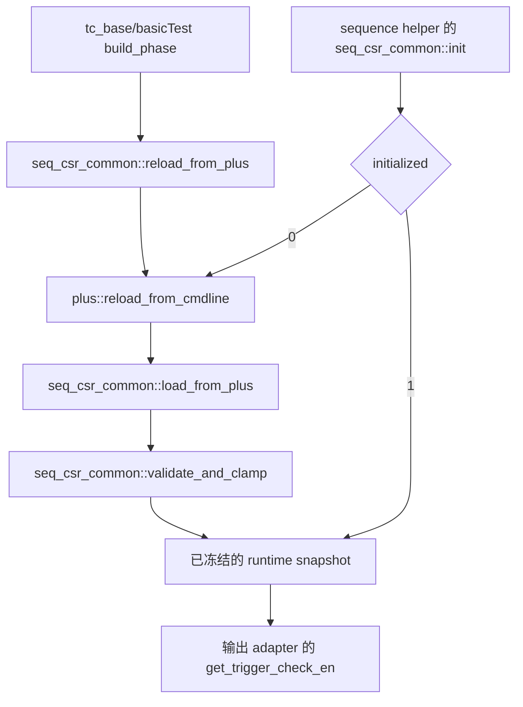
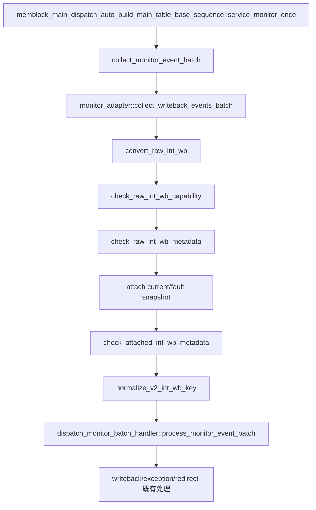

# V2 trigger 检查运行期开关正式 Coding Plan

| 项目 | 内容 |
| --- | --- |
| 状态 | 已完成 coding、当前源码独立编译、定向正反向复核和独立 coding review；可归档。 |
| 目标版本 | V2（当前分支 `codex/pbmt-rm-l2tlb-20260902`）。 |
| 目标 | 为 DUT 输出 monitor 的 scalar trigger 字段检查增加公共 plus 参数；默认保持严格检查，显式关闭时不因输出 trigger 元数据报错。 |
| 新参数 | `+MEMBLOCK_CHECK_TRIGGER_EN=<0|1>`，默认 `1`。 |
| 不在范围 | RTL/Scala、DUT 接口、trigger CSR 配置与随机激励、RM golden compare、UID/ROB/LQ/SQ 绑定、异常/redirect/replay 状态机、`flushPipe`/CBO 功能检查。 |

## 1. 专有名词与抽象功能说明

| 英文术语 | 当前文档中的中文含义 | 对应代码对象或落点 | 使用场景/示例 |
| --- | --- | --- | --- |
| trigger check | 对 DUT 输出 monitor 可见的 `trigger`/`trigger_valid` 字段及其来源一致性的诊断检查。 | `dispatch_monitor_event_adapter`。 | STA0 返回 `trigger=0`、`exceptionVec[3]=0` 时检查其是否合法。 |
| raw event | monitor 从一个有效 int writeback 端口采样的原始事件，尚未绑定 UID。 | `dispatch_raw_int_wb_t raw`。 | 采样到 STA0 的 `trigger_valid`、`trigger` 和 `exception_vec`。 |
| attached event | adapter 已利用 ROB/LQ/SQ/issue snapshot 找到 UID 的统一 writeback 事件。 | `memblock_wb_event_t wb_event`。 | STA raw event 绑定当前 issue 或 late-fault snapshot 后继续进入 writeback handler。 |
| trigger action | V2 uop 输出 writeback 的 4-bit trigger 动作编码。 | `raw.trigger`。 | `4'hf` 表示 None，`4'h0` 表示 breakpoint exception 动作或当前被诊断的异常编码。 |
| trigger validity | 当前 source/lane 是否在接口上提供有效 trigger metadata 的能力位。 | `raw.trigger_valid`。 | LDA/STA 应提供，STD 不应提供。 |
| scalar contract | 测试框架对 scalar LSQ enqueue 输入 item 的协议约束；本 plan 不改变它。 | `validate_v2_scalar_item()`。 | active scalar item 的 `uopIdx=0`、`numLsElem=1`、`lastUop=1`。 |
| runtime snapshot | testcase build 期冻结后的公共参数副本，sequence/helper 只能通过 getter 消费。 | `seq_csr_common::trigger_check_en`。 | adapter 在每个 raw event 上读取一次开关，不直接读取 `plus`。 |
| runtime mirror | 本 feature 不新增的 agent 参数镜像；LSQ 输入 driver 不消费本开关。 | 无。 | 输入 scalar contract 始终按原规则检查。 |

抽象功能描述：本 plan 只给 DUT 输出 monitor 的既有 trigger 诊断增加运行期开关。它不改变任何 DUT 输入、raw event 内容、UID 绑定、writeback 状态或 RM 结果；开关关闭后，输出路径中的非 trigger 错误以及所有输入协议错误仍必须按原路径报错。

## 2. 目标功能 Flow 总览



初始化整体文字伪代码：标准 testcase 的 build phase 先走 `tc_base::build_phase()`，它直接调用 `seq_csr_common::reload_from_plus()`；`basicTest::build_phase()` 等派生入口在调用父类后也会按既有逻辑再次 reload。同一命令行值依次经过 `plus::reload_from_cmdline()`、`load_from_plus()` 和 `validate_and_clamp()`，最后置 `initialized=1`。之后 sequence helper 调用 `seq_csr_common::init()` 时，只因已初始化而返回；只有不经过标准 testcase build 的路径才由 `init()` 作为幂等 fallback 执行同一 parse/load/validate 链。冻结的 bit 只供输出 writeback adapter 的 getter 消费；LSQ 输入 driver 不读取该参数。



writeback 整体文字伪代码：真实 dispatch service 每拍由 `service_monitor_once()` 调用 `collect_monitor_event_batch()`。adapter 从 raw int writeback FIFO 取出事件，在 `convert_raw_int_wb()` 内依次做 capability、metadata、UID snapshot attach、attached metadata 与 key normalization；成功事件才加入当前 semantic batch，随后由 batch handler 进行 redirect-first 仲裁并交给既有 writeback/recovery 流。开关只影响其中三个 check 的 trigger 条件，不改变 attach、batch、handler 或终态推进。

## 3. 参数与配置 Flow

### 3.1 参数语义和权威来源

| 项目 | 定义 |
| --- | --- |
| plus 参数 | `MEMBLOCK_CHECK_TRIGGER_EN`，类型 `bit`。 |
| 默认值 | `1'b1`，保证未传 plusarg 的已有回归行为不变。 |
| 关闭语义 | `0` 仅关闭下表列出的 trigger 字段诊断；不将异常、触发器配置或 DUT 行为视作成功。 |
| 公共读取路径 | `env/plus.sv -> seq_csr_common::trigger_check_en -> get_trigger_check_en()`，仅供输出 monitor adapter。 |
| default cfg | `seq/plus_cfg/default.cfg` 显式设置 `+MEMBLOCK_CHECK_TRIGGER_EN=1`。 |

`plus::reload_from_cmdline()` 的抽象功能描述：该函数在 testbench 初始化时把命令行或 cfg 的字符串值转换成 `plus` 类静态字段；它只解析输入，不决定任何检查策略。

文字伪代码：读取 `MEMBLOCK_CHECK_TRIGGER_EN`。没有命令行覆盖时保留 `plus.sv` 中的默认值 1；有覆盖时打印最终 bit 值，供后续 `seq_csr_common` 读取。该函数不写 sync package，也不直接被 adapter 或 agent driver 调用。

`seq_csr_common::load_from_plus()` 的抽象功能描述：该函数在 testcase build 期把已解析的公共 plus 值冻结为运行期快照，同时将需要被 agent 消费的值同步到公共 package；它不在测试过程中动态重读命令行。

文字伪代码：读取 `plus::MEMBLOCK_CHECK_TRIGGER_EN` 写入 `trigger_check_en`。其余既有参数按原顺序冻结；没有新增 queue、扫描、agent mirror 或时序等待。

`seq_csr_common::get_trigger_check_en()` 的抽象功能描述：该 getter 为 sequence/helper 提供已冻结的 trigger 检查开关；它不解析 plusarg，也不修改快照。

文字伪代码：先复用 `check_initialized()` 确认 testcase 参数快照已准备好；成功后返回 `trigger_check_en`。adapter 读取返回值决定是否执行 trigger 专属诊断；初始化前访问仍按现有公共参数规则 fail-fast。

## 4. trigger 检查门控范围

### 4.1 `check_raw_int_wb_capability()`

抽象功能描述：该函数在 raw event 进入 UID 绑定前检查 V2 source/lane 能力和 exception 位图。它继续拒绝错误 source、lane、ROB/SQ/LQ capability、replay/flush capability 与不支持的 exception 位；只让 trigger capability 的检查可关闭。

| source/lane | 仅在开关为 1 时检查的条件 | 始终检查的代表条件 |
| --- | --- | --- |
| SCALAR_LDA | `raw.trigger_valid` 必须为 1。 | lane 范围、ROB、LQ/SQ、state lookup、replay/flush capability、exception mask。 |
| STA | `raw.trigger_valid` 必须为 1。 | lane 范围、ROB、LQ/SQ、state lookup、replay/flush capability、exception mask。 |
| STD | `raw.trigger_valid` 必须为 0，且 `raw.trigger==4'hf`。 | lane 范围、value-only ROB、LQ/SQ、state lookup、replay/flush、exceptionVec 为零。 |

文字伪代码：先保留当前 source/lane 分支与 `allowed_exception_mask` 选择。各分支构造原有非 trigger 条件；只有在 `seq_csr_common::get_trigger_check_en()` 返回 1 时，才把该 source 的 `trigger_valid` 或 `trigger` 条件加入 fatal 判定。分支结束后无条件检查 exception 位图，因此关闭开关不能掩盖非 trigger exception capability 错误。

### 4.2 `check_raw_int_wb_metadata()`

抽象功能描述：该函数检查 raw writeback 的 metadata 值编码。SCALAR_LDA 的 replay/flush 不变量不属于 trigger 语义，必须一直检查；trigger 开关仅控制后半段 trigger presence、动作编码与 breakpoint 对应关系。

文字伪代码：先按原逻辑检查 SCALAR_LDA 的 `replay_inst` 与 `flush_pipe`。接着读取 `get_trigger_check_en()`；为 0 时立即返回，不再因 `trigger_valid`、`trigger` 编码、`exceptionVec[3]` 或当前 unsupported action 报错。为 1 时继续原有流程：absent metadata 必须为 None，`trigger=0` 必须满足 breakpoint 规则或已有 STA0 特例，已知但当前未支持的 action 与未知 action 仍 fatal。

### 4.3 `check_attached_int_wb_metadata()`

抽象功能描述：该函数在 UID 已绑定后处理需要 main transaction 的 STA0 metadata 检查。`flushPipe` 与 CBO consumer 的功能限制保持无条件；只有 `INT_WB_STA0_TRIGGER_PROVENANCE` 受参数控制。

文字伪代码：raw event 不是 STA0 时立即返回。STA0 按现有时机读取 `main_tr`，不因本参数改变 transaction 查找时序。若 `flush_pipe=1`，仍保留“仅 CBO”与“当前无 CBO consumer”的 fatal。之后仅在 `get_trigger_check_en()` 为 1，且当前条件满足 `trigger=0 && !exceptionVec[3]` 时，执行原有 CBO/MMIO/NCIO provenance 判断；为 0 时跳过这一个 fatal，不跳过 `flushPipe` 检查。

## 5. 不受开关影响的行为边界

下列项目必须保持常开，不能被 `MEMBLOCK_CHECK_TRIGGER_EN=0` 绕过：

1. raw event 的 source/lane 类型、ROB/LQ/SQ key 能力、snapshot attach、UID 唯一解析、epoch/replay/redirect 过滤和 key normalization。
2. raw event 的 exceptionVec 位图能力、SCALAR_LDA 的 replay/flush 不变量，以及 STA0 `flushPipe` 仅 CBO 和 CBO consumer 未实现检查。
3. LSQ enqueue 输入的 resource 上限、active/inactive payload、`uopIdx`、`numLsElem`、`lastUop`、exceptionVec、`trigger` 和 `flushPipe` 合同；输入 driver 不读取本开关。
4. writeback/RM 的数据、异常和状态处理，以及 terminal retire/commit/deq 逻辑。
5. trigger CSR/Debug 配置和 DUT 本身产生的输出。该参数是测试框架诊断开关，不驱动 DUT 关闭 trigger 功能。
6. `lsqenq_agent_agent_xaction.sv` 中将本框架激励的 trigger 约束为零的 random constraint。它属于 stimulus 生成规则而非 runtime error check，本 plan 不改变它。

## 6. 修改文件与实现顺序

1. `mem_ut/ver/ut/memblock/env/plus.sv`：增加默认值为 1 的定义和 `reload_from_cmdline()` 解析。
2. `mem_ut/ver/ut/memblock/seq/base_seq_help/seq_csr_common.sv`：增加静态快照、load/sync 和 getter。
3. `mem_ut/ver/ut/memblock/seq/base_seq_help/dispatch_monitor_event_adapter.sv`：按第 4 节精确门控输出 monitor 的 trigger-only 条件。
4. `mem_ut/ver/ut/memblock/seq/plus_cfg/default.cfg`：显式写入默认值 1。
5. `AI_DOC/project_management/mem_ut_parameter_management.md` 与 `mem_ut/ver/ut/memblock/rule/memblock_parameter_management_rule.md`：最小增加参数路径、默认值和输出 monitor 使用边界；不修改既有 RTL 缺陷分析。

所有新增参数/字段/函数注释使用中文，且复用现有公共参数 snapshot 结构；不新增 agent mirror、每 transaction 扫描、队列或状态表。

## 7. 验证与验收

### 7.1 静态验收

```text
git diff --check 仅覆盖本 plan 的源码和文档。
rg 确认 MEMBLOCK_CHECK_TRIGGER_EN 在 plus、snapshot、getter、default cfg 和输出 adapter consumer 都存在。
rg 复查所有 INT_WB_TRIGGER、INT_WB_METADATA、INT_WB_STA0_TRIGGER_PROVENANCE 触发点均被正确门控。
rg 复查 check_raw_int_wb_capability 的 exception/source/key 条件与 check_attached 的 flushPipe 条件未被开关包住。
```

### 7.2 编译与基础仿真

```text
cd mem_ut/ver/ut/memblock/sim
make eda_compile tc=tc_sanity mode=base_fun
make eda_run tc=tc_sanity mode=base_fun
make eda_compile tc=tc_dispatch_smoke mode=trigger_gate_smoke
make eda_run tc=tc_dispatch_smoke mode=trigger_gate_smoke
make eda_run tc=tc_dispatch_smoke mode=trigger_gate_smoke plus_arg='+MEMBLOCK_CHECK_TRIGGER_EN=0'
```

验收标准：`tc_sanity` 保持已有基础环境通过；`tc_dispatch_smoke` 会实际执行 `seq_csr_common::init()`，因此默认和关闭 run 都必须通过，证明 plus 值已被解析、冻结并不会破坏非 trigger dispatch flow。该 smoke 不构造输出 trigger 违规事件，不能单独作为门控语义证明。

### 7.3 已知真实 STA0 provenance 场景的定向验收

使用既有严格 PBMT=00/non-NC 的真实 DUT 场景，不新建刺激或篡改 raw event。该 cfg 固定 scalar load/store，`MEMBLOCK_BOUNDARY_CROSS_16B_SAME_LINE_WT=25`，且 PBMT S1/S2 均为 `00`；已知 `seed=666666`、将主表临时缩小到 1000 笔时会在约 `727.8ns` 触发 V2 MAB 的 `INT_WB_STA0_TRIGGER_PROVENANCE`。

```text
cd mem_ut/ver/ut/memblock/sim
make eda_compile tc=basicTest \
  ts=memblock_dispatch_real_mmu_sv39_pbmt0_non_nc_vseq \
  mode=trigger_gate_provenance \
  cfg=tc_dispatch_real_mmu_sv39_pbmt0_non_nc_100k

make eda_run tc=basicTest \
  ts=memblock_dispatch_real_mmu_sv39_pbmt0_non_nc_vseq \
  mode=trigger_gate_provenance \
  cfg=tc_dispatch_real_mmu_sv39_pbmt0_non_nc_100k seed=666666 \
  plus_arg='+MEMBLOCK_MAIN_TRANS_NUM=1000 +MEMBLOCK_CHECK_TRIGGER_EN=1'

make eda_run tc=basicTest \
  ts=memblock_dispatch_real_mmu_sv39_pbmt0_non_nc_vseq \
  mode=trigger_gate_provenance \
  cfg=tc_dispatch_real_mmu_sv39_pbmt0_non_nc_100k seed=666666 \
  plus_arg='+MEMBLOCK_MAIN_TRANS_NUM=1000 +MEMBLOCK_CHECK_TRIGGER_EN=0'
```

验收标准：第一条 run 是预期失败的正向检查，日志必须保留 `UVM_FATAL [INT_WB_STA0_TRIGGER_PROVENANCE]`；它证明默认值没有删除已确认的 RTL metadata 缺陷检出。第二条 run 的日志中不得出现该 ID；若之后暴露其它独立 RTL/环境错误或 timeout，必须单独记录其 ID、时间和归属，不能把它当作 trigger gate 成功或失败。静态 gate 审查同时覆盖输出 capability、metadata 和 provenance 的全部 trigger-only 条件，输入 LSQ contract 不在本参数范围内。

### 7.4 审查与归档

1. 独立 subagent 先 review 正式 plan；有必须修改项则更新 plan 并重复 review。
2. 实现完成后由独立 subagent review 实际 diff，重点确认关闭时不再从 trigger 专属条件报错、默认值仍严格、常开检查没有被误门控。
3. 创建 implementation review 到 `AI_DOC/plan/test_framework/review_doc/undo/`，逐项对照本 plan。
4. 完成静态和基础验证后，将本 plan 移到 `AI_DOC/plan/test_framework/plan/do/`，仅提交本 plan 关联文件。

### 7.5 实施结果

本 plan 的最终 output-only 版本使用两个独立 VCS mode 编译，均完成编译、elaboration、链接和
Verdi KDB 生成。KDB 生成结果为 `0 error(s), 0 warning(s)`；VCS 的既有 warning 不作为本 feature
新增错误：

1. `trigger_gate_output_only_20260905`：`+MEMBLOCK_CHECK_TRIGGER_EN=1`，
   `seed=666666`、`MEMBLOCK_MAIN_TRANS_NUM=1000`。在 `727.8ns` 仍按预期报告
   `UVM_FATAL [INT_WB_STA0_TRIGGER_PROVENANCE]`，证明默认严格检查未被删除。
2. `trigger_gate_output_off_20260905`：同一场景仅改为
   `+MEMBLOCK_CHECK_TRIGGER_EN=0`。日志未出现 `INT_WB_STA0_TRIGGER_PROVENANCE`、
   `INT_WB_TRIGGER`、`INT_WB_METADATA` 或 trigger 专属的 `INT_WB_CAP`；该 STA0 event
   继续进入既有 writeback/commit 生命周期。

关闭态继续运行至 `2606.3ns`，随后因既有 `RM_LS_COMPARE` 累积到 UVM quit count 而结束。
该组错误是 PMA/PMP 期望异常与 DUT 实际异常不一致，不是 trigger gate 的 report 或行为；本 plan
不修改 RM，因此不将其作为本 feature 的通过结果。两组定向日志分别位于：

```text
mem_ut/ver/ut/memblock/sim/trigger_gate_output_only_20260905/log/
mem_ut/ver/ut/memblock/sim/trigger_gate_output_off_20260905/log/
```

## 8. 与初步 plan 差异说明

修改目的：保留 `INT_WB_STA0_TRIGGER_PROVENANCE` 对 V2 StoreMisalignBuffer metadata 缺陷的默认检出能力，同时给调试、问题隔离和非 trigger 专项测试提供一个显式的临时诊断关闭入口。

此前废止的 `mem_ut_v2_sta0_split_store_trigger_provenance_fix_plan_20260904.md` 曾建议删除 provenance 检查，但该方案已被独立 RTL review 否定，禁止执行。本 plan 不删除该检查，只增加运行期开关。

### 8.1 `plus::reload_from_cmdline()`

抽象功能描述：该函数是命令行/CFG 到 `plus` 静态字段的唯一解析入口；新增字段只在此处进入运行期配置，不直接影响 DUT 输入或输出 adapter 之外的 agent。

修改前文字伪代码：依次读取既有 `MEMBLOCK_*` 参数；没有 `MEMBLOCK_CHECK_TRIGGER_EN` 字段，因此后续框架没有该诊断策略输入。

修改后文字伪代码：保留既有读取顺序，在 hard-X/Z 诊断参数附近调用 `load_bit()` 读取 `MEMBLOCK_CHECK_TRIGGER_EN`。未提供值时保留定义处的默认 1；提供值时写入 `plus::MEMBLOCK_CHECK_TRIGGER_EN` 并打印最终值。该函数不写 sync package。

差异影响：新增一个公共测试框架参数的输入来源，不改变 xaction、raw event 或 DUT wire。

### 8.2 `seq_csr_common::reload_from_plus()`、`load_from_plus()` 与 `get_trigger_check_en()`

抽象功能描述：`reload_from_plus()` 是标准 testcase build phase 的参数刷新入口，依次调用 plus 解析、`load_from_plus()` 和校验；`load_from_plus()` 把解析值冻结成 sequence/helper 的权威 snapshot；新 getter 只读该 snapshot，保证 adapter 不在高频路径重复解析命令行。

修改前文字伪代码：`reload_from_plus()` 已依次调用 plus 解析、`load_from_plus()` 和 `validate_and_clamp()`；`load_from_plus()` 冻结既有公共参数并同步 hard-X/Z mirror，但没有 trigger check snapshot。adapter 的 check 函数无条件执行 trigger 条件。

修改后文字伪代码：`reload_from_plus()` 的调用顺序不变，但经由更新后的 `load_from_plus()` 传播新增字段。新增 `trigger_check_en` 静态字段，默认值为 1。`load_from_plus()` 读取 `plus::MEMBLOCK_CHECK_TRIGGER_EN` 后写入该字段。`get_trigger_check_en()` 先调用 `check_initialized()` 验证 snapshot 已冻结，再返回该字段；输出 adapter 以该返回值决定是否加入 trigger 专属 fatal 条件。

差异影响：snapshot 只在初始化期写一次，getter 无状态、无队列、无扫描；默认路径的检查语义不变。

### 8.3 `check_raw_int_wb_capability()`

抽象功能描述：该函数仍在 UID attach 前检查 raw source/lane 和 exception capability；改动只从复合 fatal 条件中分离 trigger capability 子条件。

修改前文字伪代码：按 LDA、STA、STD 分支检查全部能力。LDA/STA 的 `!raw.trigger_valid`、STD 的 `raw.trigger_valid || raw.trigger != 4'hf` 与 key、lane、replay、flush 等条件一起无条件触发 `INT_WB_CAP`。

修改后文字伪代码：保留原分支、lane/key/replay/flush 和 exception mask 条件。仅在 `get_trigger_check_en()` 为 1 时，把对应 `trigger_valid` 或 STD trigger 值条件加入该分支的 fatal 条件；随后仍无条件检查 exception mask。

差异影响：关闭时仅不报 trigger capability 错误，非 trigger `INT_WB_CAP` 仍可报出。

### 8.4 `check_raw_int_wb_metadata()`

抽象功能描述：该函数仍处理 LDA 的非 trigger metadata 不变量和 trigger action 编码；改动在非 trigger 检查之后增加早退。

修改前文字伪代码：先检查 LDA `replay_inst`/`flush_pipe`，随后无条件检查 absent trigger 的 None 编码、breakpoint 对应关系、unsupported action 和未知 action。

修改后文字伪代码：先原样执行 LDA `replay_inst`/`flush_pipe` 检查。若 `get_trigger_check_en()` 为 0 则返回；为 1 才继续原有 absent/action/breakpoint 分支，因此 `INT_WB_METADATA`、`INT_WB_TRIGGER` 和 `INT_WB_TRIGGER_UNSUPPORTED` 只在开关开启时出现。

差异影响：关闭不会抑制 LDA replay/flush 不变量。

### 8.5 `check_attached_int_wb_metadata()`

抽象功能描述：该函数仍在 UID 已绑定后检查 STA0 与 main transaction 关联的 metadata；只给 provenance fatal 增加 guard。

修改前文字伪代码：STA0 按现有时机读取 `main_tr`；`flushPipe` 分支无条件检查 CBO/consumer；`trigger=0 && !exceptionVec[3]` 时无条件执行 CBO/MMIO/NCIO provenance 判定并可能报 `INT_WB_STA0_TRIGGER_PROVENANCE`。

修改后文字伪代码：保留 STA0 识别、`main_tr` 读取和所有 `flushPipe` 分支。只有 `get_trigger_check_en()` 为 1 时才执行 provenance 条件；为 0 时事件继续走 key normalization 和 batch handler。

差异影响：已知 MAB metadata 违规在默认值下仍 fail-fast，关闭时只是允许该 event 继续进入既有生命周期。

总体差异影响：本 plan 新增的是仅针对 DUT 输出 monitor 的测试框架诊断控制，不删除旧 checker、不将已确认的 RTL metadata 问题定性为合法，也不改写 DUT、RM 或 LSQ 输入合同。运行期开销只有现有高频输出检查中的 bit getter，无集合扫描、agent mirror 或额外生命周期状态。

## 执行中补充/修正（IMPLEMENTATION_DELTA）

### [IMPLEMENTATION_DELTA] 参数索引同步

- 来源：`memblock_parameter_management_rule.md` 要求新增公共 plus 参数同步检查
  `mem_ut/ver/ut/memblock/rule/plus_demo_migration_plan.md`。
- 原 plan：第 6 节只列出 `mem_ut_parameter_management.md` 和
  `memblock_parameter_management_rule.md` 两个参数说明文档。
- 实现调整：在 `plus_demo_migration_plan.md` 的 Dispatch framework 参数表新增
  `MEMBLOCK_CHECK_TRIGGER_EN` 的 scalar trigger metadata 诊断分类。
- 原因：该参数表是现有 plus 参数索引，漏列会使后续 testcase/cfg 使用者无法从分类表反查该开关。
- 影响范围：仅文档索引，不改变任何 UVM、DUT 或仿真语义。

### [IMPLEMENTATION_DELTA] 远端验证执行方式

- 来源：同一 mode 连续使用 `make eda_run` 时，远端 VCS work directory 的 `tdc.sdb`
  出现损坏，后续 run 不再是可归因的功能验证。
- 原 plan：第 7.2 与 7.3 节使用一次编译后连续 `make eda_run` 覆盖不同 plusarg。
- 实现调整：每个验证 mode 只执行一次 `make eda_compile`，随后使用该 mode 的
  `make eda_batch_run` 启动单次 run；default/关闭开关分别使用独立 mode。
- 原因：保持编译产物和单次运行日志一一对应，避免 VCS work directory 损坏掩盖实际 checker 行为。
- 影响范围：只改变验证命令组织方式；验收条件、配置、DUT 和源码逻辑均不变。`tc_sanity`
  run 因同一远端基础设施问题未作为有效通过证据，专项编译和定向正反向日志仍保留。

### [IMPLEMENTATION_DELTA] 最终 scope 收敛为输出 monitor

- 来源：用户最终明确要求 `plus_check_trigge_en` 只控制输出 monitor 的 trigger 检查。
- 原 plan：初版将同一个开关同时用于输出 writeback adapter 与 LSQ enqueue 输入 driver。
- 实现调整：删除 `memblock_sync_pkg` 的 trigger mirror 及 LSQ driver 的两个 `trigger != 0`
  gate；`MEMBLOCK_CHECK_TRIGGER_EN` 只经 `plus.sv -> seq_csr_common ->
  dispatch_monitor_event_adapter` 消费。
- 原因：输入 item 合同属于 testbench 到 DUT 的 stimulus 侧合法性检查，不是 DUT 输出
  monitor 的语义 checker；关闭输出检查不能使非法输入通过。
- 影响范围：默认值和输出 adapter 的 `INT_WB_CAP`、`INT_WB_METADATA`、
  `INT_WB_TRIGGER`、`INT_WB_TRIGGER_UNSUPPORTED`、
  `INT_WB_STA0_TRIGGER_PROVENANCE` 行为不变；输入 LSQ contract 恢复且保持无条件严格。
