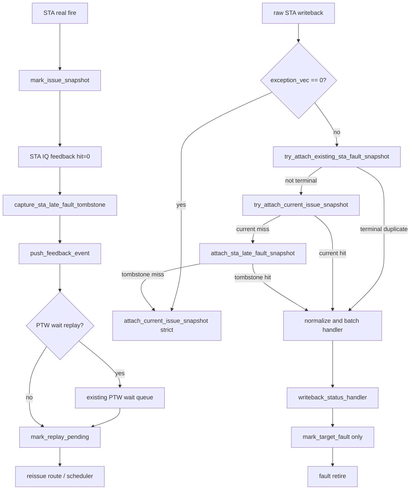

# MemBlock STA replay late-fault tombstone 修复正式执行计划（2026-08-28）

| 项目 | 内容 |
| --- | --- |
| 状态 | 代码已完成、独立复审与远端编译通过；10000 笔回归待启动 |
| 版本 | V2，`mem_ut_uvm_v2` |
| 问题分析 | `AI_DOC/analysis/framework_design/memblock_sta_replay_late_fault_tombstone_rm_issue_analysis_20260828.md` |
| 被替代 plan | `AI_DOC/plan/test_framework/plan/undo/memblock_sta_replay_drain_writeback_plan_20260828.md` |
| 源码范围 | `status_transaction.sv`、`common_data_transaction.sv`、`writeback_status_handler.sv`、`dispatch_monitor_event_adapter.sv` |
| 非目标 | 不修改 RTL、Scala、DUT interface、PMA/PMP 表模型、DCache denied/corrupt ledger、cfg 或测试激励权重 |
| 验证入口 | `sim/Makefile` 的远端 `eda_compile`、`eda_run_bg`，使用 `basicTest`、`memblock_dispatch_real_smoke_vseq`、`tc_dispatch_real_mmu_sv39_smoke` |

## 1. 专有名词与抽象功能说明

| 术语 | 中文含义 | 代码落点 | 例子 |
| --- | --- | --- | --- |
| `STA` | Store Address 子操作，负责 store 的地址和异常侧。 | `MEMBLOCK_ISSUE_TARGET_STA` | UID25 的 `writebackSta_0` fault。 |
| `current snapshot` | 当前真实 STA fire 的 software identity。 | `sta_issue_epoch`、`replay_seq`、`sta_instance_flush_epoch` | 正常 raw STA 的唯一严格归属。 |
| `raw visible tuple` | V2 raw STA 实际可见的身份，只有 ROB、exception 和 sample flush epoch。 | `dispatch_raw_int_wb_t` | raw 不带 UID、SQ、issue epoch、replay sequence 或 dynamic epoch。 |
| `tombstone` | IQ `hit=0` 已交给 replay 后保存的旧 STA identity，仅供迟到 fault 还原身份。 | `sta_late_fault_tombstone_q` | UID25 的旧 `0x8080` fault。 |
| `dynamic epoch` | redirect 后重建同一 UID 的动态实例版本。 | `status.dynamic_epoch` | 旧 tombstone 不得穿越 redirect 附着到新实例。 |
| target flush epoch | 保存 STA fire 时的 flush epoch；raw sample 只能不早于它。 | tombstone 的 `target_flush_epoch` | 老指令可以在年轻 redirect 后输出，因此不是全局 epoch 的等号比较。 |
| `current probe` | 不触发 fatal 的 current snapshot 试探；仅报告“当前身份能否成立”。 | 新增 `try_attach_current_issue_snapshot()` | fault raw 先避免误把新实例绑定为旧实例。 |
| terminal fault | 已终止该 UID 的异常状态，后续 issue/replay 不能再改变结果。 | `fault`、`exception_pending`、`sta_fault` | late fault 后进入既有 fault-retire。 |
| fault replay guard | `mark_replay_pending()` 对已 fault/exception UID 的早返回保护。 | `common_data_transaction::mark_replay_pending()` | 留在 feedback queue 中的旧 replay 不会重新入队。 |
| terminal duplicate | 同一 active UID 已经进入 terminal fault 后再次到达的 STA fault raw。 | `try_attach_existing_sta_fault_snapshot()` | 只补齐 event 后由 fault owner 记录并丢弃，不重写 exception。 |
| PTW wait replay | 已有的显式 PTW/L2TLB 等待 replay 分支，不是等待 raw STA。 | `event_should_wait_ptw()` | `ptw_back_replay=1` 时保持原等待策略。 |
| active map | ROB/SQ 到当前 active UID 的关联数组。 | `uid_by_active_rob`、`uid_by_sq` | adapter 先用 ROB O(1) 定位 UID。 |

抽象功能描述：`capture_sta_late_fault_tombstone()` 在 STA IQ `hit=0` 时冻结旧 snapshot，
随后把原 feedback 交给已有 recovery 流程；它不等待 raw，也不直接设置 fault。

抽象功能描述：`try_attach_current_issue_snapshot()` 是 strict attach 的无 fatal 探测版本。
它只在 current target 未 dispatched、epoch 已被 replay 改变等可预期状态返回未命中；坏 key、
map 不一致和未来 sample 仍保持 fatal。

抽象功能描述：`read_sta_late_fault_tombstone()` 在 adapter 已经从 raw ROB 定位 active UID 后，
只读该 UID 的 history，按动态实例、SQ owner 和 sample flush 边界选择最早兼容记录；它不消费
记录，返回值只表示是否可用于 late-fault fallback。

抽象功能描述：`attach_sta_late_fault_snapshot()` 只在 raw STA fault 没有 current snapshot
时，从同 UID 的 tombstone history 还原旧 issue identity；normal raw 不调用它。

抽象功能描述：`try_attach_existing_sta_fault_snapshot()` 只处理已经 fault 的 active UID 的重复
STA fault raw；它不查询 tombstone，也不把重复事件重新解释成 current 或 late fault。

抽象功能描述：`mark_target_fault()` 是 fault 状态的唯一外部入口。内部
`mark_sta_late_fault_from_tombstone()` 只是它的 STA 子分支，不能被 handler 或 adapter 直接调用。

## 2. 目标调用 Flow 与整体文字伪代码

整体文字伪代码：

1. 每次 STA real fire 仍由 `mark_issue_snapshot()` 建立 current identity，不改变发射和 raw
   monitor 的原有时序。
2. STA IQ `hit=0` 到达时先复制 current identity 到 tombstone，再把 feedback 放入原有
   `exception_event_q`。后续 recovery 仍按 `event_should_wait_ptw()` 决定是否先进入 PTW wait；
   “立即 replay”只表示绝不等待 raw STA，PTW/L2TLB 的已有显式等待语义保持不变。
3. 如果不需要 PTW wait，或 PTW wait 已满足，`mark_replay_pending()` 立即清旧
   `sta_dispatched`、递增 `replay_seq` 并开放 reissue；它必须保留 tombstone。
4. raw STA normal writeback 只走 current strict attach。若没有 current snapshot，继续报原有
   framework fatal，不能使用 history。
5. raw STA fault 先检查 active UID 是否已经处于 fault/exception pending；是时只补齐
   terminal duplicate event，后续 fault owner 幂等 drop，不改写 exception vector。不是重复 fault
   才执行 current probe；probe 成功时按 current identity 处理。probe 因当前 `sta_dispatched` 已被
   replay 清除而未命中时，才以 raw visible tuple 查询 tombstone；仍未命中则调用原 strict attach
   产生可诊断 fatal。
6. batch normalization 在 adapter 身份还原之后、`writeback_status_handler` 之前运行；因此
   normalized event 一定已经携带 UID、ROB、SQ、issue epoch 和 replay sequence，不改变
   batch 的 redirect-first 仲裁顺序。
7. handler 唯一调用 `mark_target_fault()`。该入口先尝试其内部 tombstone 子分支，命中时
   终止 UID 并取消 reissue；不命中时保留既有 current conditional fault 写入。

## 3. 状态、匹配与容量 Flow

### 3.1 tombstone 结构和唯一来源

新增 package-level `memblock_sta_late_fault_tombstone_t`。它定义在
`status_transaction.sv` 的 `class status_transaction` 之前；`seq_pkg.sv` 已在该文件之前 include
`memblock_dispatch_types.sv`，因此 type 可使用现有 ROB/SQ key，且同一 package 内的
`common_data_transaction` 和 adapter 都可引用。不得修改当前用户脏改的
`memblock_dispatch_types.sv`。每个 `status_transaction` 只保存该 type 的 queue：

| 字段 | 设置者 | 读取者 | 作用 |
| --- | --- | --- | --- |
| `rob_key` | capture helper | adapter、fault 子分支 | 与 raw 可见 ROB 建立第一层绑定。 |
| `sq_key` | capture helper | adapter、fault 子分支 | raw 不含 SQ 时，用 active status SQ 反证 owner 未变化。 |
| `issue_epoch` / `replay_seq` | capture helper | fault 子分支 | 仅由 history 还原给 normalized event；raw 本身没有这两个字段。 |
| `dynamic_epoch` | capture helper | adapter、fault 子分支 | 拒绝 redirect 前的旧动态实例。 |
| `target_flush_epoch` | capture helper | adapter | 要求 `raw.sample_flush_epoch >= target_flush_epoch`。 |
| `create_cycle` | capture helper | log / oldest selection | 多个候选时按最早创建记录选择。 |

raw STA 不能逐字段证明 issue epoch/replay sequence，因此 tombstone 匹配规则是：

1. `uid_by_active_rob[raw.rob_key]` 必须命中 active UID；否则 history 不可使用。
2. active status 的 ROB 必须等于 raw ROB，且 status 仍有 active SQ map。
3. tombstone 的 ROB、SQ、dynamic epoch 必须分别等于 active status 的 ROB、SQ、dynamic epoch。
4. `raw.sample_flush_epoch` 必须不小于 tombstone 的 target flush epoch，且不得大于当前全局
   dispatch flush epoch。它允许年轻 redirect 后仍活跃的老指令写回。
5. 多条记录满足时选 `create_cycle` 最早者；raw 缺 generation，不能把较新的 current fault
   冒充旧 fault，因此 current probe 总是优先于 tombstone fallback。

### 3.2 有界 history 和溢出策略

每 UID 使用 `sta_late_fault_tombstone_q[$]`。容量常量定义为
`MEMBLOCK_STA_LATE_FAULT_TOMBSTONE_MAX = MEMBLOCK_DUT_SQ_SIZE`，只使用已有 compile-time
V2 物理容量宏，不新增 runtime plus 参数。这个值是保守的框架 history guard，不声称等同于
StoreUnit late-pipeline 深度。

每个不同 `(dynamic_epoch, issue_epoch, replay_seq)` 只允许入队一次；重复 IQ feedback 只返回
已存在记录。history 不做 timeout 淘汰，也不覆盖最老记录，避免迟到 fault 被静默丢弃。若
纯 replay 连续积累到上界，直接 `uvm_fatal` 并打印 UID、dynamic epoch、queue size、最早和最新
记录；这是“raw 无 generation 时 history 观察窗口不足”的 RM/framework 问题，不是可安全降级的
正常随机路径。后续按本任务的分析-plan-修复循环处理，不能以删除旧记录继续测试。

### 3.3 创建、保留和清理

`capture_sta_late_fault_tombstone()` 的详细文字伪代码：

1. 读取 UID status，确认 active、非 fault、非 redirect，STA 已 dispatched，输入 epoch/replay
   与 current snapshot 相等。
2. 读取 current ROB、active SQ、dynamic epoch 和 STA target flush epoch；map 或字段不一致是
   当前状态表损坏，保留 fatal；已失效的 feedback 返回未命中。
3. 扫描仅该 UID 的 bounded queue，重复记录成功返回；否则检查容量、写入全字段和 cycle。
4. 不改变 `sta_dispatched`、`replay_pending` 或 issue queue，确保 feedback 仍能走已有 replay。

`clear_sta_late_fault_tombstones()` 的详细文字伪代码：

1. 删除当前 UID 的全部 history。
2. 在 `status.reset()`、`clear_uid_dispatch_result()`、`retire_active_uid()`、current STA fault
   和 tombstone STA fault 成功后调用。
3. `mark_replay_pending()` 绝不调用它；PTW wait 期间也保留 history。

`read_sta_late_fault_tombstone()` 的抽象功能描述：本 helper 在 adapter 的 fault-only fallback
阶段执行，输入已由 raw ROB 找到的 UID、raw ROB key 与 raw sample flush epoch，输出一份复制的
tombstone 和命中标志；它不写 status、queue、PMA/PMP context 或 DCache ledger。

`read_sta_late_fault_tombstone()` 的详细文字伪代码：

1. 先把 output 清零，读取 UID status；status 必须 active、非 fault/redirect/terminal，且带 active
   SQ map。raw ROB 必须仍等于 status ROB；不满足返回未命中。
2. 检查 raw sample flush epoch 不大于当前 global flush epoch；违反时保留 `INT_WB_ATTACH` fatal。
3. 从 queue 头到尾遍历。每条记录必须 valid；dynamic epoch、ROB、SQ 必须分别与当前 status
   相同，`raw.sample_flush_epoch` 必须不小于记录 target flush epoch。
4. 多条兼容记录时比较 `create_cycle`，选择最早的一条；queue 插入顺序只是优化，`create_cycle`
   才是权威 oldest 规则。
5. 找到后复制完整 record 到 output 并返回 1；找不到返回 0，不删除或修改任何 history。

## 4. 源码修改 Flow

### 4.1 删除 replay-drain 阻塞路径

删除 `sta_replay_drain_pending`、`sta_replay_drain_issue_epoch`、
`sta_replay_drain_replay_seq`，删除 `mark_sta_replay_drain_pending()` 和
`consume_sta_replay_drain_on_raw()`，同时删除 `writeback_status_handler` 中“raw 到达才应用
replay”的分支。`rg` 必须确认上述符号只保留在历史文档中，不残留在 `.sv`/`.svh`。

### 4.2 IQ feedback 与 PTW wait

抽象功能描述：`handle_issue_feedback_event()` 是 tombstone 的唯一 producer；它复用既有
feedback recovery，而不是新增另一条 replay owner。

详细文字伪代码：

1. STA `iq_feedback_failed` 时调用 capture helper；stale 输入只记录并返回。
2. capture 成功后无条件调用已有 `push_feedback_event()`；不设置 drain flag，不等待 raw。
3. `exception_redirect_replay_handler::handle_replay_event()` 保持现有 PTW wait 分支：
   `ptw_back_replay=1` 时暂存等待项，条件满足或原 timeout policy 释放时才调用
   `mark_replay_pending()`；`ptw_back_replay=0` 时该调用在当前 recovery tick 完成。
4. `mark_replay_pending()` 只清当前 STA 发射字段并开放 route，不能清 tombstone；它新增
   `fault || exception_pending || terminal_done` 早返回。late fault 已经消费后同 UID 的 queued
   feedback 即使在同一 batch 后到，也只被该 guard 丢弃，不能再次发起 replay。
5. `push_ptw_wait_replay()` 在入队前复用同一组 O(1) current identity 校验：UID 必须 active、未被
   kill/fault/exception/terminal/redirect/flush，target 仍 dispatched，且 issue epoch/replay
   sequence 与当前 status 一致。校验失败直接丢弃 stale wait，不允许 fault 后同 batch 的旧 replay
   重新插入 `ptw_wait_replay_q`；因此 `release_ptw_wait_replay(uid)` 清理后不会被后续 batch 事件
   反向污染，`runtime_drain_complete()` 的队列终态保持闭环。

### 4.3 Adapter 身份还原顺序

抽象功能描述：`convert_raw_int_wb()` 在 batch normalize 前完成 identity 选择，确保下游 handler
只看到完整 event；它不改变 raw monitor 的收集顺序。

详细文字伪代码：

1. normal raw STA 直接调用既有 `attach_current_issue_snapshot()`。
2. fault raw STA 依次调用 `try_attach_existing_sta_fault_snapshot()`、
   `try_attach_current_issue_snapshot()`、`attach_sta_late_fault_snapshot()`。第一个 helper 只在
   active UID 已有 fault/exception pending 时补齐 duplicate event；第二个成功则输出 current event；
   第三个只在前两者未命中时执行。
3. `try_attach_current_issue_snapshot(ref wb_event, sample_flush_epoch_valid,
   sample_flush_epoch)` 复用 `fill_current_issue_snapshot(..., strict_candidate=0)`：target 未
   dispatched、replay sequence 已变化、inactive/redirect 状态返回 0；raw ROB 缺失、map owner
   不一致、canonical key 不一致、SQ/LQ owner 损坏和 future sample 仍 `uvm_fatal`。
4. `try_attach_existing_sta_fault_snapshot(ref wb_event, sample_flush_epoch)` 仅对 fault raw 查
   active ROB UID；若 status 已 `fault || exception_pending`，用 current ROB/SQ、最后 STA issue
   epoch/replay sequence 和 target flush epoch 填 event，并返回 1。它不消费 history；后续 owner
   只记录 duplicate 并返回 0。
5. current 未命中时 `attach_sta_late_fault_snapshot()` 以 raw ROB 查 active UID，调用
   read helper 选择 oldest compatible tombstone，并用 tombstone 回填 UID、ROB、SQ、issue epoch
   与 replay sequence。
6. 三者都未命中时重新调用既有 strict `attach_current_issue_snapshot()`，保留原始 fatal 文本和
   当前不变量；不得静默 drop，也不得把 normal raw 转入 history。
7. 身份完成后才调用现有 `normalize_v2_int_wb_key()` 和 batch handler，保持 redirect-first
   event 处理顺序。

### 4.4 唯一 fault 写者和终止收敛

抽象功能描述：外部只有 `mark_target_fault()` 写入 fault。它内部调用
`mark_sta_late_fault_from_tombstone()`，后者返回“是否消费 history”，但没有独立调用点。

`mark_sta_late_fault_from_tombstone()` 的详细文字伪代码：

1. 仅在 target 为 STA、UID active、没有 fault/redirect/terminal 时，以 event 已还原的
   issue epoch/replay sequence 查找同 dynamic epoch 的 history。
2. 命中后删除该 UID 的 load/STA/STD issue queue，清 `queued_*`、`replay_pending` 和三个
   replay target mask，清 `sta_dispatched` 与 STA IQ success。此路径不设置 `issue_killed`，因为
   该字段还用于已有“fault 后已经物理 accepted 的 frozen candidate”记账；重新入队由新增的
   fault replay guard 阻止。
3. 在清 issue queue 后调用既有 `release_ptw_wait_replay(uid)`，再清 status replay mask；这样
   PTW wait queue 不能在本 fault 后由 `service_ptw_wait_replay()` 重新释放 stale reissue。redirect
   仍按原先 `apply_redirect_flush()` 后的 `clear_ptw_wait_replay_by_redirect()` 处理，二者按不同
   lifecycle owner 清理且重复删除幂等。
4. 不扫描全局 `exception_event_q` 删除同 UID feedback。已经在 queue 或同 batch 中的旧 replay
   event 会在 `mark_replay_pending()` 的 fault replay guard 早返回，这是 O(1) 状态过滤而非
   高频全队列扫描。
5. 设置 `sta_writeback`、`sta_fault`、`fault`、`exception_pending`、exception vector，清
   pass/success/terminal 状态并删除全部 tombstone；不直接 retire，仍由既有 commit/fault-retire
   生命周期收回 active map。
6. 不命中时返回 0，不改状态；`mark_target_fault()` 随后走既有 current conditional setter。

`mark_target_fault()` 的详细文字伪代码：

1. 先读取 status；已经 `fault || exception_pending || terminal_done` 的 event 只打印 duplicate
   信息并返回 0，不改任何 target bit 或 exception vector。该 guard 同时覆盖 current fault 和
   tombstone fault 的重复 raw。
2. 若为 STA，先调用内部 tombstone 子分支；返回成功即结束，避免双写 fault。
3. 否则执行原有 `conditional_set_target_status_field()` 两次，验证 current dispatched、epoch
   和 replay sequence 后写 writeback/fault。
4. current STA fault 成功后调用 `release_ptw_wait_replay(uid)` 并清 tombstone；同 batch 或已
   入 feedback queue 的 replay 由 `mark_replay_pending()` fault replay guard 拒绝，不做全队列扫描。
5. PMA/PMP frozen context、TLB result、DCache denied/corrupt ledger 均不在这个函数中查询、
   重算或修改；该 feature 只改变 raw 事件的 UID generation 归属。

## 5. 非法事件、清理与 PMA/PMP 边界

| 条件 | 行为 | 原因 |
| --- | --- | --- |
| STA `hit=0` 无 current snapshot | 丢弃 stale feedback 并记录信息 | 被 redirect/fault 的旧 feedback 不可复活。 |
| history overflow | `uvm_fatal`，输出最早/最新 identity | 无 raw generation 时不能安全淘汰。 |
| normal raw STA 无 current snapshot | 保持 `INT_WB_ATTACH` fatal | 不放宽正常写回 generation 约束。 |
| 已 terminal 的 duplicate STA fault | 补齐 event 后由 `mark_target_fault()` 信息级 drop | 保留观测但不重写 fault 或 exception vector。 |
| fault raw 无 current 也无 tombstone | 原 strict attach fatal | 不伪造 UID/epoch，可能是新 RM/RTL 候选。 |
| raw sample epoch 早于 tombstone epoch | tombstone 未命中，回退 strict fatal | 防止旧 sample 附着到较新 STA fire。 |
| late/current STA fault | `release_ptw_wait_replay(uid)`，并由 fault replay guard 过滤已入队 feedback | 防止 PTW wait 或同 batch replay 再次 reissue。 |
| redirect / status reset / terminal retire | 清 history；redirect 保留原 `clear_ptw_wait_replay_by_redirect()` | 防止 ROB reuse、dynamic epoch 重用和 PTW stale reissue。 |
| PMA/PMP、TLB、DCache ledger | 不读写、不重算 | 已冻结的 RM 上下文和地址错误 history 保持原 owner。 |

## 6. 验证 Flow

1. `git diff --check`，并用 `rg` 确认旧 drain 符号已从 SV 源码删除。
2. 远端编译新 mode，确认类型、queue、helper 和 package include 全部通过。
3. 同 seed 运行 Sv39/U 态 10000 笔 testcase。日志必须显示 UID9 类 `hit=0` 后实际调用
   `mark_replay_pending()`，且不再出现 `STA replay drain pending ... wait raw writeback`。
4. UID25 类 raw `0x8080` fault 必须显示 current miss 或 history hit、唯一 fault 写入和 replay
   queue 取消；不再出现 `INT_WB_ATTACH writeback target was not dispatched`。
5. 同时检查 PMA/PMP 相关 RM 日志没有新增 current-live CSR 查询、PMA/PMP 重算或 DCache ledger
   更新；本 feature 不得改变已冻结 context 的使用方式。
6. 通过标准为 `TEST CASE PASSED`、`UVM_ERROR=0`、`UVM_FATAL=0`，且 10000 笔均 terminal。
   若出现新的 RM/framework failure，按用户规定新建分析与 plan 后修复重跑；若证据指向 RTL，先
   启动独立 subagent review，确认后只记录错误点和波形路径并结束。

## 7. 与初步 plan 差异说明

修改目的：旧 replay-drain plan 把“接收 hit=0”和“旧 raw 已排空”绑定，UID9 证明 raw 可以
永久不存在；UID25 又证明迟到 fault 不能丢失。新 plan 将 replay 许可与 fault history 解耦。

修改前逻辑行为：IQ failed feedback 调用 `mark_sta_replay_drain_pending()`，保持
`sta_dispatched`；只有 `consume_sta_replay_drain_on_raw()` 收到 raw 后调用
`mark_replay_pending()`。这使纯 replay 永远不能重新 issue。

修改后逻辑行为：IQ failed feedback 调用 `capture_sta_late_fault_tombstone()` 后立即进入原有
recovery；`mark_replay_pending()` 不再等待 raw。raw normal 仍 strict-current，raw fault 先
current probe，再在未命中时使用 history fallback；唯一 `mark_target_fault()` 决定 terminal fault。

### 7.1 新增 helper 的差异伪代码

`capture_sta_late_fault_tombstone()`：读取 current STA identity，去重并写入 history；返回成功
后允许 caller enqueue 原 feedback，不负责 replay 或 fault。

`try_attach_current_issue_snapshot()`：以 raw ROB 尝试既有 current snapshot 规则；仅对
“target 已被 replay 清除”等预期状态返回未命中，bad key/map/epoch 仍保留 fatal；成功时回填
current UID/SQ/epoch/replay。

`read_sta_late_fault_tombstone()`：输入 active UID、raw ROB 和 raw sample flush epoch；只读该
UID queue，用 active status 补齐 SQ/dynamic epoch，按 flush 下界和最早 `create_cycle` 选择 record，
返回是否命中且不消费 history。

`attach_sta_late_fault_snapshot()`：只接受 exception 非零的 STA raw；从 raw ROB 查 active UID，
用 active SQ、dynamic epoch、raw sample flush epoch 在该 UID history 中选 oldest compatible
record，再回填 event；未命中不改变 event。

`try_attach_existing_sta_fault_snapshot()`：仅在 active UID 已 fault/exception pending 时补齐
duplicate event，使 handler 能落到幂等 guard；它不查 history、不重写 exception。

`mark_sta_late_fault_from_tombstone()`：仅被 `mark_target_fault()` 调用；按 event history identity
清 issue queue、PTW wait/replay/current STA 状态，写入 terminal fault 并清 history，返回是否成功消费；
不设置 `issue_killed`，而由 `mark_replay_pending()` 的 fault replay guard 过滤迟到 replay。

差异影响：删除 drain descriptor/API 和 raw-wait 状态；新增 current-first、fault-only 的 history
fallback。PMA/PMP、CSR/Sv39、DCache ledger、DUT interface 和 RTL 均保持不变；高频查询为 O(1)
ROB map 加单 UID 有界 queue，不扫描主表。
