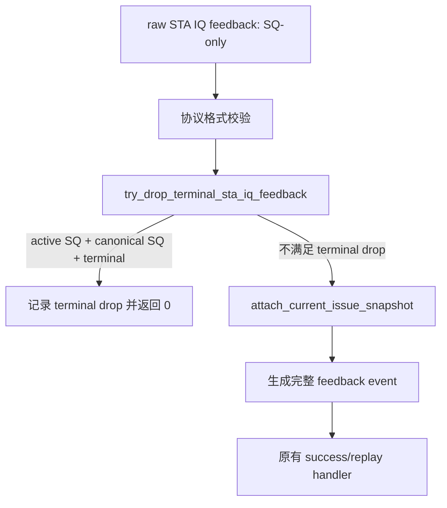

# MemBlock STA terminal 后迟到 IQ feedback 消费修复正式计划（2026-08-28）

| 项目 | 内容 |
| --- | --- |
| 状态 | 代码已完成、独立 review 与远端编译通过；10000 笔回归待启动 |
| 版本 | V2，`mem_ut_uvm_v2` |
| 问题分析 | `AI_DOC/analysis/framework_design/memblock_sta_terminal_iq_feedback_rm_issue_analysis_20260828.md` |
| 前置 feature | `AI_DOC/plan/test_framework/plan/do/memblock_sta_replay_late_fault_tombstone_coding_plan_20260828.md` |
| 修改范围 | `mem_ut/ver/ut/memblock/seq/base_seq_help/dispatch_monitor_event_adapter.sv` |
| 非目标 | 不修改 RTL、Scala、DUT interface、PMA/PMP、TLB 表、DCache ledger、sequence/cfg 或 issue scheduler |
| 验证入口 | `basicTest`、`memblock_dispatch_real_smoke_vseq`、`tc_dispatch_real_mmu_sv39_smoke`、seed `666666` |

## 1. 专有名词与抽象功能说明

| 术语 | 中文含义 | 代码落点 | 示例 |
| --- | --- | --- |
| IQ feedback | StoreUnit 到 IssueQueue 的 SQ-only `hit` 回应。 | `convert_raw_iq_feedback()` | UID9 的 `hit=1`。 |
| terminal UID | 已被 fault/exception/terminal_done 锁定结果的 active UID。 | `status.fault`、`exception_pending`、`terminal_done` | UID9 在 late `0x8080` 后。 |
| active SQ map | 由 SQ key 反查当前 UID 的关联数组。 | `uid_by_sq` | raw `0/3` 反查 UID9。 |
| canonical SQ | active status 保存的该 UID 当前 SQ key。 | `status.sqIdx_flag/value` | 必须与 raw SQ `0/3` 相同。 |
| strict current attach | 为未终态 raw 补齐 current issue identity 的既有路径。 | `attach_current_issue_snapshot()` | 非 terminal feedback 的原规则。 |
| terminal drop | 已可证明归属 terminal UID 的 raw feedback 被消费但不产生 UVM event。 | 新 helper 返回值 | 不更新 replay/fault/issue 状态。 |

抽象功能描述：`try_drop_terminal_sta_iq_feedback()` 在 SQ-only STA IQ raw 已完成协议格式校验后，
用 active SQ map 验证它是否属于 terminal UID；命中后仅消费该 raw，不能创建 feedback/replay event，
也不改变 status、queue、map 或 tombstone。

抽象功能描述：`convert_raw_iq_feedback()` 负责把合法 raw feedback 归一化为 UVM event。新增 terminal
drop 前置分支只处理可证明的 terminal case；其余输入继续调用原严格 attach，不负责放宽 current
snapshot、PMA/PMP 或 fault 写入规则。

## 2. 目标 Flow

文字流程：raw 必须先满足 STA、SQ-only、非 STD 的现有协议约束。随后 helper 仅做 O(1) active SQ
查询和 status 读取；若能够确认 raw 属于 terminal UID 则立即消费。无法确认或 UID 非 terminal 时，
严格 current attach 仍是唯一路径，任何 owner、SQ、epoch 或 dispatched 违规继续 fatal。

## 3. 源码修改 Flow

### 3.1 新增 terminal IQ drop helper

文件：`dispatch_monitor_event_adapter.sv`。

详细文字伪代码：

1. 输入为已经填入 `source=STA_FEEDBACK`、`target=STA` 和 `has_sq=1` 的 raw event。
2. 使用 `data.lookup_active_uid_by_sq()` 查询 raw SQ。查询未命中时返回 `0`，不写 event；caller 必须
   继续原 strict attach，以保留无 owner 的 fatal。
3. 读取 status，检查 `active_sq_mapped` 且 canonical SQ 与 raw SQ 相等；任一不满足时返回 `0`，
   由 strict attach 报出 map/owner 不变量错误。
4. 若 `fault || exception_pending || terminal_done` 为假，返回 `0`；这条分支不能按
   `sta_dispatched=0` 直接 drop，避免掩盖非 terminal 的 stale generation 问题。
5. 若 terminal 为真，打印 UID、raw SQ、fault/exception/terminal 标志，返回 `1`。helper 不修改
   status、issue queue、PTW wait、tombstone、PMA/PMP context、TLB 或 DCache ledger。

### 3.2 调整 raw IQ converter

文件：`dispatch_monitor_event_adapter.sv`，函数 `convert_raw_iq_feedback()`。

详细文字伪代码：

1. 保留 `raw.valid`、vector/std、SQ-only 的全部现有 fatal 检查；这些检查在 helper 前执行。
2. 填入 event 的 port、source、target 和 SQ key。
3. 调用 terminal helper。命中时直接返回 `0`，表示 monitor 已消费 raw 而下游不应再看到 event。
4. 未命中时调用现有 `attach_current_issue_snapshot()`，并保留完整 event 字段检查、`hit`/replay/
   `ptw_back_replay` 计算和 cycle 记录。
5. 不新增 callback、queue、config 或 runtime plus；不调整 `writeback_status_handler`、
   `common_data_transaction` 或 scheduler。

## 4. 正确性和性能边界

| 输入条件 | 行为 | 原因 |
| --- | --- | --- |
| active SQ 命中、canonical SQ 相同、terminal | info 后消费 raw，converter 返回 0 | event 不能再改变 terminal UID。 |
| SQ 无 active owner | 保持现有 fatal | 不能确认 raw 是旧反馈还是未知 DUT 输出。 |
| SQ owner/canonical key 不一致 | 保持现有 fatal | 不得掩盖 map 损坏或资源复用问题。 |
| UID 非 terminal 且 `sta_dispatched=0` | 保持现有 strict attach fatal | 不放宽未证明的 generation 归属。 |
| active terminal 但 `sta_dispatched=1` | 仍消费 | terminal 是 fault/replay 写入的权威边界，后续 feedback 不得改变状态。 |

高频成本是一次 SQ associative-map 查询和一次 status 读取，均为 O(1)；不扫描 main table、tombstone
queue、exception queue 或 PTW queue。

## 5. 验证 Flow

1. `git diff --check` 并编译新 mode，确认 helper 类型和 converter return 语义通过 VCS。
2. 运行相同 seed。UID9 在 late fault 后的 `hit=1` 必须出现 `STA_IQ_TERMINAL_DROP`，不再出现
   `IQ_FEEDBACK_ATTACH`。
3. 保持 normal/非 terminal IQ feedback 的 strict attach；日志中不得出现 new warning/fatal，且
   `UVM_ERROR=0`、`UVM_FATAL=0`。
4. 回归持续到 10000 笔全部 terminal，出现新 RM issue 时再建立独立 analysis/plan；出现 RTL
   候选时才按用户要求启动独立 RTL subagent review。
