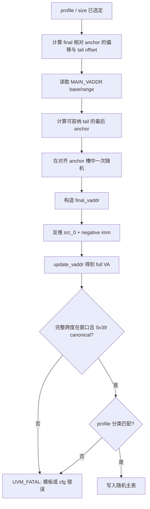

# V2 boundary 地址窗口与 Sv39 canonical 修正 Coding Plan

| 项目 | 内容 |
| --- | --- |
| 状态 | 已实施；基础与定向验证完成。real-DUT 1k 在已确认的 V2 `StoreMisalignBuffer` RTL blocker 处停止，按本任务停止规则不执行 100k。 |
| 目标版本 | V2 |
| 触发场景 | 严格 `PBMT=00`、non-NC、Sv39、普通整数 Load/Store 的 real-DUT 压力回归 |
| 修改范围 | 自动主表的 boundary 地址构造与对应 flow 文档 |
| 不在范围 | RTL、L2TLB payload、PBMT/PBMTE 建模、PMA/PMP、RM、scoreboard、手工 directed fault 场景 |
| 关联源码 | `mem_ut/ver/ut/memblock/seq/base_seq_help/memblock_dispatch_base_sequence.sv` |
| 关联配置 | `mem_ut/ver/ut/memblock/seq/plus_cfg/tc_dispatch_real_mmu_sv39_pbmt0_non_nc_100k.cfg` |

本 plan 修复已由独立 RTL review 确认的测试框架输入问题。严格 `PBMT=00` 配置下的首笔
UID0 曾生成 `VA=0x0000_004e_0e34_fb2f`：其 bit38 为 `1`、bits[63:39] 为 `0`，因此不是
Sv39 正 canonical 地址。DUT 在 full-VA precheck 中正确产生 Store Page Fault；RM 的非对齐
预期因此与 DUT 状态不一致。该现象不证明 PBMT、L2TLB 或 RTL 异常。

波形证据保存在：

- `mem_ut/ver/ut/memblock/sim/pbmt0_non_nc_smoke/l2tlb_uid0_650_680.rpt`
- `mem_ut/ver/ut/memblock/sim/pbmt0_non_nc_smoke/uid0_sta_path_645_665.rpt`

关键时序为：full-VA precheck 在约 `645ns` 置 page-fault，DTLB 随后把 S1 PF 送给 StoreUnit，
Store writeback 在约 `655ns` 输出 exception bit15，RM 在约 `671ns` 因仍只预期非对齐 bit6 而报错。

## 1. 专有名词与抽象功能说明

| 术语 | 当前含义 | 代码落点 | 本 plan 中的例子 |
| --- | --- | --- | --- |
| boundary profile | 测试框架为 Load/Store 选择的地址边界类别，例如自然对齐、跨 8B 或跨 16B。 | `main_control_transaction.boundary_profile` | `CROSS_16B_SAME_LINE` 让 2/4/8B 访问跨 16B 而不跨 64B。 |
| anchor | 模板先随机出的对齐基址；最终 `final_vaddr` 在其上加固定偏移。 | `random_aligned_vaddr()` 的返回值 | cross-16B 的 `line_base` 是 64B 对齐 anchor。 |
| tail offset | 从 anchor 到本次访问最后一个字节的偏移。 | `gen_final_vaddr_by_profile()` 的 profile 局部值 | 对 cross-16B，`bank*16 + 16-k + size-1`。 |
| MAIN_VADDR 窗口 | 自动主表允许产生的虚拟地址闭区间 `[MAIN_VADDR_BASE, BASE+RANGE-1]`。 | `seq_csr_common::get_main_vaddr_base/range()` | 本场景是 `0x8000_0000..0x8fff_ffff`。 |
| full VA | `src_0 + sign_extend(imm)` 后 DUT 实际检查的有效虚拟地址。 | `main_control_transaction.vaddr`、DUT full-VA precheck | `src_0` 本身不是 canonical 判断对象，`vaddr` 才是。 |
| Sv39 正 canonical | bit38 为 `0` 且 bits[63:38] 全为 `0` 的低半区虚拟地址。 | `is_sv39_positive_canonical()` | `0x0000_004e_...` 因 bit38=1 被拒绝。 |

### 1.1 修改对象的抽象职责

`memblock_dispatch_base_sequence::random_aligned_vaddr()` 在 boundary 模板需要对齐 anchor 时，
只从当前 `MAIN_VADDR` 窗口内、且能够容纳指定 tail offset 的候选槽中随机选择。它不判断 DUT
结果、不访问 TLB 表、不改变 PBMT，也不扫描主表。它使用 65-bit 局部中间值检查 base/range、对齐
进位和候选 anchor 的 64-bit 上溢，不把截断后的结果当作合法地址。

`memblock_dispatch_base_sequence::gen_final_vaddr_by_profile()` 按 profile/访问大小构造有效虚拟地址。
它只选择满足边界语义且完整访问落在 `MAIN_VADDR` 窗口内的 anchor；它不修改 transaction、RM 或
物理地址映射。

`memblock_dispatch_base_sequence::apply_boundary_addr_template()` 把构造出的 `final_vaddr` 拆成
`src_0 + imm` 并回写 transaction。它在回填后的 full VA 上检查完整访问跨度、Sv39 canonical 和
profile 分类；它不对手工主表或其它 directed fault 输入施加全局过滤。

`memblock_dispatch_base_sequence::is_sv39_positive_canonical()` 是纯值检查 helper。它只判断低半区
Sv39 canonical 规则，不读取配置、不随机、不驱动接口。

## 2. 目标与边界

### 2.1 目标

1. boundary profile 打开后，自动生成的每一笔 normal Load/Store 完整访问跨度必须位于
   `MAIN_VADDR` 窗口内。
2. 任一生成的 `final_vaddr`、最终 `tr.vaddr` 和访问末字节必须满足 Sv39 正 canonical，且无 64-bit
   加法回绕。
3. `ALIGNED`、`MISALIGN_WITHIN_8B`、`CROSS_8B_WITHIN_16B`、`CROSS_16B_SAME_LINE`、
   `CROSS_CACHELINE_SAME_4K` 与 `CROSS_4K` 继续按已有模板语义生成，不使用 retry 或 fallback。
4. 无合法 anchor 时 fail-fast，日志必须包含窗口、对齐、tail offset、profile 和访问大小，便于定位
   cfg 太窄或模板计算错误。
5. 严格 `PBMT=00` / non-NC 100k 重新运行时，自动地址不再触发 DUT 的 Sv39 non-canonical pre-fault。
6. 所有地址加法、向上对齐、槽数量计算、槽索引乘法和最终 anchor 加法均必须显式检查无 64-bit
   回绕；不能因窗口很大而假设算术天然安全。
7. address reuse 可能在初始模板之后复制地址并更换访问大小；因此最终写入自动 boundary 主表的
   transaction 也必须重新满足完整 span 的 `MAIN_VADDR` 与 Sv39 canonical 约束。该保证不施加给
   manual directed。

### 2.2 明确边界

1. 不新增 plusarg、cfg 字段、CSR 行为、PTE 字段或 L2TLB token 状态；复用现有
   `MAIN_VADDR_BASE/RANGE` getter。
2. 不把 `MAIN_VADDR` 检查塞进 `validate_main_table_entry()`。该函数也被手工主表与未来 directed
   non-canonical/page-fault 场景调用；全局拦截会把合法的异常激励误判为框架错误。
3. 不读取或限制 `MEMBLOCK_PADDR_BASE/RANGE`。VA window 是 stimulus 合法性边界，PA 仍由 TLB
   backing 路径独立选择。
4. 不修改 RM。首错的 RM mismatch 是非法自动输入的后果；本 plan 先消除输入缺陷。后续如果合法 VA
   场景仍产生 RM mismatch，另建 RM 分析与修复 plan。
5. 不修改 RTL。独立 review 已确认 V2 的 full-VA precheck 与 Store PF 行为正确。

## 3. 根因与目标 Flow

### 3.1 修改前根因

`is_sv39_positive_canonical()` 当前只检查 `vaddr[63:39] == 0`，漏掉 Sv39 符号位 bit38；
`random_aligned_vaddr()` 使用全局 `2^39` 上界，且 boundary profile 路径未消费
`MAIN_VADDR_BASE/RANGE`。因此 `0x0000_0040_0000_0000..0x0000_007f_ffff_ffff` 这一非法洞会被
当作“正 canonical”地址采样。

### 3.2 修改后 Flow



该流程每个 transaction 只进行常数次数的算术和一次取模随机，不扫描历史 uid、TLB entry 或 RM 表。

## 4. 实现 Flow

### 4.1 修正 `is_sv39_positive_canonical()`

抽象功能描述：该 helper 继续作为 boundary 模板的纯值校验，但把正 canonical 的判断边界收敛到
Sv39 bit38。它不区分 profile，也不替代驱动时的 DUT full-VA 检查。

源码级伪代码：

```text
is_sv39_positive_canonical(vaddr):
  返回 vaddr[63:38] 全为 0。
```

中文文字伪代码：该函数只读取输入 VA 的高位。bit38 是 Sv39 的符号扩展来源；正半区要求 bit38 与
bits[63:39] 都为 0，因此检查范围必须是 `[63:38]`。返回值只被自动 boundary 模板的防御性检查使用；
它不试图把非 canonical 输入改写为 fault，也不触碰手工 directed 输入。

### 4.2 修改 `random_aligned_vaddr(align_bytes, tail_offset)`

抽象功能描述：该 helper 由各 profile 模板调用，根据对齐要求和完整访问末字节相对 anchor 的偏移，
从 `MAIN_VADDR` 窗口中返回一个合法对齐 anchor。它只解决候选槽选择，不知道最终 profile 的分类规则。

源码级伪代码：

```text
random_aligned_vaddr(align_bytes, tail_offset):
  检查 align_bytes 非零且为 2 的幂。
  base  = get_main_vaddr_base()
  range = get_main_vaddr_range()
  wide_limit = {0, base} + {0, range}，使用 65-bit 中间值。
  若 range 为 0 或 wide_limit 超出 64-bit：
    UVM_FATAL；配置窗口发生下溢或回绕。
  upper = wide_limit - 1。

  若 range <= tail_offset：
    UVM_FATAL；完整访问在该窗口内没有任何 anchor。

  latest_anchor = upper - tail_offset
  wide_aligned_first = {0, base} + (align_bytes - 1)，使用 65-bit 中间值。
  若 wide_aligned_first 超出 64-bit：
    UVM_FATAL。
  aligned_first = 向上对齐 base 到 align_bytes
  aligned_last  = 向下对齐 latest_anchor 到 align_bytes
  若向上对齐发生回绕，或 aligned_first > aligned_last：
    UVM_FATAL；报告窗口、对齐和 tail offset。

  slot_count = ((aligned_last - aligned_first) / align_bytes) + 1
  slot_pick  = random64() % slot_count
  slot_offset = slot_pick * align_bytes
  若 slot_pick 非零且 slot_offset / align_bytes 不等于 slot_pick：
    UVM_FATAL；槽乘法发生截断。
  wide_candidate = {0, aligned_first} + {0, slot_offset}，使用 65-bit 中间值。
  candidate = wide_candidate 的低 64-bit。
  若 wide_candidate 超出 64-bit，或 candidate 超过 aligned_last：
    UVM_FATAL。
  返回 candidate。
```

中文文字伪代码：调用者先把 profile 的固定偏移和 `size-1` 合成为 tail offset。helper 从已有参数快照
读取窗口，因此不新增配置真源。它将 `upper-tail_offset` 作为最后允许的 anchor，保证 anchor 加上
本次访问最后一个字节仍不超过窗口；再只在首尾对齐槽之间选择一次。任何窗口太窄、对齐进位回绕、无
可选槽、槽乘法截断或候选 anchor 越过最后槽的情况都是 cfg/模板错误，直接 fatal，而不是生成窗口外
地址或改成 ALIGNED profile。65-bit 只服务本函数局部算术，不新增状态、参数或 DUT 接口。

### 4.3 修改 `gen_final_vaddr_by_profile()`

抽象功能描述：该函数继续按 profile 构造 final VA，只把 anchor 采样从全局 Sv39 数值范围改为
`MAIN_VADDR` 窗口。它不重新解释 profile 权重、op class 或 TLB 映射。

每个 profile 先确定相对 anchor 的 `final_offset` 和 `tail_offset`，再调用 4.2 的 helper：

| profile | anchor 对齐 | `final_offset` | `tail_offset` |
| --- | --- | --- | --- |
| `ALIGNED` | `max(size, 64B for size>=64)` | `0` | `size-1` |
| `MISALIGN_WITHIN_8B` | 8B | `offset` | `offset+size-1` |
| `CROSS_8B_WITHIN_16B` | 16B | `8-k` | `8-k+size-1` |
| `CROSS_16B_SAME_LINE` | 64B | `bank*16+16-k` | `bank*16+16-k+size-1` |
| `CROSS_CACHELINE_SAME_4K` | 4KB | `line*64+64-k` | `line*64+64-k+size-1` |
| `CROSS_4K` | 4KB | `4096-k` | `4096-k+size-1` |

源码级伪代码：

```text
gen_final_vaddr_by_profile(profile, size, op_class):
  检查 size 非零和 profile 的现有 size 支持矩阵。
  按 profile 选择 offset、k、bank、line。
  tail_offset = final_offset + size - 1。
  若 tail_offset 的计算回绕：
    UVM_FATAL。
  anchor = random_aligned_vaddr(profile_required_alignment, tail_offset)。
  final_vaddr = anchor + final_offset。
  若 final_vaddr 小于 anchor：
    UVM_FATAL。
  返回 final_vaddr。
```

中文文字伪代码：模板仍先选择只影响边界语义的离散变量，例如跨 16B 的 bank/k，随后把该选择折算为
anchor 到最后字节的总距离；全部离散变量在调用 anchor helper 前确定，因此 helper 不会在一个随机
anchor 上再改变 profile 形态。`random_aligned_vaddr()` 用这个总距离限制 anchor，使生成的 final VA
既保持原 profile，又不会跨越 `MAIN_VADDR` 上界。`CROSS_4K` 删除固定 `2^39` page count，改为用同一
anchor helper；这样所有 profile 共用一套窗口和回绕检查。

### 4.4 修改 `apply_boundary_addr_template()`

抽象功能描述：该函数在 address split 完成后验证 DUT 实际会看到的 full VA，而不是只信任拆分前的
`final_vaddr`。它只校验本函数生成的自动 boundary transaction，不改变 `validate_main_table_entry()`
的手工 directed 语义。

源码级伪代码：

```text
apply_boundary_addr_template(tr, profile, size):
  final_vaddr = gen_final_vaddr_by_profile(profile, size, tr.op_class)
  计算 final_end = final_vaddr + size - 1。
  检查 final/end 不回绕且都满足 Sv39 正 canonical。

  生成既有负 imm12，反推 src_0，并检查加回后仍等于 final_vaddr。
  写 tr.src_0/tr.imm；调用 tr.update_vaddr()。
  计算 full_end = tr.vaddr + size - 1。
  从 MAIN_VADDR getter 取得窗口；检查 full VA、full_end 都在窗口、无回绕且 canonical。
  检查 tr.vaddr 等于 final_vaddr。
  检查 classify_boundary_profile(tr.vaddr, size) 等于目标 profile。
```

中文文字伪代码：先对模板结果做 canonical/回绕检查，随后沿用现有负立即数拆分，确保测试仍能刺激
非零 imm 路径。回写 transaction 后再次用 `update_vaddr()` 的 full VA 检查完整访问，而不是假设
`src_0/imm` 永远无误。检查失败说明生成规则或配置错误，因此 fatal；检查成功才允许后续的 profile
分类和主表写入。该局部检查不会影响手工主表中有意构造的 translation fault。

### 4.5 收敛 address reuse 后的 boundary span

抽象功能描述：地址复用是在初始 boundary 模板之后执行的公共主表构造步骤。该步骤在真正复制参考
地址时保持地址关系，并把不兼容的大访问收敛到参考大小；没有参考地址时不保留不存在的地址关系，按
最终 op 模板重新构造一个合法 boundary 地址。`sync_boundary_profile_after_addr_reuse()` 是最终标签
同步点，同时复核 full VA span，不把检查扩大到 manual directed。

源码级伪代码：

```text
fixup_after_addr_reuse(tr, ref_tr, copy_addr):
  若 copy_addr：
    复制 ref_tr.src_0/imm，更新 tr.vaddr。
    用当前最终访问大小检查 window、回绕；boundary 模式还检查 canonical。
    若本次大小不适合 copied address：
      验证 reference 自身的完整 span；
      把当前 load/store 收敛到 reference size，保留 copied address；
      重新验证完整 span 与 canonical。

apply_addr_reuse_window() 无 reference 的 boundary fallback：
  保持已有 fallback load/store op_class 选择。
  从最终 fuOpType 派生 size。
  若旧 boundary profile 不支持该 size，或最终是 STORE x CROSS_8B_WITHIN_16B
  且 MEMBLOCK_STORE_CROSS_8B_WITHIN_16B_EN 为 0，选择 ALIGNED。
  用该 profile 和最终 size 重新调用 boundary 模板；不复制地址。

sync_boundary_profile_after_addr_reuse(tr):
  更新 full VA，检查 final/end 无回绕、在 MAIN_VADDR、且是 Sv39 positive canonical。
  根据 final VA/size 重新分类，写回 boundary 标签并验证主表结构。
```

中文文字伪代码：有 reference 的复用不能静默丢失地址相关性，因此优先保留参考地址；若随机的新
访问更大而越过窗口，就把其 opcode 收敛到 reference 的合法大小。由于 reference 在先前写入主表
时已经通过同一终态检查，收敛后既保留地址关系，也不会跨出窗口。没有 reference 时不存在必须保留
的关系，旧 fallback 已经重新选择 op 模板；此时按最终 size 重新生成地址是唯一能保证 profile/span
闭环的行为。最后同步函数再次检查最终事实，防止以后新增复用分支绕开前面的局部 helper。

## 5. 文档、验证与提交

### 5.1 文档同步

1. 新建本 plan 并在完成 coding 后移动到 `AI_DOC/plan/test_framework/plan/do/`。
2. 新建 implementation review 到 `AI_DOC/plan/test_framework/review_doc/undo/`，记录 Sv39 地址问题的
   独立 RTL review 已排除 DUT/PBMT 根因、代码 diff、计划对齐和验证结果；若后续运行发现独立 RTL
   blocker，必须同时记录其波形路径和停止原因。
3. 更新 `AI_DOC/mem_ut_flow_doc/main_table_boundary_profile_generation_flow.md`：将全局
   `[0, 2^39)` 采样描述替换为 `MAIN_VADDR` 中的 anchor/tail-offset 构造，并把 Sv39 检查表述修正为
   `[63:38] == 0`。
4. 更新 `AI_DOC/project_management/mem_ut_parameter_management.md` 与
   `mem_ut/ver/ut/memblock/rule/plus_demo_migration_plan.md`：保留手工 directed 不受全局 normal
   窗口拦截的边界，但明确自动 boundary profile 已成为 `MAIN_VADDR` consumer。
5. 在旧的 `main_table_boundary_candidate_addr_generation_plan_20260701.md` 顶部增加后续修正说明，
   标记其中关于 `[0, 2^39)`、`[63:39]` 和 boundary 不消费 `MAIN_VADDR` 的内容仅是历史实现，
   当前行为以本 plan 为准。

### 5.2 静态检查

```bash
git diff --check -- \
  mem_ut/ver/ut/memblock/seq/base_seq_help/memblock_dispatch_base_sequence.sv \
  AI_DOC/plan/test_framework \
  AI_DOC/mem_ut_flow_doc/main_table_boundary_profile_generation_flow.md

rg -n '0000_0080_0000_0000|\[63:39\]|random_aligned_vaddr\(' \
  mem_ut/ver/ut/memblock/seq/base_seq_help/memblock_dispatch_base_sequence.sv
```

最后一条检查应只保留新的 function declaration/调用，并且源码不再含旧的 `2^39` 上界或 `[63:39]`
canonical 规则。

### 5.3 基础仿真

为避免复用已损坏的 VCS 增量目录，使用新的 mode。先对同一 PBMT0/non-NC cfg 做小规模 smoke；此
覆盖只用于验证修复，不替代最终 100k：

`memblock_dispatch_real_mmu_sv39_pbmt0_non_nc_vseq` 已在 `seq_pkg.sv` 注册，并被
`basicTest::vseq_starts_l2tlb()` 与 `vseq_owns_static_mmu_csr()` 明确识别；本 plan 使用该专用
VSEQ，而不是带 `PBMT=01` 语义的 legacy `memblock_dispatch_real_smoke_vseq`。

```bash
cd mem_ut/ver/ut/memblock/sim
make eda_compile tc=basicTest \
  ts=memblock_dispatch_real_mmu_sv39_pbmt0_non_nc_vseq \
  mode=pbmt0_non_nc_vaddr_fix \
  cfg=tc_dispatch_real_mmu_sv39_pbmt0_non_nc_100k

make eda_run tc=basicTest \
  ts=memblock_dispatch_real_mmu_sv39_pbmt0_non_nc_vseq \
  mode=pbmt0_non_nc_vaddr_fix \
  cfg=tc_dispatch_real_mmu_sv39_pbmt0_non_nc_100k \
  plus_arg='+MEMBLOCK_MAIN_TRANS_NUM=1000'
```

验收条件：无生成期 `UVM_FATAL`；所有自动 boundary VA/末字节在 `0x8000_0000..0x8fff_ffff`；没有
Sv39 full-VA non-canonical PF；L2TLB response 仍是 `PBMT=00`；任何后续 RM mismatch 按独立 RM
问题流程分析，不把它归因到本修复。

`MEMBLOCK_HARD_XZ_CHECK_EN=1` 保持严格 PBMT0 cfg 的既有设置。该开关只把非通用硬 X/Z 诊断报告为
`UVM_ERROR`，不会改变地址生成、PBMT 或 DUT exception 语义；若它在 smoke/100k 中报错，按独立环境
问题处理，不通过关闭该开关掩盖错误。

### 5.3.1 无 reference fallback 的 Store cross-8B 定向检查

使用 software-only testcase 固定构造 UID0：初始 transaction 是 2B Load x
`CROSS_8B_WITHIN_16B`；地址复用强制选择 `LOAD_AFTER_STORE`，但 recent store queue 在 UID0
为空，因此 fallback 将它改为 2B Store。`MEMBLOCK_STORE_CROSS_8B_WITHIN_16B_EN=0` 时，最终
`boundary_profile` 必须是 `ALIGNED`，不能保留初始 cross-8B 标签和地址。

```bash
cd mem_ut/ver/ut/memblock/sim
make eda_compile tc=tc_boundary_addr_reuse_gate \
  mode=boundary_addr_reuse_gate \
  cfg=tc_boundary_addr_reuse_store_cross8_gate

make eda_run tc=tc_boundary_addr_reuse_gate \
  mode=boundary_addr_reuse_gate \
  cfg=tc_boundary_addr_reuse_store_cross8_gate
```

验收条件：日志包含 `boundary no-reference fallback honored STORE x CROSS_8B gate`；无
`UVM_ERROR`/`UVM_FATAL`。该 test 只构建和检查主表，不驱动 DUT，不替代本节的 real-DUT 1k/100k 验收。

当前任务只验收 `PBMT=00` / non-NC 100k。带 `PBMT=01` 的 strict-NC cfg 不作为本 plan 的功能通过
条件，避免把不同的 NC/uncache RTL 路径混入本次地址修复归因；该 cfg 仅在后续 strict-NC 专项回归时
复用本修复后的通用 boundary 逻辑。

### 5.4 实际回归状态与后续门槛

1. 小 smoke 与无 reference fallback 定向检查已通过，独立 implementation review 也确认本 plan 的
   地址生成代码无测试框架 blocker；本功能源码、plan、flow 与 implementation review 应以单独 commit
   归档。
2. 同一 PBMT0/non-NC real-DUT 1k 已确认完成主表构造且未复现原 Sv39 non-canonical pre-fault；但在
   `727.8ns` 命中 `INT_WB_STA0_TRIGGER_PROVENANCE`。Scala、生成 RTL 和 FSDB 的独立复核确认该事件是
   普通跨 16B store 在 `StoreMisalignBuffer` 中丢失 `trigger` metadata 的 V2 RTL 缺陷，详见
   `AI_DOC/analysis/rtl/v2/flows/store_misalign_trigger_metadata_propagation.md`。
3. `INT_WB_STA0_TRIGGER_PROVENANCE` 不是本 plan 可删除或放宽的测试框架检查。按用户规定，确认 RTL
   问题后只记录错误点和波形路径，不修改 RTL，且停止本次 100k 压力回归。因此下面命令没有在本轮执行。
4. RTL owner 修复并重新生成/接入 V2 RTL 后，才可使用新的 100k mode 从 cfg 原值恢复回归；不得通过
   `+MEMBLOCK_MAIN_TRANS_NUM=` 覆盖、关闭 checker 或修改 RTL 以外的验证语义来绕过该 blocker：

```bash
make eda_compile tc=basicTest \
  ts=memblock_dispatch_real_mmu_sv39_pbmt0_non_nc_vseq \
  mode=pbmt0_non_nc_100k_vaddr_fix \
  cfg=tc_dispatch_real_mmu_sv39_pbmt0_non_nc_100k

make eda_run_bg tc=basicTest \
  ts=memblock_dispatch_real_mmu_sv39_pbmt0_non_nc_vseq \
  mode=pbmt0_non_nc_100k_vaddr_fix \
  cfg=tc_dispatch_real_mmu_sv39_pbmt0_non_nc_100k
```

5. 恢复后的回归若出现 RM error，新增 RM 分析文档与 RM plan，明确 fault/exception 的期望来源、最佳修复和回归
   命令；RM 修改只能在该 plan review 后进行，并以独立 commit 提交。

## 6. RM 协同支持

本 plan 不实现 RM/checker/scoreboard。本 plan 只保证自动 boundary 地址是合法 Sv39 normal stimulus，
使后续 RM 比较不再把 DUT 对 non-canonical VA 的合法 page fault 与非对齐异常混淆。

## 7. 功能覆盖率协同支持

本 plan 不实现 coveragent/covergroup。后续覆盖可交叉采样 `boundary_profile`、访问大小与 full VA
所在 `MAIN_VADDR` 窗口，但本 plan 不增加 coverage 字段或采样点。

## 与初步 plan 差异说明

修改目的：已有
`AI_DOC/plan/test_framework/plan/do/main_table_boundary_candidate_addr_generation_plan_20260701.md`
把 Sv39 正 canonical 上界写为 `2^39`，并明确 boundary 地址不使用 `MAIN_VADDR`。真实 Sv39
stress 证明这两个前提会产生 DUT 正确但测试框架无法正确预期的 Page Fault，因此需要更正。

修改前逻辑行为：

```text
profile 模板调用 random_aligned_vaddr()：
  直接从 [0, 2^39) 采样 anchor；该 helper 只按旧 [63:39] 规则检查高位。
profile 叠加 offset 后得到 final_vaddr：
  不受 MAIN_VADDR 窗口约束。
apply_boundary_addr_template()：
  只检查 final/end 的旧 canonical 规则，再回写 src_0/imm。
```

修改后逻辑行为：

```text
profile 模板先计算 tail offset：
  该偏移覆盖 anchor 到完整访问末字节的距离。
random_aligned_vaddr()：
  从 MAIN_VADDR 中选择对齐 anchor，并保证 anchor+tail 不越界。
apply_boundary_addr_template()：
  用修正后的 [63:38] canonical 规则检查 final 和 update_vaddr 后的 full VA，
  同时检查完整跨度仍在 MAIN_VADDR 窗口内。
```

差异影响：无新参数、无新状态、无表扫描。boundary 模式从“全局正地址空间”改为“已配置的 normal VA
窗口”；手工 directed 和 RM/RTL 语义保持不变。该改变修复自动 normal stimulus，不把 DUT 对故意非法
地址的异常行为隐藏或过滤掉。

## 执行中补充/修正（IMPLEMENTATION_DELTA）

`[IMPLEMENTATION_DELTA]`

- 来源：执行 4.2 的槽索引乘法时复查了 SystemVerilog 表达式位宽。
- 原 plan：伪代码以 65-bit `{1'b0, slot_pick} * {1'b0, align_bytes}` 表达“宽乘法”。
- 实现调整：源码将两个乘数都显式扩宽为 130-bit，即
  `{66'd0, slot_pick} * {66'd0, align_bytes}`，结果保存到 `slot_product[129:0]` 后再检查
  高位是否为零。
- 原因：SystemVerilog 乘法表达式可能按操作数宽度求值；若只使用 65-bit 操作数，结果高位可能在赋给
  130-bit 目标前丢失，使溢出检测失效。
- 影响范围：仅 `random_aligned_vaddr()` 的局部算术健壮性检查；候选 anchor、窗口语义、随机分布、
  配置接口和 DUT 接口均不改变。

`[IMPLEMENTATION_DELTA]`

- 来源：独立 implementation review 发现 initial template 后仍会执行 `apply_addr_reuse_window()`；
  原 `ensure_normal_reused_addr_span()` 在 boundary 模式直接返回，
  `sync_boundary_profile_after_addr_reuse()` 仅更新标签，无法保证最终 span。
- 原 plan：4.2--4.4 只描述了初始模板和回填后的 full VA 检查，没有展开 post-reuse 的最终收敛。
- 实现调整：将 copied-address span helper 收敛为自动主表共用 helper，boundary 下也检查 window 与
  canonical；无 reference 的 boundary fallback 按最终 op/size 重新生成合法地址；最终 sync 再做
  防御性 full-span 检查。
- 原因：否则小 size reference 位于窗口尾部、被复用为更大 size 时，访问末字节可能越过
  `MAIN_VADDR`；若窗口邻接 Sv39 bit38 边界，还可能重新引入 non-canonical 自动输入。
- 影响范围：只影响 `MEMBLOCK_BOUNDARY_PROFILE_GEN_EN=1` 的自动随机地址复用分支。manual directed、
  RM、L2TLB、PBMT、PMA/PMP、DUT 接口和 RTL 均不改变；正常 reference 复用继续保留地址关系。

`[IMPLEMENTATION_DELTA]`

- 来源：独立 implementation review 发现 `apply_addr_reuse_window()` 的无 reference fallback 只调用
  `boundary_profile_supported_for_fuop()`，未复用 candidate cache 的 Store x cross-8B 专用 gate。
- 原 plan：4.5 只按 profile/size 支持矩阵决定 fallback 是否降级为 `ALIGNED`。
- 实现调整：当 fallback 的最终 op 是 `STORE`、profile 是 `CROSS_8B_WITHIN_16B` 且
  `MEMBLOCK_STORE_CROSS_8B_WITHIN_16B_EN=0` 时，同样改用 `ALIGNED`；新增
  `tc_boundary_addr_reuse_store_cross8_gate` software-only 定向检查固定覆盖该分支。
- 原因：初始候选可以是 Load x cross-8B，随后 `LOAD_AFTER_STORE` 在 UID0 没有 reference 时会改成
  Store。若不再次检查 gate，fallback 会绕过 testcase 对 Store cross-8B 的关闭约束。
- 影响范围：只影响 automatic boundary 的无 reference 地址复用 fallback；不新增运行期字段、不会
  改变已命中 reference 的地址相关性、manual directed、PBMT/RM 和 RTL。
