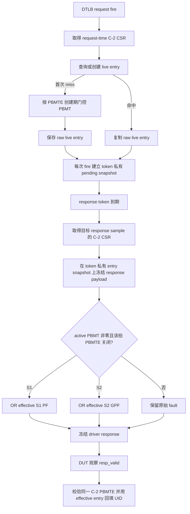

# V2 L2TLB PBMTE 驱动 PBMT 创建期门控与返回期 PF/GPF 叠加方案

状态：`undo`，执行中。创建期门控、返回期 payload 冻结和 software-only 闭环已完成；real-DUT 动态 PBMTE smoke 待完成。

本文定义 V2 `L2TLB_agent` 对 PBMT 的两阶段建模：首次创建 live entry 时，按 request-time C-2 CSR 的 PBMTE 决定是否允许生成非零 PBMT；已经保存非零 PBMT 的 entry 在后续返回时，按 response-visible C-2 CSR 的 PBMTE 叠加 S1 PF 或 S2 GPF。本文不修改 RTL、StoreUnit、StoreQueue、RM、scoreboard 或功能覆盖率；RM 对已完成 response payload 的读取和异常推导另立专项文档，不属于本计划实现范围。

关联实现与证据：

- `mem_ut/ver/ut/memblock/seq/base_seq_help/tlb_map_builder.sv`
- `mem_ut/ver/ut/memblock/seq/base_seq_help/mmu_csr_runtime_state.sv`
- `mem_ut/ver/ut/memblock/seq/base_seq_help/memblock_tlb_entry.sv`
- `mem_ut/ver/ut/memblock/seq/base_seq/memblock_l2tlb_base_sequence.sv`
- `mem_ut/ver/ut/memblock/seq/base_seq_help/common_data_transaction.sv`
- `mem_ut/ver/ut/memblock/common/memblock_common/src/memblock_sync_pkg.sv`
- `mem_ut/ver/ut/memblock/seq/virtual_sequence/memblock_mmu_sv39_csr_sequence.sv`
- `src/main/scala/xiangshan/cache/mmu/MMUBundle.scala` 的 `PteBundle.isPf/isGpf()`

## 1. 专有名词与抽象功能说明

| 术语 | 当前含义和代码落点 | 示例 |
|---|---|---|
| PBMT | 页表项或 L2TLB response 中的 2-bit memory type。`00` 表示由 PMA 决定，`01` 为 NC，`10` 为 IO，`11` 保留。 | 成功 S1 response 的 `pbmt=01` 可使 StoreUnit 得到 NC 语义。 |
| PBMTE | CSR 中允许非零 PTE.PBMT 的 enable。运行期状态字段为 `m_pbmt_en/h_pbmt_en`。 | 新 entry 创建时 `m_pbmt_en=0`，普通 S1 PBMT 必为 `00`。 |
| request-time C-2 CSR snapshot | DTLB request fire sample 使用的 C-2 CSR 历史快照。 | 它决定首次 miss 创建 entry 时能否随机产生非零 PBMT。 |
| response-visible C-2 CSR snapshot | 某个 L2TLB response 真正被 DUT 消费的 sample 使用的 C-2 CSR 历史快照。 | 旧 entry 的 `pbmt=01` 在该快照中 PBMTE 已关闭时，response 必须补 PF/GPF。 |
| live entry | `tlb_entry_by_key` 中首次 lookup miss 构造、可被后续请求复用的 `memblock_tlb_entry`。 | entry 在 PBMTE 开启时已保存 `pbmt=01`，之后 PBMTE 可关闭。 |
| L2TLB token | 每次真实 DTLB -> L2TLB request fire 建立的独立 pending/driving 生命周期记录。 | 指令 A 完成后其 token 被释放；指令 B 命中同一 live entry 时建立新 token。 |
| terminal complete | 目标指令已完成其框架终态记账，且关联 L2TLB token 不再 pending 或 driving 的边界。 | 定向 CSR producer 只能在指令 A terminal complete 后改变 PBMTE。 |
| pending entry snapshot | 每次真实 request fire 从 live entry 复制出的 token 私有 payload，即 `pending.entry_snapshot`。 | response select 前它是 raw payload；首次 select 后原地成为已冻结的 effective payload。 |
| response payload frozen | token 已按目标 response C-2 CSR 完成 PBMT fault overlay，之后不得再改写 payload 的状态。 | `response_payload_frozen=1` 后 CSR 再变化也不能影响正在驱动的 response。 |
| effective response entry | `response_payload_frozen=1` 后的 `pending.entry_snapshot`。 | 它保留 PBMT、PTE 和原始 fault，只对本 token OR PBMT 导致的 PF/GPF，同时供 driver 和 UID 回填消费。 |
| PBMT fault overlay | response-visible PBMTE 关闭且 active stage PBMT 非零时产生的附加 fault。 | S1 置 `s1_pf`；S2 置 `s2_gpf`；已有 fault 位保持为 1。 |
| `fault_stage_selected` | builder 对原始随机 fault 的单 stage provenance。 | PBMT overlay 可同时置 S1 PF 和 S2 GPF，因此不能把该单值字段当作 response fault 的唯一真源。 |
| `s2xlate` | DTLB request 指定的翻译阶段编码：`00=noS2xlate`、`01=onlyStage1`、`10=onlyStage2`、`11=allStage`。 | `11` 同时检查 VS-S1 的 `hPBMTE` 和 S2 的 `mPBMTE`。 |

### 本专项修改对象的抽象功能描述

`mmu_csr_runtime_state::get_stage_pbmt_enable()` 是 build path 与 response path 共用的阶段到 PBMTE 映射 helper。它只从给定 CSR snapshot 返回一个 active stage 的 PBMTE，不随机化、不驱动接口，也不修改 TLB 表。

`tlb_map_builder::choose_pbmt()` 在首次创建 entry 时选择原始 PBMT。对应 request-time PBMTE 关闭时它返回 `00`；开启时才消费现有 PBMT 权重。

`tlb_map_builder::check_pbmt_build_csr_compatibility()` 只校验新建 entry 的 PBMT 与同一 request-time snapshot 是否一致。它不判断某个延迟 response 的结果，也不修改 entry。

`memblock_l2tlb_base_sequence::get_l2tlb_csr_snapshot_for_sample()` 从 CSR history 为指定 DUT sample 取得 C-2 snapshot。它统一 request capture、response selection 与 response completion 的时序来源，不读取任意时刻的 latest CSR。

`memblock_l2tlb_base_sequence::apply_pbmt_response_overlay()` 为一个已选中的 token 在其私有 `entry_snapshot` 上冻结 effective response payload。它保留 PBMT 和原始 fault，只把 response-visible PBMTE 关闭所需的 PF/GPF OR 到该 token，绝不修改 live entry。

`memblock_l2tlb_base_sequence::select_due_response()` 在 token 最早可返回且下一 response sample 的 C-2 CSR 已可取得时冻结 effective response entry，并据此填充 driver transaction。

`memblock_l2tlb_base_sequence::complete_driving_response()` 在 DUT 已观察 response 的 sample 校验所用 C-2 PBMTE context，并把同一已冻结 `entry_snapshot` 回填到 UID record；它不从 live entry 重建 payload。

## 2. 问题、目标与边界

### 2.1 当前问题

CSR monitor 已采集 `m_pbmt_en/h_pbmt_en`，静态 Sv39 CSR producer 也已有受 `seq_csr_common` 管理的 PBMTE 驱动入口；但当前 `tlb_map_builder::choose_pbmt()` 仅按权重选择，且 `fill_dtlb_resp_from_entry()` 只原样复制 `entry` 中的 fault/PBMT 字段。

因此需要同时覆盖两个不同场景：

1. **创建期关闭**：request-time PBMTE 为 `0` 时，新的 live entry 不得生成非零 PBMT；PBMT 必须收敛为 `00`。
2. **返回期关闭**：entry 曾在 PBMTE 为 `1` 时创建并保存非零 PBMT；目标 CSR 切换在前一条目标指令完成后发生，后续指令复用该 live entry 并在 PBMTE 关闭时返回。若只复用保存的原始 fault，DUT 会看到“PBMTE=0、PBMT 非零、PF/GPF=0”的不一致 response。

第二类不是重新随机 PBMT，也不是更新 live entry，而是对本次 response 的 fault 结果做时序正确的叠加。

### 2.2 目标

1. 所有 active S1/S2 的新建 entry PBMT 必须由创建该 entry 的 request-time C-2 CSR snapshot 门控。
2. 创建期对应 PBMTE 为 `0` 时，`choose_pbmt()` 返回 `00`，不读取权重、不调用随机化。
3. 创建期对应 PBMTE 为 `1` 时，保持现有 stage-local 三项权重、单次 `dist` 随机和 fail-fast 校验。
4. 每个 response token 在首次驱动 `resp_valid` 前，必须以该 response-visible sample 的 C-2 CSR snapshot 检查尚未冻结的 token 私有 `entry_snapshot` 中的 active-stage PBMT。
5. response-time 检查命中时，S1 的 `fault_effective_s1_pf` 与 S2 的 `fault_effective_s2_gpf` 分别 OR overlay；已有 PF/AF/GPF/GAF 均不得被清除或替换。
6. driver response 与 UID completion 必须消费同一个已冻结 token payload，避免 DUT 与 UID payload 对 PF/GPF 的记录分叉。
7. live entry、entry PBMT、PTE 字段和 builder 原始 `fault_raw_*` 不得被 response-time 检查改写；token 私有 `entry_snapshot` 只允许在首次 response select 边界一次性 OR effective PF/GPF。PBMTE 重新打开后，后续 token 从 live entry 新复制的 payload 不得继承前一 token 的 overlay fault。
8. PBMTE 动态变化不新增 TLB key 字段、不触发全表扫描、不自动清除 live entry，也不改变既有 reset/SFENCE/translation-CSR flush 生命周期。定向 CSR producer 必须在目标指令及其 L2TLB token 完成后才改变 PBMTE，不构造跨 PBMTE 切换的 outstanding token。
9. 提供 build gate、旧 entry 返回期 fault、S1/S2 独立映射、OR 保留和重新 enable 去污染的 software test；提供动态 CSR real-DUT directed smoke 验证真实 response 时序。

### 2.3 非目标

1. 不在 response-time 改写 PBMT 值；PBMT 保持 raw entry 创建时的值，response-time 只生成 PF/GPF overlay。
2. 不用 `drain_csr_runtime_events()` 的 latest CSR 代替 response-visible C-2 history。
3. 不改变既有随机 fault 权重、PTE 权重、`fault_stage_selected` 的 builder provenance，或 L2TLB lifecycle owner。
4. 不建模 PBMT=`11` 的保留编码行为；当前 chooser 继续只允许 `00/01/10`，遇到 `11` 仍为框架内部错误。
5. 不把 PBMTE update 定义为自动 SFENCE/HFENCE，也不要求对旧 entry 重新 page walk。
6. 不修改 DTLB、StoreUnit、StoreQueue、RM、scoreboard 或 functional coverage 的实现；RM 的 response payload 消费语义另立专项文档。

## 3. 阶段到 PBMTE 的权威映射与时序合同

| `s2xlate` | active S1 的 PBMTE | active S2 的 PBMTE | PBMTE 关闭时的 response overlay |
|---|---|---|---|
| `00` `noS2xlate` | `m_pbmt_en` | 不存在 | S1 `pbmt!=00` 时 OR `s1_pf` |
| `01` `onlyStage1` | `h_pbmt_en` | 不存在 | S1 `pbmt!=00` 时 OR `s1_pf` |
| `10` `onlyStage2` | 不存在 | `m_pbmt_en` | S2 `pbmt!=00` 时 OR `s2_gpf` |
| `11` `allStage` | `h_pbmt_en` | `m_pbmt_en` | 两 stage 独立判断并可同时 OR |

同一映射在两个时间点使用，但作用不同：

| 时间点 | CSR 来源 | PBMT 行为 | fault 行为 |
|---|---|---|---|
| entry build | request fire sample 的 C-2 snapshot | PBMTE=0 时生成 `00`；PBMTE=1 时按权重生成 | 保留 builder 原始 fault 逻辑 |
| response select | 即将可见的 response sample 的 C-2 snapshot | 不重选、不改写 PBMT | PBMTE=0 且保存 PBMT 非零时 OR S1 PF/S2 GPF |
| response complete | DUT 已观察 response 的同一 sample C-2 snapshot | 不改写 raw/effective PBMT | 校验使用的 PBMTE context，并把 effective entry 回填 UID |

V2 CSR 管线深度为 C-2。若当前 service sample 是 `N`，`select_due_response(N+1)` 必须查询 sample `N+1` 的 C-2 context，而不是直接使用 sample `N` 的 latest CSR；该 context 对应 CSR history 的 `N-1` 样本。DUT 真正观察 response 的 `N+1` sample 时，completion 必须再次读取同一 C-2 context 做一致性校验。

PBMTE CSR 写入遵循当前 CSR 控制路径的串行化合同：目标指令及其 L2TLB token 完成后，CSR producer 才允许改变 PBMTE。PBMTE change 后不自动 flush live entry；下一条同上下文请求可以命中切换前创建的 entry，并按新的 response-visible C-2 PBMTE 生成 fault overlay。本计划不支持用一次 PBMTE write 取消、重解释或重算已经 outstanding 的 token。

## 4. 目标功能 Flow



该 flow 中只有首次 miss 修改 live entry；每次 response 仅在已有 token 私有 `entry_snapshot` 上做一次常数时间 fault overlay，不复制第二份 entry。response selection 至多检查 S1/S2 两个 stage，不扫描 `tlb_entry_by_key`、UID 主表或 pending queue 以外的元素。

## 5. 参数与配置 Flow

### 5.1 静态 Sv39 PBMTE 配置

已有静态 Sv39 配置入口必须保留并作为本计划的前置路径：

```text
env/plus.sv
  -> MEMBLOCK_MMU_SV39_M_PBMTE_EN / MEMBLOCK_MMU_SV39_H_PBMTE_EN
seq_csr_common.sv
  -> get_mmu_sv39_m_pbmte_en() / get_mmu_sv39_h_pbmte_en()
memblock_mmu_sv39_csr_sequence.sv
  -> io_ooo_to_mem_tlbCsr_mPBMTE / io_ooo_to_mem_tlbCsr_hPBMTE
```

`default.cfg` 维持两个 enable 为 `0`。当前 `tc_dispatch_real_mmu_sv39_smoke.cfg` 可将两者设为 `1`，用于构造允许随机 NC/IO PBMT 的静态 Sv39 smoke；本计划不得新增重复的 enabled cfg。

### 5.2 PBMT 权重与动态 CSR 的边界

既有六项 `MEMBLOCK_L2TLB_S{1,2}_PBMT_{0,1,2}_WT` 不删除、不重命名、不新增同义 PBMT enable 参数。

```text
entry build 时 PBMTE=0：
  权重不参与本 stage 的选择，PBMT=00。

entry build 时 PBMTE=1：
  保持既有一次 dist，PBMT 可为 00/01/10。

response-time PBMTE：
  不读取权重，不改变 PBMT；只决定是否给该 token 叠加 PF/GPF。
```

response-time 行为只读 CSR runtime history，不进入 `plus.sv` 或 `seq_csr_common`。动态 PBMTE directed test 使用 test-specific CSR sequence 驱动 CSR agent，不能用新增 plus 参数伪造 response-time snapshot；该 sequence 必须等待目标指令及其 L2TLB token 完成后才改变 PBMTE。

## 6. 创建期 PBMT 实现 Flow

### 6.1 `mmu_csr_runtime_state::get_stage_pbmt_enable()`

抽象功能描述：该纯 helper 由 builder 与 responder 的 response overlay 共用，根据调用者已经取得的 CSR snapshot 和 `s2xlate` 返回一个 active stage 的 PBMTE。它不读取 global latest，不修改 snapshot、entry、queue 或 driver。

实现要点：将原计划放在 `tlb_map_builder` 的 stage 映射收敛到 `mmu_csr_runtime_state`，避免 build path 与 response path 各复制一份 `s2xlate` 判断。

文字伪代码：

```text
get_stage_pbmt_enable(s1, s2xlate):
  若 s1：
    s2xlate=00：返回 m_pbmt_en。
    s2xlate=01 或 11：返回 h_pbmt_en。
    s2xlate=10：uvm_fatal，onlyStage2 没有 S1。

  若非 s1：
    s2xlate=10 或 11：返回 m_pbmt_en。
    s2xlate=00 或 01：uvm_fatal，该请求没有 S2。
```

### 6.2 `tlb_map_builder::choose_pbmt()`

抽象功能描述：该函数只在 lookup miss 创建 active stage payload 时选择 PBMT。它接收创建期 PBMTE；关闭时确定返回 `00`，开启时按原有权重选择一次。

修改后文字伪代码：

```text
choose_pbmt(s1, pbmt_enabled):
  若 pbmt_enabled=0：
    返回 00；不读取权重、不调用 randomize。

  读取该 stage 的 PBMT_0/1/2 权重。
  若权重和为 0：uvm_fatal。
  用既有单次 dist 在 00/01/10 中选择。
  randomize 失败：uvm_fatal。
  返回选择值。
```

### 6.3 `tlb_map_builder::build_payload_for_key_with_csr()` 与 `check_pbmt_build_csr_compatibility()`

抽象功能描述：`build_payload_for_key_with_csr()` 在 lookup miss 构造 immutable raw live entry；`check_pbmt_build_csr_compatibility()` 在该 entry 插表前验证创建期 PBMTE gate。二者都只处理首次创建，不处理 response-time overlay。

文字伪代码：

```text
build_payload_for_key_with_csr(key, request_csr):
  创建并 reset entry。
  按既有流程冻结 stage context、PTE profile、原始 fault、level、PPN 和 sector payload。
  对每个 active stage：
    enabled = request_csr.get_stage_pbmt_enable(stage, key.s2xlate)。
    entry.stage_pbmt = choose_pbmt(stage, enabled)。
  check_pbmt_build_csr_compatibility(key, request_csr, entry)。
  返回 raw entry。

check_pbmt_build_csr_compatibility(key, request_csr, entry):
  检查 inactive stage 仍为默认 payload。
  对每个 active stage：
    若 request_csr 对应 PBMTE=0 且 entry PBMT 非零：uvm_fatal。
    若 PBMT=11：uvm_fatal。
  不修改 fault、PBMT 或 live table。
```

创建期 `PBMTE=0` 且 PBMT 被收敛为 `00` 是合法 normal payload，不在此时制造 PF/GPF。

## 7. 返回期 PBMT PF/GPF 叠加 Flow

### 7.1 `memblock_l2tlb_pending_req` 的 response 私有状态

抽象功能描述：pending record 已经是每次 request fire 的独立生命周期单位。它复用已有的 token 私有 `entry_snapshot`，在首次 response select 边界将其从 raw payload 单向转换为 frozen effective payload；不创建第二份 entry，也不修改全局 live entry。

计划新增字段：

```text
longint unsigned      response_visible_sample_seq
bit                   response_payload_frozen
bit                   response_m_pbmt_en
bit                   response_h_pbmt_en
bit                   response_pbmt_forced_s1_pf
bit                   response_pbmt_forced_s2_gpf
```

token 创建、reset 初始化和 cancel 清理时必须将 `response_payload_frozen`、`response_visible_sample_seq`、保存的 m/h PBMTE 及两个 force 标志清为默认值。`entry_snapshot` 在 request fire 至首次 response select 前保存 raw payload。`response_payload_frozen=0` 时不得向 DUT 驱动 response；首次 select 使用目标 response C-2 CSR 在该对象上 OR fault 后置 `response_payload_frozen=1`。从此刻起，`entry_snapshot` 就是 driver 与 UID completion 共用的 effective payload，不能再按 later CSR 改写。reset、flush cancel 和 token 销毁只释放 token 私有对象，不接触 live entry。

### 7.2 `get_l2tlb_csr_snapshot_for_sample()`

抽象功能描述：该 helper 为指定 DUT sample 读取 C-2 CSR history 并构造 detached `mmu_csr_runtime_state`。它替代名称误导的 `get_request_csr_snapshot()`，让 request capture 与 response path 都显式说明所取的 sample。

文字伪代码：

```text
get_l2tlb_csr_snapshot_for_sample(target_sample, snapshot):
  调用 memblock_sync_pkg::get_l2tlb_request_csr_history(target_sample, raw_csr)。
  history 不存在：返回 0，不构造部分 snapshot。
  创建并 reset detached mmu_csr_runtime_state。
  调用 update_from_raw_csr(raw_csr) 写入完整 C-2 payload。
  返回 1。
```

`capture_fired_request()` 以当前 `sample_seq` 调用它；`select_due_response()` 以 `next_sample_seq` 调用它；`complete_driving_response()` 以实际 `sample_seq` 调用它。不得调用 `get_latest_runtime_csr_snapshot()` 代替这个 helper。

### 7.3 `apply_pbmt_response_overlay()`

抽象功能描述：该 helper 在一个 token 已选中、尚未向 DUT 驱动 response 时，依据指定 response C-2 CSR 将 PBMT fault overlay 原地写入该 token 私有 `entry_snapshot`。它只检查至多两个 active stage，不访问 live table、UID 全表或其他 pending token。

输入：未冻结的 token 私有 `entry_snapshot`、`s2xlate`、response C-2 CSR snapshot。

输出：原地更新后的 effective `entry_snapshot`、`response_pbmt_forced_s1_pf`、`response_pbmt_forced_s2_gpf`。

文字伪代码：

```text
apply_pbmt_response_overlay(entry, response_csr):
  entry 或 response_csr 为 null：uvm_fatal。
  调用方必须证明 response_payload_frozen=0；否则 uvm_fatal。
  检查 entry inactive stage 默认值与 PBMT 编码。

  若 S1 active：
    s1_disabled = !response_csr.get_stage_pbmt_enable(1, entry.s2xlate)。
    s1_force_pf = s1_disabled && entry.s1_entry_pbmt != 00。
    entry.fault_effective_s1_pf |= s1_force_pf。

  若 S2 active：
    s2_disabled = !response_csr.get_stage_pbmt_enable(0, entry.s2xlate)。
    s2_force_gpf = s2_disabled && entry.s2_entry_pbmt != 00。
    entry.fault_effective_s2_gpf |= s2_force_gpf。

  不改 entry 的 PBMT、AF/GAF、原始 PTE 字段或 fault_raw_*。
  返回两个 force 标志；调用方据此记录 token debug 状态并冻结 payload。
```

`fault_stage_selected` 保持 raw builder provenance，不尝试编码 PBMT overlay；driver 与 UID payload 使用各 `fault_effective_*` 位及 force 标志记录实际 response 结果。`allStage` 下 S1 PF 与 S2 GPF 可同时为 1。RM 对这些字段的读取和推导不属于本计划。

### 7.4 修改 `select_due_response()`

抽象功能描述：该函数从到期 token 中选择一个，并把该 token 将在下一 sample 可见的 response 完整冻结。它继续遵守 ordered/reorder、due sample、flush barrier 和单 response 端口合同。

修改后文字伪代码：

```text
select_due_response(next_sample_seq, cycle_tr):
  保持既有 barrier、pending 非空、ordered/reorder 与 due 判断。
  调用 get_l2tlb_csr_snapshot_for_sample(next_sample_seq, response_csr)。
  若 history 尚未可用：不删除 token，返回 0，等待后续 sample。
  选中一个到期 token 并从 pending_q 移入 driving_req。
  若 driving_req.response_payload_frozen=1：uvm_fatal。
  调用 apply_pbmt_response_overlay()，在 driving_req.entry_snapshot 上生成 effective fault。
  保存 response_visible_sample_seq=next_sample_seq、response_m_pbmt_en、response_h_pbmt_en 与 force 标志。
  置 response_payload_frozen=1。
  调用 fill_dtlb_resp_from_entry(driving_req.entry_snapshot, resp_tr)。
  将 resp_tr 保存到 driving_req；之后同一 token 不重新读取 CSR 或重新计算 overlay。
  返回 1。
```

`capture_fired_request()` 仍在 request fire 时创建 token、冻结 raw `entry_snapshot` 并记录 request 侧字段，但不再调用 `fill_dtlb_resp_from_entry()` 预先填充 response payload。该调用只允许发生在本节的 select/freeze 边界。

### 7.5 修改 `complete_driving_response()` 与 `fill_dtlb_resp_from_entry()`

抽象功能描述：completion 在实际 response sample 做 token 完成记账并更新 UID；driver helper 只把已冻结的 effective entry 逐字段写到 response transaction。二者不在 completion 后补改已被 DUT 观察的 response。

修改后文字伪代码：

```text
complete_driving_response():
  用实际 sample_seq 取得 response-visible C-2 snapshot。
  若 snapshot 不存在：uvm_fatal。
  若 driving_req.response_payload_frozen=0：uvm_fatal。
  校验实际 sample_seq 等于 driving_req.response_visible_sample_seq；不一致：uvm_fatal。
  校验其 m_pbmt_en/h_pbmt_en 与 driving_req.response_m_pbmt_en/response_h_pbmt_en 一致；不一致：uvm_fatal。
  调用 complete_waiting_uid_records_by_response(
    driving_req.entry_snapshot, actual_response_csr)。
  清理 driving_req 并递增 completed_count。

fill_dtlb_resp_from_entry(entry, resp):
  保持现有逐字段 PBMT、PTE、PPN、PF/AF/GPF/GAF 驱动。
  调用方必须传入已经 `response_payload_frozen` 的 token `entry_snapshot`；函数内不读取 CSR、不会重新计算 PBMT overlay。
```

UID completion 复制的是同一已冻结 token payload。本计划不修改或假设 RM 的 readonly API、payload 消费方式和异常推导；这些内容在后续 RM 专项中处理。

## 8. 生命周期与异常边界

PBMTE update 不进入当前 `satp/vsatp/hgatp/priv_virt_changed` 的 flush event 条件。它不会删除 live entry、重新随机 PBMT 或关闭 ready；由于 CSR 写入在目标指令及其 token 完成后才发生，本计划不定义“PBMTE write 取消 pending token”的路径。其新影响是后续请求复用旧 live entry 时的 effective fault 结果。

必须保持以下例子：

```text
例 A：创建期 enable，切换后复用旧 entry
  指令 A request C-2：mPBMTE=1，S1 权重选择 PBMT=01；A 的 token 正常完成。
  live entry：保留 PBMT=01，原始 S1 PF=0。
  A 完成后，CSR producer 将 mPBMTE 置 0。
  指令 B 以相同上下文命中该 live entry；B response C-2：mPBMTE=0。
  B 的 effective response：PBMT 仍为 01，S1 PF=1。

例 B：创建期 disable，切换后复用旧 entry
  指令 A request C-2：mPBMTE=0，entry PBMT 收敛为 00；A 的 token 正常完成。
  A 完成后，CSR producer 将 mPBMTE 置 1。
  指令 B 命中该 live entry。
  B 的 effective response：PBMT 仍为 00，不因 enable 重新随机，也不产生 PBMT PF。

例 C：同一 live entry 的后续 response 重新 enable
  指令 B 在 disable 下从 live entry 新复制 token payload，并得到 overlay S1 PF 后完成。
  B 完成后，CSR producer 将 PBMTE 重新置 1。
  指令 C 从同一 live entry 新复制 token payload，C 的 effective response 只保留 raw fault。
  B 的 token 私有 overlay 不得污染 C，也不得写回 live entry。
```

若一个 token 已置 `response_payload_frozen=1` 并等待 DUT observation，其 `entry_snapshot` 必须保持稳定。这里的“每次 response 前检查”指每个新 token 首次拉起 `resp_valid` 前检查，不是在已驱动 token 的每个周期重新改写 payload；当前 CSR 串行化合同也不允许该 token 驱动期间再切换目标 PBMTE。

## 9. 失败策略与激励合法性处理

| 条件 | 策略 | 原因 |
|---|---|---|
| 新建 entry 时 CSR snapshot 为空 | `uvm_fatal` | 无法做创建期 PBMTE gate。 |
| response select 时目标 sample 的 C-2 history 未就绪 | 暂不选择 token，不驱动 `resp_valid` | 允许 due 之后因 CSR history 尚未可用而晚完成，不能猜测 CSR。 |
| response completion 时 C-2 history 缺失 | `uvm_fatal` | DUT 已观察 response，框架必须能证明其 PBMTE context。 |
| completion PBMTE 与 selection snapshot 不一致 | `uvm_fatal` | response overlay 与 DUT 可见 CSR 发生时序漂移。 |
| build 后 PBMTE=0 且 PBMT 非零 | `uvm_fatal` | 创建期 gate 的框架内部错误。 |
| response 时 PBMTE=0 且旧 entry PBMT 非零 | 合法异常 response，OR PF/GPF | 这是本计划必须构造和驱动的 DUT 定义 fault 行为。 |
| active stage PBMT=`11` | `uvm_fatal` | 当前 responder 不支持保留编码。 |
| 已冻结 token 再次执行 overlay，或 overlay 改写 live entry | `uvm_fatal` | 前者会改变已准备驱动的 payload，后者会污染后续 token。 |

PBMT 导致的 PF/GPF 是合法异常 response，不得作为“非法激励”过滤掉。

## 10. 验证与 smoke 方案

### 10.1 software-only 定向检查

新增 `soft_test_l2tlb_pbmt_csr_gate_sequence` 与对应 testcase，放在现有 L2TLB soft-test 目录。它调用 builder 和 response-overlay helper，不驱动真实 DTLB/L2TLB wire，也不建立 lifecycle owner。

必须覆盖：

1. 四种 `s2xlate` 的 PBMTE 映射。
2. 创建期 PBMTE=0 时，非零权重也只能生成 PBMT=`00`。
3. 创建期 PBMTE=1 时，定向权重可生成 PBMT=`01` 或 `10`。
4. 已保存 nonzero S1 PBMT 在 response C-2 `mPBMTE=0` 时 OR `s1_pf`，并保留 PBMT=`01/10`。
5. 已保存 nonzero S2 PBMT 在 response C-2 `mPBMTE=0` 时 OR `s2_gpf`。
6. `allStage` 下 `h=0,m=1`、`h=1,m=0`、`h=0,m=0` 的 S1/S2 独立结果；最后一项允许两个 force bit 同时为 1。
7. 原始 `s1_pf/s1_af/s2_gpf/s2_gaf` 与 PBMT overlay 使用 OR，不得丢失任一既有 fault 位。
8. 同一 live entry 为两个独立 token 提供 payload：第一个 token 在 PBMTE=0 下冻结 effective fault，第二个 token 在 PBMTE=1 下冻结时不得保留前一 token 的 overlay。
9. live entry 在所有 overlay 前后逐字段不变；同一 token 的 `entry_snapshot` 只允许在首次冻结时改变 effective PF/GPF，PBMT、PTE 与 `fault_raw_*` 保持不变。

新增两个 fixed-weight cfg：

```text
mem_ut/ver/ut/memblock/seq/plus_cfg/tc_l2tlb_pbmt_csr_gate_nc.cfg
mem_ut/ver/ut/memblock/seq/plus_cfg/tc_l2tlb_pbmt_csr_gate_io.cfg
```

它们只固定 PBMT 权重，PBMTE 的不同值由 software test 本地构造的 `mmu_csr_runtime_state` 表达，不在运行中篡改 `plus::` 或 `seq_csr_common` 快照。

### 10.2 real-DUT directed smoke

新增 `memblock_l2tlb_pbmt_response_fault_vseq` 与 test-specific `memblock_l2tlb_pbmt_toggle_csr_sequence`。场景必须让 CSR agent 在同一生命周期中只有一个 CSR producer；不得与持续驱动的 `memblock_mmu_sv39_csr_sequence` 并发占用 `csr_ctrl_sqr`。

场景文字伪代码：

```text
vseq::body:
  检查 L2TLB、CSR、dispatch 及 memory responder sequencer 已连接。
  启动唯一的定向 Sv39/U CSR producer，先令目标 PBMTE=1。
  构造指令 A，使其首次 request 建立一个 nonzero PBMT live entry；等待 A 的 L2TLB token、指令生命周期和 terminal complete 全部完成。
  通过同一 CSR producer 将目标 PBMTE 置 0，保持 satp/vsatp/hgatp/priv_virt changed pulse 为 0，避免把本测试变成 flush 测试。
  等待 PBMTE 的 C-2 生效边界；确认 A 建立的 live entry 没有被删除。
  构造相同翻译上下文的指令 B，使其命中 A 建立的 live entry。
  等待 B response；检查 driver/UID debug 记录：PBMT 保持非零，目标 S1 PF 或 S2 GPF 被置位。
  正常 global stop 后等待 responder 自然 drain 并退出。
```

该 real-DUT 场景至少覆盖 S1 `mPBMTE:1->0`；VS-S1 `hPBMTE:1->0` 与 S2 `mPBMTE:1->0` 可作为同一 vseq 的子场景或后续 directed 变体，但都必须复用同一 CSR producer 与 response token 生命周期，不得另建第二个 L2TLB pending queue。

静态 smoke 继续保留两类验证：

| 场景 | CSR / 权重 | 预期 |
|---|---|---|
| 默认关闭 build gate | `default.cfg`，PBMTE=0，目标 PBMT 非零权重 | 新 entry PBMT=`00`，不产生 PBMT overlay。 |
| 静态开启 PBMT | `tc_dispatch_real_mmu_sv39_smoke.cfg`，PBMTE=1 | 新 entry 可产生 `pbmt=01/10`，保持现有 NC/IO 激励能力。 |
| 动态关闭旧 entry | 定向 vseq：先 enable 创建并完成指令 A，再 disable，再发射复用 entry 的指令 B | B 返回 PBMT 不变且相应 PF/GPF=1。 |

## 11. RM 与功能覆盖率协同支持

### RM 协同支持

本 plan 不实现 RM/checker/scoreboard，也不修改 RM readonly API 或 RM 的异常推导。responder 会把已冻结的 token `entry_snapshot` 传入 `complete_waiting_uid_records_by_response()` 写入 UID payload；后续 RM 专项文档负责定义如何读取和消费该 payload。

### 功能覆盖率协同支持

本 plan 不实现 coveragent/covergroup。后续 coverage 可交叉采样：`s2xlate`、active stage、entry-build PBMTE、response-time PBMTE、raw PBMT、PBMT force S1 PF、PBMT force S2 GPF 与 `response_payload_frozen`。

## 12. 文件落点与文档同步

| 文件 | 计划修改或核验 |
|---|---|
| `seq/base_seq_help/mmu_csr_runtime_state.sv` | 新增单一 `get_stage_pbmt_enable()` 映射 helper。 |
| `seq/base_seq_help/tlb_map_builder.sv` | 创建期 PBMT gate、build compatibility check，并改为复用 CSR-state helper。 |
| `seq/base_seq/memblock_l2tlb_base_sequence.sv` | 增加 token payload frozen 状态、response sample/PBMTE 记录、sample 参数化 CSR helper、原地 response overlay、selection/completion 同源回填。 |
| `seq/base_seq_help/common_data_transaction.sv` | 核验 `complete_waiting_uid_records_by_response()` 可直接接收 effective entry；除调用输入外不新增全表扫描。 |
| `env/plus.sv`、`seq/base_seq_help/seq_csr_common.sv`、`seq/plus_cfg/default.cfg`、`seq/virtual_sequence/memblock_mmu_sv39_csr_sequence.sv` | 保留并核验已有静态 Sv39 PBMTE 参数链路，不新增 response-time 同义参数。 |
| `seq/plus_cfg/tc_dispatch_real_mmu_sv39_smoke.cfg` | 保留其静态 PBMTE enabled smoke 用途。 |
| `seq/base_seq/soft_test/soft_test_l2tlb_pbmt_csr_gate_sequence.sv` | 新增 build gate 与 response overlay software test。 |
| `tc/src/soft_test/soft_test_tc_l2tlb_pbmt_csr_gate.sv` | 新增 software test testcase 入口。 |
| `seq/virtual_sequence/memblock_l2tlb_pbmt_response_fault_vseq.sv` | 新增真实动态 PBMTE response fault 场景：先完成建表指令，再切换 PBMTE，并让后续指令复用旧 entry。 |
| `seq/virtual_sequence/memblock_l2tlb_pbmt_toggle_csr_sequence.sv` | 新增该场景唯一 CSR producer；只在目标指令及其 token terminal complete 后按 C-2 时序切换 PBMTE。 |
| `seq/plus_cfg/tc_l2tlb_pbmt_csr_gate_nc.cfg`、`seq/plus_cfg/tc_l2tlb_pbmt_csr_gate_io.cfg` | 新增 software-only fixed PBMT weight preset。 |
| `seq/seq_pkg.sv`、`seq/seq.f`、`tc/tc_pkg.sv`、`tc/tc.f` | 按依赖顺序接入新增 sequence/testcase。 |

coding 时还必须同步修订：

```text
AI_DOC/plan/test_framework/plan/do/mem_ut_v2_l2tlb_response_random_payload_plan_20260729.md
AI_DOC/analysis/source_sv/dispatch_framework_sv/memblock_l2tlb_base_sequence.md
AI_DOC/mem_ut_flow_doc/csr_runtime_sync_flow.md
```

## 13. 与现有实现的行为差异

修改目的：同时消除“创建期 PBMTE=0 仍随机 NC/IO PBMT”和“旧 nonzero PBMT entry 在 PBMTE 后关闭时仍返回无 PF/GPF”两类不一致 response。

修改前逻辑行为：builder 只按权重选择 PBMT，pending snapshot 直接复制 live entry，`fill_dtlb_resp_from_entry()` 原样驱动 fault/PBMT；response completion 用 response C-2 CSR 做 match，但不会用它修正 payload fault。因此 PBMTE 与 PBMT 的关系没有创建期 gate，也没有返回期语义。

修改后逻辑行为：首次 miss 时 builder 用 request-time C-2 PBMTE gate 选择 PBMT；每个 token 即将可见时，responder 用目标 response sample 的 C-2 PBMTE 在该 token 私有 `entry_snapshot` 上一次性冻结 effective payload，并将 PBMT 非零且 PBMTE 关闭的情况 OR 为 S1 PF/S2 GPF。completion 用同一时序的 C-2 snapshot 校验并把该已冻结 payload 回填 UID。CSR 切换只在目标指令及其 token 完成后发生，后续指令复用旧 live entry 验证返回期语义。

差异影响：PBMTE=0 创建的新 entry 仍安全收敛为 PBMT=`00`；PBMTE=1 创建的旧 entry 在之后 PBMTE 关闭时不再伪装为成功 response。PBMTE 重新开启不会重写 entry，也不会保留前一 token 的 overlay fault。该变化不增加第二份 token entry、TLB key、live-entry 全表扫描、第二个 lifecycle owner 或自动 flush 行为。

## 执行中补充/修正（IMPLEMENTATION_DELTA）

### [IMPLEMENTATION_DELTA] real-DUT 动态 smoke 的表项串行化与 VSEQ 接线

来源：coding 时确认现有 `memblock_dispatch_real_smoke_vseq` 只能启动持续静态 CSR producer，且 generic 自动主表会在同一 admission 窗口内并发发射 A/B/C，无法满足本计划要求的“PBMTE 切换前没有 B/C outstanding token”。

原 plan：新增 `memblock_l2tlb_pbmt_response_fault_vseq` 与唯一的
`memblock_l2tlb_pbmt_toggle_csr_sequence`，完成 A 建表、关闭 PBMTE、B 复用、重新开启和 C 去污染验证。

实现调整：新增一个只服务该 vseq 的手工主表 sequence，仍使用已存在的 issue `delay` 字段而不新增 runtime 参数。它构造三个同 VPN 的 scalar Load：A 的 delay 为 0，B/C 使用足够大的固定 delay；唯一 CSR producer 仅在 A 的 TLB token 和 terminal done 完成后把 `mPBMTE` 置 0，在 B 完成后再置 1。该 sequence 在 global stop 后检查 A/B/C UID payload、raw live entry 和异常状态。`basicTest` 同步把该 vseq 注册为显式 L2TLB lifecycle owner 与 disabled-topology CSR owner，防止 legacy default sequence 并发占用 `L2tlb_sqr` 或 `csr_ctrl_sqr`。

原因：这是落实原 plan 的唯一 CSR producer、token 串行化和真实 response 检查所必需的调度接线；不改变 L2TLB responder、TLB key、live entry 或 CSR runtime snapshot 的功能语义。

影响范围：新增 `seq/base_seq/memblock_main_dispatch_pbmt_response_fault_sequence.sv`、
`seq/virtual_sequence/memblock_l2tlb_pbmt_toggle_csr_sequence.sv`、
`seq/virtual_sequence/memblock_l2tlb_pbmt_response_fault_vseq.sv` 和定向 cfg；更新
`seq_pkg.sv`、`seq.f`、`tc/src/basicTest.sv`。验证使用 `basicTest` + 新 vseq，不新增 testcase 类或 RTL 改动。

### [IMPLEMENTATION_DELTA] U 态 real-DUT smoke 的 PMP 启动前置条件

来源：首次 real-DUT dynamic smoke 中，A 的 L2TLB response 已经返回 `PBMT=01` 且
`PF/AF=0`，但后续 Load writeback 仍出现 access fault。波形显示
`_inner_pmp_checkers_0_io_resp_ld=1`，说明 U 态下 reset 的全零 PMP 表拒绝了访问；
这发生在 PBMT response 之后，不能由 `MEMBLOCK_PMA_PMP_MODEL_EN` 或 RM 配置解决。

原 plan：定向 CSR producer 只维持 Sv39/U payload 并在 A/B terminal 边界切换
`mPBMTE`，A 立即发射。

实现调整：该场景的唯一 CSR producer 在前两笔 item 通过既有
`io_ooo_to_mem_csrCtrl_distribute_csr_w_*` 通道依次写入
`pmpaddr0=0x3fff_ffff_ffff` 和 `pmpcfg0=0x0f`。`pmpaddr0` 在 V2 中只有
PA[47:2] 的 46 bit，数学端点 `0x4000_0000_0000` 会截断为零；因此采用最大可表示
值，使 entry0 的 TOR、RWX、非锁定 allow 区覆盖本场景使用的 48-bit PA 窗口。A 使用已有
`delay` 字段延后 64 个 cycle 发射，确保两笔 CSR 写和 PMP 管线生效；B/C 的 PBMTE
切换与 token 串行化保持不变。

原因：这是 Sv39/U 场景驱动真实 translated memory access 的 DUT 前置条件。没有该
bootstrap，PMP access fault 会在 PBMT response 之后覆盖 Load 正常路径，导致该用例无法
观察 A 的 NC 行为或后续 B/C 的 PBMT fault overlay。

影响范围：只修改本专项的 `memblock_l2tlb_pbmt_toggle_csr_sequence` 和
`memblock_main_dispatch_pbmt_response_fault_sequence`，不修改通用静态 CSR sequence、
PMA/PMP RM 模型、L2TLB responder 或 RTL。验证需确认 A 不再产生 access fault、B 得到
S1 PF、C 恢复无 PF，且日志中能观察到两笔 PMP distribute CSR write。
