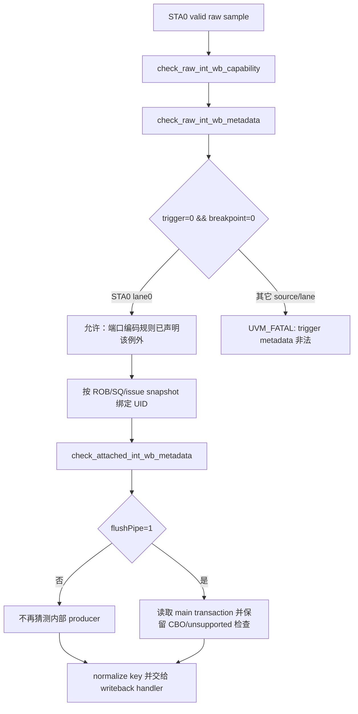

# V2 STA0 split-store trigger provenance 误判修正 Coding Plan（已废止）

| 项目 | 内容 |
| --- | --- |
| 状态 | 已废止，禁止执行。独立 Scala/生成 RTL/FSDB review 已证明其“删除 provenance fatal”的前提错误。 |
| 目标版本 | V2 |
| 触发场景 | Sv39、普通 cacheable store、非对齐且跨 16B 的 split-store writeback |
| 修改范围 | 无。本文件只保留历史错误假设和废止原因，不能据此修改 `dispatch_monitor_event_adapter.sv`。 |
| 不在范围 | RTL、顶层接口、raw event 结构、RM、PBMT/PMA/PMP、L2TLB、CBO `flushPipe` 消费语义 |
| 关联源码 | `mem_ut/ver/ut/memblock/seq/base_seq_help/dispatch_monitor_event_adapter.sv` |
| 证据波形 | `mem_ut/ver/ut/memblock/sim/pbmt0_non_nc_vaddr_fix/wave/tc=basicTest_ts=memblock_dispatch_real_mmu_sv39_pbmt0_non_nc_vseq_cfg=tc_dispatch_real_mmu_sv39_pbmt0_non_nc_100k_seed=666666_rtl.fsdb` |

> **停止执行说明**：独立复核确认最终 MAB writeback 使用 parent `req.uop.trigger`，而这个 parent 在
> StoreUnit MAB admission 时错误复制早期 `s1_in.uop.trigger=0`；普通无 trigger 场景的正确编码应为
> `TriggerAction.None=4'hf`。因此 `INT_WB_STA0_TRIGGER_PROVENANCE` 正在检出 V2 DUT metadata 缺陷，
> 不是应被放宽的测试框架误判。本 plan 的所有“删除/放宽 checker、重新运行以通过”内容均不得执行。
> 事实、最小 RTL 修复方向和波形路径见
> `AI_DOC/analysis/rtl/v2/flows/store_misalign_trigger_metadata_propagation.md`。

## 1. 专有名词与抽象功能说明

| 英文术语 | 当前含义 | 代码对象或状态落点 | 本 plan 中的例子 |
| --- | --- | --- | --- |
| STA0 | V2 `io_mem_to_ooo_writebackSta_0` 顶层 store-address writeback 端口。 | `MEMBLOCK_INT_WB_SOURCE_STA`、`port_id==0` | 同一端口可由普通 StoreUnit、`otherStoutConnect` 或 StoreMisalignBuffer 复用。 |
| raw event | monitor 从一个有效 DUT writeback 端口采样出的原始事件，不含软件推断来源。 | `dispatch_raw_int_wb_t` | `raw.trigger=0`、`raw.exception_vec[3]=0`。 |
| attached event | adapter 已根据 ROB/SQ/issue snapshot 找到 UID 的统一 writeback 事件。 | `memblock_wb_event_t` | 用于执行 `flushPipe` 对当前 main transaction 的 CBO 约束。 |
| trigger action | DUT uop 的 4-bit trigger 编码。 | `raw.trigger` | `4'hf` 是 None；`4'h0` 在 STA0 可以是非 breakpoint 的 split-store 子路径值。 |
| breakpoint exception | `exceptionVec[3]` 对应的 breakpoint 异常位。 | `raw.exception_vec[3]` | 正常 breakpoint 时可与 trigger action 一起出现。 |
| split-store | 非对齐、特别是跨 16B store 被 StoreMisalignBuffer 拆成子请求后再汇合输出的路径。 | `StoreMisalignBuffer.io_writeBack` | 低段子请求的 `trigger` 可被 RTL 固定为 `0`，但 `debug_isMMIO/debug_isNCIO` 仍为 0。 |
| provenance | 当前 top-level STA0 值实际来自哪个内部 mux producer。 | `inner__7`、`inner_`、StoreUnit valid | 顶层 raw payload 没有 producer-id 字段，adapter 不能可靠反推它。 |

抽象功能描述：`check_raw_int_wb_metadata()` 在 raw event 进入 UID 绑定前验证端口可见的 trigger
编码；`check_attached_int_wb_metadata()` 在 UID 已绑定后仅验证必须读取 main transaction 的
`flushPipe`/CBO 关系。二者都不判断 RTL 功能正确性，也不重建内部 mux provenance。

## 2. 问题、证据与目标 Flow

### 2.1 复现事实

PBMT0/non-NC 1k smoke 在 `727.8ns` 被如下测试框架 fatal 中止：

```text
UVM_FATAL [INT_WB_STA0_TRIGGER_PROVENANCE]
STA0 trigger=0 without breakpoint needs uncache/CBO provenance
```

该 fatal 不是 RM compare，也不是 PBMT/NC 配置漂移。相同 run 的 cfg 明确为 `mPBMTE=0`、S1/S2
PBMT 均为 `00`，且 `debug_isMMIO=0`、`debug_isNCIO=0`。

波形在 `720.3ns` 显示：

| 信号 | 值 | 解释 |
| --- | --- | --- |
| `io_mem_to_ooo_writebackSta_0_valid` | `1` | STA0 发生有效 writeback。 |
| `io_mem_to_ooo_writebackSta_0_bits_uop_trigger` | `0` | 进入现有 provenance fatal 的编码。 |
| `io_mem_to_ooo_writebackSta_0_bits_uop_exceptionVec_3` | `0` | 非 breakpoint。 |
| `io_mem_to_ooo_writebackSta_0_bits_debug_isMMIO` / `debug_isNCIO` | `0` / `0` | 普通 cacheable 路径。 |
| `inner__7` | `1` | top-level mux 选择 StoreMisalignBuffer。 |
| `_inner_storeMisalignBuffer_io_writeBack_valid` | `1` | split-store writeback 是实际 producer。 |
| `_inner_otherStoutConnect_io_out_valid` / `_inner_StoreUnit_0_io_stout_valid` | `0` / `0` | 其它两个 producer 未被选择。 |

RTL 输出关系为：

```text
writebackSta_0
  = StoreMisalignBuffer (inner__7)
  | otherStoutConnect (inner_)
  | StoreUnit_0

StoreMisalignBuffer lowAddrStore_uop_trigger
  = cross16BytesBoundary ? req_uop_trigger : 4'h0
```

因此一般的跨 16B split-store 可以合法产生 `STA0 trigger=0 && exceptionVec[3]=0`。顶层接口没有
producer-id，`debug_isMMIO/debug_isNCIO` 也不代表 producer。当前 adapter 把普通 split-store 误判为
“缺少 uncache/CBO provenance”。

### 2.2 目标 Flow



中文文字伪代码：monitor 仍按现有次序采集 STA0 raw event，adapter 先检查 source/lane capability 和
trigger 数值。只有 `STA0/lane0` 的 `trigger=0 && !breakpoint` 是既有允许编码；其它 source/lane
仍然 fatal。随后 adapter 使用既有快照绑定 UID。绑定后只有 `flushPipe` 需要读取对应 transaction
判断 CBO；普通 trigger 不再根据无 producer-id 的 top-level 观测反推内部 mux 来源。事件继续走原有
key normalization 和 writeback status handler，不创建队列、不改写状态表。

## 3. 修改对象与不变量

### 3.1 不新增字段或配置

本 plan 不修改 `dispatch_raw_int_wb_t`、`memblock_wb_event_t`、monitor interface、plusarg 或 cfg。
理由是内部 producer provenance 没有跨顶层端口导出；为消除一个不可靠的环境断言新增 sideband 字段会
扩大 DUT/testbench 接口范围，且当前 writeback 生命周期不需要该字段。

### 3.2 保持的检查

下列检查必须原样保留：

1. `check_raw_int_wb_capability()` 对 STA0 lane、ROB key 能力、`trigger_valid`、exception mask 的检查。
2. `check_raw_int_wb_metadata()` 对 `trigger=4'hf`、`trigger=4'h0`、未知/不支持 trigger 编码的检查。
3. `trigger=0 && exceptionVec[3]=0` 只对 STA0 lane0 保留的已有例外；其它 source/lane 仍 fatal。
4. `check_attached_int_wb_metadata()` 中 `flushPipe` 仅 CBO 且当前 CBO consumer 未实现的 fatal。
5. 现有 UID 绑定、STA late-fault snapshot、ROB/SQ key normalization、writeback handler 调用顺序。

## 4. 实现 Flow

### 4.1 收敛 `check_attached_int_wb_metadata()` 的职责

抽象功能描述：该函数只处理必须依赖已绑定 UID/main transaction 的 STA0 metadata。普通 trigger
数值已在 raw 阶段完成语义检查，函数不再从 `op_class` 或 debug 位推断 producer。

源码级伪代码：

```text
check_attached_int_wb_metadata(raw, wb_event):
  若 raw 不是 STA0，直接返回。
  若 raw.flush_pipe 为 0，直接返回。

  main_tr = data.get_main_transaction(wb_event.uid)。
  若 main_tr.op_class 不是 CBO，报告 STA0 flushPipe 非法。
  报告当前 CBO flushAfter 没有 adapter consumer。
```

中文文字伪代码：仅当 STA0 真正带 `flushPipe` 时才读取 main transaction，避免普通每个 STA0
writeback 都作一次无关 transaction 查询。`flushPipe` 的 CBO 限制与 producer provenance 无关，仍是
已定义的端口语义，必须保持。删除的分支只曾对 `trigger=0 && !breakpoint` 结合 CBO/MMIO/NCIO 做猜测；
它既无法识别 StoreMisalignBuffer，又和 raw 层已允许 STA0 lane0 该编码冲突，因此不再保留。

### 4.2 `convert_raw_int_wb()` 调用顺序不变

抽象功能描述：该函数仍是 raw STA0 从端口采样到统一 writeback event 的转换入口。本 plan 只改变
attached metadata 内部判断，不改变转换、绑定和 normalizing 的顺序。

源码级伪代码：

```text
convert_raw_int_wb(raw, wb_event):
  check_raw_int_wb_capability(raw)
  check_raw_int_wb_metadata(raw)
  为 STA0 绑定已有 fault/current/late-fault issue snapshot
  check_attached_int_wb_metadata(raw, wb_event)
  normalize_v2_int_wb_key(raw, wb_event)
```

中文文字伪代码：raw 检查仍先于 UID 绑定执行，因此 malformed trigger 不会进入状态表。STA0 event
仍按照 fault snapshot 优先、current issue 其次、late-fault tombstone 最后的既有路径绑定 UID。新的
attached check 只在需要 CBO `flushPipe` 语义时读取 transaction，最后按原顺序规范 ROB key；普通
split-store 不会改变 exception、UID、SQ key 或 terminal 状态。

## 5. 文档、验证与提交

### 5.1 文档同步

1. 新建本 plan，完成后移至 `AI_DOC/plan/test_framework/plan/do/`。
2. 新建 implementation review 到 `AI_DOC/plan/test_framework/review_doc/undo/`，记录波形的 mux 证据、
   修改前后的职责边界和未改 RTL 的原因。
3. 新建或同步 `AI_DOC/mem_ut_flow_doc/sta0_writeback_metadata_validation_flow.md`，说明 raw trigger
   校验与 attached CBO `flushPipe` 校验的职责边界及端到端 event 路径。

### 5.2 静态检查

```bash
git diff --check -- \
  mem_ut/ver/ut/memblock/seq/base_seq_help/dispatch_monitor_event_adapter.sv \
  AI_DOC/plan/test_framework \
  AI_DOC/mem_ut_flow_doc/sta0_writeback_metadata_validation_flow.md

rg -n 'INT_WB_STA0_TRIGGER_PROVENANCE|trigger=0 without breakpoint needs' \
  mem_ut/ver/ut/memblock/seq/base_seq_help/dispatch_monitor_event_adapter.sv
```

验收是旧 provenance fatal 不再存在；保留 `INT_WB_TRIGGER`、`INT_WB_STA0_FLUSH_PIPE` 和
`INT_WB_STA0_CBO_UNSUPPORTED`。

### 5.3 基础仿真

使用已编译的 PBMT0/non-NC binary 先运行 1k smoke，证明该修复消除既有阻断；随后重新编译并运行：

```bash
cd mem_ut/ver/ut/memblock/sim
make eda_compile tc=basicTest \
  ts=memblock_dispatch_real_mmu_sv39_pbmt0_non_nc_vseq \
  mode=pbmt0_non_nc_sta0_trigger_fix \
  cfg=tc_dispatch_real_mmu_sv39_pbmt0_non_nc_100k

make eda_run tc=basicTest \
  ts=memblock_dispatch_real_mmu_sv39_pbmt0_non_nc_vseq \
  mode=pbmt0_non_nc_sta0_trigger_fix \
  cfg=tc_dispatch_real_mmu_sv39_pbmt0_non_nc_100k \
  plus_arg='+MEMBLOCK_MAIN_TRANS_NUM=1000'
```

验收条件：无 `INT_WB_STA0_TRIGGER_PROVENANCE`；跨 16B store 可以继续完成；其它 raw trigger 或
`flushPipe` 非法条件仍保留原有 fatal。该 smoke 只验证 STA0 checker，不替代 PBMT0/non-NC 100k 或
strict-NC 100k 最终回归。

### 5.4 提交边界

本功能以独立 commit 提交，只包含 adapter、该 plan、对应 flow 和 implementation review。不得把
boundary 地址窗口修复、PBMT/RM 修改或 RTL 文件混入该 commit。

## 6. RM 协同支持

本 plan 不实现 RM/checker/scoreboard。STA0 事件仍按现有统一 writeback event 传递；RM 可继续读取
同一 UID、exception vector 和 terminal lifecycle，不新增观测字段。

## 7. 功能覆盖率协同支持

本 plan 不实现 coveragent/covergroup。后续 coverage 可交叉采样 STA0 的 `trigger=0`、
`exceptionVec[3]=0`、boundary profile 与内部 mux 观测，但本 plan 不增加 coverage 代码或 DUT sideband。

## 与初步 plan 差异说明

本 plan 没有独立初步 plan。当前正式方案直接基于 `727.8ns` 的实际波形和现有 raw/attached metadata
职责划分形成。

修改前逻辑：`check_raw_int_wb_metadata()` 已允许 STA0 lane0 的 `trigger=0 && !breakpoint`，但
`check_attached_int_wb_metadata()` 又要求 CBO 或 MMIO/NCIO provenance，造成同一编码在两个层级的
语义冲突。

修改后逻辑：raw 层是 trigger 编码的唯一判断点；attached 层只保留需要已绑定 transaction 的
`flushPipe`/CBO 检查。没有 producer-id 的 top-level 观测不再被用于生成 fatal。

差异影响：不会放宽其它端口的 trigger 编码，不会改变 driver、monitor raw queue、UID 映射、RM 或 RTL。
