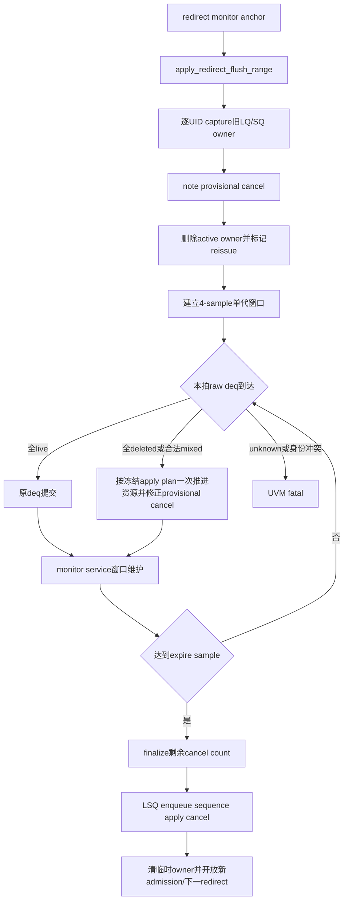

# MemBlock Redirect 删除 LSQ Owner 后迟到 Deq 修复正式执行计划（2026-09-17）

## 1. Plan 定位、专有名词与抽象功能说明

### 1.1 Plan 定位

| 项目 | 内容 |
|---|---|
| 类型 | V2 `mem_ut` 测试框架运行期状态与 redirect/deq 协同修复 |
| 目标 | 修复 redirect 删除 active LQ/SQ owner 后，RTL 已进入输出流水线的迟到 `lqDeq/sqDeq` 被误报为 stale owner 的问题 |
| 主复现场景 | `basicTest` / `memblock_dispatch_real_smoke_vseq` / `tc_dispatch_real_mmu_sv39_smoke` / seed `666666` / 10000笔 |
| 已知报错 | `stale DUT lqDeq count=8 key flag=0 value=6 has no active uid`，约 `24082.8ns` |
| RTL 基线 | V2 `build/rtl/MemBlock.sv`；顶层 `enqLsq` 无 ready，redirect 经一拍进入 `LsqWrapper`，LQ/SQ cancel和pointer恢复继续由RTL完成 |
| 非目标 | RTL/Scala修改、多代redirect owner、运行期plus、RM/checker逻辑、改变正常deq顺序、关闭stale检查、伪造DUT deq/cancel |

### 1.2 专有名词

| 英文术语 | 当前 plan 中的中文含义 | 代码落点 | 示例 |
|---|---|---|---|
| `active owner` | 当前动态实例对一个物理LQ/SQ key的唯一有效所有权 | `uid_by_lq`、`uid_by_sq`和`status.active_*_mapped` | `LQ 0/6 -> UID94 epoch3` |
| `redirect-deleted owner` | 本次redirect扫描删除active owner前保存的单代旧实例身份 | 本plan新增的`redirect_deleted_lq_owner_by_key`、`redirect_deleted_sq_owner_by_key` | redirect后仍保存旧`LQ 0/6 -> UID94 epoch3` |
| `dynamic epoch` | 同一UID在redirect/re-admission后的动态实例版本 | `status.dynamic_epoch` | UID94从epoch3变为epoch4 |
| `late deq` | redirect前已进入RTL deq流水线、redirect删除软件owner后才由monitor采到的`lqDeq/sqDeq` | `dispatch_raw_ctrl_t`、`apply_raw_ctrl_deq()` | redirect后收到`lqDeq=8,start=0/6` |
| `provisional cancel` | redirect扫描已统计但尚未finalize/apply的待定软件cancel数量 | `cancel_record_q[].software_cancel_*_count`、`pending_*_cancel_count` | 迟到deq命中后从待定cancel中减去8 |
| `reclassification` | 将一个redirect-deleted key从待定cancel改判为正常deq释放 | 本plan新增的deq提交helper | `cancel 8 -> deq 8`，总free增量不重复 |
| `hold window` | 从DUT可见redirect anchor起保留临时owner的固定4个DUT sample窗口 | `redirect_deleted_owner_expire_sample` | sample N建立，N+4完成finalize |
| `batch/domain` | 一个raw中连续的LQ侧或SQ侧deq key集合 | `preflight_dut_lq_deq()`、`preflight_dut_sq_deq*()` | LQ domain为`0/6..0/13` |
| `mixed provenance` | 同一连续domain内同时出现未被redirect删除的older live owner和被删除的younger owner | deq预检分类 | `LQ 0/4..0/5` live，`0/6..0/9` deleted；整批联合预检后一次提交 |
| `apply plan` | deq预检生成的只读提交计划，冻结每个key的owner来源和待修正cancel数量 | `lsq_commit_handler`局部queue/结构 | LQ/SQ全部预检成功后才修改pointer/map/count |

### 1.3 关键函数抽象职责

| 函数/helper | 抽象功能描述 |
|---|---|
| `capture_redirect_deleted_owner()` | redirect扫描删除UID active map前，保存该UID当前LQ/SQ key、旧dynamic epoch和redirect身份；不修改pointer/free count。 |
| `start_redirect_deleted_owner_window()` | 当前redirect扫描完成后，以redirect anchor sample建立唯一4-sample临时owner窗口；不启动下一redirect。 |
| `service_redirect_deleted_owner_window()` | 主monitor service已处理本拍raw deq后，检查窗口到期并finalize剩余待定cancel；等待LSQ sequence应用cancel后再清临时owner。 |
| `lookup_redirect_deleted_lq_owner()` / `lookup_redirect_deleted_sq_owner()` | active owner查找失败时，按物理key返回当前单代redirect删除的旧实例身份；不改变状态。 |
| `preflight_redirect_deleted_deq()` / `commit_redirect_deleted_deq()` | 前者只验证apply plan中的deleted key和cancel delta，后者在所有LQ/SQ预检完成后从未finalize cancel record扣除数量并删除已消费临时owner。 |
| `preflight_dut_lq_deq()` / `preflight_dut_sq_deq*()` | 对连续domain逐key冻结live/deleted来源和UID，允许合法mixed但拒绝unknown、错误record和重复key。 |
| `apply_raw_ctrl_deq()` | 先联合预检LQ/SQ和全部cancel delta，再按apply plan一次推进各domain资源；live key释放active map，deleted key提交reclassification。 |
| `lsq_allocating_admission_blocked()` | 仅阻止需要LQ/SQ物理资源的新candidate launch；已有pending sample保持原采样/flush-epoch闭环，control/non-LSQ admission不因窗口额外阻塞。 |
| `request_redirect_flush()` / `process_pending_events()` / `request_fault_head_redirect()` | 公共API拒绝覆盖单代窗口；两个普通入口在窗口active时保留下一redirect请求，不pop/不覆盖。 |

## 2. 目标功能 Flow 总览



主流程文字伪代码：

```text
1. 当前redirect完成drive并绑定monitor anchor后，现有recovery handler进入active UID扫描。
2. 每个被覆盖UID在active LQ/SQ map删除前，capture_redirect_deleted_owner保存其物理key、UID、旧dynamic epoch和当前redirect record身份。
3. note_lsq_cancel_for_uid继续把仍映射的entry加入当前cancel record，但该计数保持provisional，不立即finalize或应用。
4. retire_active_uid删除active ROB/LQ/SQ map；clear_uid_dispatch_result和dynamic_epoch推进保持现有reissue语义。
5. redirect扫描完成后启动固定4个DUT sample的单代窗口；active redirect可以结束，但LSQ admission和下一redirect继续等待。
6. monitor每拍先转换并处理raw ctrl：
   - 每个key命中active owner时冻结live UID；
   - active owner不存在但命中本窗口临时owner时冻结deleted身份；
   - 同一连续domain允许older live与younger deleted共存，unknown、重复key或错误record继续fatal。
7. handler先为LQ/SQ两侧构造完整apply plan并验证所有live map、deleted record、资源容量和cancel delta；全部成功后，各domain只调用一次资源release。live key删除active mapping并尝试retire；deleted key从尚未finalize的cancel record和pending aggregate扣除对应数量。旧UID已经失效，不再次修改其status或新dynamic epoch。
8. 本拍deq raw处理完成后，service_redirect_deleted_owner_window检查当前sample：未到期则保持；到期则finalize剩余cancel count。
9. LSQ enqueue sequence复用apply_pending_lsq_cancels应用剩余cancel，回退enqueue pointer并完成software_applied。
10. 窗口service观察到record已software_applied后清空单代临时owner，解除LSQ admission和下一redirect gate；新动态实例从恢复后的连续LQ/SQ key重新入队并在后续拍发射。
```

## 3. 状态和数据结构

### 3.1 `memblock_redirect_deleted_owner_t`

抽象功能描述：该结构只保存一个被当前redirect删除的旧动态实例资源身份，供短期deq归属恢复；它不承担active owner或资源计数职责。

定义于`memblock_dispatch_types.sv`：

```systemverilog
typedef struct {
    bit           valid;
    memblock_uid_t uid;
    int unsigned  old_dynamic_epoch;
    int unsigned  redirect_epoch;
    int unsigned  cancel_record_id;
} memblock_redirect_deleted_owner_t;

typedef enum bit {
    MEMBLOCK_DEQ_OWNER_LIVE,
    MEMBLOCK_DEQ_OWNER_REDIRECT_DELETED
} memblock_deq_owner_kind_e;

typedef struct {
    memblock_lq_key_t         key;
    memblock_deq_owner_kind_e owner_kind;
    memblock_uid_t            uid;
    int unsigned              old_dynamic_epoch;
    int unsigned              redirect_epoch;
    int unsigned              cancel_record_id;
} memblock_lq_deq_apply_item_t;

typedef struct {
    memblock_sq_key_t         key;
    memblock_deq_owner_kind_e owner_kind;
    memblock_uid_t            uid;
    int unsigned              old_dynamic_epoch;
    int unsigned              redirect_epoch;
    int unsigned              cancel_record_id;
} memblock_sq_deq_apply_item_t;
```

`common_data_transaction`新增：

```systemverilog
localparam int unsigned MEMBLOCK_REDIRECT_DELETED_OWNER_HOLD_SAMPLES = 4;
memblock_redirect_deleted_owner_t redirect_deleted_lq_owner_by_key[memblock_lq_map_key_t];
memblock_redirect_deleted_owner_t redirect_deleted_sq_owner_by_key[memblock_sq_map_key_t];
bit              redirect_deleted_owner_window_active;
int unsigned     redirect_deleted_owner_epoch;
int unsigned     redirect_deleted_owner_record_id;
longint unsigned redirect_deleted_owner_expire_sample;
```

约束：

- 只允许一代窗口；新redirect不能覆盖未清理状态。
- `cleanup_completed_cancel_records()`不得pop当前窗口绑定的record；窗口清理后由service再次调用cleanup释放它。
- 所有字段在constructor和`reset_all_tables()`清零；当前框架没有独立的`common_data_transaction` runtime reset helper，不虚构该入口。
- end check必须要求窗口、两张map和关联未完成cancel状态均为空。
- 不新增plus/cfg；4是V2 standalone固定保护常量。
- `redirect_deleted_owner_expire_sample = cancel_record.redirect_sample_seq + 4`，从monitor anchor计算，不从redirect扫描或service调用时间计算。
- cancel finalize只读取/写入关联record的`software_count_finalized`，不维护第二个同义状态。

## 4. 主流程实现 Flow

### 4.1 Redirect扫描和owner转移

修改位置：`common_data_transaction.sv::prepare_uid_for_redirect_reissue()`、`apply_redirect_flush_range()`。

抽象功能描述：redirect扫描在删除每个旧动态实例前保存LSQ身份，并在完整active窗口扫描后建立唯一保护窗口；它不在扫描阶段提前应用资源cancel。

源码级伪代码：

```systemverilog
function void prepare_uid_for_redirect_reissue(uid, redirect);
    capture_redirect_deleted_owner(uid, current_redirect_epoch);
    note_lsq_cancel_for_uid(uid, current_redirect_epoch);
    retire_active_uid(uid);
    clear_uid_dispatch_result(uid);
    status.redirect_pending = 1;
    status.flushed = 1;
    status.dynamic_epoch++;
endfunction

function void apply_redirect_flush_range(redirect);
    scan covered active uid and call prepare_uid_for_redirect_reissue();
    mark active_scan_done;
    if redirect-deleted maps are empty:
        software_count_finalized = 1;
    else:
        start_redirect_deleted_owner_window(record);
        keep software_count_finalized = 0;
    clear active cancel record ownership after scan;
endfunction
```

中文详细伪代码：

```text
prepare_uid_for_redirect_reissue先调用capture helper：该helper读取当前status的active_lq_mapped/active_sq_mapped和完整key，并将旧UID/epoch绑定到当前cancel record；成功后才允许note cancel与retire。
note_lsq_cancel_for_uid继续承担待定资源数量聚合，确保没有迟到deq时行为与当前实现一致。
retire_active_uid仍删除active owner，后续deq只能通过临时owner恢复旧身份。
apply_redirect_flush_range扫描结束时不再无条件finalize：没有LSQ owner的redirect保持旧路径；存在临时owner时建立4-sample窗口，让迟到deq有机会修正待定cancel数量。
```

### 4.2 Deq逐key分类、联合预检和原子提交

修改位置：`lsq_commit_handler.sv`。

抽象功能描述：deq handler对每个非空LQ/SQ domain逐key冻结owner来源，允许合法live/deleted混合；LQ、SQ和cancel delta全部预检成功后才一次提交，任何失败都不留下部分pointer/map/count修改。

源码级伪代码：

```systemverilog
function bit preflight_dut_lq_deq(count, deq_ptr, ptr_is_next,
    output memblock_lq_deq_apply_item_t items[$]);
function bit preflight_dut_sq_deq_from_start(count, start_ptr, ptr_is_next,
    output memblock_sq_deq_apply_item_t items[$]);
function bit preflight_dut_sq_deq(count, deq_ptr, ptr_is_next,
    output memblock_sq_deq_apply_item_t items[$]);
function bit preflight_dut_sq_deq_count_only(count,
    output memblock_sq_deq_apply_item_t items[$]);

function bit preflight_redirect_deleted_deq(
    input memblock_lq_deq_apply_item_t lq_items[$],
    input memblock_sq_deq_apply_item_t sq_items[$],
    output int unsigned deleted_lq_count,
    output int unsigned deleted_sq_count);

function void commit_redirect_deleted_deq(
    input memblock_lq_deq_apply_item_t lq_items[$],
    input memblock_sq_deq_apply_item_t sq_items[$],
    input int unsigned deleted_lq_count,
    input int unsigned deleted_sq_count);

for each physical key in each domain:
    active_hit = lookup active owner;
    deleted_hit = lookup redirect-deleted owner;
    if active_hit && deleted_hit:
        fatal;
    else if active_hit:
        append {key, LIVE, uid} to apply plan;
    else if deleted_hit:
        require owner belongs to current window/record;
        append {key, REDIRECT_DELETED, old uid/epoch} to apply plan;
    else:
        fatal;

preflight both LQ/SQ resource counts and every deleted cancel delta;
if any preflight fails: return/fatal without mutation;

release each non-empty LQ/SQ domain exactly once by its total count;
for each LIVE item: release active mapping and try retire;
for each REDIRECT_DELETED item: commit cancel->deq delta and delete tombstone;

commit_dut_lq_deq(count, lq_items):
    release_lq(count) once;
    release mapping and try retire only LIVE items;
commit_dut_sq_deq(count, sq_items):
    release_sq(count) once;
    release mapping and try retire only LIVE items;

apply_dut_lq_deq(single domain):
    build lq_items and an empty sq_items queue;
    preflight resource and deleted delta;
    commit lq domain and deleted delta;
apply_dut_sq_deq / apply_dut_sq_deq_count_only:
    build sq_items and an empty lq_items queue;
    preflight resource and deleted delta;
    commit sq domain and deleted delta;
```

中文详细伪代码：

```text
LQ继续用DUT next pointer倒推start key，SQ V2继续以当前软件sq_deq_ptr展开count-only连续key。
每个key独立查询active map和单代临时map：两者同时命中、两者都不命中、命中错误record或同一key重复出现都属于身份冲突。
合法mixed允许一个连续batch跨越redirect边界，例如older live前缀后接younger deleted后缀；apply plan冻结各项来源后不再依赖可变map重新查询。
先预检LQ/SQ总release不会超过已分配资源，再预检每个live UID仍active/mapped且key一致，以及deleted总数不超过record和pending provisional cancel。两侧全部成功前不调用任何写状态helper。
提交阶段每个非空domain仅按总count调用一次release_lq/release_sq，保证物理deq pointer连续推进；随后live项释放active mapping并尝试retire，deleted项扣除cancel delta并删除临时owner。
`commit_dut_lq_deq()`和`commit_dut_sq_deq()`改为接收强类型apply-item queue；它们对总count只做一次资源release，并只对LIVE item调用mapping release/retire。deleted item的公共cancel delta由联合commit helper处理。
现有software-only调用的`apply_dut_lq_deq()`、`apply_dut_sq_deq()`和`apply_dut_sq_deq_count_only()`保留入口签名；内部为未使用domain创建空apply queue，执行相同deleted只读预检后再调用单domain commit，确保旧测试不绕过新语义。
因为所有可能fatal的身份、计数和容量检查都已在preflight完成，提交阶段不得新增可恢复失败分支；内部不变量破坏仍可fatal，但不作为正常控制流。
```

### 4.3 4-sample窗口维护和cancel finalize

修改位置：`common_data_transaction.sv`、`memblock_main_dispatch_auto_build_main_table_base_sequence.sv::service_monitor_once()`。

抽象功能描述：窗口service只在本拍deq raw已经drain后推进临时owner生命周期，窗口到期时finalize剩余cancel，并在资源cancel已经应用后清除单代状态。

源码级伪代码：

```systemverilog
collect_monitor_event_batch(); // includes deferred raw deq apply
data.service_redirect_deleted_owner_window(current_sample);
exception_redirect_replay_task();

function void service_redirect_deleted_owner_window(current_sample);
    if !active: return;
    if !cancel_record.software_count_finalized && current_sample >= expire_sample:
        require deferred_raw_ctrl_q empty;
        cancel_record.software_count_finalized = 1;
    if cancel_record.software_count_finalized && cancel_record.software_applied:
        delete remaining cancel-only owners;
        clear maps/window state;
        cleanup completed cancel records;
endfunction
```

中文详细伪代码：

```text
主service保持“先处理raw deq、后处理窗口、再仲裁下一redirect”的顺序，确保expire sample上的最后一笔旧deq仍能命中临时owner。
到期时若持久deferred raw ctrl仍非空，不finalize，继续等待下一service tick，避免未处理旧deq越过清理点。
finalize后LSQ enqueue sequence原有apply_pending_lsq_cancels成为唯一cancel资源写者；它只应用迟到deq扣除后的剩余数量。
cleanup_completed_cancel_records在窗口active且record_id匹配时禁止pop该record，消除main reconcile和LSQ sequence并发清理竞态。
record software_applied后，剩余临时owner代表已走cancel而不是等待deq，可统一删除；随后先清窗口，再调用cleanup弹出已完成record，新LSQ admission和下一redirect恢复。
```

### 4.4 Admission与下一redirect gate

修改位置：`common_data_transaction.sv::request_redirect_flush()`、`memblock_lsqenq_dispatch_base_sequence.sv`的LSQ candidate launch gate、`exception_redirect_replay_handler.sv::process_pending_events()`、`lsq_commit_handler.sv::request_fault_head_redirect()`。

抽象功能描述：gate只阻止窗口内的新LSQ admission和第二次redirect覆盖单代状态；monitor采集、deq drain、cancel对账和其它后台响应继续运行。

源码级伪代码：

```systemverilog
admission_blocked_by_flush = issue_blocked_by_global_flush();
lsq_allocating_admission_blocked =
    admission_blocked_by_flush() || redirect_deleted_owner_window_active;

request_redirect_flush:
    if redirect-deleted window active: fatal because caller failed to defer;
    otherwise create the redirect/cancel record normally;

process_pending_events:
    advance active redirect;
    if active redirect: return;
    if redirect-deleted window active: return without popping exception_event_q;
    process next redirect/replay/fault normally;

request_fault_head_redirect:
    if redirect-deleted window active: return 0 and keep fault_head_waiting;
```

中文详细伪代码：

```text
原`admission_blocked_by_flush()`保持只表达全局redirect/flush，因此control和need_alloc=0的non-LSQ head仍可按有序前缀正常admission。
需要LQ/SQ资源的candidate selection改用`lsq_allocating_admission_blocked()`；窗口active时当前head若需要LSQ则停在该UID，不跨过它发送后续non-LSQ，从而保持有序admission前缀。
`complete_v2_pending_sample()`保持原逻辑，不增加window gate：它继续先把已经launch的reservation标记为DUT-visible，再按原global flush和flush epoch决定完成或丢弃。redirect扫描的`note_lsq_cancel_for_uid()`本来就要求mapped reservation已经DUT-visible，因此窗口只能在旧pending sample结算后建立；candidate gate保证窗口期间不会产生新pending sample。
LSQ admission在4-sample窗口和剩余cancel尚未应用时等待，避免软件enqueue pointer尚未完成“deq推进+剩余cancel回退”就分配新key；窗口清理后沿用现有连续pointer分配。
recovery handler检测窗口active时不从exception_event_q出队，因此第二次monitor redirect、replay和fault事件不会丢失。
fault-head redirect入口返回未启动，保留现有fault_head_waiting token；窗口清理后原service自然重试。
request_redirect_flush作为所有调用者共享的最终防线，在窗口active时拒绝分配第二cancel record，防止soft-test/direct caller绕过两个普通gate覆盖单代状态。
这些gate不停止ctrl monitor、raw deq、DCache/L2TLB/SBuffer responder，也不修改RTL。
```

## 5. 关键 Helper 细节

### 5.1 `capture_redirect_deleted_owner()`

抽象功能描述：在active map删除前保存一个UID的当前LQ/SQ旧实例身份，建立deq fallback所需的唯一来源。

详细文字伪代码：

```text
读取status和当前active cancel record；验证record已anchor、扫描开放且未finalize。
若status.active_lq_mapped，将完整LQ key转成map key；要求临时LQ map不存在重复key，再写UID、old_dynamic_epoch、redirect_epoch和record_id。
若status.active_sq_mapped，对SQ执行相同操作。
不修改active map、status、cancel count、pointer或free count；这些动作仍由后续既有helper负责。
```

### 5.2 `preflight_redirect_deleted_deq()`与`commit_redirect_deleted_deq()`

抽象功能描述：preflight helper只验证apply plan中deleted key和待修正cancel数量，commit helper只在联合预检完成后落实相同delta；二者拆分保证LQ/SQ批次不会部分提交。

详细文字伪代码：

```text
preflight读取窗口和关联record，验证输入每个deleted key均命中同一redirect epoch/record，且record尚未finalize/software_applied；按domain累计deleted数量，并检查software_cancel_count和pending_cancel_count均足够。它不修改map、record或pointer。
apply_raw_ctrl_deq只有在LQ/SQ/live/deleted所有预检成功后才进入提交阶段。
commit按preflight冻结的domain数量，从record对应software count以及公共pending aggregate同时减去数量，再逐key删除已消费临时owner。
commit调用现有aggregate一致性检查确认queue记录与pending count一致；该阶段不得重新选择key或改变分类。
```

### 5.3 `service_redirect_deleted_owner_window()`

抽象功能描述：在唯一main monitor service中维护单代窗口到期、cancel finalize和最终清理，不参与DUT事件正确性判断。

详细文字伪代码：

```text
窗口无效则返回。
校验当前sample单调且关联cancel record存在。
未到expire sample时返回。
到期但deferred raw ctrl非空时保持窗口，等待raw队首先完成owner分类。
record未finalize时，将当前迟到deq修正后的剩余cancel count设为最终值，并置software_count_finalized。
record尚未software_applied时返回，让LSQ enqueue sequence成为唯一cancel资源写者。
record已应用后，删除剩余LQ/SQ临时owner；这些entry已经由剩余cancel完成资源回退。
清窗口字段，使LSQ admission和下一redirect在后续service中恢复。
```

### 5.4 `cleanup_completed_cancel_records()`

抽象功能描述：cancel reconcile仍按FIFO清理已完成record，但当前单代窗口绑定的record由窗口service持有，必须延迟到临时owner生命周期结束后才能pop。

详细文字伪代码：

```text
检查FIFO头是否valid、software_applied且observed_valid；任一条件不满足时停止。
如果redirect-deleted窗口active且FIFO头record_id等于窗口record_id，停止清理并保留record供deq fallback和窗口service查询。
否则pop该完成record并继续检查下一项。
窗口service在删除剩余cancel-only owner并清active标志后重新调用本helper，此时原record不再被pin，可正常pop。
```

### 5.5 `request_redirect_flush()`

抽象功能描述：该公共API是任何redirect分配cancel record前的最终一致性边界；它拒绝在单代临时owner仍有效时创建第二代redirect。

详细文字伪代码：

```text
先验证redirect payload有效。
若redirect-deleted窗口active，报告明确fatal，说明调用者没有把第二redirect保留在fault token或exception_event_q；不修改现有窗口、active redirect或cancel queue。
窗口无效时继续执行原有active redirect、queue深度、epoch、cancel record和freeze状态初始化。
普通recovery入口在调用API前主动defer，因此该fatal只捕获direct/soft-test caller违反单代协议的情况。
```

### 5.6 `lsq_allocating_admission_blocked()`

抽象功能描述：该helper只保护会分配LQ/SQ key的新candidate launch，不改变已有pending sample、control或non-LSQ admission的原有语义。

详细文字伪代码：

```text
先调用既有admission_blocked_by_flush读取active redirect、flush和issue freeze；若为真则返回阻塞。
若单代临时owner窗口active，返回阻塞；否则允许LSQ allocating candidate。
collect_lsq_candidates在读取到当前顺序head需要LSQ时调用本helper；阻塞时返回无candidate并发送idle边界，不扫描越过该UID。
complete_v2_pending_sample、admit_control_marker_if_ready和admit_non_lsq_if_ready继续只使用原全局flush/epoch语义，不读取本helper。
```

### 5.7 `start_redirect_deleted_owner_window()`

抽象功能描述：该helper在redirect active UID扫描完成后，把已经捕获的临时owner绑定到当前唯一cancel record并建立固定到期sample；它不应用cancel或清active redirect。

详细文字伪代码：

```text
要求当前窗口无效，且至少一张redirect-deleted map非空；否则重复窗口或空窗口均fatal。
通过active cancel record id取得record，验证record已绑定monitor anchor、active scan已经完成、尚未finalize/software_applied。
写入window active、redirect epoch和record id。
将expire sample精确写为record.redirect_sample_seq加固定4，不读取当前service sample作为起点。
不修改record cancel count、active map、pointer/free count或redirect public状态；后续service负责到期推进。
```

### 5.8 `lookup_redirect_deleted_lq_owner()`与`lookup_redirect_deleted_sq_owner()`

抽象功能描述：两个domain-specific只读helper在active owner miss后按完整物理key返回单代旧实例身份，供deq apply plan冻结provenance。

详细文字伪代码：

```text
将输入LQ或SQ完整flag/value转换为对应map key。
窗口无效、map key不存在或record/epoch不等于当前窗口时返回未命中，不修改状态。
命中时复制owner结构到output，验证valid为1并返回命中。
调用者把结果写入对应LQ/SQ apply item；lookup本身不删除临时owner、不扣cancel、不推进pointer。
```

## 6. Reset、结束检查和性能边界

- constructor和`reset_all_tables()`统一删除两张临时map并清窗口字段。
- `runtime_drain_complete()`和`end_test_check()`纳入窗口active、临时map非空和关联未完成record检查。
- 捕获redirect owner沿用现有active UID窗口扫描，不新增第二次全表扫描。
- deq fallback按物理count遍历，LQ最多`CommitWidth=8`，SQ最多物理deq宽度；不扫描主表。
- 临时map按物理keyO(1)查询；不新增每拍全表逻辑。
- 不新增参数、agent接口、transaction字段、RTL接口或filelist。

## 7. 修改文件范围

| 文件 | 计划修改 |
|---|---|
| `seq/base_seq_help/memblock_dispatch_types.sv` | 新增redirect-deleted owner结构和deq分类enum。 |
| `seq/base_seq_help/common_data_transaction.sv` | 新增单代map/window、capture/lookup/preflight/commit/service/reset/end-check逻辑；redirect扫描延迟cancel finalize。 |
| `seq/base_seq_help/lsq_commit_handler.sv` | LQ/SQ deq整侧owner分类、redirect-deleted资源提交；fault redirect gate。 |
| `seq/base_seq/memblock_lsqenq_dispatch_base_sequence.sv` | 窗口期间阻止新LSQ admission，继续复用既有cancel apply。 |
| `seq/base_seq_help/exception_redirect_replay_handler.sv` | 单代窗口期间保留下一批recovery事件，不启动第二redirect。 |
| `seq/base_seq/memblock_main_dispatch_auto_build_main_table_base_sequence.sv` | raw deq之后、下一redirect之前调用窗口service。 |
| `seq/base_seq/soft_test/soft_test_redirect_deleted_lsq_owner_sequence.sv`及`tc/src/soft_test`接入 | 新增software-only定向测试，覆盖全deleted、mixed、SQ、双domain、第二redirect和record清理竞态。 |
| `seq/seq_pkg.sv`、`seq/seq.f`、`tc/tc_pkg.sv`、`tc/tc.f` | 接入定向sequence/testcase；不新增cfg或plus。 |
| `AI_DOC/mem_ut_flow_doc/virtual_sequence_unified_dispatch_flow.md` | 同步redirect删除owner、迟到deq重分类和4-sample窗口。 |
| `AI_DOC/analysis/source_sv/dispatch_framework_sv/common_data_transaction.md`及相关函数分析 | 同步新增字段/helper和调用关系。 |
| implementation review | 按执行规则新建对应review文档。 |

若coding发现无需修改某个预列文档，implementation review中说明未修改原因；不得扩展到RTL/RM。

## 8. 验证计划与验收标准

### 8.1 静态和编译

```text
git diff --check覆盖本轮文件；
rg确认新增字段均有初始化、reset、写入、读取和清理；
VCS使用当前V2 build/rtl完整重新编译，0 error。
```

### 8.2 主失败场景

```text
tc=basicTest
ts=memblock_dispatch_real_smoke_vseq
cfg=tc_dispatch_real_mmu_sv39_smoke
seed=666666
+MEMBLOCK_MAIN_TRANS_NUM=10000
```

最低验收：

- 原`24082.8ns`附近不再出现`stale DUT lqDeq count=8 key=0/6`。
- 对应8项全部命中同一redirect-deleted LQ domain并完成`cancel -> deq`重分类。
- `software_cancel_lq_count`与DUT `lqCancelCnt`仍精确匹配。
- 软件LQ enqueue/dequeue pointer和free count无underflow、重复释放或preview drift。
- 仿真继续推进；若出现新错误，按新首错分类，不把“越过原报错点”写成整用例通过。

### 8.3 Software-only定向边界

新增`soft_test_tc_redirect_deleted_lsq_owner`，使用公共helper构造有限状态并逐项断言：

1. LQ全deleted：8个连续key全部从provisional cancel转为deq，pointer只推进一次，cancel归零。
2. LQ mixed与交错来源：至少覆盖older live前缀加younger deleted后缀，并额外验证逐key apply plan不依赖“只允许一个切换点”；整批联合预检和提交，live map释放、deleted cancel扣除。
3. SQ count-only：从冻结软件SQ head展开连续key并完成同型重分类。
4. 双domain raw：LQ/SQ一侧live、一侧mixed，任一预检失败时两侧状态完全不变，成功时两侧一次提交。
5. unknown/错误record：精确触发预期fatal或helper失败，且pointer/count/map不变。
6. 第二redirect：窗口active时普通recovery事件保持queue/fault token，公共API direct调用被防御性fatal拒绝。
7. record竞态：`software_applied && observed_valid`时关联record仍被窗口pin；窗口清理后才pop。
8. expire sample：同sample先消费最后一笔deq再finalize；deferred raw非空时不清理。
9. admission gate：窗口期间当前head为control/non-LSQ时仍可admission；当前head需要LSQ时停在该UID且不跨越；N+4只保证最早finalize，若`software_applied`下一service才到达，则窗口和LSQ admission相应延长。

### 8.4 其它已知RTL bug不被掩盖

1. Trigger metadata：

```text
tc=basicTest
ts=memblock_dispatch_real_mmu_sv39_pbmt0_non_nc_vseq
cfg=tc_dispatch_real_mmu_sv39_pbmt0_non_nc_100k
seed=666666
+MEMBLOCK_MAIN_TRANS_NUM=100000
+MEMBLOCK_CHECK_TRIGGER_EN=1
```

仍应复现`INT_WB_STA0_TRIGGER_PROVENANCE`；本plan不得改变trigger checker或RTL输出。

2. SBuffer/LDA2 X传播：

```text
同一PBMT=00/non-NC vseq/cfg
seed=710006
+MEMBLOCK_MAIN_TRANS_NUM=10000
+MEMBLOCK_CHECK_TRIGGER_EN=0
+MEMBLOCK_HARD_XZ_CHECK_EN=1
```

仍应复现`LDA2 valid is X/Z`；本plan不得关闭硬检查。

3. DCache E次生X诊断：

```text
seed=710006
+MEMBLOCK_MAIN_TRANS_NUM=10000
+MEMBLOCK_CHECK_TRIGGER_EN=0
+MEMBLOCK_HARD_XZ_CHECK_EN=0
```

诊断run仍应在原传播链存在时观察到`E.valid`/`sink`异常；关闭硬检查只用于确认下游表现，不算通过。

### 8.5 基础回归

- `tc=basicTest, ts=virtual_base_sequence, cfg=default, seed=666666`：0 error/fatal并PASS。
- 编译和所有run使用独立新mode，保留日志与FSDB。

## 9. 风险和明确边界

- 初版只支持单代窗口；下一redirect在窗口清理前保留在现有fault token或`exception_event_q`，不会覆盖状态。
- 每个连续domain允许合法live/deleted mixed；unknown、错误record、active与deleted双命中或重复key继续fatal。
- 4 samples是当前V2生成Verilog固定恢复/迟到deq保护边界，不开放runtime配置。
- N+4是最早cancel finalize点，不承诺窗口或LSQ admission恰好在N+4解除；实际清理还要等待deferred raw排空和关联record `software_applied`。
- 如果deferred raw ctrl在4拍到期仍未排空，窗口延长到其排空和cancel apply完成，不提前删除owner。
- 本plan修复测试框架owner生命周期，不改变原有三项RTL bug的责任和预期复现结果。

## 执行中补充/修正（IMPLEMENTATION_DELTA）

### Fault store在LSQ deq前启动redirect

[IMPLEMENTATION_DELTA]

来源：主失败场景首次实现后，`seed=666666`不再触发原`stale DUT lqDeq`，但在
`terminal_done_uid=11`停止推进；旧日志中UID11依赖后续`SQ deq`进入异常终态，
四拍窗口改变发送节奏后该`SQ deq`不再出现，形成“等待deq才发redirect、等待redirect
才回收SQ”的闭环等待。

原plan：fault token只有在`terminal_done && lsq_deq`后才请求redirect；redirect扫描只处理
普通待reissue UID。

实现调整：real-dispatch fault完成ROB异常提交后即可请求redirect。fault token保持到资源释放完成；
扫描命中redirect自身ROB且该UID仍为active committed fault时，保留其active LQ/SQ owner，不计入
cancel、不增加`dynamic_epoch`、不设置`redirect_pending`、不重新入队。RTL随后通过正常deq释放
该committed fault entry，框架沿live owner路径完成异常终态。redirect只对年轻UID执行cancel/reissue，
rollback起点仍由第一个年轻UID决定。若deq与active redirect重叠，deq handler先释放mapping但按
公共规则暂不retire；fault token在redirect解除后的下一次同步补做`try_retire_committed_uid()`，再
推进commit cursor，避免终态缺少后续事件而卡住。

原因：异常提交是RM对比时机，LSQ资源回收属于随后redirect职责。fault UID不能因为等待本应由
redirect触发的资源回收而阻塞redirect自身。

影响范围：

- `common_data_transaction.sv`新增fault head保留helper，并在redirect active扫描中识别精确ROB head
  fault，使其不进入年轻项cancel。
- `lsq_commit_handler.sv::sync_modeled_head_after_fault_terminal()`允许LSQ mapping尚在时请求redirect，
  并等待扫描完成后再推进commit cursor。
- software-only fault路径不变，仍按原有deq终态逻辑完成。
- 不修改RTL、RM、接口、参数或正常非fault commit语义。

### Active redirect覆盖的STD value-only迟到raw前置丢弃

[IMPLEMENTATION_DELTA]

来源：fault redirect前移后，主场景继续推进到`24422.8ns`，但一个已经被active redirect覆盖的
年轻STD raw在完整事件构造前触发`INT_WB_STD_KEY`。V2 STD端口只有ROB value，没有flag；原逻辑
必须先用`std_dispatched`恢复完整owner，随后batch handler才能执行redirect-first丢弃。同拍
redirect abort使该年轻UID没有完成`std_dispatched`标记，导致丢弃动作之前先误报零候选。

原plan：所有int writeback先完成完整key normalization，再由batch handler丢弃redirect覆盖事件。

实现调整：只对STD value-only raw增加前置只读探测。active redirect有效时，分别检查同一ROB value
的两个flag对应active owner；至少存在一个active owner且所有存在的owner都被当前redirect覆盖时，
直接丢弃该raw。只要存在未覆盖owner，继续执行原`resolve_std_uid_by_rob_value_only()`严格解析和
零候选/双候选检查。

原因：STD缺少flag，无法像LDA/STA一样先构造完整ROB key再进入统一batch过滤；覆盖判断必须位于
STD owner严格解析之前，但判断条件必须保守，不能把未覆盖实例当作迟到事件吞掉。

影响范围：仅修改`dispatch_monitor_event_adapter.sv`的STD raw转换路径；不改变STA/LDA、正常STD、
batch仲裁、writeback状态机、RM或RTL。

## 与初步 plan 差异说明

修改目的：

```text
把“保存单代owner并在4拍后删除”的初步方案补成资源记账闭环，避免只吞掉stale fatal后产生cancel count和pointer错误。
```

修改前逻辑行为：

```text
redirect扫描立即把所有仍映射LQ/SQ entry计入software cancel并finalize；
retire_active_uid删除owner；
LSQ sequence应用全部cancel并回退enqueue pointer；
后到deq找不到active owner直接fatal。
```

修改后逻辑行为：

```text
redirect扫描保存单代旧owner并先形成provisional cancel；
4-sample窗口内迟到deq按逐key apply plan分类，合法live/deleted mixed从provisional cancel扣除deleted部分并按domain总count推进正常deq资源；
窗口结束只finalize剩余cancel，LSQ sequence沿用原helper应用；
资源cancel完成后清临时owner，开放新admission和下一redirect。
```

差异影响：

- 不增加多代owner、RTL接口或运行期参数。
- 相比初步“命中后直接丢弃”，新增`cancel -> deq`重分类，保证DUT cancel count、软件pointer和free count一致。
- 新LSQ admission只等待RTL真实恢复和单代资源结算，不修改正常无redirect路径。
- 其它RTL bug checker和激励保持不变。

### 修改函数差异：`apply_redirect_flush_range()`

抽象功能描述：该函数仍是redirect active UID扫描和公共状态flush的唯一入口，本plan只延迟其cancel count finalize，并在删除owner前建立单代旧身份。

修改前文字伪代码：

```text
扫描redirect覆盖的active UID；
对每个UID调用prepare_uid_for_redirect_reissue；该函数内部先调用note_lsq_cancel_for_uid累计最终cancel，再删除active map并推进epoch；
扫描结束立即置software_count_finalized，清active cancel record owner。
```

修改后文字伪代码：

```text
扫描redirect覆盖的active UID；
prepare_uid_for_redirect_reissue先调用capture helper保存旧LSQ owner，再调用note helper累计provisional cancel并删除active map；
若没有保存任何LSQ owner，继续立即finalize；否则以redirect anchor sample建立4-sample窗口并保持record未finalize；
清active scan owner，后续窗口service负责最终cancel count。
```

差异影响：现有active UID扫描、reissue状态和无LSQ redirect路径不变；只有含LSQ owner的redirect延迟资源finalize。

### 修改函数差异：`apply_raw_ctrl_deq()`及LQ/SQ preflight/commit helper

抽象功能描述：这些函数仍负责把DUT真实deq转换成软件资源释放，本plan增加旧实例身份恢复和整批原子提交。

修改前文字伪代码：

```text
LQ/SQ分别从当前active map逐key查UID；任一key无active owner立即fatal；
两侧预检通过后调用原commit helper推进pointer/free count、删除active map并尝试retire。
```

修改后文字伪代码：

```text
逐key先查active map，未命中再查当前单代临时owner，冻结为live或deleted apply item；
允许连续batch中出现older live和younger deleted；unknown、双命中、错误record或重复key失败；
联合验证LQ/SQ容量、live map和所有deleted provisional cancel delta；
全部成功后各domain只推进一次总count，live项释放active状态，deleted项扣cancel并删除临时owner。
```

差异影响：正常全live路径结果不变；redirect边界mixed batch从误报fatal变为精确的一次资源释放。

### 修改函数差异：`cleanup_completed_cancel_records()`与`service_redirect_deleted_owner_window()`

抽象功能描述：两个函数共同维护cancel record与临时owner的一致生命周期，防止跨sequence提前清理。

修改前文字伪代码：

```text
cancel record一旦software_applied和observed_valid同时成立，reconcile立即从FIFO头pop；
不存在redirect-deleted窗口service。
```

修改后文字伪代码：

```text
cleanup遇到当前窗口绑定record时停止pop；
窗口service在raw deq之后检查4-sample到期，finalize迟到deq修正后的剩余cancel；
等待LSQ sequence应用cancel后，service删除剩余cancel-only临时owner并清窗口；
窗口清除后再次调用cleanup，完成record正常回收。
```

差异影响：cancel compare和软件apply仍各自只有原有owner；只延长record保存时间，不改变对账值。

### 修改函数差异：`request_redirect_flush()`和两个普通redirect入口

抽象功能描述：公共API保护单代状态不被覆盖，普通入口则把第二redirect保留在现有pending载体中等待。

修改前文字伪代码：

```text
只要没有active redirect/cancel record，任意调用者都可创建新redirect record；
monitor recovery从exception_event_q选择redirect，fault路径从fault_head token创建redirect。
```

修改后文字伪代码：

```text
monitor recovery和fault路径发现单代窗口active时分别保留queue item或fault token，不调用公共API；
公共request_redirect_flush再检查窗口，direct caller绕过defer时fatal且不修改状态；
窗口清理后原service再次进入，按既有oldest/commit-head规则启动下一redirect。
```

差异影响：普通monitor和资源响应继续运行，只串行化redirect应用；不新增第二套pending queue。

### 新增helper差异

函数名：`capture_redirect_deleted_owner()`。

抽象功能描述：redirect删除active map前冻结旧UID、epoch和物理key，不拥有资源释放。

添加原因：当前`retire_active_uid()`删除map后，迟到deq没有可恢复身份。

详细文字伪代码：读取当前status映射；验证窗口尚未被其它redirect占用；分别按LQ/SQ key写单代map；不修改status、pointer或cancel count；返回后`prepare_uid_for_redirect_reissue()`继续原有cancel统计和retire。

函数名：`start_redirect_deleted_owner_window()`。

抽象功能描述：redirect扫描完成后把已捕获owner绑定当前cancel record并从monitor anchor建立N+4到期点。

添加原因：capture和到期计时必须分阶段，避免每个UID各自创建窗口或使用service时间作为起点。

详细文字伪代码：要求窗口空闲且临时map非空；验证当前record已anchor、scan完成且未finalize；保存epoch/record id；写expire为redirect sample加4；不应用cancel或清redirect状态。

函数名：`lookup_redirect_deleted_lq_owner()`与`lookup_redirect_deleted_sq_owner()`。

抽象功能描述：两个强类型只读helper按LQ/SQ完整key恢复当前单代旧实例身份。

添加原因：active map miss不能直接等同非法deq，而LQ/SQ key宽度和map key类型不同，不能使用未定义泛型。

详细文字伪代码：转换对应domain map key；窗口无效、key不存在或record/epoch不匹配时返回miss；命中时复制owner并返回hit；不删除map、不修改cancel或pointer。

函数名：`preflight_redirect_deleted_deq()`。

抽象功能描述：在任何资源写入前验证apply plan中的deleted key和provisional cancel容量。

添加原因：LQ/SQ两侧必须联合失败或联合成功，不能先扣一侧再发现另一侧错误。

详细文字伪代码：遍历apply plan的deleted项；检查窗口、record、epoch和key映射；累计两侧delta；验证record/pending count足够；只返回冻结delta，不修改公共状态。

函数名：`commit_redirect_deleted_deq()`。

抽象功能描述：联合预检成功后提交已冻结deleted delta，不重新判断owner来源。

添加原因：将只读检查和写状态阶段分开，保证正常控制流不存在部分提交。

详细文字伪代码：按冻结delta扣record和pending count；删除已消费临时key；检查aggregate一致；返回后handler继续处理live UID retire，不改旧UID epoch/status。

函数名：`service_redirect_deleted_owner_window()`。

抽象功能描述：在主monitor service中管理N+4最早finalize、cancel apply等待和窗口清理。

添加原因：单代临时owner需要唯一生命周期owner，不能由并发sequence各自清理。

详细文字伪代码：无窗口返回；未到expire返回；deferred raw非空则等待；finalize关联record；未software_applied继续等待；应用完成后删除cancel-only owner、清窗口并释放被pin record。

函数名：`lsq_allocating_admission_blocked()`。

抽象功能描述：只阻塞需要LQ/SQ资源的ordered admission，不额外阻塞control/non-LSQ head。

添加原因：直接扩展`admission_blocked_by_flush()`会超出用户确认范围。

详细文字伪代码：先读原全局flush gate，再读单代窗口；只有LSQ candidate launch使用结果；pending sample、control和non-LSQ保持原入口；若顺序head是LSQ则停在该head，不越过。

函数名：`commit_dut_lq_deq()`、`commit_dut_sq_deq()`和三个单domain `apply_dut_*` wrapper。

抽象功能描述：commit helper消费强类型apply plan，wrapper保持旧外部调用入口并复用同一预检/提交语义。

添加原因：现有software-only sequence直接调用单domain wrapper，签名迁移不能让这些入口绕过deleted provenance。

详细文字伪代码：commit helper按domain总count只release一次，并只释放LIVE mapping；wrapper为另一domain构造空queue，先完成资源和deleted delta预检，再提交本domain和cancel delta；全live输入得到与修改前一致的行为。

### 其它修改函数差异

函数名：`prepare_uid_for_redirect_reissue()`。

抽象功能描述：保持原有旧实例cancel/reissue转换，只在active map删除前插入owner capture。

修改前文字伪代码：统计cancel，取消TLB等待，删除active map，清dispatch结果并递增dynamic epoch。

修改后文字伪代码：先冻结旧LSQ身份；随后完全按原顺序统计cancel、删除active map、清dispatch结果并递增epoch。

差异影响：新动态实例语义不变，旧实例迟到deq获得短期身份。

函数名：`process_pending_events()`。

抽象功能描述：继续承担recovery事件仲裁；窗口active时保留队列，不启动第二redirect。

修改前文字伪代码：推进active redirect；空闲后pop全部event，选择oldest redirect并启动。

修改后文字伪代码：推进active redirect；若窗口active则在pop前返回；窗口清理后再按原oldest规则消费。

差异影响：事件不丢失，只延迟第二redirect应用。

函数名：`request_fault_head_redirect()`。

抽象功能描述：继续把terminal fault token转换为redirect；窗口active时保持token等待。

修改前文字伪代码：检查active/pending redirect和flush后创建redirect。

修改后文字伪代码：在原检查前增加窗口判断并返回失败；调用者保留`fault_head_waiting`，后续service重试。

差异影响：fault UID不重发、不丢失，不覆盖单代owner。

函数名：`collect_lsq_candidates()`；`complete_v2_pending_sample()`明确保持原逻辑。

抽象功能描述：二者仍分别选择LSQ head batch和完成已launch reservation，本plan增加LSQ专用窗口gate。

修改前文字伪代码：只检查全局flush和资源free count；pending sample只比较flush epoch。

修改后文字伪代码：当前head需要LSQ时先调用专用gate；窗口active则不选择且不跨UID。`complete_v2_pending_sample()`不读取窗口，继续先标记DUT-visible，再按原global flush/flush epoch完成或丢弃；窗口建立依赖`note_lsq_cancel_for_uid()`既有DUT-visible断言证明旧pending sample已经结算。

差异影响：control/non-LSQ不额外暂停，LSQ key只在资源结算完成后复用。

函数名：`service_monitor_once()`。

抽象功能描述：保持唯一monitor service顺序，在raw deq drain后插入窗口service，并在其后才仲裁下一redirect。

修改前文字伪代码：drain sideband，处理monitor batch/deq，处理recovery event，再做cancel reconcile。

修改后文字伪代码：drain sideband，处理monitor batch/deq，调用窗口service完成expire/finalize/清理，然后处理recovery event，最后做cancel reconcile。

差异影响：expire sample上的deq先于窗口清理，窗口清理后同service可继续启动已等待redirect。

## 执行中补充/修正（IMPLEMENTATION_DELTA）

### [IMPLEMENTATION_DELTA] fault UID未发射issue工作的收口

- 来源：专项仿真确认fault UID在STA fault后仍可能保留尚未fire的STD issue item。
- 原plan：fault head只保留LQ/SQ owner，不重发，等待异常终态收口。
- 实现调整：新增`quiesce_fault_uid_pending_work()`，在fault ROB commit、fault redirect保留和最终fault retire边界幂等清除该UID的issue/replay等待项。
- 原因：fault head不允许重发；若只保留owner而不删除尚未发射的STD，scheduler会持续看到不可发射的pending item，形成`std_q=1`无进展。
- 语义边界：该helper不修改LQ/SQ owner、cancel计数、DUT deq期望、fault证据或dynamic epoch；年轻UID仍沿用原redirect cancel/reissue流程。
- 验证结果：seed `666666`专项日志出现`quiesce fault uid=517 removed pending issue items=1`，原`std_q=1` issue-loop错误未再出现；用例随后在约`129.6us`停止推进，尚未通过，剩余问题转入fault exception head资源释放分析。

### [IMPLEMENTATION_DELTA] redirect扫描清理inactive/terminal残留issue item

- 来源：第一版专项日志在`terminal_done_uid=517`时仍出现`std_q=1`；fault UID本身的pending item已被清除，残留项属于redirect扫描中被跳过的旧动态UID。
- 实现调整：`apply_redirect_flush_range()`在跳过`terminal_done`或inactive且无writeback/pass的UID前，调用`remove_uid_from_issue_queues()`。
- 原因：这类UID不可能再次合法路由；保留其旧issue item会让scheduler永久看到不可发射的pending work。
- 影响范围：只作用于已有redirect active-window扫描，不改变active UID的owner/cancel/reissue流程，不增加每拍全表扫描。
- 验证状态：fix2代码已完成VCS首次编译，但后续`eda_run`在VCS增量partition阶段出现工具`Got SIGSEGV`，尚未取得fix2仿真结果。

### [IMPLEMENTATION_DELTA] fault head异常SQ释放与terminal收口

- 来源：fix1日志显示fault store UID517在`terminal_done_uid=517`处仍无法继续；其SQ没有正常`completed/sqDeq`，普通`try_retire_committed_uid()`会永久等待。
- 实现调整：新增`release_fault_head_store_lsq()`，在fault redirect完成且SQ key到达软件deq head时，只推进软件SQ pointer/free count并删除active SQ mapping；不增加DUT cancel/deq期望，不重发fault UID。新增`force_fault_head_terminal_after_redirect()`，在owner全部释放且旧redirect gate解除后清理旧replay/redirect状态并完成fault terminal。
- 验证状态：fix3、fix4均使用`partcmp_op=off`完成VCS全量编译（0 error/0 warning）。fix3专项仿真在约`1.7us`后L2TLB no-progress并停在`terminal_done_uid=2`，未观察到`release fault store`或`force fault terminal`；fix4同样未完成，因此两个问题尚未被专项测试确认解决。
