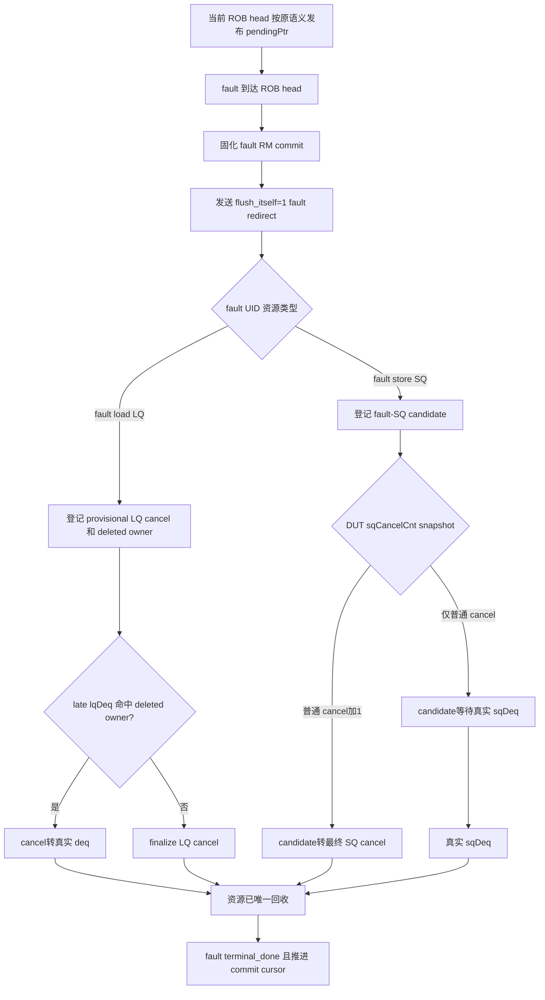

# MemBlock V2 fault redirect 的 LSQ cancel 统一建模修改计划（2026-09-18）

## 1. Plan 定位、专有名词与抽象功能说明

### 1.1 定位与范围

| 项目 | 内容 |
|---|---|
| 类型 | V2 `mem_ut` 测试框架 redirect、fault commit、LSQ pointer/cancel 协同修复 plan |
| 目标 | 让 fault store 在不改变真实 `pendingPtr` 驱动的前提下，按 DUT `sqCancelCnt` 或真实 `sqDeq` 二选一回收；让 fault load 的 LQ cancel 与可能迟到的 `lqDeq` 通过既有重分类机制精确对账。 |
| 关联前序 plan | `AI_DOC/plan/test_framework/plan/undo/memblock_redirect_deleted_lsq_owner_late_deq_coding_plan_20260917.md` |
| 非目标 | 修改 RTL/Scala、关闭 cancel 对账、放宽 selector、修改 RM 比较算法、伪造 DUT `lqDeq/sqDeq`。 |
| 当前已知现象 | fix5 中 UID123 fault store 被 DUT 计入 `sqCancelCnt`，但软件因 exception `release_sq` 少计 1，得到 `software=66/54, dut=66/55`。 |

### 1.2 专有名词

| 名词 | 中文含义 | 状态或代码落点 | 示例 |
|---|---|---|---|
| `pendingPtr` | 后端传给 LSQ 的延迟 ROB dequeue/head 指针；它与 normal `scommit` 不同，fault head 也会按真实 ROB 行为继续发布。 | `lsqcommit_agent_agent_xaction.io_ooo_to_mem_lsqio_pendingPtr_*` | UID123 是当前 ROB head 时，框架仍发布 UID123 的 ROB key，但 `scommit=0`。 |
| `fault-SQ candidate` | fault store redirect 后尚未确定由 DUT cancel 还是由真实 `sqDeq` 回收的唯一 SQ 资源候选。 | 本 plan 新增的 fault token resource 字段，关联 cancel record-id。 | UID123 SQ0/49 在 cancel snapshot 到来前处于 candidate 状态。 |
| `ordinary SQ cancel` | 当前 redirect 中除 fault-SQ candidate 之外、已由原有 redirect scan 确定的普通年轻 SQ cancel 数。 | `cancel_record_q[].software_cancel_sq_count` 的既有部分。 | 普通年轻 SQ 为 54，fault-SQ candidate 单独计为 1。 |
| `fault redirect` | fault UID 到达框架 ROB head 后发出的 `level=1, flush_itself=1` redirect；其作用是恢复架构控制流和回收未提交 LSQ 资源。 | `request_fault_head_redirect()` | fault store UID123 的 redirect 包含 UID123 自身。 |
| `provisional cancel` | redirect scan 初始统计、但尚未最终确认的 LQ/SQ cancel 数；允许被同一 redirect 前已进入 DUT 流水线的迟到 deq 扣回。 | `cancel_record_q[].software_cancel_*_count` | fault load 的 LQ 先计 cancel；随后 late `lqDeq` 到来时从 cancel 中减 1。 |
| `redirect-deleted owner` | 软件 active owner 删除前保存的旧物理 LQ/SQ 身份，用于识别 redirect 后晚到的真实 deq。 | `redirect_deleted_lq_owner_by_key`、`redirect_deleted_sq_owner_by_key` | redirect 后仍可识别旧 LQ key 属于 fault load。 |
| `late deq reclassification` | 将 provisional cancel 改判为真实 DUT deq，防止同一物理 entry 被 cancel 与 deq 双重释放。 | `preflight_redirect_deleted_deq()`、`commit_redirect_deleted_deq()` | cancel LQ=1 后收到该 key 的 `lqDeq`，最终 cancel=0、按 deq 推 pointer。 |
| `fault terminal` | fault UID 已完成 RM commit 对比、LSQ 资源已由 cancel/deq 之一回收、且不会 reissue 的框架终态。 | `status.terminal_done`、fault token | fault store SQ 被 cancel apply 回收后，fault UID terminal。 |

### 1.3 关键函数抽象职责

| 函数/helper | 抽象功能描述 |
|---|---|
| `build_lsqcommit_xaction()` / `clear_lsqcommit_xaction()` | 保持现有真实 ROB head `pendingPtr` 驱动；本 plan 不改变该接口语义。 |
| `mark_rob_commit_batch()` | 保持现有 normal commit 与 sideband 状态推进；本 plan 不把它改成 `pendingPtr` 的唯一来源。 |
| `mark_fault_rob_commit_uid()` | 固化 fault 的 RM commit 时刻、建立 fault token、清 pending issue/replay；保持现有 fault head `pendingPtr` 驱动，不伪造 normal `scommit`。 |
| `arm_fault_redirect_resource_candidate()` | 为 fault LQ/SQ 保存 UID、epoch、物理 key、redirect record-id 与资源侧；它不预先认定 fault SQ 必 cancel。 |
| `commit_redirect_deleted_deq()` | 对晚到的真实 LQ/SQ deq 进行 cancel→deq 重分类，保证软件资源只释放一次。 |
| `apply_pending_lsq_cancels()` | 仅对未被 late deq 重分类的最终 cancel 回退软件 LQ/SQ enqueue pointer/free count。 |
| `resolve_fault_redirect_resource()` / `finish_fault_head_terminal()` | 前者依据 cancel snapshot 或真实 deq 将 candidate 固化为 cancel/deq；后者只在该结论已完成资源回收后推进 commit cursor。 |

## 2. 当前问题与根因

### 2.1 fault store 当前路径混用了两种资源释放语义

真实 V2 ROB 始终把当前延迟 `deqPtr` 作为 `pendingPtr` 发布；fault head 不发生 normal `scommit`，但仍可被 StoreQueue 标为 `committed`。因此 fault store 在 redirect 时可能走 cancel，也可能在已 committed 后走真实异常 `sqDeq`。

当前 fix5 的错误不是 `pendingPtr` 本身，而是框架在未知道 DUT 选择哪条物理回收路径前，直接调用 `release_fault_head_store_lsq()` 推进软件 SQ deq pointer。UID123 实测走未 committed cancel 路径，DUT 输出 `sqCancelCnt=55`，其中包含 UID123；框架只统计年轻项 54，并另行 software `release_sq(1)`，导致 cancel record 对账差 1。

```text
当前错误模型：
fault store -> redirect 后立即 software release_sq
           -> DUT 实际可能按 cancel 或真实 deq 回收
           -> software 与 DUT 发生双路径或少计 cancel

目标模型：
fault store -> 记录 fault-SQ candidate
           -> 等本 redirect 的 DUT sqCancelCnt snapshot
           -> cancel snapshot 或真实 sqDeq 二选一
           -> 只由最终路径回收一次软件资源
```

### 2.2 fault load 的 LQ 不依赖 `pendingPtr`，但存在 cancel/deq 交叠

V2 VirtualLoadQueue 的 redirect cancel 条件只依赖 `allocated && robIdx.needFlush(redirect)`，不读取 StoreQueue 的 `committed` 或 `pendingPtr`。因此 fault load 本身若在 redirect 到来时仍 allocated，应先计入 `lqCancelCnt`；若其 deq 已进入 DUT 输出流水线，则会在 redirect 后观测到 late `lqDeq`。

这不是两套错误语义，而是同一物理 LQ entry 的时序交叠。必须复用既有 provisional cancel 和 redirect-deleted owner 重分类；不能在 fault terminal 时直接 `release_lq(1)`。

## 3. 目标功能 Flow



文字伪代码：

```text
fault 到达当前 ROB head：
  固化 status.rob_commit 和 RM fault compare 时机。
  保持既有 pendingPtr = 当前 modeled ROB head 的真实驱动。
  创建 level=1、flush_itself=1 redirect。

fault redirect scan：
  fault store 的 active SQ：登记 fault-SQ candidate；不预先统计 SQ cancel、不 reissue。
  fault load 的 active LQ：capture deleted owner，登记 provisional LQ cancel；不 reissue。

monitor 收到 cancel snapshot 或 late deq：
  fault-SQ candidate：按 snapshot 与 ordinary SQ cancel 的差额，决定最终 SQ cancel或等待真实sqDeq。
  命中 deleted owner：从关联 provisional cancel 扣除并按真实 deq 推进软件 pointer。
  未命中：保持原有严格 stale 检查。

window 到期：
  剩余 provisional cancel 成为最终 cancel。
  LSQ enqueue sequence 仅对最终 cancel 调用 cancel_lq/cancel_sq。
  fault token 等资源回收后进入 terminal_done。
```

## 4. 状态与语义修改

### 4.1 `pendingPtr` 保持真实驱动

本 plan 不修改 `pendingPtr`：`clear_lsqcommit_xaction()` 继续在 modeled head 有效时发布 `modeled_rob_deq_ptr`。normal `scommit/pendingst` 与 fault commit 仍按现有接口独立驱动。

### 4.2 fault resource disposition

新增或收敛一个 fault token 的资源处置字段，使用枚举而不是多个可同时为真的 bit：

```text
FAULT_LSQ_DISPOSITION_PENDING
FAULT_LSQ_DISPOSITION_LQ_CANCEL_PENDING
FAULT_LSQ_DISPOSITION_SQ_CANDIDATE
FAULT_LSQ_DISPOSITION_WAIT_SQ_DEQ
FAULT_LSQ_DISPOSITION_LATE_DEQ
FAULT_LSQ_DISPOSITION_SQ_DEQED
FAULT_LSQ_DISPOSITION_CANCEL_APPLIED_WAIT_RECORD_APPLY
FAULT_LSQ_DISPOSITION_CANCEL_APPLIED
```

规则：

- fault load 只允许 `LQ_CANCEL_PENDING -> LATE_DEQ` 或 `LQ_CANCEL_PENDING -> CANCEL_APPLIED`。
- fault store 先进入 `SQ_CANDIDATE`；若 snapshot 比 ordinary SQ cancel 多 1，则转 `CANCEL_APPLIED`；若相等，则转 `WAIT_SQ_DEQ` 并等待真实 sqDeq。
- candidate 必须保存 `uid`、`dynamic_epoch`、资源侧、物理 LQ/SQ key、redirect epoch 和 cancel record-id。
- `release_fault_head_store_lsq()` 中直接调用 `lsq_ctrl.release_sq()` 的语义必须删除；已 committed fault SQ 也只能由真实 `sqDeq` 释放。

### 4.3 candidate 的权威存储、record pin 和回调

新增 `memblock_fault_redirect_resource_t`，由 `common_data_transaction` 维护，以 fault UID 为 key 的关联表作为权威存储。一次只能存在一个与当前 fault token 对应的有效 candidate；若发现不同 UID 的未完成 candidate，直接 fatal。

```text
valid
uid
dynamic_epoch
resource_side = LQ / SQ
lq_key 或 sq_key
redirect_epoch
cancel_record_id
disposition
```

candidate 生命周期：

```text
fault redirect scan：
  创建 candidate，绑定当前 record-id。

record pin：
  cleanup_completed_cancel_records() 对 candidate.valid && record-id 相等的 record 必须停止 pop；
  即使 observed_valid && software_applied，也不能删除 WAIT_SQ_DEQ candidate 的 record。
  candidate 删除、明确 fatal/recovery终态才解除 pin；completion callback 本身只改变 disposition，
  fault token 完成 terminal 后删除 candidate 才允许 pop record。
  WAIT_SQ_DEQ 只 pin record，不得保持 redirect_deleted_owner_window_active，避免阻塞后续 redirect。
  record 被 pin 仅阻止 FIFO pop，不得阻止 cancel monitor 继续消费其后的基线 snapshot：
  当不存在未锚定 record 且所有 anchored record 均已 observed 时，
  service_cancel_reconcile() 仍按 held baseline 校验并 pop 后续 snapshot。
  否则 `WAIT_SQ_DEQ` 会让周期性 baseline snapshot 无界积压。

snapshot resolve：
  fault SQ cancel 路径：candidate 转 CANCEL_APPLIED_WAIT_RECORD_APPLY；
  fault SQ deq 路径：candidate 转 WAIT_SQ_DEQ。

deq callback：
  snapshot 前的 live SQ deq 命中 candidate key 时，转 SQ_DEQED；
  deleted LQ deq 命中 candidate key 时，转 LATE_DEQ。

record apply callback：
  record-id 匹配且 candidate 正处 CANCEL_APPLIED_WAIT_RECORD_APPLY 时，转 CANCEL_APPLIED。

fault terminal：
  token 消费 candidate 的最终 disposition 后删除 candidate。
```

同一 fault UID后续被 redirect 覆盖时：

```text
同 UID、同 dynamic_epoch 的有效 candidate：
  preserve_fault_uid_during_redirect 仅验证并保持既有 candidate；
  不得再次 arm、改写 record-id 或重复计数。

不同 UID 的未完成 candidate：
  fatal，禁止覆盖唯一 candidate。
```

高频路径不扫描完整主表：snapshot 通过 record-id 查关联 candidate；deq 通过现有 active/deleted owner key 反查 UID 后，再 O(1) 查 UID candidate。

## 5. 主流程实现 Flow

### 5.1 fault redirect 的 LQ/SQ candidate

抽象功能描述：fault UID 不 reissue；其 LQ/SQ 资源先建立与当前 cancel record 关联的处置状态，随后只由 DUT cancel snapshot 或真实 deq 选择唯一回收路径。

修改位置：`common_data_transaction.sv` 的 `apply_redirect_flush_range()`、`preserve_fault_uid_during_redirect()`；新增 `arm_fault_redirect_resource_candidate()` 与仅摘除 LSQ map 的 helper。

伪代码：

```text
若扫描到 fault redirect anchor UID：
  验证该 UID 已 rob_commit、fault 状态有效、dynamic epoch 与 token 一致。
  保留 active ROB owner 与 fault token；不调用 retire_active_uid。
  fault load 的 active LQ：capture deleted owner，增加 provisional LQ cancel，摘除 active LQ map，disposition=LQ_CANCEL_PENDING。
  fault store 的 active SQ：记录 fault-SQ candidate，但不增加 ordinary SQ cancel，保持 active SQ map，disposition=SQ_CANDIDATE。
  不设 redirect_pending、不递增 dynamic_epoch、不进入 reissue admission。
```

fault load 和 fault store 分别使用哪一侧资源：

```text
以当前 `derive_op_behavior()` 的实际 LQ/SQ 使用结果决定资源侧；scalar load 预期只有 LQ、scalar store 预期只有 SQ。异常组合必须打印完整行为、mapping与ROB信息后 fatal，不能仅按 op_class 推断。
```

### 5.2 cancel snapshot 对 fault-SQ candidate 的归因

抽象功能描述：在严格 cancel compare 前，以已观测的 DUT `sqCancelCnt` 与 ordinary SQ cancel 计数比较，唯一决定当前 fault-SQ candidate 是被 cancel 还是必须等待真实 deq。

修改位置：`common_data_transaction.sv` 的 cancel snapshot reconcile 流程；新增 `resolve_fault_sq_candidate_from_snapshot()`。

伪代码：

```text
取得当前 redirect record 的 ordinary SQ cancel count 与 fault-SQ candidate：
  无 candidate：执行原有严格 compare。
  candidate 的 record-id/epoch 不匹配：fatal。
  candidate 已是 SQ_DEQED/LATE_DEQ：要求 DUT sqCancel = ordinary count；不得重新转换状态。
  真实 sqDeq 若在目标 snapshot 前先到：candidate 已置 SQ_DEQED，后续 snapshot 只能等于 ordinary count。
  DUT sqCancel = ordinary count + 1：
    仅允许 candidate 正处 SQ_CANDIDATE。
    将 candidate 记入 software SQ cancel 与 pending aggregate。
    仅摘除 active SQ map、保留 active ROB。
    disposition=CANCEL_APPLIED_WAIT_RECORD_APPLY。
  DUT sqCancel = ordinary count：
    仅允许 candidate 正处 SQ_CANDIDATE。
    不改变 software SQ cancel。
    保留 active SQ map。
    disposition=WAIT_SQ_DEQ。
  其他差额：fatal。

apply gate：
  当 record 绑定 SQ_CANDIDATE 时，即使本 redirect 没有 deleted owner 而
  software_count_finalized 已被原流程置位，apply_pending_lsq_cancels()
  也必须停在该 record 前。它不得提前调用 cancel_lq/cancel_sq 或
  mark_cancel_record_applied()；必须先等目标 cancel snapshot 完成
  ordinary / ordinary+1 归因并通过严格 compare，下一次 service tick 才可 apply。

之后以更新后的 software count 执行原有严格 LQ/SQ compare。
```

### 5.3 late LQ/SQ deq 重分类

抽象功能描述：识别 redirect 前已经进入 DUT deq 流水线、但在软件 owner 删除后才被采到的真实 deq；将其从 provisional cancel 改判为 deq。

修改位置：复用 `preflight_redirect_deleted_deq()`、`commit_redirect_deleted_deq()` 与现有 deleted-owner map。

伪代码：

```text
raw lqDeq/sqDeq 到达：
  active owner 命中：按原 live deq 处理。
  deleted owner 命中：
    验证同一 redirect epoch/record。
    从该 record 的 provisional cancel 减去对应数目。
    推进软件 deq pointer/free count。
    删除 deleted owner。
  资源释放后，若 uid 命中有效 fault candidate：调用 completion callback 更新 disposition。
  两者均不命中：保持现有 fatal。

snapshot 已先归因为 CANCEL_APPLIED_WAIT_RECORD_APPLY 后同 key sqDeq 到达：
  snapshot 已证明 DUT 在 redirect 采样点 cancel 了该资源。
  将该 sqDeq 作为协议/monitor stale 冲突 fatal；不得扣回 software SQ cancel、不得转换为 deq。
```

### 5.4 fault terminal

抽象功能描述：只在 fault redirect 已完成，且 fault UID 的 LQ/SQ disposition 已由最终 cancel 或真实 deq 回收后，完成 fault terminal 并推进 commit cursor。

修改位置：`lsq_commit_handler.sv` 的 `sync_modeled_head_after_fault_terminal()`、`finish_fault_head_terminal()`。

伪代码：

```text
若 fault token 的 disposition 不是 CANCEL_APPLIED、LATE_DEQ 或真实 SQ_DEQ：
  保持 token。

cancel record 被 `mark_cancel_record_applied()` 确认后：
  若 candidate 是 CANCEL_APPLIED_WAIT_RECORD_APPLY：
    置 CANCEL_APPLIED；通知 fault token。

真实 live/deleted deq 提交后：
  若 key 命中 fault candidate：
    置 LATE_DEQ 或真实 SQ_DEQ；通知 fault token。

若 disposition 已确认且所有 fault LSQ resource 已释放：
  consume_fault_retire。
  finish_fault_head_terminal。

不得在此直接 cancel_lq/cancel_sq 或 release_lq/release_sq。
```

### 5.5 record pin 与 completion callback

抽象功能描述：将 cancel record 的资源回退完成事件与 fault token 的资源 disposition 绑定，保证 record 不会过早删除，也保证 fault terminal 不会早于 cancel/deq 的唯一回收。

修改位置：`common_data_transaction.sv` 的 `cleanup_completed_cancel_records()`、`mark_cancel_record_applied()`、`commit_redirect_deleted_deq()`；live deq commit 后的 candidate callback。

伪代码：

```text
cleanup record：
  若有效 fault candidate 绑定本 record-id：停止 pop。

record apply：
  先完成既有 cancel_lq/cancel_sq 资源回退。
  record-id 命中且 disposition=CANCEL_APPLIED_WAIT_RECORD_APPLY：
    置 CANCEL_APPLIED。
  disposition=LATE_DEQ/SQ_DEQED：
    不改变 disposition；允许在 fault token 完成后解除 record pin。

deq commit：
  先完成既有 live/deleted pointer、map和provisional count处理。
  再按冻结 uid/key/record-id 匹配 candidate。
  命中则置 LATE_DEQ/SQ_DEQED，并唤醒 fault token。
```

## 6. 删除或替换的错误路径

| 当前路径 | 问题 | 本 plan 后的处理 |
|---|---|---|
| 将 `pendingPtr` 改成 normal commit watermark | 会偏离真实 V2 ROB `pendingPtr=RegNext(deqPtr)`，影响普通 Store/Load/DTLB 顺序语义。 | 保持现有 modeled ROB head 驱动。 |
| `release_fault_head_store_lsq()` 调用 `lsq_ctrl.release_sq(1)` | 软件伪造 deq；DUT 若实际输出 `sqCancelCnt` 会发生双路径或少计。 | 删除直接 software release；由 candidate 决定 cancel 或真实 sqDeq。 |
| fault redirect 仅保留 owner、不记录资源 candidate | DUT cancel 时软件无法补入对应 cancel record；真实 deq 时也无 token 完成判据。 | 按 LQ/SQ 分别建立 fault resource candidate 与 disposition。 |
| fault terminal 只等待 owner自然 deq | 未 committed fault SQ 被 cancel 后无 deq，fault token可能永久等待。 | 等 record apply、late deq或真实 SQ deq 的 completion callback。 |

## 7. RM 与验证协同支持

本 plan 不修改 RM/checker 算法。

- `mark_fault_rob_commit_uid()` 仍是 fault 的 RM commit 对比时刻；本 plan 保持真实 `pendingPtr`，不能推迟或提前该比较。
- 新增或保留日志需同时打印 fault UID、ROB key、fault disposition、当前 pendingPtr、cancel record id、LQ/SQ key及最终资源来源（cancel或late deq），供 RM failure 关联。
- `SQ_CANDIDATE` 必须记录 arm、snapshot 归因和真实 sqDeq 的转移日志；若专项等待超时，可由 UID、record-id、SQ key 判断是 snapshot 未归因还是 DUT 未产生异常 drain。
- 若 `WAIT_SQ_DEQ` 期间 issue loop 有待发射 item 却长期无 fire，日志必须打印队首 target、UID、动态 epoch、replay 序号和 active/fault/issue-killed/dispatched 状态；以区分 fault UID 遗留项与阻塞 fault SQ 之前的普通 store-data。
- `mark_target_fault()` 落表后必须立即调用 `quiesce_fault_uid_pending_work()`，清理该动态实例的 LOAD/STA/STD 队列项；fault UID 后续不 reissue，任何保留的 issue item 都属于 stale work，不能留在 scheduler 中等待 fire。
- V2 STD raw 只有 ROB value、且不支持 STD replay；若按两个 ROB flag 反查到的 active owner 已处于 fault/exception/flush 状态，应将该 raw 作为迟到 stale event 丢弃，不能因缺少可用 STD candidate 触发 fatal。
- RM 后续可观测 `status.rob_commit`、`status.terminal_done`、`cancel_record_q` 和 deq provenance；本 plan 不在 RM 内重算 DUT cancel。 

## 8. 验证计划与验收标准

### 8.1 静态与编译

```text
git diff --check 覆盖本 plan 修改范围。
rg 确认 fault store 不再存在 software release_sq 路径。
VCS V2 全量编译通过，0 error。
```

### 8.2 定向 software-only 场景

1. fault store、未 committed、`flush_itself=1`：software SQ cancel 增 1；不调用 `release_sq`；cancel apply 后 fault terminal。
2. fault load、redirect 时仍 allocated：software LQ provisional cancel 增 1；窗口到期无 deq 时 cancel apply。
3. fault load late `lqDeq`：provisional LQ cancel 从 1 减到 0，pointer 只按 deq 推进一次。
4. fault store、DUT sqCancel 与 ordinary count 相等：candidate 转 `WAIT_SQ_DEQ`，保持 live SQ owner，真实 `sqDeq` 后 terminal。
5. fault store cancel 已归因后收到同 key `sqDeq`：作为协议/monitor stale 冲突 fatal；禁止取消归因、禁止二次释放。
6. 首条 fault：验证 `pendingPtr` 仍发布真实 fault ROB head，不伪造 predecessor。
7. 连续 normal commit 后 fault：验证 `pendingPtr` 仍发布当前 fault ROB head，`scommit/pendingst` 保持各自真实语义。

### 8.3 主专项场景

```text
tc=basicTest
ts=memblock_dispatch_real_smoke_vseq
cfg=tc_dispatch_real_mmu_sv39_smoke
seed=666666
+MEMBLOCK_MAIN_TRANS_NUM=10000
```

验收：

- UID123 类未 committed fault store 归入 software SQ cancel，且不再出现 `software SQ cancel` 比 DUT 少 1。
- 已 committed fault store 不计 SQ cancel，并等待并匹配真实 `sqDeq`。
- 不出现 `release fault store SQ ... without DUT sqDeq`。
- 不出现 `cancel mismatch`、`stale DUT lqDeq`、`issue queue has pending work but no fire`。
- fault RM compare 仍在原 `rob_commit` 时刻发生且保持 PASS。
- 测试达到 `TEST CASE PASSED`，或出现与本 plan 无关的新首错并保留完整日志/波形路径。

## 9. 修改文件范围

| 文件 | 修改内容 |
|---|---|
| `seq/base_seq_help/lsq_commit_handler.sv` | 保持真实 pendingPtr 驱动；删除 fault SQ software release；保存并等待 fault resource disposition 完成。 |
| `seq/base_seq_help/common_data_transaction.sv` | fault candidate、snapshot 归因、仅摘除 LSQ map、deleted owner/provisional cancel、record apply/deq completion callback。 |
| `seq/base_seq/memblock_lsqenq_dispatch_base_sequence.sv` | 对 `SQ_CANDIDATE` 增加 snapshot-pending apply gate，禁止 ordinary count 在 snapshot 前被提前 apply。 |
| `seq/base_seq_help/common_data_transaction.sv` | 当 pinned 的已观测 record 存在但没有未锚定 record 时，继续消费 cancel baseline snapshot，避免 monitor queue 无界增长。 |
| `seq/base_seq/soft_test/*` 与 `tc/src/soft_test/*` | 增加 fault load/store cancel 与 late deq 定向测试。 |
| 对应 implementation review 与 fault/redirect flow 文档 | coding 完成后按执行规则同步。 |

## 10. 当前状态与后续执行边界

本文件是新的待执行 plan，当前只记录设计方案，未据此修改源码。

现有 `memblock_redirect_deleted_lsq_owner_late_deq_coding_plan_20260917.md` 的已修改代码仍在工作区；本 plan coding 前必须先完成其工作区归属确认、plan review、实现 review和独立专项验证。不得把本 plan 的 pendingPtr/cancel 语义混入前序 plan 的历史改动中。
