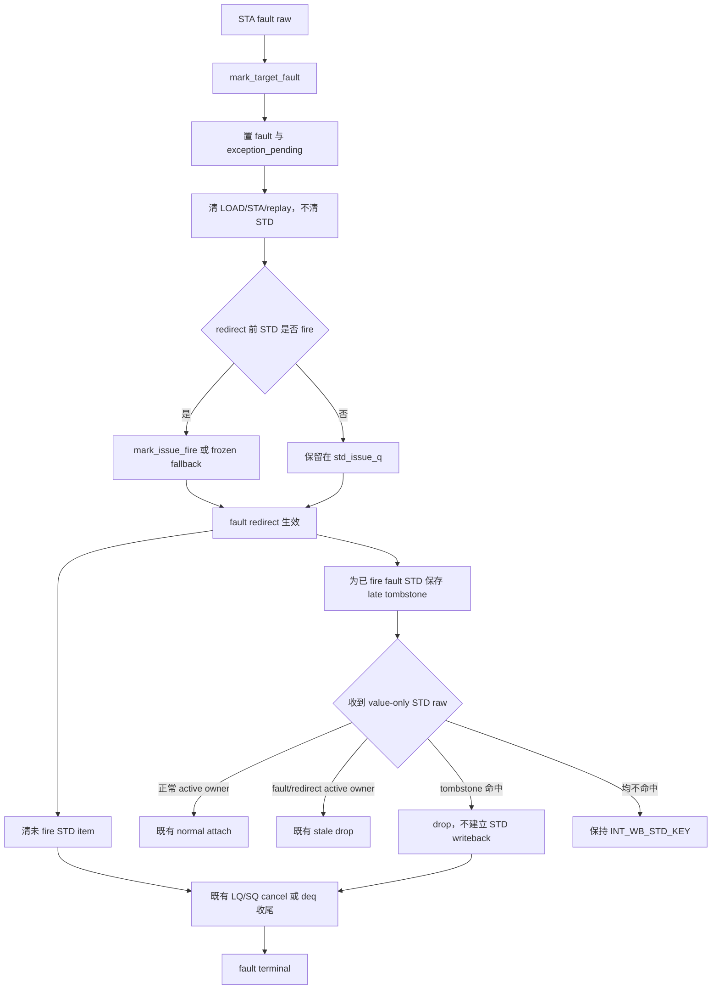

# MemBlock V2 fault 与 STD 生命周期 RTL 对齐修改方案（2026-09-20）

**状态**：已 coding，专项复测完成；独立 implementation review 待后续主线程执行。  
**适用版本**：V2，`mem_ut_uvm_v2`。  
**修改范围**：`mem_ut` 的 fault 状态维护、scalar issue scheduler、redirect 清理和 STD raw adapter。  
**非目标**：修改 RTL/Scala、改变 DUT 的 `issueStd` 接口、放宽未知 STD raw 的 fatal、伪造 STD writeback、改变 LQ/SQ cancel/deq 资源归因。  
**关联问题**：fault store 的 `std_issue_q` 在 `exception_pending` 后永久不可发，以及 redirect 后迟到 value-only STD raw 触发 `INT_WB_STD_KEY`。

## 1. 专有名词与抽象功能说明

### 1.1 专有名词

| 名词 | 当前含义 | 代码落点 | 示例 |
| --- | --- | --- | --- |
| `STA` | store-address target；由 StoreUnit 完成地址、TLB/PMP 和异常检测。 | `MEMBLOCK_ISSUE_TARGET_STA` | STA 发现 store page fault。 |
| `STD` | store-data target；向 DUT `issueStd` 发送 store data，和 STA 独立调度。 | `MEMBLOCK_ISSUE_TARGET_STD`、`std_issue_q` | 同一条 store 的 data 可比 STA 早、同拍或晚发。 |
| `fault pending` | STA fault 已被框架记录，但 ROB exception redirect 尚未完成的过渡状态。 | `status.fault`、`status.exception_pending` | STA fault 后到 level-1 redirect 生效前的数拍。 |
| `issue item` | 框架未来可驱动的一条 LOAD/STA/STD 请求计划；它不是已经进入 DUT 的请求。 | `memblock_issue_q_item_t`、`std_issue_q` | UID584 的 STD 尚未 fire 时仍是 issue item。 |
| `fire` | driver 在同一采样边界观察到 `valid && ready`，DUT 已接收 payload。 | `memblock_dispatch_fired_mask`、`mark_issue_fire()` | 已 fire 的 STD 可以在 redirect 后留下 pipeline raw。 |
| `frozen candidate` | 已被 sequence 放入当前 xaction、但 fault 可能在 framework 完成 fire 记账前到达的 candidate。 | `fired_items`、`mark_issue_fire_from_frozen_candidate()` | STD 已真实 fire，但 watcher 尚未写 `std_dispatched`。 |
| `fault redirect` | ROB head fault 触发的 level-1、`flush_itself=1` redirect。 | `request_fault_head_redirect()`、`preserve_fault_uid_during_redirect()` | fault store 自身不 reissue，年轻动态实例被 flush。 |
| `STD late tombstone` | 已被 fault redirect/terminal 清理的旧 STD 动态身份的短时只读记录，仅用于识别迟到 raw。 | 本方案新增 `std_late_raw_tombstone_by_rob` | 已删除 UID31 owner 后，旧 STD raw 仍携带相同 ROB value。 |
| `value-only STD raw` | DUT `writebackStd` 只带 ROB value、不带 ROB flag 的 monitor 原始事件。 | `dispatch_raw_int_wb_t` | adapter 必须在 flag=0/1 中归属，或判定为可证明的迟到事件。 |

### 1.2 关键函数抽象职责

| 函数/helper | 抽象功能描述 |
| --- | --- |
| `mark_target_fault()` | 接收 STA fault 后设置 fault 状态，撤销不应继续发射的工作；修改后它保留尚未 fire 的 STD。 |
| `is_issue_item_state_eligible()` | 在普通 scheduler 选新 candidate 前判定 item 是否可被驱动；修改后仅对 fault-pending store 的 STD 保留 redirect 前的合法发射窗口。 |
| `quiesce_fault_uid_pending_work()` | 清理 fault UID 仍停留在软件 issue/replay 队列的工作项；修改后由调用点指定是否一并清理 STD。 |
| `preserve_fault_uid_during_redirect()` | 处理 fault ROB head 的 redirect，保留 fault LQ/SQ 资源归因并停止未发 sibling issue；它成为未 fire STD 的最终撤销边界。 |
| `capture_std_late_raw_tombstone()` | 在删除可产生迟到 raw 的 fault STD 身份前保存短时身份，不改变任何 DUT/LSQ 资源状态。 |
| `try_drop_std_raw_by_tombstone()` | 只在正常 active owner 无法归属时，验证 raw 是否匹配短时 tombstone；命中则作为 redirect 前流水线残留丢弃。 |
| `service_std_late_raw_tombstones()` | 仅按有限 tombstone 表和 service sample 清除过期记录，不扫描 main table。 |

## 2. 问题与目标行为

### 2.1 当前框架行为与 RTL 时序的偏差

当前 `mark_target_fault()` 在 STA fault raw 到达时立即调用 `quiesce_fault_uid_pending_work()`。该 helper 同时删除
`load_issue_q`、`sta_issue_q` 和 `std_issue_q`，并清除 `queued_std`。普通 scheduler 也因
`exception_pending=1` 拒绝所有 target。

```text
当前：
STA fault 到达
  -> fault / exception_pending = 1
  -> 删除未 fire STD item
  -> STD 永远不能再被框架驱动
  -> 若 driver 已经 fire，只能走 frozen-candidate 补记
```

真实 V2 后端中，STA 与 STD 属于独立 IQ/EXU。STA fault 到达 ROB/ExceptionGen，不会在同一周期直接清除
STD IQ；真正取消未发 STD 的边界是 fault redirect 到达 scheduler/IQ。故 fault 到 redirect 生效之间，尚未
发射的 STD 仍可能合法 `valid && ready`。

### 2.2 目标行为

```text
STA fault 到达：
  设置 fault / exception_pending。
  撤销 LOAD、STA、replay/PTW wait 等不可继续的工作。
  保留同一 scalar store 的未 fire STD item；普通 scheduler 仍可在 redirect 前选择它。

真实 STD fire：
  继续按现有 mark_issue_fire() 建立 std_dispatched 与 issue snapshot。
  fault 不允许 normal pass 或重发，STD fire 仅表示 DUT 已接收 data。

fault redirect 生效：
  删除仍未 fire 的 STD item，清 queued_std。
  已 fire STD 不重新驱动；若其 raw 晚到，按 active owner 或 tombstone 丢弃。

fault terminal：
  不以 std_issue_q 删除或 STD raw drop 为终态条件。
  仍由 cancel apply、late lqDeq、真实 sqDeq 等既有资源事实完成 fault token。
```

## 3. 目标功能 Flow



### 函数调用 Flow 图整体文字伪代码

```text
1. STA fault 进入 writeback handler：
   mark_target_fault() 标记该动态实例为 fault pending。
   它调用带“保留 STD”选项的 quiesce helper；该 helper 删除未来不应再发的
   LOAD/STA/replay 工作，但不删除 std_issue_q 中的同实例 STD item。

2. redirect 前 issue service：
   issue_queue_scheduler::is_issue_item_state_eligible() 继续拒绝 fault-pending
   的 LOAD/STA，但对仍 queued、未 fire、未 redirect/flush/kill 的 scalar STD 返回可选。
   若 driver 观察到 valid&&ready，mark_issue_fire() 建立 STD issue snapshot；若 fault 与
   记账同拍，则保留既有 frozen-candidate fallback 只补记真实 fire。

3. fault redirect 生效：
   preserve_fault_uid_during_redirect() 调用“清 STD”模式的 quiesce helper，撤销未 fire
   STD item；随后按既有 fault LQ/SQ candidate、cancel snapshot 和真实 deq 处理资源。
   若该 UID 已 fire STD，capture_std_late_raw_tombstone() 在删除 normal owner 前保存旧 ROB 身份。

4. monitor 接收 STD raw：
   convert_raw_int_wb() 先保持现有 active redirect、active fault owner 和正常 active owner
   优先级；只有这些路径都不能归属时，调用 try_drop_std_raw_by_tombstone()。
   tombstone 命中仅消费 raw；未知 raw 继续 INT_WB_STD_KEY。

5. fault 终结：
   STD 的软件 queue 清理和 late raw drop 不推进 terminal；既有 cancel/deq 资源结论完成后，
   由 fault token 逻辑置 terminal_done。
```

## 4. 最优最小修改方案

### 4.1 复用现有 `quiesce_fault_uid_pending_work()`，增加 target 选择能力

修改位置：

```text
mem_ut/ver/ut/memblock/seq/base_seq_help/common_data_transaction.sv
```

抽象功能描述：该 helper 仍是 fault UID 停止软件 pending 工作的唯一入口；新增一个是否撤销 STD 的入参，
避免复制三条 issue queue 的删除与 replay 清理逻辑。

修改后的接口建议：

```systemverilog
function void quiesce_fault_uid_pending_work(
    input memblock_uid_t uid,
    input bit quiesce_std = 1'b1
);
```

详细文字伪代码：

```text
读取 fault UID status，保持现有“必须处于 fault/exception”检查。
删除 load_issue_q 和 sta_issue_q 中该 UID 的所有旧 replay item，并清 queued_load/queued_sta。
若 quiesce_std=1：
  删除 std_issue_q 中该 UID 的所有旧 replay item，并清 queued_std。
若 quiesce_std=0：
  不触碰 std_issue_q、queued_std、std_dispatched 和 STD issue snapshot。
清 PTW wait/replay target；该部分不依赖 STD 是否保留。
不修改 LQ/SQ active owner、cancel record、dynamic_epoch 或 terminal_done。
```

调用点规则：

| 调用点 | `quiesce_std` | 原因 |
| --- | ---: | --- |
| `mark_target_fault()` | `0` | STA fault 到达不是真实 STD IQ flush 边界。 |
| `mark_fault_rob_commit_uid()` / fault commit 记录 | `0` | 该步骤只固定 RM 对比时机和 fault token，不提前伪造 redirect 效果。 |
| `preserve_fault_uid_during_redirect()` | `1` | fault redirect 已实际生效，未 fire STD 必须被撤销。 |
| `consume_fault_retire()` | `1` | terminal 的幂等兜底，不应遗留软件 pending item。 |
| 普通 redirect/reissue、`retire_active_uid()` | 保持现有默认 `1` | 非 fault head 的旧动态实例已被真实 redirect 覆盖。 |

### 4.2 将普通 eligibility 改为“fault-pending 仅保留 STD”

修改位置：

```text
mem_ut/ver/ut/memblock/seq/base_seq_help/issue_queue_scheduler.sv
function is_issue_item_state_eligible()
```

抽象功能描述：该函数决定 scheduler 能否将未冻结 item 选为新的 DUT issue。它只改变 fault-pending 的
target 区分，不改变 global flush、redirect、dynamic epoch、ready cycle、replay 或已 dispatched 的既有约束。

详细文字伪代码：

```text
保留 active/enq/issue_ready、flushed、redirect_pending、issue_killed、replay_seq、ready_cycle 的原检查。

若 exception_pending=1：
  若 item.target 不是 STD：返回不可发。
  若 item.target 是 STD，但 sta_fault=0：返回不可发。
  若 item.target 是 STD 且 sta_fault=1：继续后续检查。

对 STD 的既有检查保持：
  必须 queued_std=1、std_dispatched=0、std_writeback=0，且 SQ key 与当前 active SQ owner 一致。
  满足时可由普通 scheduler 驱动；不设置 normal pass，也不消除 fault。
```

这里限制为 `sta_fault=1`，而不是任意 `fault=1`：只有 STA 发现的 scalar store fault 对应独立的 STD
target。LOAD fault、STA/STD 已被 redirect 覆盖、terminal 或普通 replay 都不获得这个例外。

### 4.3 保留并收紧现有 frozen-candidate fallback

修改位置：

```text
mem_ut/ver/ut/memblock/seq/base_seq_help/issue_queue_scheduler.sv
function is_frozen_issue_item_fire_acceptable()
function mark_issue_fire_from_frozen_candidate()
mem_ut/ver/ut/memblock/seq/base_seq/memblock_issue_dispatch_base_sequence.sv
task send_issue_cycle()
```

抽象功能描述：这条路径只记录 driver 已确认 fire、但 fault 状态在 watcher 记账之前到达的旧 candidate；它
不是允许 fault 后重新选择 STD 的第二条 scheduler 路径。

详细文字伪代码：

```text
普通 mark_issue_fire() 成功时：保持现有路径，不走 fallback。
只有 fired_mask 已证明 DUT 接收、普通记账失败时：
  调用 frozen-candidate helper。
  helper 继续要求 active/enq/issue_ready、dynamic_epoch、ROB key、SQ key、queued_std
  与冻结 item 一致，且没有 global flush、redirect、flushed、issue_killed 或 terminal。
  成功后建立一次 issue epoch/snapshot、删除该 STD item、置 std_dispatched。
  失败只按既有 stale warning 处理，不能重新插入 item 或创建新动态实例。
```

本方案不放宽 frozen helper 的 `fault && exception_pending` 限制，也不把它用于未 fire item。

### 4.4 新增短生命周期 `STD late tombstone`

修改位置：

```text
mem_ut/ver/ut/memblock/seq/base_seq_help/memblock_dispatch_types.sv
mem_ut/ver/ut/memblock/seq/base_seq_help/common_data_transaction.sv
```

新增数据结构只保存归属证明，不保存 payload：

```text
valid
rob_key
uid
dynamic_epoch
redirect_epoch
expire_service_sample
reason = FAULT_REDIRECT / FAULT_TERMINAL
```

权威索引为 `rob_key -> tombstone` 的关联表，数量由当前 redirect/fault active window 限制；不扫描 main
table。保留时间复用现有 redirect-deleted owner 的短窗口语义：从 capture 起最多 4 个 dispatch service
sample。该长度覆盖 scalar STD 的直接 EXU/writeback 残留，但不会长期遮蔽以后 ROB wrap 后的新实例。

#### `capture_std_late_raw_tombstone()`

抽象功能描述：在即将删除一个 fault UID 的 normal ROB owner 前，为已经真实 fire 的 STD 保存一份短时
identity，以便后续 value-only raw 被识别为旧流水线残留。

详细文字伪代码：

```text
仅当 status.sta_fault 或 status.exception_pending 成立，且 status.std_dispatched=1 时继续。
读取 status 的完整 rob_key、uid、dynamic_epoch 和当前 redirect epoch。
若同 rob_key 已存在未过期 tombstone：
  必须 uid 和 dynamic_epoch 完全相同；否则 fatal，禁止覆盖新旧实例。
若不存在：
  写入一条 tombstone，并令 expire_service_sample = 当前 service sample + 4。
不删除 LQ/SQ owner，不修改 cancel count，不修改 std_dispatched，也不置 terminal。
```

调用点：

```text
prepare_uid_for_redirect_reissue() 调用 retire_active_uid() 前：
  针对被 redirect 覆盖且已 fire STD 的 fault UID capture。

consume_fault_retire() 清理 active owner 前：
  针对 fault head 的已 fire STD 进行 terminal 兜底 capture。
```

`preserve_fault_uid_during_redirect()` 本身保留 fault head active owner，因此不立即 capture；正常 owner
仍可由现有 `std_raw_owned_by_fault()` 归属。只有 owner 将被删除时才创建 tombstone。

#### `try_drop_std_raw_by_tombstone()` 与清理服务

抽象功能描述：该 helper 只处理已无法由 current active owner 归属的 value-only STD raw。它在短窗口内
用两个可能 ROB flag 查询 tombstone，命中后消费旧 raw；不能把它作为未知 raw 的默认 ignore。

详细文字伪代码：

```text
先执行现有 std_raw_covered_by_active_redirect()：
  active redirect 覆盖则按既有逻辑 drop。
再执行现有 std_raw_owned_by_fault()：
  active fault/exception owner 命中则按既有逻辑 drop。
随后按 raw.rob_value 生成 flag=0 和 flag=1 两个完整 rob_key：
  对每个 key O(1) 查询 tombstone map。
  过期记录先删除，不计为命中。
  未过期记录计为一个候选。
若恰有一个 tombstone 命中：
  打印 UID、dynamic_epoch、ROB key、redirect epoch 和 raw port 的 UVM_INFO。
  返回 drop；不得补 std_dispatched、std_writeback、status.pass 或任何 SQ data 状态。
若两个 tombstone 同时命中：
  UVM_FATAL，ROB value-only raw 身份存在真实歧义。
若没有 tombstone 命中：
  返回 0，由既有 resolve_std_uid_by_rob_value_only() 保持 INT_WB_STD_KEY。

每次 dispatch service sample 调用 service_std_late_raw_tombstones()：
  仅遍历 tombstone map 的当前有限项，删除 expire_service_sample 已到的记录。
  该清理属于中频 service 路径，最大项数受 redirect/fault active window 限制。
```

### 4.5 adapter 调用顺序保持 current-first

修改位置：

```text
mem_ut/ver/ut/memblock/seq/base_seq_help/dispatch_monitor_event_adapter.sv
function convert_raw_int_wb()
```

抽象功能描述：该 adapter 将 DUT raw writeback 转成 framework event；新 tombstone 仅是正常归属失败后的
最后一层历史归因，不能抢占当前 active owner。

最终顺序：

```text
STD raw
  -> active redirect 覆盖：drop
  -> active fault/exception owner：drop
  -> 当前 normal active owner：attach normal STD event
  -> 单一 STD late tombstone：drop
  -> 无命中或双重歧义：保持 INT_WB_STD_KEY
```

实现时将 `try_drop_std_raw_by_tombstone()` 放在 `resolve_std_uid_by_rob_value_only()` 的零候选处理分支中，
或让 resolve helper 在 normal candidate probe 均失败后调用它。不得在普通 candidate probe 之前调用，
否则短期 tombstone 会误吞 redirect 后新 admission 的同 ROB key。

## 5. 不变量与风险控制

1. `STA fault` 不再是软件 STD queue 的删除时机；`fault redirect 生效` 才是未 fire STD 的最终撤销边界。
2. 已真实 fire 的 STD 仍按现有 snapshot 记账；tombstone 不把未 fire item 伪装成已 fire。
3. `STD late tombstone` 不参与 LQ/SQ owner、cancel record、pendingPtr、commit cursor 或 fault terminal。
4. active owner 永远优先于 tombstone；tombstone 仅在没有正常 active candidate 时使用。
5. tombstone 只覆盖 fault UID、只保存短窗口、且发生双候选时 fatal；未知 raw 不会被静默吞掉。
6. 不新增 plusarg、cfg、DUT interface 或 RTL 修改。
7. 所有高频 raw 查询至多检查两个 ROB flag 和关联数组 O(1) 项；不扫描 `main_trans_num`。

## 6. 验证与验收

### 6.1 定向生命周期检查

1. **fault 前后但 redirect 前的 STD fire**：构造 STA fault 与同 UID STD 临近发射；确认 STD 若实际
   `valid&&ready`，框架保留并建立 `std_dispatched/std_issue_epoch`，而不是因 `exception_pending` 拒绝。
2. **redirect 前未 fire STD**：使 STD 仍留在 queue，确认 redirect 生效后 `std_issue_q` 删除、
   `queued_std=0`，且 scheduler 不再报告永久 pending issue work。
3. **fault 后迟到 STD raw**：在 owner 删除后注入/复现已 fire 的 value-only STD raw；确认 tombstone
   命中后只打印 drop 信息，不产生 `INT_WB_STD_KEY`，不改变 SQ/LQ/terminal 状态。
4. **真正无主 STD raw**：使用不存在 active owner/tombstone 的 ROB value；必须仍触发
   `INT_WB_STD_KEY`。
5. **同 ROB key 新实例**：redirect 后重新 admission 的 active owner 与旧 tombstone 同时存在时，
   normal active owner 必须优先归属，tombstone 不得 drop 新 raw。

### 6.2 专项仿真

先使用现有 fault/redirect 场景执行远端编译与仿真；随后回归历史 RTL bug 用例，确认 framework 修复不
掩盖 RTL 现象：

```text
cacheable cross-16B fault store：
  tc=basicTest
  ts=memblock_dispatch_real_smoke_vseq
  cfg=tc_dispatch_real_mmu_sv39_smoke
  seed=666666
  +MEMBLOCK_MAIN_TRANS_NUM=10000
```

验收：不再出现 UID584 类 `std_issue_q` 无进度或 fault late STD 的 `INT_WB_STD_KEY`；UID517 若仍保持
`hasException=1, committed=1, datavalid=0, completed=0, sqDeq=0`，必须仍按 RTL bug 报告，不能被
tombstone 或 queue 清理转换为通过。

## 7. 文档同步

coding 后同步更新：

- 本 plan 的实现状态、实际函数名和验证结果；
- `AI_DOC/plan/test_framework/review_doc/undo/` 下的 implementation review；
- 如确认为测试框架缺陷，按规则更新当前周
  `AI_DOC/buglist/rm/v2/rm_buglist_2026-W38_20260914.md`；
- 与 fault/redirect issue 生命周期直接相关的现有测试框架 flow 文档。

本 plan 不实现 RM/checker/scoreboard 算法，也不实现 covergroup；后续组件仅可使用 tombstone drop 的
诊断日志和计数作为观测信息。

## 8. 与初步 plan 差异说明

修改目的：将“fault 到达即停止 STD”改为真实 V2 后端的“redirect 才 flush 未发 STD”，同时为已发但晚到
的 value-only raw 提供受限归因。

修改前逻辑行为：

```text
mark_target_fault()：
  调用 quiesce_fault_uid_pending_work()，该 helper 删除全部 LOAD/STA/STD issue item。
  scheduler 的 exception_pending 通用过滤拒绝 STD。
  若 redirect 后 owner 已删除才收到 STD raw，adapter 仅查 active redirect 或 active owner；
  两者均不存在时 resolve_std_uid_by_rob_value_only() 报 INT_WB_STD_KEY。
```

修改后逻辑行为：

```text
mark_target_fault()：
  调用 quiesce_fault_uid_pending_work(uid, 0)，该 helper 保留未 fire STD。
  scheduler 仅允许 sta_fault 对应、仍 queued 的 STD 在 redirect 前正常选择。

preserve_fault_uid_during_redirect()/fault terminal：
  调用 quiesce_fault_uid_pending_work(uid, 1) 清除未 fire STD；删除已 fire fault owner 前，
  capture_std_late_raw_tombstone() 保存短时 raw 归属。

convert_raw_int_wb()：
  先按 active redirect、active fault owner、正常 active owner 处理；都不匹配时，
  try_drop_std_raw_by_tombstone() 仅消费单一、未过期的旧实例 raw；其它情况保持 fatal。
```

差异影响：不新增参数或改变 RTL 激励接口；只把 STD 的软件 queue 删除从 fault 观测边界推迟到真实 redirect
边界。正常无 fault、已 redirect 的旧实例、未知 raw 和 UID517 的 RTL exception-drain 结果保持原语义。

## 执行中补充/修正（IMPLEMENTATION_DELTA）

`[IMPLEMENTATION_DELTA]`

来源：coding 时确认 `retire_active_uid()` 是 normal active ROB owner 删除的唯一公共出口，既覆盖
`prepare_uid_for_redirect_reissue()`，也覆盖 `consume_fault_retire()`。

原 plan：在 `prepare_uid_for_redirect_reissue()` 与 `consume_fault_retire()` 两个调用点分别调用
`capture_std_late_raw_tombstone()`。

实现调整：在 `retire_active_uid()` 删除 `uid_by_active_rob` 前统一调用
`capture_std_late_raw_tombstone()`；helper 自身严格要求 `active && std_dispatched &&
(fault || exception_pending || sta_fault)`，不满足时无副作用。

原因：统一入口避免两个路径漏记或重复维护；helper 的状态谓词保证普通 redirect 的未 fault STD 不会创建
tombstone。

影响范围：只改变 tombstone 建立调用点，不改变 tombstone key、4 个 service sample 生命周期、adapter
优先级、issue queue 或 LQ/SQ 资源语义。

## 实施与专项复测结果

### 实施结果

- `mark_target_fault()` 使用 `quiesce_fault_uid_pending_work(uid, 1'b0)`；fault 到达只清 LOAD/STA/replay，保留未 fire STD。
- `mark_fault_rob_commit_uid()` 与 redirect 后收尾前的 helper 保持同一边界：fault commit 不清 STD；
  `preserve_fault_uid_during_redirect()` 和 terminal 路径仍使用默认 `quiesce_std=1` 清除未 fire STD。
- `is_issue_item_state_eligible()` 仅对 `exception_pending && sta_fault && target==STD` 放开 redirect 前
  issue；仍要求 `queued_std`、未 dispatched、未 writeback、SQ mapping 和 key 一致。
- 以完整 `rob_key` 为 key 新增 `STD late tombstone`；adapter 在 active redirect、active fault owner
  和 normal active owner 都无法归属后才使用它。未知或双重 tombstone raw 仍为 `INT_WB_STD_KEY`。

### 专项复测

1. `fault_std_alignment_20260920`：

```text
tc=basicTest
ts=memblock_dispatch_real_smoke_vseq
cfg=tc_dispatch_real_mmu_sv39_smoke
seed=666666
+MEMBLOCK_MAIN_TRANS_NUM=10000
```

VCS compile 通过。运行中无 `INT_WB_STD_KEY`、`UVM_ERROR` 或 `UVM_FATAL`。随机时序因 redirect 前 STD
可发而改变，原 UID517 未按相同动态轨迹出现；但 UID273 形成 fault store，`70.305us` 发送
`level=1, flush_itself=1` redirect，`70.342us` 进入 `fault SQ snapshot->wait_deq`，之后长时间没有
真实 `sqDeq`。框架没有因 STD queue/tombstone 将它置 terminal，因此 fault-SQ 不出队问题未被掩盖。
该 run 被人工终止，未取得 `TEST CASE PASSED`。

日志：

```text
/nfs/home/lixiangrui/work/memblock_ut/XiangShan_V2/XiangShan/mem_ut/ver/ut/memblock/sim/fault_std_alignment_20260920/log/tc=basicTest_ts=memblock_dispatch_real_smoke_vseq_cfg=tc_dispatch_real_mmu_sv39_smoke_seed=666666_rtl.log
```

2. `fault_std_alignment_20260920_trigger`：

```text
tc=basicTest
ts=memblock_dispatch_real_mmu_sv39_pbmt0_non_nc_vseq
cfg=tc_dispatch_real_mmu_sv39_pbmt0_non_nc_100k
seed=666666
+MEMBLOCK_MAIN_TRANS_NUM=100000
+MEMBLOCK_CHECK_TRIGGER_EN=1
```

VCS compile 通过；`727.8ns` 仍触发
`INT_WB_STA0_TRIGGER_PROVENANCE`。该既有 RTL trigger metadata 缺陷按原时间、原错误 ID 复现。

3. `fault_std_alignment_20260920_sbuffer_xprop`：

```text
tc=basicTest
ts=memblock_dispatch_real_mmu_sv39_pbmt0_non_nc_vseq
cfg=tc_dispatch_real_mmu_sv39_pbmt0_non_nc_100k
seed=710006
+MEMBLOCK_MAIN_TRANS_NUM=10000
+MEMBLOCK_HARD_XZ_CHECK_EN=1
+MEMBLOCK_CHECK_TRIGGER_EN=0
```

VCS compile 通过。运行至约 `137us`，远超历史 `690.6ns` 的 `LDA2 valid is X/Z` 首错点，未出现
LDA2 X/Z、writeback-valid X/Z、`UVM_ERROR` 或 `UVM_FATAL`。该 run 为避免占用远端资源人工终止，
故只能结论为“旧首错未复现”，不能声明 1 万笔完全通过。

### 未覆盖边界

- 本轮随机 smoke 没有走回历史 UID517 的完全相同 dynamic trajectory；仅确认同类 fault-SQ wait-deq
  不会被框架修复吞掉。
- NC cross-16B `rdataPtrExt` 原始组合未在本轮修改后的随机轨迹命中，不能据此给出新的动态修复结论。
- 本 side conversation 不允许启动独立 subagent；后续主线程应对实现和专项结果执行独立 review 后，才能将
  plan 移入 `do` 或更新测试框架 buglist 的最终状态。
