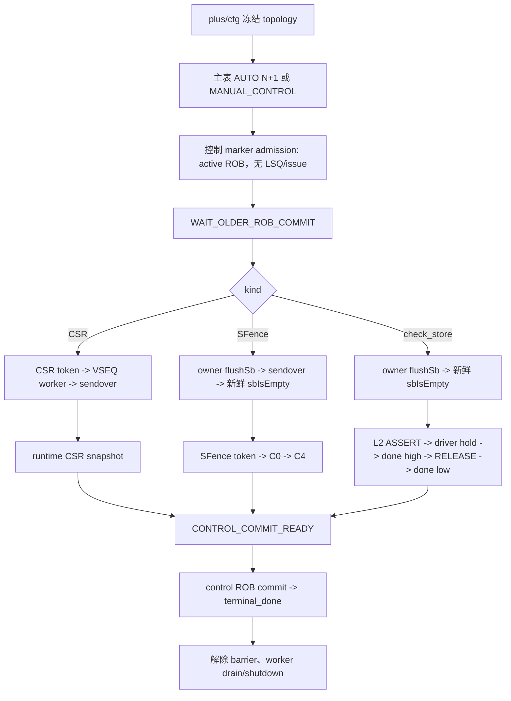

# CSR/SFence/`check_store` ROB 控制屏障 Implementation Review

| 项目 | 内容 |
|---|---|
| review 日期 | 2026-08-14 |
| review 范围 | `a6a48cf4a^..d92d3a431`，20 个本地实现提交、36 个变更文件 |
| 关联 plan | `AI_DOC/plan/test_framework/plan/do/csr_sfence_check_store_rob_control_coding_plan_20260813.md` |
| review 结论 | 未发现阻塞实现正确性的缺陷；可以归档 plan。 |
| 代码范围 | `mem_ut/ver/ut/memblock` 的 dispatch、CSR/Fence/ctrl/DCache agent、plus/cfg、VSEQ/testcase 和远端 plusarg 转发。 |

## 1. 专有名词与抽象职责

| 名词 | 当前语义 | 代码落点与示例 |
|---|---|---|
| control marker | `op_class` 为 CSR、SFence 或 `check_store` 的主表条目；占 UID/ROB，但不进入普通 LSQ/issue。 | `memblock_dispatch_types.sv`、`common_data_transaction::activate_control_uid()`。 |
| control topology | 由 `MEMBLOCK_CONTROL_WORKER_TOPOLOGY_MODE` 冻结的四态运行拓扑。 | `seq_csr_common`、`memblock_sync_pkg`；0/1/2/3 分别为 disabled/auto/manual/manual-control。 |
| static barrier | `WAIT_OLDER_ROB_COMMIT` 的控制 marker。它等待前序连续 commit，但尚未创建动态 action owner。 | redirect 命中该状态时只 preserve，不 reissue。 |
| action owner | `uid + dynamic_epoch + action_generation + kind` 的唯一动作身份。 | CSR/SFence token、owner `flushSb` completion、L2 release 都使用同一比较函数。 |
| sendover | `finish_item()` 返回后确认 sequence/driver 交付完成的边界。它不等于 monitor 完成。 | CSR sendover、SFence sendover、`flushSb` sendover。 |
| runtime CSR snapshot | CSR monitor 已观察到的当前 runtime CSR 状态与单调序号。 | CSR 控制完成时归档该 snapshot，不归档发送 xaction。 |
| C0/C4 | SFence monitor 记录的发送采样与 L2TLB lifecycle 生效记录。 | SFence 只能在 C4 effective 后 commit-ready。 |
| `l2_flush_level_hold` | CSR driver 私有的完整 CSR baseline 与 owner。 | ASSERT 后 idle 周期保持 `flush_l2_enable=1`；RELEASE owner 匹配后清除。 |

本特性的核心抽象职责是：在现有 dispatch 框架中增加一类不进入 LSQ/issue 的 ROB 顺序标记；控制 service 只推进当前 barrier，worker 只从持久队列消费 token，agent monitor 只发布原始事实，driver 只驱动接口与私有 hold。该职责划分避免 CSR/Fence/monitor 同时写 `status_transaction`。

## 2. 范围覆盖与总体 Flow



### 文件覆盖检查

| 文件或文件组 | review 判断 |
|---|---|
| `seq/base_seq_help/memblock_dispatch_types.sv`、`status_transaction.sv` | 新增控制分类、owner、completion profile、状态字段；枚举值连续追加且 reset 初始化完整。 |
| `common_data_transaction.sv` | 增加自动建表、control admission/redirect preserve/retire、token FIFO、owner `flushSb` lifecycle、C0/C4 record、worker drain；是本 review 的主要状态所有者。 |
| `memblock_control_barrier_service.sv` | 新增唯一控制状态推进者；按 active UID 而非全表扫描推进。 |
| `memblock_lsqenq_dispatch_base_sequence.sv`、`issue_queue_scheduler.sv` | 在普通 LSQ/issue 前识别 control marker，避免对控制条目调用普通 behavior 推导。 |
| `lsq_commit_handler.sv`、`memblock_lsqcommit_dispatch_base_sequence.sv` | 新增 control ROB commit/retire 分支及 `flushSb` attached/sendover 边界；普通 commit 逻辑继续复用。 |
| `memblock_dispatch_base_sequence.sv`、`memblock_main_dispatch_auto_build_main_table_base_sequence.sv`、`memblock_main_dispatch_manual_main_table_sequence.sv`、`memblock_main_dispatch_manual_control_main_table_sequence.sv` | 实现 AUTO/MANUAL/MANUAL_CONTROL 建表分流、bootstrap 与 service 生命周期。 |
| `memblock_csr_control_base_sequence.sv`、`memblock_sfence_control_base_sequence.sv` | 新增持久 token worker；CSR/SFence payload 扩展入口固定，sendover 不等于 monitor completion。 |
| `csr_ctrl_agent_agent_xaction.sv`、`csr_ctrl_agent_agent_driver.sv`、`csr_ctrl_agent_agent_monitor.sv` | CSR xaction 增加非 DUT L2 metadata；driver 是 L2 level 唯一写者；monitor 发布 runtime snapshot/reset ack。 |
| `dcache_agent_agent_monitor.sv`、`io_mem_to_ooo_ctrl_agent_agent_monitor.sv`、`memblock_sync_pkg.sv` | 发布 L2 done、`sbIsEmpty` observation、CSR baseline 与四方 reset handshake；monitor 不直接写 UID status。 |
| `env/plus.sv`、`seq_csr_common.sv`、`seq/plus_cfg/default.cfg`、`csr_sfence_check_store_rob_control.cfg`、`csr_sfence_check_store_manual_control.cfg` | topology 和六个 interval plus 走公共参数路径；default 为 disabled，专项 cfg 分别选 mode 1/3。 |
| `tc_dispatch_real_*` 三个 cfg、`seq.f`、`seq_pkg.sv` | direct-manual cfg 显式 mode 2；新增 helper/worker/VSEQ 已加入编译顺序。 |
| `memblock_dispatch_real_smoke_vseq.sv`、`memblock_dispatch_manual_control_vseq.sv`、`basicTest.sv`、`tc_base.sv` | 采用第二种方式：VSEQ 显式启动两个 worker；`basicTest` allowlist 只接受两个 active VSEQ，legacy testcase fail-fast。 |
| `sim/remote_eda_make.sh` | 修正多个 plusarg 的远端转发，防止专项 cfg/命令行组合只传递第一项。 |

## 3. 参数、主表与 admission review

### `seq_csr_common::initialize_control_worker_topology_from_plus()`

抽象功能描述：

该函数将已校验的 plus mode 一次性冻结到 `memblock_sync_pkg`。它不根据 testcase/VSEQ 推导模式，因此配置的单一权威来源保持在 plus 参数。

真实逻辑摘要：

```systemverilog
topology_mode = get_control_worker_topology_mode();
memblock_sync_pkg::initialize_control_worker_topology(
    topology_mode, caller_context);
```

中文伪代码：

```text
读取已通过范围检查的 mode 枚举。
把 mode 写入 sync_pkg 的 immutable snapshot；重复初始化仅允许值相同，否则 fatal。
后续 main sequence、VSEQ、worker 和 service 全部只读 snapshot，不能再改写 mode。
```

正确性检查：mode 参数与 interval 参数由 `plus.sv -> seq_csr_common -> cfg` 同步管理；mode 0 保持既有默认行为，mode 2 保护 direct-manual 既有场景。

### `build_control_auto_main_table()`

抽象功能描述：

该构建期 helper 生成固定总长度 `N+1` 的 AUTO 主表，在 UID `[0,N)` 内预约 CSR/SFence，在 UID `N` 固定生成 `check_store`，并保持连续 `robIdx`。

中文伪代码：

```text
校验 N、interval enable/min/max 和总长度不溢出。
分别初始化 CSR/SFence 的 next_uid 计划。
遍历 0 到 N-1：CSR 命中优先；冲突时消费两方旧目标并分别重新预约；越界目标停止该计划。
控制 slot 只构造 uid/op_class/robIdx 与无效 LSQ 字段；普通 slot 继续走既有随机生成。
最后分配 UID N 的 CHECK_STORE，初始化 status 并检查表完整性。
```

正确性检查：构建期为有限单次扫描，没有每拍全表扫描；CSR/SFence collision 和 interval out-of-range smoke 已通过。

### `activate_control_uid()` 与 `preserve_static_control_marker_on_redirect()`

抽象功能描述：

前者将控制 marker 纳入 active ROB/admission prefix，而不申请 LQ/SQ 或 issue work；后者在控制动作尚未开始时保留该静态 marker，防止普通 redirect 回滚误删除屏障。

真实逻辑摘要：

```systemverilog
if (status.control_state == MEMBLOCK_CONTROL_STATE_WAIT_OLDER_ROB_COMMIT) begin
    preserve_static_control_marker_on_redirect(uid, redirect);
    continue;
end
`uvm_fatal("CONTROL_REDIRECT", ...)
```

中文伪代码：

```text
redirect 扫描命中控制 UID 时，若仍在静态等待：保留 active ROB、robIdx、barrier 和 dynamic_epoch；
该 UID 不计入 oldest_flushed_uid，也不调用普通 reissue。
若控制动作已经绑定 owner，redirect 覆盖它直接 fatal；首版不支持取消半完成 CSR/SFence/L2 flush。
```

## 4. 控制 service 与 worker review

### `memblock_control_barrier_service::service_active_control_barrier()`

抽象功能描述：

该函数在每个 dispatch service tick 只读取当前 `active_control_barrier_uid` 的 status，根据控制状态消费已固化的 monitor/worker 事实。它不扫描历史主表、不直接驱动 CSR/Fence 接口。

真实逻辑摘要：

```systemverilog
if (commit_handler.commit_cursor_uid != uid) begin
    return;
end
bind_control_owner(status);
case (status.control_kind)
  MEMBLOCK_CONTROL_KIND_CSR: status.control_state = MEMBLOCK_CONTROL_STATE_CSR_CONFIG_PENDING;
  MEMBLOCK_CONTROL_KIND_SFENCE: status.control_state = MEMBLOCK_CONTROL_STATE_WAIT_FLUSHSB_REQ;
  MEMBLOCK_CONTROL_KIND_CHECK_STORE: status.control_state = MEMBLOCK_CONTROL_STATE_CHECK_STORE_FLUSHSB_PENDING;
endcase
```

中文伪代码：

```text
若当前 barrier 已 terminal_done，释放 barrier 并返回。
若处于 WAIT_OLDER_ROB_COMMIT：等待 commit_cursor 恰好到该 UID 且无 active redirect。
满足后分配不可复用的 action_generation，绑定 owner 与 control reset epoch，再按 kind 进入对应首状态。
其余状态只由 CSR/SFence/check_store 子服务读取精确 owner completion 推进。
```

正确性检查：使用 commit cursor 和单一 active UID，不存在高频全表扫描；普通 redirect 在静态阶段不会取消 marker，开始动作后的 redirect 显式 fatal。

### CSR worker 与 runtime snapshot 完成

抽象功能描述：

`memblock_csr_control_base_sequence` 从 `csr_control_action_q` 取 token。它只构造/驱动 CSR item，并在 sendover 后记录 expected payload；最终完成仍由 service 匹配 monitor runtime snapshot。

真实逻辑摘要：

```systemverilog
action.runtime_snapshot_seq_before_drive = runtime_seq_before_drive;
start_item(tr);
finish_item(tr);
data.mark_csr_control_sendover(action);
```

中文伪代码：

```text
worker 先查 token queue，空时等待 action/shutdown event，醒来后重查 queue。
普通 CSR profile 从 action-local runtime baseline 构造一个 SATP ASID 变化，清除旧 changed/write pulse。
在 start_item 前记录 latest snapshot seq；finish_item 后只把状态更新为 CSR_SENDOVER。
service 仅接受 seq 更大且 payload 等于 expected 的 monitor snapshot，归档该 observed snapshot 后置 CONTROL_COMMIT_READY。
```

正确性检查：发送 xaction 与归档 snapshot 分离；`flush_l2_enable` 不会误用 CSR snapshot 完成语义。

### SFence worker 与 C0/C4

抽象功能描述：

`memblock_sfence_control_base_sequence` 从持久 queue 取 token，先 arm C0 匹配、再完成接口交付；service 在 sendover 后消费 C0 record，最后只在 C4 effective record 到达时放开 commit。

真实逻辑摘要：

```systemverilog
action.pre_drive_event_seq = memblock_sync_pkg::last_allocated_l2tlb_event_seq;
action.l2tlb_reset_epoch_at_arm = memblock_sync_pkg::get_l2tlb_current_reset_epoch();
action.sfence_c0_match_armed = 1'b1;
data.arm_sfence_control_c0_match(action);
start_item(tr);
finish_item(tr);
data.mark_sfence_control_sendover(action);
```

中文伪代码：

```text
worker 在接口交付前冻结 L2TLB event/reset baseline，并注册同拍 C0 可匹配的 armed owner。
finish_item 后状态才成为 SFENCE_SENDOVER；armed 或 sendover 本身都不等于 C0/C4 完成。
service 读取匹配 owner 的 C0 record，转 WAIT_L2TLB_FLUSH_EFFECTIVE；
仅当 adapter 标记同一 event/reset epoch 的 C4 effective 后，进入 CONTROL_COMMIT_READY。
```

正确性检查：没有固定两拍 shortcut；控制 worker 由 VSEQ 唯一启动，generic fence producer 不会并发写同一 sequencer。

## 5. `flushSb` 与 `check_store` L2 flush review

### `send_lsqcommit_cycle()` 的 attached/sendover 边界

抽象功能描述：

LSQ commit sequence 是唯一 `flushSb` consumer。它把 request 合并到正常 lsqcommit item，并精确区分 request attached 与 driver sendover。

真实逻辑摘要：

```systemverilog
if (data.try_pop_flushsb_request(flushsb_req)) begin
    tr.io_ooo_to_mem_flushSb = 1'b1;
    data.mark_flushsb_request_attached_to_lsqcommit_xaction(flushsb_req, cycle);
end
start_item(tr);
finish_item(tr);
if (has_flushsb_progress) begin
    data.mark_flushsb_request_driver_sendover(flushsb_req, cycle);
end
```

中文伪代码：

```text
global flush/redirect 阻塞时不 pop request。
成功 pop 后先记录 attached，此时旧 high sbIsEmpty 不能结束 request。
finish_item 返回才记录 sendover，保存当前 observation 序号，并打开 waiting-empty capture。
同一 xaction 仍可携带普通 commit；未新增第二个 driver 或 direct DUT signal consumer。
```

### `update_sb_is_empty(raw)`

抽象功能描述：

该函数将 immutable ctrl raw 转为 request completion。owner request 写 completed slot，由 service 消费；normal request 保持既有直接收尾语义。

真实逻辑摘要：

```systemverilog
if (flushsb_waiting_empty && raw.sb_is_empty &&
    raw.sb_is_empty_observation_seq >
        active_flushsb_req.sb_is_empty_observation_seq_at_sendover) begin
    if (active_flushsb_req.owner_valid) begin
        flushsb_completed.valid = 1'b1;
        flushsb_completed.req_id = active_flushsb_req.req_id;
        flushsb_completed.owner = active_flushsb_req.owner;
    end
    flushsb_waiting_empty = 1'b0;
    active_flushsb_req_valid = 1'b0;
end
```

中文伪代码：

```text
只在 active request 已 sendover、raw level=1 且 raw observation 序号更新时完成。
无 owner request 直接清 active；owner request 先写唯一 completed slot，再清 active。
service 使用 req_id + owner 取 completion；不匹配的 periodic/directed request 不能推进 SFence/check_store 状态。
```

### `check_store` ASSERT/hold/RELEASE

抽象功能描述：

check_store 先完成 owner `flushSb`，再走 `L2_FLUSH_LEVEL` profile。worker 只发送一次 ASSERT 与一次 RELEASE，CSR driver 是高电平唯一写者。

真实逻辑摘要：

```systemverilog
// ASSERT item 到 driver 后建立 hold
drive_pkt_fields(tr);
capture_l2_flush_level_hold(tr);

// driver idle 路径
if (l2_flush_level_hold_valid) begin
    drive_l2_flush_level_hold();
    return;
end
```

中文伪代码：

```text
service 在 ASSERT 前要求 current L2 done observation 为低，并冻结 action-local CSR baseline。
ASSERT finish_item 后 worker 写 sendover baseline；driver 已深拷贝完整 baseline，idle 时继续驱动 flush_l2_enable=1。
service 仅接受 assert baseline 后的新 done=1，写有界 RELEASE request 并唤醒仍占有 CSR sequencer 的 worker。
RELEASE item 必须与 driver hold owner 完全匹配；driver 驱动 low 并清 hold。
service 仅接受 release baseline 后的新 done=0，随后才进入 CONTROL_COMMIT_READY。
```

正确性检查：worker 不连续发送 HOLD item，因此不存在 worker 与 driver 双重维护高电平；DCache monitor 是唯一 L2 done completion source，TopToBackendBypass done 仅用于 debug。

## 6. reset、shutdown 与 testcase 拓扑 review

### control runtime bootstrap/reset

抽象功能描述：

`initialize_control_runtime_bootstrap()` 在 control 主表完成后发起一次 epoch request；CSR driver、CSR monitor、DCache monitor 和 ctrl monitor 分别 ack。ready 后还必须等 CSR monitor 发布 current-epoch runtime baseline。

中文伪代码：

```text
AUTO 或 MANUAL_CONTROL 建表完成：清未交付 action runtime，发布 reset request。
四个独立 writer 观察 request：driver 清私有 hold；三条 monitor 首个 sample 只 ack，不发布可消费完成事实。
四方 ack 齐备：sync_pkg 打开 ready；后续 sample 才发布 CSR/sbIsEmpty/L2 done observation。
若任一 UID 已 admission 后发生 physical/L2TLB reset：首版 fatal，不部分清 control 状态后继续旧 ROB 表。
```

### VSEQ 显式 worker 与 shutdown

抽象功能描述：

`basicTest` 在 build 阶段解析 `VSEQ_MAIN`、冻结 plus mode 并校验 allowlist；两个专项 VSEQ 在同一 fork/join 生命周期内显式启动 main dispatch、responders 和 CSR/Fence worker。worker shutdown 与 global stop 解耦。

真实逻辑摘要：

```systemverilog
if (uses_explicit_control_workers()) begin
    `uvm_do_on(csr_control_seq, p_sequencer.csr_ctrl_sqr)
end
if (uses_explicit_control_workers()) begin
    `uvm_do_on(sfence_control_seq, p_sequencer.fence_sqr)
end
```

中文伪代码：

```text
active topology 只允许 basicTest + real-smoke VSEQ 或 manual-control VSEQ。
VSEQ 使用 p_sequencer 的真实 CSR/Fence sequencer 启动唯一 worker；agent phase default_sequence 仅保留无 producer idle base，防止 fallback 竞争。
主 service 先确认 terminal prefix 与 control action drain，再触发 worker shutdown event。
worker 醒来后重查 queue，确认无 in-flight token 后发布 exited ack；runtime_drain_complete 收到两个 ack 后才允许 global stop。
```

正确性检查：避免全局 stop 等 worker、worker 又等 global stop 的循环依赖；mode 0/2 不要求不存在的 worker ack。

## 7. 实现与 Plan 不一致项

### 7.1 worker 启动方式

| 必填项 | 内容 |
|---|---|
| Plan 原有逻辑 | 原始正文要求 testcase build/config 以 agent phase `default_sequence` 覆盖 CSR/Fence worker，并允许 `tc_dispatch_real_smoke` 进入 AUTO。 |
| 当前源码逻辑 | worker 只由 `basicTest` 的 `memblock_dispatch_real_smoke_vseq` 或 `memblock_dispatch_manual_control_vseq` 通过 `p_sequencer` 显式启动；`tc_dispatch_real_smoke` 在 active mode fail-fast。 |
| 不一致原因 | 用户确认采用第二种方式；该方式符合项目 VSEQ 规则，消除 phase default 与显式 producer 并发。 |
| 源码位置 | `seq/virtual_sequence/memblock_dispatch_real_smoke_vseq.sv`、`seq/virtual_sequence/memblock_dispatch_manual_control_vseq.sv`、`tc/src/basicTest.sv`。 |
| 处理结论 | 保持当前实现；plan 已在 `IMPLEMENTATION_DELTA` 和实现状态说明中修正。 |

中文伪代码：

```text
basicTest 读取 +VSEQ_MAIN 和 plus mode；mode 为 active 时先检查 VSEQ 是否在允许集合中。
允许的 VSEQ 在自身 fork/join 内启动 worker，且 worker 与 main dispatch/responders 同时收敛。
legacy testcase/VSEQ 不能通过 mode 自动获得 worker；请求 active mode 立即 fatal。
```

### 7.2 helper 初始化边界

| 必填项 | 内容 |
|---|---|
| Plan 原有逻辑 | 假设 child main sequence 的 `pre_body()` 一定执行，在其中初始化 control service 与 dispatch helper。 |
| 当前源码逻辑 | `ensure_dispatch_runtime_helpers()` 同时由 `pre_body()` 与建表入口调用，幂等完成初始化。 |
| 不一致原因 | `uvm_do_on()` child 启动使用 `call_pre_post=0`，只依赖 `pre_body()` 会造成 AUTO bootstrap 空对象访问。 |
| 源码位置 | `seq/base_seq_help/memblock_dispatch_base_sequence.sv`。 |
| 处理结论 | 保持当前实现；这是保证第二种 VSEQ 启动方式可用的必要修正。 |

中文伪代码：

```text
任何进入 build_main_table 的路径先调用 ensure helper。
首次调用构造 data/handler/adapter/control service，后续调用只复用现有对象。
该函数不分配 UID、不建表、不推进 control state，因此不会与正常运行期流程重复执行。
```

## 8. Plan 未说明但 Coding 落实的细节

### 8.1 enum sentinel 显式初始化

| 必填项 | 内容 |
|---|---|
| 细节功能 | 为 control enum/owner 默认值显式初始化，避免 4-state 未定义值进入 mode/状态比较。 |
| 为什么 plan 未覆盖 | plan 描述枚举与状态语义，但未展开 SystemVerilog default/struct 初始化细节。 |
| 在本特性中的作用 | 避免首次 bootstrap 前错误把 X 当成 active topology 或有效 owner。 |
| 源码位置 | `memblock_sync_pkg.sv`、`memblock_dispatch_types.sv`、`status_transaction.sv`。 |
| 是否需要回写 plan | 已在 plan implementation delta 的初始化说明中体现；无需再扩大正文。 |

中文伪代码：

```text
初始化时把 topology、owner.valid、control kind/state 和各 observation 槽设为确定哨兵值。
所有 consumer 先检查 valid/epoch/owner，再读取 payload；无效值不允许推进状态。
```

### 8.2 多 plusarg 远端转发

| 必填项 | 内容 |
|---|---|
| 细节功能 | 远端 make 包装保留多个 plusarg，不只转发第一个。 |
| 为什么 plan 未覆盖 | plan 只规定参数语义，未涉及远端 shell 参数拼接实现。 |
| 在本特性中的作用 | CSR/SFence interval、mode 与原有 runtime plus 可以同时抵达 simv。 |
| 源码位置 | `mem_ut/ver/ut/memblock/sim/remote_eda_make.sh`。 |
| 是否需要回写 plan | review 记录即可；它是运行基础设施修复，不改变 feature flow。 |

中文伪代码：

```text
make 入口收集全部 plusarg，按原有 quoting 传给远端执行脚本。
远端 simv 接收 mode、interval 与既有资源参数的完整集合，不因 shell 只保留首项而改变专项配置。
```

## 9. 验证与剩余风险

| 场景 | 结果 |
|---|---|
| AUTO `check_store` | 正常结束，`UVM_ERROR=0`、`UVM_FATAL=0`。 |
| 固定 CSR interval | 正常结束，runtime CSR completion 链通过。 |
| 固定 SFence interval | 正常结束，日志出现 owner `flushSb` sendover/completion 与 L2TLB C4 apply。 |
| CSR/SFence 同 UID | CSR 优先，正常结束。 |
| interval 超主表范围 | 无控制 interval marker，末尾 `check_store` 正常收敛。 |
| mode 0 `basicTest + virtual_base_sequence` | legacy disabled flow 正常结束。 |
| mode 2 legacy manual testcase | `tc_dispatch_real_mixed_wb_smoke` 正常结束。 |
| mode 3 `basicTest + memblock_dispatch_manual_control_vseq` | CSR、SFence、`check_store` 顺序完成，正常结束。 |

已检查日志位于 `mem_ut/ver/ut/memblock/sim/base_fun/log/`，包括：

- `...rtl_csr_interval.log`
- `...rtl_sfence_interval.log`
- `...rtl_csr_sfence_collision.log`
- `...rtl_interval_out_of_range.log`
- `...rtl_control_mode_manual_control.log`

所有上述正常场景 UVM summary 均为 `UVM_ERROR : 0`、`UVM_FATAL : 0` 并自然 `$finish`。此前 `make eda_run` 的 VCS incremental compile 曾发生 `SIGSEGV`，因此使用成功编译后的 `eda_batch_run` 完成专项运行；这不改变已生成 simv 的仿真结论。

静态检查：`git diff --check a6a48cf4a^..d92d3a431` 已通过；旧 `mark_flushsb_driven()` 调用已从源码清除。

剩余风险：本轮使用 `fsdb_reader` 无法打开本地保留的 control smoke FSDB，故没有把 `flush_l2_enable` 高电平持续区间做信号级波形审计。代码、monitor observation 和日志已覆盖 ASSERT/RELEASE/done 闭环；后续若需波形签核，应在可读取 FSDB 的 EDA 节点抽查 ASSERT、idle hold、RELEASE、done high/low 四个边界。

## 10. 非本次修改的逻辑分析

`git status --short` 中仍有未跟踪文件：

| 类别 | 文件 | 判断 | 原因 |
|---|---|---|---|
| 其他分析文档 | `AI_DOC/analysis/rtl/riscv_vector_register_state_analysis_20260814.md` | 非本次 review | 与 CSR/SFence/check_store 测试框架实现无关，未纳入本次提交或正确性判断。 |

最终结论：实现覆盖 control marker 建表、ROB/admission、CSR runtime snapshot、SFence C0/C4、owner `flushSb` 新鲜度、`check_store` L2 hold/release、bootstrap/reset、VSEQ worker lifecycle 与 worker shutdown。未发现需要回改源码的 blocker；plan 可从 `undo` 归档到 `do`。
