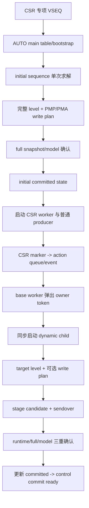

# MemBlock CSR Sequence 搭建与嵌入 Implementation Review

| 项目 | 内容 |
|---|---|
| review 日期 | 2026-09-03 |
| 关联计划 | `/nfs/home/wangyan/Mem_env_work_20260716/csr_analysis/csr_sequence_plan_record/memblock_csr_sequence_current_plan.md` |
| 实现提交 | `67fba5359` (`mem_ut: add staged CSR configuration sequences`) |
| 源码范围 | `mem_ut/ver/ut/memblock` 的 CSR sequence/helper、control service、CSR agent、plus/cfg、VSEQ/test 接入 |
| 文档范围 | `csr_runtime_sync_flow.md`、`mem_ut_parameter_management.md`、`plus_demo_migration_plan.md` |
| review 结论 | 核心功能、专项隔离和旧路径回归均已闭环；跨节点 VCS 编译及专项/legacy 仿真通过。 |

## 1. 术语与抽象功能说明

| 英文术语 | 当前文档中的中文含义 | 对应代码对象或落点 | 使用场景/示例 |
|---|---|---|---|
| `initial sequence` | 普通请求前一次性完成完整 CSR 与 PMP/PMA 初始化的 sequence | `memblock_csr_initial_config_sequence` | main table/control bootstrap 完成后启动，完成后放开 LSQ/issue |
| `dynamic child` | 每个 CSR marker 触发一次、由 base worker 同步调用的动态配置子 sequence | `memblock_dynamic_csr_change_sequence` | UID 8 action generation 1 只创建一个 child |
| `action owner` | 唯一标识一次 control action 的 UID、动态代际、动作代际和类型 | `memblock_control_owner_t` | candidate 只能由 owner 完全相同的 status 提交 |
| `committed state` | 已通过完整 CSR 和 PMP/PMA observation 确认的净化 level/profile | `csr_committed_state`、`csr_committed_pmp_pma_profile` | 下一次动态随机以它为唯一基线 |
| `candidate` | 已发送但还未满足提交条件的动态目标 | `csr_dynamic_candidate_*` | full snapshot 未跨过 drive sample 时保持 pending |
| `full snapshot` | monitor 同拍采集 92 个 DUT CSR 输入形成的 587-bit observation | `memblock_csr_full_snapshot_t` | 对比动态 clean candidate 的全部字段 |
| `runtime snapshot` | 既有 MMU CSR 窄镜像及单调序号 | `dispatch_raw_csr_t`、`latest_runtime_csr_snapshot` | legacy control completion 与 TLB runtime 更新继续使用 |
| `write plan` | normal/exception region 到有序 PMP/PMA RMW CSR 写拍的转换结果 | `memblock_csr_pmp_pma_write_plan::beats` | entry 0/2 为 OFF lower，entry 1/3 为 TOR top |
| `CSR level hold` | driver 在专项 item 间保持完整净化 CSR level 的私有状态 | `csr_level_hold_tr` | 动态 `111` 后下一拍保持相同配置并清 changed 为 `000` |
| `special lifecycle` | 只在新增 CSR VSEQ 内有效的专项开关生命周期 | `csr_special_sequence_active` | 非专项 real/manual/sanity 不进入新 hold/commit 分支 |

## 2. 需求、范围与总体流程

本次修改实现两条职责分离的 sequence：启动期 sequence 完成静态配置，运行期动态 child 由既有 control action event 触发。`memblock_csr_control_base_sequence` 没有被改造成随机 CSR sequence，仍然拥有 action queue、L2 flush 和 shutdown 生命周期。



### 2.1 文件覆盖检查

| 文件或文件组 | 功能特性、修改前逻辑与修改后逻辑 | 正确性检查与风险边界 |
|---|---|---|
| `memblock_dispatch_types.sv` | 修改前没有 CSR sequence 配置/profile/write beat 类型；修改后新增冻结配置、PMP/PMA profile 和写拍值类型。 | 只增加 seq package 类型，不改变 DUT interface 或已有枚举值。 |
| `memblock_csr_config_state.sv` | 修改前依赖 xaction 默认/零值零散构造；修改后函数 A 显式写 92 个 DUT 字段和 1 个 transaction-only TP 字段，并提供固定根、净化与统一 pack。 | 机器检查 transaction 字段 93、builder 赋值 93；monitor/full expected pack 均为同序 92 字段。 |
| `memblock_csr_randomizer.sv` | 修改前没有联合 profile 求解或 PMP/PMA write plan；修改后 initial/dynamic 都只调用一次 `randomize()`，关闭组复制 committed。 | 权重/范围提前检查，`W -> R`、依赖关系和 dynamic 必须实际变化均为求解约束。 |
| `plus.sv`、`seq_csr_common.sv`、`default.cfg` | 修改前只有 3 个 CSR marker 调度参数；修改后 `MEMBLOCK_CSR_*` 共 110 项并形成 define/load/default/frozen snapshot 的一一映射。 | default 不启用专项 VSEQ；公共 helper 只读冻结 cfg，driver/monitor 不读 plus。 |
| `memblock_csr_initial_config_sequence.sv` | 修改前没有启动期完整配置；修改后在 producer 前发送静态 level/write plan并等待 observation。 | initial done 前其它 producer 均阻塞；CSR sequencer 没有双 producer 窗口。 |
| `memblock_dynamic_csr_change_sequence.sv` | 修改前 base worker 直接构造 SATP ASID+1；修改后该兼容策略移入 child legacy 分支，专项分支实现六组动态配置。 | 非专项仍走旧策略；专项 candidate 只登记不直接提交。 |
| `memblock_csr_control_base_sequence.sv` | 修改前普通 CSR 分支直接生成/发送；修改后 factory 创建并同步 start 动态 child；L2 flush 与 shutdown 留在 base。 | child 返回前不弹下一 token；L2 ASSERT/RELEASE owner 和 hold 状态不迁移。 |
| `common_data_transaction.sv` | 修改前没有 CSR committed/candidate/profile；修改后公共对象持有唯一已确认基线和一个 pending candidate。 | owner、sample、full payload、PMP/PMA model 全匹配才原子提升；reset 清空全部新增状态。 |
| `memblock_control_barrier_service.sv` | 修改前窄 runtime snapshot 匹配后直接 control-ready；修改后专项路径再调用 candidate 完整确认。 | legacy 没有 candidate 时不进入新检查；control status 仍由 service 唯一推进。 |
| `memblock_sync_pkg.sv` | 修改前只有窄 runtime CSR；修改后增加 special lifecycle、587-bit full snapshot 与 PMP/PMA write raw FIFO。 | monitor 是 observation 唯一写者；sequence/service 只读，不伪造 DUT observation。 |
| `csr_ctrl_agent_agent_monitor.sv` | 修改前发布窄 runtime 与 history；修改后同拍另发布完整 payload和 distributed write fact。 | 完整 pack 与 expected pack 字段顺序静态比对一致；旧 runtime 发布条件未删除。 |
| `csr_ctrl_agent_agent_driver.sv` | 修改前 idle 会恢复默认，无法保持完整随机 level；修改后仅专项保存净化 level，并把 changed 限制为一拍。 | 优先级 `L2 flush hold > CSR hold > 原 idle`；两类 reset 均清 hold，非专项分支不增加等待。 |
| `memblock_csr_random_config_vseq.sv` | 修改前 real smoke 同时启动所有 producer；修改后新增专用 VSEQ，main/initial 先启动，done 后才启动其余 producer。 | 强制 AUTO topology、main memory range 和 PMA/PMP model；只该 VSEQ设置 special lifecycle。 |
| `tc_memblock_csr_random_config.cfg` | 新增六组全开、多 CSR marker、exception region 的专用 preset。 | 当前 `priv_virt` 固定 0 以匹配既有预建 TLB map；U/S/M 仍可随机。 |
| `seq.f`、`seq_pkg.sv`、`basicTest.sv` | 新 helper/sequence/VSEQ 按依赖顺序编译，并只把新 VSEQ 加到 active topology allowlist。 | 不改已有 testcase 名称或 default sequence 安装。 |
| 三份参数/flow 文档 | 修改前没有本功能记录且 plus 文档的 PMP/PMA non-goal 已过时；修改后同步真实链路、110 项参数分组和专项边界。 | 文档函数名、状态名和验证日志均与当前源码一致。 |

## 3. 静态配置、随机配置与参数管理

### 3.1 `configure_static_defaults()` 与一次联合求解

抽象功能描述：`configure_static_defaults()` 为全部 CSR 字段建立显式确定基线；`memblock_csr_randomizer` 随后只覆盖计划允许随机的 ATP、权限、priv context、13 个 enable 和 region 属性，不拥有 driver 或 observation 状态。

源码位置：`mem_ut/ver/ut/memblock/seq/base_seq_help/memblock_csr_config_state.sv`，函数：`configure_static_defaults()`。

```systemverilog
tr.io_ooo_to_mem_tlbCsr_satp_mode = 4'h0;
tr.io_ooo_to_mem_tlbCsr_satp_changed = 1'b0;
tr.io_ooo_to_mem_csrCtrl_pf_ctrl_l2_pf_enable = 1'b1;
tr.io_ooo_to_mem_csrCtrl_pf_ctrl_l1D_pf_enable = 1'b1;
tr.io_ooo_to_mem_csrCtrl_power_down_enable = 1'b0;
tr.io_ooo_to_mem_csrCtrl_flush_l2_enable = 1'b0;
tr.io_ooo_to_mem_csrCtrl_distribute_csr_w_valid = 1'b0;
tr.io_ooo_to_mem_csrCtrl_hd_misalign_ld_enable = 1'b1;
tr.io_ooo_to_mem_csrCtrl_hd_misalign_st_enable = 1'b1;
```

中文伪代码：

```text
该函数先把 ATP、权限和所有普通 payload 写成明确静态值。
再按指南把正常功能 enable 写为 1，把 unused、trigger、power-down 和 flush 动作字段写为 0。
最后清除 distributed write、changed 和其它协议脉冲，使初始 transaction 不依赖 rand soft constraint 或旧 item 残留。
```

源码位置：`mem_ut/ver/ut/memblock/seq/base_seq_help/memblock_csr_randomizer.sv`，约束：`c_dynamic_must_change`。

```systemverilog
constraint c_dynamic_must_change {
    if (dynamic_mode) {
        cfg.change_satp_enable || cfg.change_vsatp_enable ||
        cfg.change_hgatp_enable || cfg.change_permission_enable ||
        cfg.change_priv_context_enable || cfg.change_pmp_pma_enable;
        (cfg.change_satp_enable &&
            (satp_mode != cur_satp_mode || satp_asid != cur_satp_asid)) ||
        (cfg.change_vsatp_enable &&
            (vsatp_mode != cur_vsatp_mode || vsatp_asid != cur_vsatp_asid)) ||
        (cfg.change_hgatp_enable &&
            (hgatp_mode != cur_hgatp_mode || hgatp_vmid != cur_hgatp_vmid)) ||
        (cfg.change_permission_enable &&
            (mxr != cur_mxr || sum != cur_sum || vmxr != cur_vmxr || vsum != cur_vsum)) ||
        (cfg.change_priv_context_enable &&
            (priv_virt != cur_priv_virt || priv_imode != cur_priv_imode ||
             priv_dmode != cur_priv_dmode)) ||
        (cfg.change_pmp_pma_enable &&
            (pmp_r != cur_region.pmp_r || pmp_w != cur_region.pmp_w ||
             pmp_x != cur_region.pmp_x || pma_c != cur_region.pma_c ||
             pma_atomic != cur_region.pma_atomic));
    }
}
```

中文伪代码：

```text
该约束先要求动态六组中至少一组启用。
然后只比较已启用组与 committed 基线；至少一个字段必须不同。
关闭组由其它约束等于 current value，不会靠随机后修复改变。
如果所有正权重候选只能得到当前组合，randomize 返回失败，sequence 在首包前 fatal。
```

### 3.2 参数完整性和失败边界

`seq_csr_common::check_csr_sequence_cfg()` 统一检查 0/1 pair、三态 mode 权重、ASID/VMID 范围、六组动态开关和 PMP/PMA 属性。normal/exception region 的对齐、溢出、平台 PMEM、48-bit PA、固定根覆盖和不重叠条件由 `check_region_profile()` 在 `start_item()` 前检查。

参数集合静态结果：`plus.sv define=110`、命令行 load=110、`default.cfg=110`、`memblock_csr_sequence_cfg_t` snapshot/load=110，集合无缺项或多项。固定 0 字段未进入 enable allowlist。

## 4. Initial 与 Dynamic Sequence 调度

### 4.1 启动顺序

抽象功能描述：专项 VSEQ 使 main sequence 先提供主表、control bootstrap 和 monitor service；initial sequence 完成后，其余 producer 才解除 barrier。

源码位置：`mem_ut/ver/ut/memblock/seq/virtual_sequence/memblock_csr_random_config_vseq.sv`，task：`start_core_dispatch_flow()`。

```systemverilog
fork
    begin
        `uvm_do_on(main_seq, p_sequencer)
    end
    begin
        `uvm_do_on(initial_csr_seq, p_sequencer.csr_ctrl_sqr)
        `uvm_do_on(csr_control_seq, p_sequencer.csr_ctrl_sqr)
    end
    begin
        wait_for_initial_config(data);
        `uvm_do_on(lsqenq_seq, p_sequencer.lsqenq_sqr)
    end
    begin
        wait_for_initial_config(data);
        `uvm_do_on(issue_seq, p_sequencer.lintsissue_sqr)
    end
    begin
        wait_for_initial_config(data);
        `uvm_do_on(l2tlb_seq, p_sequencer.L2tlb_sqr)
    end
join
```

中文伪代码：

```text
main sequence 立即启动并建立主表、control runtime 和 monitor service。
CSR 分支先在 csr_ctrl_sqr 运行 initial sequence；它返回后才在同一分支启动长期 base worker。
LSQ enqueue、issue、commit、L2TLB 和 SFence 各自先等待 csr_initial_config_done，再启动自己的 sequence。
因此 initial 独占 CSR sequencer，普通 request 不会在完整配置提交前进入 DUT。
```

### 4.2 base worker 调用 dynamic child

抽象功能描述：base worker 在 event 唤醒并从持久 queue 弹出普通 CSR token 后，同步运行动态 child。它不把 `csr_change` marker 转成第二套事件协议。

源码位置：`mem_ut/ver/ut/memblock/seq/base_seq/memblock_csr_control_base_sequence.sv`，task：`body()`。

```systemverilog
dynamic_csr_seq = memblock_dynamic_csr_change_sequence::type_id::create(
    $sformatf("dynamic_csr_uid_%0d_gen_%0d", action.owner.uid,
              action.owner.action_generation));
if (dynamic_csr_seq == null)
    `uvm_fatal(get_type_name(), "failed to create dynamic CSR child sequence")
dynamic_csr_seq.set_action(action);
dynamic_csr_seq.start(m_sequencer, this);
```

中文伪代码：

```text
base worker 用 token owner 生成可追踪的 child 名称并经 factory 创建对象。
创建失败立即 fatal；成功后把完整 action context 交给 child。
在当前 CSR sequencer 上同步 start；child 返回之前 base worker不会弹出下一 token。
```

### 4.3 dynamic child 的兼容与专项分支

修改前 SATP ASID+1 逻辑位于 base worker；修改后原行为原样迁入 `run_legacy()`。只有 `csr_special_sequence_active=1` 时，child 才读取 committed state、执行六组动态求解、三路 changed=111、PMP/PMA write plan 和 candidate staging。

正确性检查：legacy real-smoke、ROB-control 和 manual-control 仿真均没有 `MEMBLOCK_CSR_*_AUDIT` 专项日志，也没有 CSR level hold；专项日志中每个 marker 恰好出现一次 dynamic child。

## 5. Observation、提交与 Driver 边界

### 5.1 candidate 提交

抽象功能描述：`commit_csr_dynamic_candidate_if_observed()` 是 candidate 到 committed 的唯一转换入口，只由 control service 在窄 runtime snapshot 已匹配后调用。

源码位置：`mem_ut/ver/ut/memblock/seq/base_seq_help/common_data_transaction.sv`。

```systemverilog
service_csr_pmp_pma_write_observations();
if (!memblock_sync_pkg::get_latest_csr_full_snapshot(observed) ||
    observed.sample_seq <= csr_dynamic_candidate_after_sample)
    return 1'b0;
expected_payload = memblock_csr_config_state::pack_full_payload(
    csr_dynamic_candidate_state);
if (observed.payload != expected_payload)
    return 1'b0;
if (csr_dynamic_candidate_pmp_pma_required) begin
    plan = memblock_csr_pmp_pma_write_plan::type_id::create(
        "csr_dynamic_candidate_observation_plan");
    if (!plan.model_matches(pma_pmp_model, csr_dynamic_candidate_profile))
        return 1'b0;
end
publish_csr_committed_state(csr_dynamic_candidate_state);
publish_csr_pmp_pma_profile(csr_dynamic_candidate_profile);
csr_dynamic_candidate_valid = 1'b0;
return 1'b1;
```

中文伪代码：

```text
先按 DUT sample 顺序把 monitor 的 PMP/PMA write facts 回放到公共 model。
若 full snapshot 不存在或没有跨过本次 drive sample，返回 false并保持 control status 等待。
按固定 92 字段顺序打包 clean candidate；payload 不同继续等待。
若本次要求 PMP/PMA 变化，再核对四个 region entry；model 未完成时继续等待。
全部事实匹配后同时发布 CSR level/profile，清 pending candidate并返回 true；service 才允许 control commit。
```

### 5.2 driver hold 与非专项隔离

抽象功能描述：driver 专项 hold 解决 CSR agent 原 idle 值覆盖完整 level 的问题，并把 changed 事件限定到一个 drive 边界；它不改变 item 格式或已有 L2 flush owner 协议。

源码位置：`mem_ut/ver/ut/memblock/agent/csr_ctrl_agent_agent/src/csr_ctrl_agent_agent_driver.sv`，task：`drive_idle()`。

```systemverilog
if (l2_flush_level_hold_valid) begin
    drive_l2_flush_level_hold();
    return;
end
if (memblock_sync_pkg::csr_special_sequence_active && csr_level_hold_valid) begin
    drive_csr_level_hold();
    return;
end
if (drv_mode == tcnt_dec_base::DRV_0) begin
    vif.drv_mp.drv_cb.io_ooo_to_mem_tlbCsr_satp_mode <= '0;
    vif.drv_mp.drv_cb.io_ooo_to_mem_csrCtrl_hd_misalign_ld_enable <= 1'b1;
    vif.drv_mp.drv_cb.io_ooo_to_mem_csrCtrl_hd_misalign_st_enable <= 1'b1;
end
```

中文伪代码：

```text
idle 首先检查既有 L2 flush high hold；存在时继续驱动并返回，保持最高优先级。
否则只有 special lifecycle 和 CSR hold 同时有效时才保持完整净化 level。
两者都不存在时进入已有 drv_mode idle 赋值；因此普通 testcase 的默认接口行为不变。
reset_phase 和 control runtime reset 都调用 clear helper 清除两类私有 hold。
```

## 6. 正确性与非影响检查

| 检查点 | 结论 |
|---|---|
| sequence 结构 | helper 位于 `seq/base_seq_help`，initial/dynamic 位于 `seq/base_seq`，VSEQ 位于 `seq/virtual_sequence`，并按依赖顺序加入 `seq_pkg.sv/seq.f`。 |
| 动态触发位置 | 保留 `marker -> enqueue_csr_action -> queue/event -> base worker -> dynamic child`；没有把 base worker 改造成随机 sequence。 |
| 单 producer | initial 与 base worker 在同一 fork 分支顺序启动；其它 producer 等 initial done。 |
| 静态字段保持 | dynamic target 从 committed 完整复制；randomizer 的 static enable 约束等于 current。 |
| observation 真源 | full snapshot/PMP-PMA raw 只由 monitor 发布；sequence 不直接修改 model或伪造观察。 |
| 原框架隔离 | special flag 只由新增 VSEQ 设置；driver、service 和 child 的新增行为均有该 flag gate。 |
| L2 flush | base worker 和 driver 保留原 ASSERT/RELEASE owner 与优先级；real/manual control 回归通过。 |
| reset/shutdown | common data reset 清 candidate/committed，driver reset 清 hold，base worker exit 分支未改变。 |
| 远程仓库 | 已创建本地实现提交 `67fba5359`；未执行 fetch、pull、push 或 rebase。 |

## 7. 验证记录

| 验证 | 命令或日志 | 结果 |
|---|---|---|
| 静态格式 | `git diff --check` | 通过。 |
| 参数集合 | define/load/default/snapshot 集合检查 | 四处均为 110，集合一致。 |
| 字段覆盖 | xaction/builder 与 monitor/expected pack 脚本比对 | builder 93/93；DUT full payload 92/92，同序一致。 |
| 跨节点编译 | `make eda_compile REMOTE_HOST=172.28.10.101 tc=basicTest mode=base_fun` | VCS parse/elab/partition/link 通过，0 error。 |
| 默认 guard | `basicTest + virtual_base_sequence + default.cfg` | `TEST_PASS`，`UVM_ERROR=0`，`UVM_FATAL=0`。 |
| legacy real smoke | `memblock_dispatch_real_smoke_vseq + tc_dispatch_real_smoke.cfg` | `TEST_PASS`，无 error/fatal。 |
| legacy ROB control | `memblock_dispatch_real_smoke_vseq + csr_sfence_check_store_rob_control.cfg` | `TEST_PASS`，覆盖 owner flush 与 check_store。 |
| legacy manual control | `memblock_dispatch_manual_control_vseq + csr_sfence_check_store_manual_control.cfg` | `TEST_PASS`，无 error/fatal。 |
| CSR 专项 | `memblock_csr_random_config_vseq + tc_memblock_csr_random_config.cfg`，seed 666666 | `TEST_PASS`，`UVM_ERROR=0`，`UVM_FATAL=0`。 |
| 正向：Bare/Sv39、ID 最大值、M/U | initial 三组 ATP 固定 Bare/M，dynamic 固定 Sv39/Sv39x4、ASID=`0xffff`、VMID=`0x3fff`、U | `TEST_PASS`，一次 dynamic child 完整提交，无 error/fatal。 |
| 正向：Sv39/Sv48、ID 最小值、U/S | initial 固定 Sv39/Sv39x4、ASID/VMID=0、U，dynamic 固定 Sv48/Sv48x4、S | `TEST_PASS`，一次 dynamic child 完整提交，无 error/fatal。 |
| 负向：全零权重 | 覆盖 `CHANGE_SATP_*_WT=0/0/0` | 0ns `SEQ_CSR_CFG` fatal，未进入激励。 |
| 负向：非法 region | 覆盖未对齐 exception base | initial CSR 首包前 `invalid or overlapping exception` fatal。 |
| 负向：非法 PMP W/R | 强制 `R=0/W=1` | 0ns `PMP W=1 has no legal R=1 candidate` fatal。 |
| 负向：仅当前候选 | initial/dynamic SATP 均固定 Bare，其它 change group 关闭 | 首个 marker 的 dynamic child 报 `no non-current legal solution` fatal。 |

专项最终日志：`mem_ut/ver/ut/memblock/sim/base_fun/log/tc=basicTest_ts=memblock_csr_random_config_vseq_cfg=tc_memblock_csr_random_config_seed=666666_rtl_csr_random_config_final.log`。

关键计数为 initial sequence 1 次、dynamic child 3 次、PMP/PMA model write 48 次，即初始 12 次加三次动态各 12 次；enable audit 30 条，profile audit 16 条，weight audit 9 条。主表 25 个 UID 全部完成 compare/retire，仿真在 2402.8ns 正常结束。

正向定向 plusarg 已覆盖 Bare、Sv39/Sv39x4、Sv48/Sv48x4、ASID/VMID 最小值与最大值以及 U/S/M；默认专项 seed 另外完成三次带权限和 PMP/PMA 属性随机的动态提交。全部笛卡尔组合和统计分布仍由后续回归 seed matrix 收集，不在本次接入中硬编码 directed sequence。

## 8. Plan 对齐检查

关联计划路径：`/nfs/home/wangyan/Mem_env_work_20260716/csr_analysis/csr_sequence_plan_record/memblock_csr_sequence_current_plan.md`。

对齐结论：两条 sequence、base worker 调用动态 child、六个动态组、PMP/PMA 逐属性权重、专项 driver hold、central plus、独立 VSEQ、full observation 后提交和 legacy 隔离均已按计划实现。

### 8.1 实现与 Plan 不一致项

未发现实现与 Plan 不一致项；当前 coding 行为与对应 plan 保持一致。

### 8.2 Plan 未说明但 Coding 落实的细节

#### changed 下降沿不推进窄 runtime snapshot

细节功能：既有 `raw_csr_payload_changed()` 对 ATP changed 使用上升沿语义，`111 -> 000` 不单独推进窄 snapshot 序号。因此 action 的窄 expected payload 使用动态 item 的 `111`，而 full candidate/committed 使用 driver hold 的净化 `000`。

为什么 plan 未覆盖：计划规定 `000 -> 111 -> 000`，但未展开既有 runtime 去重函数的边沿实现。该细节是在端到端 barrier 验证中确认的兼容边界。

源码位置：`mem_ut/ver/ut/memblock/seq/base_seq/memblock_dynamic_csr_change_sequence.sv`。

```systemverilog
clean.copy(target);
memblock_csr_config_state::clear_protocol_metadata(clean);
action.expected_runtime_csr = memblock_csr_config_state::make_runtime_payload(target);
action.expected_runtime_csr_valid = 1'b1;
data.stage_csr_dynamic_candidate(action.owner, clean, target_region,
                                 baseline_sample, cfg.change_pmp_pma_enable);
```

中文伪代码：

```text
复制动态 target并清除 changed/write 等 pulse，得到 full snapshot最终应观察到的 clean level。
窄 runtime expected 从 changed=111 的 target 构造，使既有上升沿 snapshot completion 可以完成。
candidate 则保存 changed=000 的 clean level，只有 driver 下一拍 hold 被 full monitor 观察到后才提交。
```

处理结论：保持当前实现。它没有改变 legacy runtime 去重语义，也没有要求回改外部原始计划；本 review 和 flow 文档记录该边界。

#### 专项 cfg 暂不随机 `priv_virt=1`

细节功能：参数层完整保留 `priv_virt` 0/1 权重和动态组能力，但当前专项 preset 将 initial/change 的 1 权重设为 0。

为什么 plan 未覆盖：现有 AUTO 主表预建 TLB map 没有为运行期随机 stage-2 context 注册完整 entry；直接启用会把 CSR sequence 验证与 TLB map 扩展混为一项修改。

源码位置：`mem_ut/ver/ut/memblock/seq/plus_cfg/tc_memblock_csr_random_config.cfg`。

```text
+MEMBLOCK_CSR_INIT_PRIV_VIRT_0_WT=1
+MEMBLOCK_CSR_INIT_PRIV_VIRT_1_WT=0
+MEMBLOCK_CSR_CHANGE_PRIV_VIRT_0_WT=1
+MEMBLOCK_CSR_CHANGE_PRIV_VIRT_1_WT=0
```

中文伪代码：

```text
initial 与 dynamic 求解时 priv_virt 只能选择 0。
PRIV_CONTEXT group 仍开启，imode/dmode 的 U/S/M 候选继续参与随机并可形成实际变化。
框架参数能力没有删除；后续补齐 stage-2 map 后只需修改 cfg 权重，无需重编译。
```

处理结论：保持当前 preset，并已同步参数文档；不扩展本次计划到 L2TLB stage-2 map 重构。

#### 配置成功路径审计日志

细节功能：增加 constraint/payload version、seed、owner、权重、ATP/权限/root/region 和 30 个 enable 的结构化 UVM 日志。

为什么 plan 未覆盖：计划只概括“冻结 plusarg、seed”；配置指南明确要求成功路径可审计字段，coding 因此补齐集中日志 helper。

源码位置：`mem_ut/ver/ut/memblock/seq/base_seq_help/memblock_csr_randomizer.sv`，函数：`log_selected_profile()`。

```systemverilog
`uvm_info("MEMBLOCK_CSR_PROFILE_AUDIT",
          $sformatf("phase=%s constraint_version=memblock_csr_v1 payload_version=full92_v1 owner=%s random_seed=%0d constraint_solve_ok=1",
                    phase_name, owner, seed), UVM_LOW)
```

中文伪代码：

```text
每次求解成功且 region 已校验后，在首包发送前记录阶段、约束版本、full payload版本、owner、命令行 seed 和求解成功状态。
同一 helper 随后记录权重、选择值和 region；initial 额外逐项记录 30 个 enable 的 requested/reset/status/dependency。
日志不读取指令属性、请求翻译路径或独立系统 action payload。
```

处理结论：保留在 coding 与 review/flow 文档中，无需修改用户要求原封不动保存的计划记录。

## 9. 非本次修改的逻辑分析

### 9.1 git status 对比结论

本 review 创建前的 `git status --short` 共列出 22 个已修改/新增文件，全部属于本次 CSR sequence、专项配置、接入或配套文档范围；未发现用户已有但与本主题无关的源码修改。仿真 log、exec、coverage 等生成产物均被仓库 ignore，不纳入提交或源码 review。
