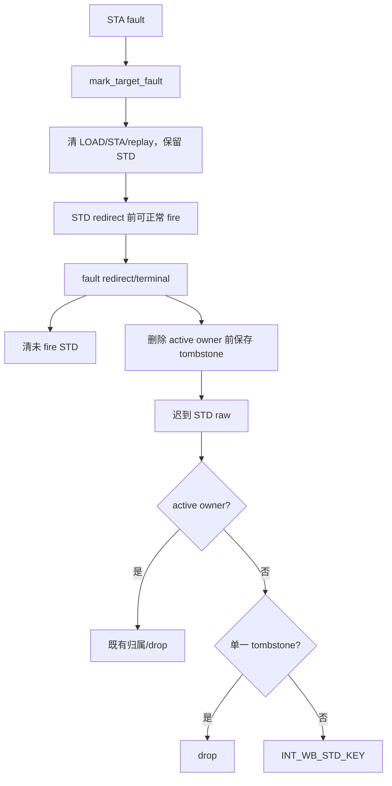

# MemBlock V2 fault/STD 生命周期 RTL 对齐实现 Review（2026-09-20）

**关联 plan**：`/nfs/home/lixiangrui/work/memblock_ut/XiangShan_V2/XiangShan/AI_DOC/plan/test_framework/plan/undo/memblock_v2_fault_std_lifecycle_rtl_alignment_plan_20260920.md`。  
**范围**：fault pending 的 STD issue、redirect 后未 fire STD 清理、late value-only STD raw 归属。  
**不在范围内**：RTL/Scala、RM 比较算法、LQ/SQ cancel/deq 的资源归因。  
**Review 状态**：本次为实现者自查；side conversation 禁止独立 subagent，独立 review 待后续主线程补充。

## 1. 专有名词与抽象功能说明

| 名词 | 当前含义 | 代码落点 | 示例 |
| --- | --- | --- |
| `fault pending` | STA fault 已落表、但 redirect 尚未结束的动态实例。 | `status.fault`、`status.exception_pending` | STA fault 到达后，STD 尚可在 redirect 前真实 fire。 |
| `STD issue item` | 测试框架未来可驱动的 store-data 工作项，不是 DUT 已接收的请求。 | `std_issue_q`、`queued_std` | redirect 前未 fire 的 UID584 STD。 |
| `fire` | `issueStd.valid && ready` 已被 DUT 接收的事实。 | `mark_issue_fire()`、`std_dispatched` | 已 fire STD 可在 redirect 后迟到输出 raw。 |
| `active owner` | 完整 ROB key 到当前动态 UID 的实时映射。 | `uid_by_active_rob` | normal STD raw 先由它归属。 |
| `STD late tombstone` | active owner 删除后的短时 ROB-key 历史记录，只用于识别旧 pipeline raw。 | `std_late_raw_tombstone_by_rob` | 已删除 UID31 owner 后收到旧 STD raw。 |

抽象功能描述：本实现将“停止未来软件驱动 STD”的时机从 fault raw 到达移动到 fault redirect/terminal，
同时用短时 tombstone 吸收已经进入 DUT 流水线的旧 STD raw。它不改变 fault token 的资源收尾条件。

## 2. 实现总览



## 3. 源码 Review

### 3.1 `quiesce_fault_uid_pending_work()` 与 `mark_target_fault()`

源码位置：`mem_ut/ver/ut/memblock/seq/base_seq_help/common_data_transaction.sv`。

抽象功能描述：该 helper 在 fault 生命周期不同边界撤销尚未发送的 framework 工作。`mark_target_fault()`
调用它时只停止非 STD target；redirect 和 terminal 调用默认模式停止全部 target。

```systemverilog
function void quiesce_fault_uid_pending_work(input memblock_uid_t uid,
                                              input bit quiesce_std = 1'b1);
    delete_issue_queue_entry(MEMBLOCK_ISSUE_TARGET_LOAD, uid, 0, 1'b0);
    delete_issue_queue_entry(MEMBLOCK_ISSUE_TARGET_STA, uid, 0, 1'b0);
    status.queued_load = 1'b0;
    status.queued_sta  = 1'b0;
    if (quiesce_std) begin
        delete_issue_queue_entry(MEMBLOCK_ISSUE_TARGET_STD, uid, 0, 1'b0);
        status.queued_std = 1'b0;
    end
endfunction

// mark_target_fault()
quiesce_fault_uid_pending_work(uid, 1'b0);
```

中文伪代码：

```text
fault helper 先删除同 UID 的 LOAD/STA queue item，并清它们的 queued 标记。
调用者传入 quiesce_std 为 0 时，helper 保留 STD queue、queued_std 和已发 STD 状态；因此 STA fault
不会伪造 STD IQ 的立即 flush。
fault redirect 或 terminal 调用默认值 1 时，helper 再删除仍未 fire 的 STD item。
该 helper 调用 release_ptw_wait_replay() 清理 replay 等待，但不改变 LQ/SQ owner、cancel 或 terminal。
```

正确性：fault 前已经 fire 的 STD 不会被此 queue 删除撤销；未 fire STD 在真正 redirect 后被清掉，
不会成为永久不可发 queue item。

### 3.2 `is_issue_item_state_eligible()`

源码位置：`mem_ut/ver/ut/memblock/seq/base_seq_help/issue_queue_scheduler.sv`。

抽象功能描述：该函数是普通 issue 仲裁的唯一资格判定。它仅为 STA fault 对应的 STD 保留 redirect 前
窗口，不放宽全局 flush、redirect、kill、replay 或 SQ key 校验。

```systemverilog
if (status.exception_pending &&
    !(item.target == MEMBLOCK_ISSUE_TARGET_STD && status.sta_fault)) begin
    return 1'b0;
end
...
MEMBLOCK_ISSUE_TARGET_STD: return !status.std_dispatched &&
                                   status.queued_std &&
                                   !status.std_writeback &&
                                   !status.std_fault &&
                                   status.active_sq_mapped &&
                                   item.has_sqIdx &&
                                   item.sq_key.flag == status.sqIdx_flag &&
                                   item.sq_key.value == status.sqIdx_value;
```

中文伪代码：

```text
函数先保留 active/enq/issue_ready、flushed、redirect_pending、issue_killed、replay sequence 和 ready
cycle 的原限制。
当 exception_pending 为真时，只有 target 是 STD 且 STA 已 fault 才继续；LOAD、STA 和其它异常仍拒绝。
STD 继续要求仍 queued、未 dispatched、未 writeback、未 STD fault，且冻结 SQ key 与 active SQ owner 一致。
满足时普通 scheduler 可以驱动该 STD；该选择不清除 fault，也不能形成 normal pass。
```

### 3.3 `STD late tombstone` 与 adapter

源码位置：

```text
mem_ut/ver/ut/memblock/seq/base_seq_help/memblock_dispatch_types.sv
mem_ut/ver/ut/memblock/seq/base_seq_help/common_data_transaction.sv
mem_ut/ver/ut/memblock/seq/base_seq_help/dispatch_monitor_event_adapter.sv
```

抽象功能描述：tombstone 在 fault STD active ROB owner 将被删除前保存短时完整 ROB identity；adapter
仅在 current active 归属失败后读取它，防止晚到 raw 被错误地当作新 STD writeback。

```systemverilog
if (!status.active || !status.std_dispatched ||
    !(status.fault || status.exception_pending || status.sta_fault)) begin
    return;
end
...
if (try_drop_std_raw_by_tombstone(raw, wb_event)) begin
    return 1'b0;
end
resolve_std_uid_by_rob_value_only(raw, wb_event);
```

中文伪代码：

```text
在 retire_active_uid() 删除 active ROB map 前，capture helper 仅对已发且 fault 相关的 STD 写入
完整 ROB-key tombstone，并设置当前 service sample 加 4 的过期点。
adapter 收到 raw 时，先执行已有 active redirect 与 active fault-owner drop；随后 tombstone helper 先探测
是否仍有正常 active STD candidate。若有，返回 normal path；若没有且恰有一个未过期 tombstone，丢弃 raw；
两个 tombstone 则 fatal；无 tombstone 继续原有 INT_WB_STD_KEY。
service_std_late_raw_tombstones() 每个 monitor service sample 仅遍历有限 map 删除过期项，不扫描主表。
```

正确性：tombstone 不写 `std_dispatched/std_writeback`，不释放 SQ，也不终结 fault token；因此不可能把
UID517 类 `WAIT_SQ_DEQ` 转成软件成功。

## 4. 专项验证结果

| 场景 | 结果 | 结论 |
| --- | --- | --- |
| fault smoke，seed 666666 | compile 通过；无 `INT_WB_STD_KEY`；UID273 进入 `fault SQ snapshot->wait_deq` 后无 deq | framework 未掩盖 fault-SQ RTL 卡死；随机路径与旧 UID517 不同 |
| trigger，seed 666666 | `727.8ns` 触发同一 `INT_WB_STA0_TRIGGER_PROVENANCE` | 既有 RTL trigger bug 仍复现 |
| SBuffer X，seed 710006 | compile 通过，运行到约 `137us` 未出现 LDA2 X/Z | 已越过旧首错；run 未完整结束，不能宣称全量通过 |

专项日志均位于：

```text
/nfs/home/lixiangrui/work/memblock_ut/XiangShan_V2/XiangShan/mem_ut/ver/ut/memblock/sim/fault_std_alignment_20260920*/log/
```

## 5. Plan 对齐检查

关联 plan 已覆盖 fault 时保留 STD、redirect 时清 STD、frozen fire、tombstone 和 adapter current-first
优先级。实现与 plan 一致，唯一执行调整如下。

### Plan 未说明但 Coding 落实的细节

`capture_std_late_raw_tombstone()` 放在 `retire_active_uid()` 内，而不是两个单独调用点。该公共出口覆盖
redirect reissue 与 fault terminal 两条 owner 删除路径；其 `fault && std_dispatched` 前置条件防止普通 redirect
产生 tombstone。该调整已写入 plan 的 `IMPLEMENTATION_DELTA`。

### 实现与 Plan 不一致项

无。当前实现与 plan 的功能边界一致。

## 6. 风险与后续

- 尚未完成独立 review；本 side conversation 不允许使用 subagent。
- 未完整跑完 SBuffer X 的 1 万笔请求。
- UID517 的原始动态轨迹未命中；本轮仅证明同类 fault-SQ wait-deq 没有被框架修复吞掉。
- plan 保持在 `undo`，不得移动到 `do` 或提交为已完成实现。
