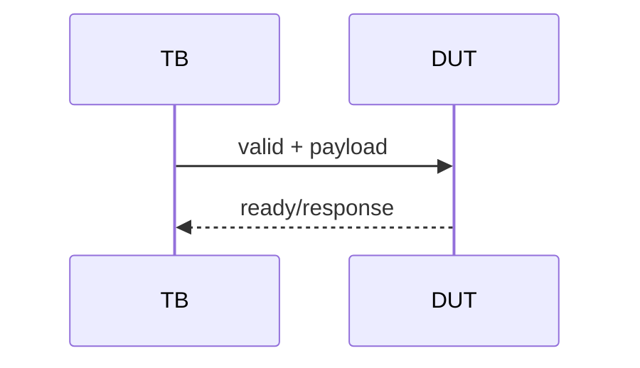
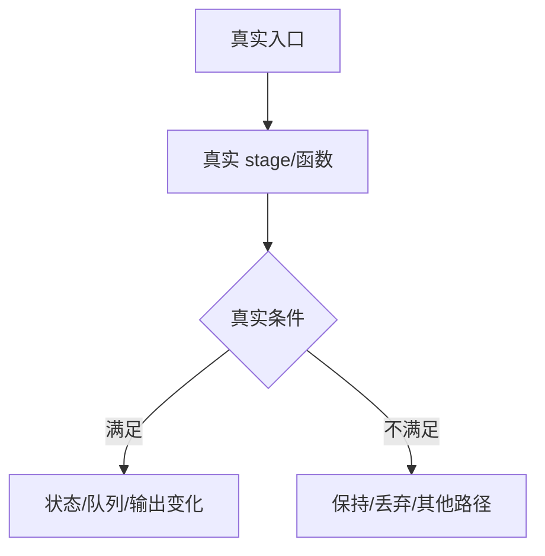

# RTL 知识文档模板

创建新文档时选择一种模板。更新已有文档时保留原有合理结构，但补齐缺失的版本元数据、源码证据、修订记录和待确认项。

## 1. 顶层 Interface-Agent 模板

````markdown
# <Agent 名称>接口知识

## 版本元数据

| 项目 | 内容 |
|---|---|
| RTL 版本 | V2 或 V3 |
| 分支 | `<branch>` |
| 核验 commit | `<full commit>` |
| 权威源码 | `<RTL/Scala/profile path>` |
| 最后核验日期 | `YYYY-MM-DD` |

## Agent 职责和边界

说明 agent 负责的协议、功能边界、驱动方、消费者和不属于本 agent 的相邻接口。

## RTL 顶层端口

| 端口/字段 | 方向 | 位宽 | valid/ready 关系 | 功能语义 | 源码位置 |
|---|---:|---:|---|---|---|

## 握手和时序



按真实寄存器边界说明请求接受、响应产生、保持和取消条件。

## UVM 组件映射

| RTL 信号 | interface | transaction | connect | monitor | driver |
|---|---|---|---|---|---|

## 关联 Flow

- [Flow 名称](../../../rtl/<version>/flows/<flow>.md)：说明关联阶段。

## V2/V3 差异

只记录已由各自版本源码确认的差异，并链接另一版本对应文档。

## 源码证据

- `<path>:<line>`：定义或关键赋值说明。

## 知识修订记录

| 日期 | commit | 旧结论 | 新结论 | 修订原因 | 影响范围 |
|---|---|---|---|---|---|

首次建立文档时写“首次建立，无旧结论修订”。

## 待确认项

- 无；或列出冲突源码、缺失证据和验证方法。
````

## 2. 内部 RTL Flow 模板

````markdown
# <Flow 名称>

## 版本元数据

| 项目 | 内容 |
|---|---|
| RTL 版本 | V2 或 V3 |
| 分支 | `<branch>` |
| 核验 commit | `<full commit>` |
| 权威源码 | `<Scala/RTL/profile path>` |
| 最后核验日期 | `YYYY-MM-DD` |

## Flow 范围

说明入口事件、覆盖模块、出口事件、完成条件和明确不覆盖的相邻行为。

## 主流程图



## 主流程文字伪代码

```text
1. 从真实入口接收请求或 uop，说明输入字段来源。
2. 按源码顺序执行 stage、状态机或 helper，并解释每个调用的功能和副作用。
3. 写清关键分支、优先级、寄存器边界和 kill/flush 条件。
4. 写清出口信号、队列消费、ROB/下游行为和完成条件。
```

## 关键阶段

### 1. `<stage/function>`

源码位置：`<path>:<line>`

关键逻辑：

```scala
// 只摘录决定行为的源码
```

功能、输入、输出、寄存器边界和副作用说明。

## 状态、队列和优先级

| 状态/字段/队列 | 生产者 | 置位/入队条件 | 清除/出队条件 | 消费者 | 优先级 |
|---|---|---|---|---|---|

## 异常、回滚与 Flush

说明异常优先于正常行为的条件、精确异常点、redirect level、当前指令和年轻指令的处理。

## 关联 Agent 和 Flow

- [Agent/Flow 名称](<relative path>)：说明接口或阶段关系。

## V2/V3 差异

只记录已由各版本源码分别确认的差异。

## 源码证据

- `<path>:<line>`：定义、赋值、连接或消费者说明。

## 知识修订记录

| 日期 | commit | 旧结论 | 新结论 | 修订原因 | 影响范围 |
|---|---|---|---|---|---|

首次建立文档时写“首次建立，无旧结论修订”。

## 待确认项

- 无；或列出冲突源码、缺失证据和验证方法。
````
